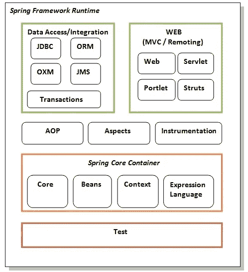
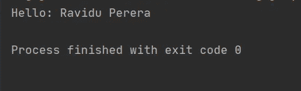

# Spring 框架——模块和架构

> 原文：<https://levelup.gitconnected.com/spring-framework-modules-and-architecture-abc8d4a53ee6>

Spring 框架由大约 20 个模块组成，每个模块都有自己的一套功能。核心容器、数据访问/集成、Web、AOP(面向方面的编程)、工具和测试是这些模块的类别。这里我要详细讲讲那些模块。

照片由[西格蒙德](https://unsplash.com/@sigmund?utm_source=unsplash&utm_medium=referral&utm_content=creditCopyText)在 [Unsplash](https://unsplash.com/s/photos/springboot-modules?utm_source=unsplash&utm_medium=referral&utm_content=creditCopyText) 拍摄

Spring 可以为您的所有业务应用程序提供一站式服务。另一方面，Spring 是模块化的，因此您可以挑选与您相关的组件，而不必安装其他组件。接下来的部分提供了关于所有 Spring 框架模块的信息。许多模块组成了 Spring 框架，包括核心、beans、上下文、表达式语言、AOP、方面、工具、JDBC、ORM、OXM、JMS、事务、Web、Servlet 和 Struts 等等。如图所示，这些模块分为测试、核心容器、AOP、方面、工具、数据访问/集成和 Web (MVC / Remoting)。

Javapoint.com 的弹簧模块

## 核心容器层

核心容器由四个模块组成:核心、Beans、上下文和表达式语言，具体如下:

1.  **核心**模块包含框架的核心组件，比如 IoC 和依赖注入功能。
2.  BeanFactory 是由 **Bean** 模块提供的工厂模式的复杂实现。
3.  **上下文**模块提供了一种访问任何已建立和配置的对象的方法，它建立在核心和 Beans 模块提供的健壮基础之上。ApplicationContext 接口是上下文模块的焦点。
4.  **SpEL** 是一种强大的表达式语言，用于实时搜索和修改对象图。

## 数据访问/集成层

JDBC、ORM、OXM、JMS 和事务模块组成了数据访问/集成层，如下所示。

1.  **JDBC 模块**包含一个 JDBC 抽象层，消除了对耗时的 JDBC 代码的需求。
2.  JPA、JDO、Hibernate 和 iBatis 只是受 ORM 模块支持的几个突出的对象关系映射 API。
3.  对于 JAXB、Castor、XMLBeans、JiBX 和 XStream， **OXM 模块**提供了支持对象/XML 映射实现的抽象层。
4.  Java 消息服务的 **JMS 模块**提供了发送和接收消息的工具。
5.  对于实现特殊接口和所有 POJOs 的类，**事务模块**提供了编程和声明式事务管理。

## Web 层

Web 层由 Web、Web-MVC、Web-Socket 和 Web-Portlet 模块组成，下面将详细介绍。

1.  **web 模块**包括基本的面向 Web 的集成特性，包括通过 servlet 监听器和面向 Web 的应用程序环境进行多部分文件上传和 IoC 容器设置。
2.  Spring 的 web 应用程序的模型-视图-控制器(MVC)实现包含在 **Web-MVC** 模块中。
3.  在 web 应用程序中， **Web-Socket** 模块支持客户端和服务器之间基于 WebSocket 的双向通信。
4.  **Web-Portlet** 模块模仿 Web-Servlet 模块的功能，并提供一个 MVC 实现，以便在 Portlet 上下文中使用。

## 其他重要层

还有一些额外的关键模块，比如 AOP、Aspects、Instrumentation、Web 和 Test，下面会详细介绍。

1.  **AOP 模块**通过允许您构造方法拦截器和切入点来解耦实现应该完全分离的功能的代码，从而支持面向方面的编程。
2.  方面模块**与 AspectJ 集成，AspectJ 是一个成熟的 AOP 框架。**
3.  **插装模块**包括对特定应用服务器中使用的类插装和类加载器实现的支持。
4.  STOMP 作为 WebSocket 子协议由**消息模块**支持在应用中使用。现在支持注释编程模型来路由和处理来自 WebSocket 客户端的 STOMP 消息。
5.  可以使用**测试模块**在 JUnit 或 TestNG 框架中测试 Spring 组件。

## 让我们用 Spring 创建一个简单的“Hello world”程序

在这里，我将介绍创建第一个 spring 应用程序的基本步骤。我没有使用任何 IDE 来运行这个程序。我只会使用命令提示符。让我们来看看如何通过几个简单的步骤制作一个 spring 应用程序。

*   **创建班级**
*   **创建 XML 文件以提供值**
*   **创建测试类**
*   **加载 spring jar 文件**

**1。创建 Java 类**

这是一个简单的 java bean 类，只包含 name 属性。

这是一个简单的 bean 类，只有一个属性名以及 getters 和 setters 的方法。这个类有一个名为 displayInfo()的附加方法，它在 hello 消息旁边打印学生的名字。

**2。创建 XML 文件**

如果您使用任何 IDE，您不需要创建这个 XML 文件，因为 IDE 已经为您自己做了这些。打开 applicationContext.xml 文件并编写以下代码。

bean 元素为指定的类指定 bean。学生类的 name 属性由 bean 的 property 子元素指定。IOC 容器将设置 Student 类对象的 property 元素中提供的值。

**3。创建测试类**

使用 BeanFactory 的 getBean()函数，我们从 IOC 容器中获取 Student 类的对象。让我们看看测试类的代码。

applicationContext.xml 文件的信息由资源对象表示。资源接口的接口是 Resource，而资源接口的实现类是 ClassPathResource。BeanFactory 负责退回豆子。XmlBeanFactory 是 BeanFactory 的实现类。BeanFactory 接口有很多方法。例如，getBean()返回关联类的对象。

**4。加载 spring 框架所需的 jar 文件**

运行这个应用程序主要需要三个 jar 文件。

*   **org . spring framework . core-3 . 0 . 1 . release-A**
*   **com . springsource . org . Apache . commons . logging-1 . 1 . 1**
*   **org . spring framework . beans-3 . 0 . 1 . release-A**

为了将来使用，您可以[下载](https://jar-download.com/?search_box=spring-core)spring 核心应用程序所需的 jar 文件。

要运行这个，您需要加载 spring core jar 文件，然后运行 Test.java 文件。

输出

编码快乐！！！！！