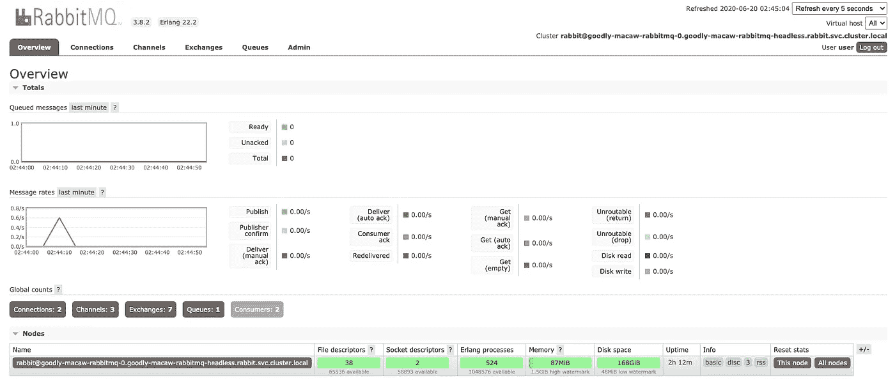
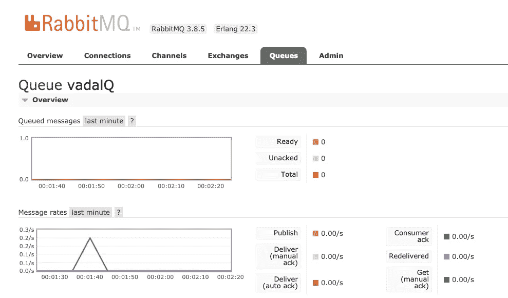

# 库伯内特斯的 AMQP 跳羚和兔子

> 原文：<https://levelup.gitconnected.com/springboot-amqp-with-rabbitmq-in-kubernetes-390a8039d5c4>


和我以前的博客一样，我们使用本地 docker 桌面 kubernetes 设置和 helm 来安装该功能。

使用 helm 将 rabbitmq 安装到 K8s 上。

> *helm install—name rab—set auth . username = admin，auth.password=admin，metrics . enabled = true stable/rabbit MQ*

将密码固定为这个(**注意:** rabbitmq 不喜欢短密码，它会在这个设置中接受它们，但你将无法登录)。

> *helm upgrade—set auth . username = admin，auth.password=secretpassword，metrics . enabled = true rab bitnami/rabbit MQ*

否则，默认用户名为 user，密码如下:

> *echo " Password:$(ku bectl get secret rab-rabbit MQ-o JSON path = " { . data . rabbit MQ-Password } " | base64—decode)"*

RabbitMQ 可以在集群中访问

`rab-rabbitmq.default.svc.cluster.local`

要从群集外部访问，请执行以下步骤:

要访问 RabbitMQ AMQP 端口:

> *kubectl 端口转发 svc/rab-rabbitmq 5672:5672*

echo " URL:amqp://127 . 0 . 0 . 1:5672/"

要访问 RabbitMQ 管理界面:

> *kubectl 端口转发 SVC/rab-rabbit MQ 15672:15672*

[http://127 . 0 . 0 . 1:15672/#/](http://127.0.0.1:15672/#/)



在 admin 选项卡下，创建用户名和密码 **guest/guest** ，这是 spring rabbitmq 的默认设置。有一些属性设置可以用来改变这些，或者使用环境变量并在 K8s 中进行设置，由 spring 选择，例如:

```
spring.rabbitmq.username=${RABBITMQ_USER:guest}
spring.rabbitmq.password=${RABBITMQ_PASS:guest}
```

RABBITMQ_USER 和 RABBITMQ_PASS 可以在 k8s 部署属性中设置。

# 春季 AMPQ 电码

春季初始 zr

[https://start.spring.io/#!type=maven-project&language = Java&platform version = 2 . 3 . 1 . release&packaging = jar&JVM version = 1.8&groupId = uk . co . actual code&artifactId = vadal-MQ&name = vadal-MQ&description = Demo % 20 project % 20 for % 20 spring % 20 boot&package name = uk . co . actual code . vadal-MQ&](https://start.spring.io/#!type=maven-project&language=java&platformVersion=2.3.1.RELEASE&packaging=jar&jvmVersion=1.8&groupId=uk.co.actualcode&artifactId=vadal-mq&name=vadal-mq&description=Demo%20project%20for%20Spring%20Boot&packageName=uk.co.actualcode.vadal-mq&dependencies=amqp,web)

Pom 需要以下内容:

```
<dependencies>
  <dependency>
   <groupId>org.springframework.boot</groupId>
   <artifactId>spring-boot-starter-amqp</artifactId>
  </dependency>
  <dependency>
   <groupId>org.springframework.boot</groupId>
   <artifactId>spring-boot-starter-data-rest</artifactId>
  </dependency>
  <dependency>
   <groupId>org.springframework.amqp</groupId>
   <artifactId>spring-rabbit-test</artifactId>
   <scope>test</scope>
  </dependency>
  <dependency>
   <groupId>io.micrometer</groupId>
   <artifactId>micrometer-registry-prometheus</artifactId>
   <scope>runtime</scope>
  </dependency>
 </dependencies>
```

普罗米修斯已经被添加，这样我们以后就可以通过 grafana 来监控这项服务了。

应用程序. yml

```
spring.rabbitmq.host: rab-rabbitmq.default.svc.cluster.localserver.port: 7777management:
  endpoints:
    web:
      exposure:
        include: "*"
```

Vadal-mq-sender 应用程序

```
@SpringBootApplication
@RestController
@Slf4j
public class VadalMqApplication {private static final String VADALQ = "vadalQ"; public static void main(String[] args) {
     SpringApplication.run(VadalMqApplication.class, args);
  } @Autowired
  RabbitTemplate rabbitTemplate; @Bean
  public Queue vadalQueue() {
    return new Queue(VADALQ, false);
  } @GetMapping("/m/{m}")
  public void send(@PathVariable String m) {
     rabbitTemplate.convertAndSend(VADALQ, m);
  }
}
```

创建图像

> *mvn spring-boot:构建映像*

部署映像

> *kubectl 创建部署 vadal-MQ-sender-image = vadal-MQ-sender:0 . 0 . 1-SNAPSHOT*
> 
> *deployment.apps/vadal-mq-sender 创造了*

# 暴露内部端口 7777

> *ku bectl expose deployment vadal-MQ-sender-type node port-port 8889-target-port 7777*

如果您已经有了一个现有的图像，请像这样更新它:

> *kubectl 补丁部署 vadal-MQ-receiver-p ' { " spec ":{ " template ":{ " spec ":{ " terminationgraceperiodes ":31 } } } '*

找到发送者的端口。

> *ku bectl get SVC vadal-MQ-sender
> NAME TYPE CLUSTER-IP EXTERNAL-IP PORT AGE
> vadal-MQ-sender node PORT 10 . 108 . 231 . 116 8889:31498/TCP 3d*

发送方端点端口是 31498，发送消息 hi

[http://localhost:31498/m/hi](http://localhost:8889/m/hi)

现在是接收器。这将接收消息并将它们存储在数据库中，以便可以根据需要检索它们。

春季初始 zr

[https://start.spring.io/#!type=maven-project&language = Java&platform version = 2 . 3 . 1 . release&packaging = jar&JVM version = 1.8&groupId = uk . co . actual code&artifactId = vadal-MQ-receiver&name = vadal-MQ-receiver&description = Demo % 20 project % 20 for % 20 spring % 20 boot&package name = uk . co . actual code . vadal](https://start.spring.io/#!type=maven-project&language=java&platformVersion=2.3.1.RELEASE&packaging=jar&jvmVersion=1.8&groupId=uk.co.actualcode&artifactId=vadal-mq-receiver&name=vadal-mq-receiver&description=Demo%20project%20for%20Spring%20Boot&packageName=uk.co.actualcode.vadal-mq-receiver&dependencies=amqp,data-rest,h2,prometheus)

Pom 也类似

```
<dependencies>
  <dependency>
   <groupId>org.springframework.boot</groupId>
   <artifactId>spring-boot-starter-data-jpa</artifactId>
  </dependency>
  <dependency>
   <groupId>org.springframework.boot</groupId>
   <artifactId>spring-boot-starter-amqp</artifactId>
  </dependency>
  <dependency>
   <groupId>org.springframework.boot</groupId>
   <artifactId>spring-boot-starter-data-rest</artifactId>
  </dependency><dependency>
   <groupId>com.h2database</groupId>
   <artifactId>h2</artifactId>
   <scope>runtime</scope>
  </dependency>
  <dependency>
   <groupId>io.micrometer</groupId>
   <artifactId>micrometer-registry-prometheus</artifactId>
   <scope>runtime</scope>
  </dependency>
 </dependencies>
```

我们还利用了 spring data rest 和内存中的 H2 数据库。

Application.yml 也类似:

```
spring:
  application:
    name: vadalmqreceiver
  rabbitmq.host: rab-rabbitmq.default.svc.cluster.localserver.port: 7777management:
  endpoints:
    web:
      exposure:
        include: "*"
```

应用程序如下:

```
@SpringBootApplication
@RestController
@Slf4j
public class VadalMqReceiverApplication { private static final String VADALQ = "vadalQ"; public static void main(String[] args) {
    SpringApplication.run(VadalMqReceiverApplication.class, args);
  } @Autowired
  public MsgRepo msgRepo; @Bean
  public Queue vadalQueue() {
     return new Queue(VADALQ, false);
  } @RabbitListener(queues = VADALQ)
  public void listen(String in) {
     log.info("Message read from vadalQ : " + in);
     msgRepo.save(new Msg(in));
  } @GetMapping("/put/{p}")
  public String put(@PathVariable String p) {
     Msg save = msgRepo.save(new Msg(p));
     return save.toString();
  } @GetMapping("/get")
   public Iterable<Msg> get() {
     Iterable<Msg> all = msgRepo.findAll();
     msgRepo.deleteAll();
     return all;
  }}
```

它监听消息队列，并将任何收到的消息保存到数据库中。可以使用/get 端点检索消息。

创建图像。

> *mvn spring-boot:构建映像*

部署它并公开端口

> *kubectl 创建部署 vadal-MQ-receiver-image = vadal-MQ-receiver:0 . 0 . 1-SNAPSHOT*
> 
> *ku bectl expose deployment vadal-MQ-receiver-type node port-port 8899-target-port 7777*

检查端口

> *ku bectl get SVC vadal-MQ-receiver
> NAME TYPE CLUSTER-IP EXTERNAL-IP PORT AGE
> vadal-MQ-receiver NodePort 10 . 96 . 60 . 154 8899:30676/TCP 10d*

[http://localhost:30676/get](http://localhost:30676/get)

```
[ { "id": 3, "m": "hi" }, { "id": 4, "m": "this is" }, { "id": 5, "m": "a rabbitmq" }, { "id": 6, "m": "message" } ] 
```

rabbitmq 管理 UI 提供了队列流量的视图。



# 结论

我们在 docker 桌面 kubernetes 本地基础设施上安装了 RabbitMQ。我们使用 spring boot starter 依赖项创建了一个发送者和一个接收者服务，并且我们能够发布和监听 k8s 中运行的 rabbit mq broker 队列。

这个博客的代码可以在

[https://gitlab.com/lightphos/spring/vadal](https://gitlab.com/lightphos/spring/vadal)

*原载于 2020 年 6 月 30 日*[*https://blog . ramjee . uk*](https://blog.ramjee.uk/rabbitmq-spring-k8s/)*。*