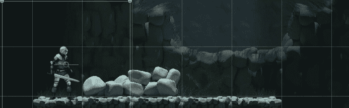
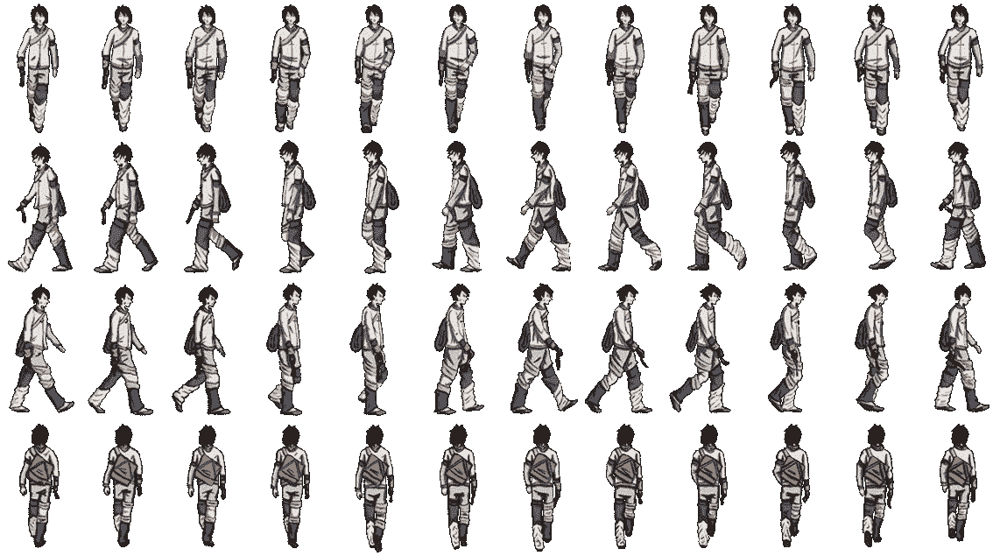
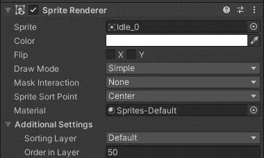

# 2D 动画中的精灵翻转

> 原文：<https://levelup.gitconnected.com/sprite-flipping-in-unity-for-2d-animations-f5c33d3e8f71>

## Unity 快速提示

//轻松控制精灵方向。



快速改变精灵面对的方向

今天的邮件很快。通常当我们在 2D 游戏中工作时，我们希望能够改变精灵面对的方向，给我们一个更加完美的动画。一如既往，Unity 让我们的工作变得非常简单。

如果你在互联网上查看一些旧的精灵表，你会发现在过去，为每个方向创建精灵表动画是很常见的。举个例子:



Pinterest ( [图钉动画教程(pinterest.com)](https://www.pinterest.com/pin/469922542349678919/)中的精灵表示例

在这种情况下，左右移动是有意义的，因为它从左右两边看着玩家，他的服装使它更加优雅。然而，在我正在开发的手机冒险游戏中，我们只有一个面向右边的精灵。Unity 让我们直接在 Sprite 渲染器中处理这个问题。



检查器中的渲染器

请注意，精灵渲染器有一个名为 Flip 的设置，带有 X 和 y 选项。这意味着我们可以在代码中轻松翻转精灵，以处理从左向右的过渡。让我们看一下完成这个任务所需的代码。

我的动画类中有精灵翻转代码(下面是完整的代码),因为它对我来说是动画的一部分。

首先，我们需要一个脚本中的 sprite 渲染器的句柄，以便于访问。所以我们创建了一个类变量:

```
private SpriteRenderer _renderer;
```

接下来，我们需要初始化新的变量，所以我们在 Start()中处理它

```
void **Start**()
{
    _renderer = GetComponent<SpriteRenderer>();
    if (_renderer == null)
    {
        Debug.LogError("Player Sprite is missing a renderer");
    }
}
```

最后，在 Update()方法中，我们使用水平输入上的 GetAxisRaw()检查玩家运动方向的状态，并根据结果翻转 X 轴。

```
void **Update**()
{
    if (Input.GetAxisRaw("Horizontal") > 0)
    {
        _renderer.flipX = false;
    }
    else if (Input.GetAxisRaw("Horizontal") < 0)
    {
        _renderer.flipX = true;
    }   
}
```

就是这样。现在，当我们玩游戏时，我们的玩家将翻转到他面对的方向。

重要的是要注意，如果你太关注它，它看起来确实有点笨重。在我的例子中，玩家总是把他的剑放在离屏幕最近的手里，所以当他翻转时，就好像他把剑换到了另一只手上。这可能会打破一些玩家的沉浸感，但当你有一个左右两边几乎相同的精灵(想想马里奥或索尼克)时，翻转效果几乎不明显。

正如所承诺的，这里是动画类的当前完整代码。

```
using UnityEngine;

public class **Player_Animation_Contoller** : MonoBehaviour
{
    private Animator _animator;
    private SpriteRenderer _renderer;
    private static readonly int MovementSpeed = Animator.StringToHash("MovementSpeed");

    *// Start is called before the first frame update* void **Start**()
    {
        _animator = GetComponent<Animator>();
        if (_animator == null)
        {
            Debug.LogError("The player sprite is missing an Animator Component");
        }

        _renderer = GetComponent<SpriteRenderer>();
        if (_renderer == null)
        {
            Debug.LogError("Player Sprite is missing a renderer");
        }
    }

    *// Update is called once per frame* void **Update**()
    {
        if (Input.GetAxisRaw("Horizontal") > 0)
        {
            _renderer.flipX = false;
        }
        else if (Input.GetAxisRaw("Horizontal") < 0)
        {
            _renderer.flipX = true;
        }
        _animator.SetFloat(MovementSpeed, Mathf.Abs(Input.GetAxisRaw("Horizontal")));
    }
}
```