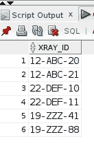
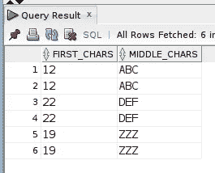
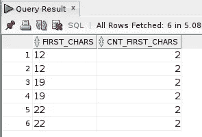
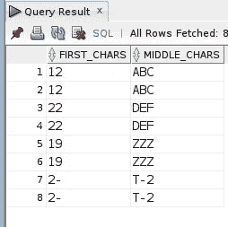
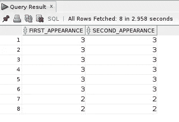
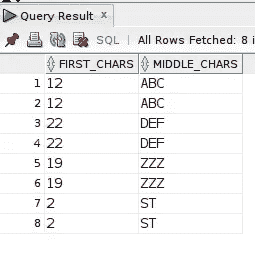

# SQL INSTR()字符串函数作为动态参数

> 原文：<https://levelup.gitconnected.com/sql-instr-string-function-as-a-dynamic-parameter-80726b46e852>

在编程工作流程的某些时候，您必须处理字符和文本数据。我确信有些语言比其他语言更擅长解析字符串。然而，大多数编程语言都有用于处理字符串数据的*结构*或函数。在本文中，我将介绍 Oracle SQL `INSTR()`函数，该函数返回字符串(子字符串)中某个字符串的特定位置(以数值形式)。

图片由 [MorningbirdPhoto](https://pixabay.com/users/morningbirdphoto-129488/?utm_source=link-attribution&utm_medium=referral&utm_campaign=image&utm_content=539709) 来自 [Pixabay](https://pixabay.com/?utm_source=link-attribution&utm_medium=referral&utm_campaign=image&utm_content=539709)

在 Medium 上关注我，当我发布帖子时[会收到电子邮件通知](https://parabollus.medium.com/subscribe)！

[**自我推销**](https://digitalowlsprose.ck.page/1b35a06295) :

如果你喜欢这里写的内容，尽一切办法，把我的博客和你最喜欢的帖子分享给那些可能从中受益或喜欢它的人。既然咖啡是我最喜欢的饮料，如果你愿意，你甚至可以给我买一杯！

## INSTR()语法和功能

`INSTR()`绝对可以作为独立功能使用。然而，我发现它作为其他字符串函数的参数是最强大的，尤其是`SUBSTR()`。

**相关**:如果你对 `[SUBSTR()](/substr-character-function-oracle-sql-example-fcdd37a5a3a8)`不熟悉，需要更多关于在查询中使用它的信息，我已经写了一篇关于[的详细帖子。](/substr-character-function-oracle-sql-example-fcdd37a5a3a8)

`INSTR()`函数的语法如下:

`INSTR(search_string, substring_to_search, start_position, nth_appearance)`

**注意**:参数`start_position`和`nth_apprearance`都是可选的。如果省略，`start_position`默认为 1。同样，如果`start_position`参数为负值，`INSTR()`从`search_string`的末端开始搜索`substring_to_search`，并向后移向`search_string`的开始处。

## 动态 SUBSTR()函数的 INSTR()用例

我主要处理石油和天然气能源(地理空间)调查数据。由于焊接是在管道安装过程中连接单个管段时进行的，每个焊接都用 x 射线编号或名称*标记*以便识别。阿明公约因公司和项目而异，但在大多数情况下，x 射线 id 遵循类似的模式，如 14-ABC-10 或类似的模式。

我最近在对此类数据的一些查询中使用了`LAG()`和`LEAD()`分析窗口函数，发现我需要解析这些 x 射线 id 的特定部分，但是在*捕获*特定字符值时需要一些灵活性。因此，`SUBSTR()`和`INSTR()`形成了完美的互补组合。

## 样本数据集

对于示例查询，我使用一个名为 **WELD_NAMES、**的表，其中有一列数据类型为`VARCHAR2`的数据:

来自 WELD_NAMES 表的 XRAY_ID 列值。

(**注**:此数据为实践或虚拟数据，出于本文目的而创建，不属于任何实体。)

我希望解析 **XRAY_ID** 列值，检索从字符串开头到第一个破折号的所有字符，以及位于两个破折号之间的那些字符。`SUBSTR()`让这变得非常简单:

Oracle SUBSTR()函数结果。

现在我可以这样做:

但是，如果这两行被`INSERT`到表 **WELD_NAMES** 中会发生什么呢？

前面的查询现在不太好用了:

插入附加行后的查询结果。

`start_position`和`length`的*硬编码* `SUBSTR()`参数不再返回期望的查询结果。并且，结果现在包括那些 **WELD_ID** 值的实际破折号字符，这些值的长度与大多数其他当前行的长度不同。

知道我们需要*操作两个破折号之间的*可以说，除了第一个破折号之前的那些字符值，这是我们可以使用`INSTR()`函数进行更动态或更通用的查询的地方。只要**x 射线 ID** 值有两个破折号。

我坚持每周写一封关于我正在学习并感兴趣的 SQL/PHP 的邮件。如果这听起来像是你想参与的事情，使用这个[注册](https://digitalowlsprose.ck.page/1b35a06295)(异地链接)表格并订阅。谢谢大家！

## INSTR()函数*起始位置*和第 n 个外观参数

如前所述，`INSTR()`返回子串在字符串中的数值位置。要检索第一个和第二个破折号字符的位置，我们可以执行以下查询:

注意在 **SECOND_APPEARANCE** 表达式中，`start_positon`参数为-1，在这种情况下`INSTR()`从 **XRAY_ID** 字符串的末尾开始搜索，向开始处移动。此外，将 1 指定为`nth_appearance`参数，返回第二个破折号的位置，因为这是从 **XRAY_ID** 字符串的末端向后的*第一个位置*。

## 使用 INSTR()代替硬编码的 SUBSTR() start_position 和 length 参数值

现在我们有了位于 **XRAY_ID** 值中的 2 个破折号的更灵活和动态的位置，我们可以将它们插入到对`SUBSTR()`的调用中，并检索第一个破折号之前以及第一个破折号和第二个破折号之间的所需字符值。

我将访问返回的结果，并讨论 **FIRST_CHARS** 和 **MIDDLE _CHARS** 表达式的`SUBSTR()`函数参数。

我总是渴望一杯浓咖啡！！！

**FIRST_CHARS** 表情:`SUBSTR(XRAY_ID, 1, INSTR(XRAY_ID, ‘-’, 1, 1) — 1)`

*   **XRAY_ID:** 目标字符串参数。
*   1: `start_position`参数(从字符串的开头开始)。
*   `INSTR(XRAY_ID, ‘-’, 1, 1) — 1)`:参数`length`。通过从第一个破折号的数字返回位置减去 1，`SUBSTR()`提取破折号本身之前的字符，但不包括破折号本身。

**MIDDLE_CHARS** 表达式:`SUBSTR(XRAY_ID, INSTR(XRAY_ID, ‘-’, 1, 1) + 1, INSTR(XRAY_ID, ‘-’, -1, 1) — INSTR(XRAY_ID, ‘-’, 1, 1) — 1)`

*   **XRAY_ID:** 目标字符串参数。
*   `INSTR(XRAY_ID, ‘-’, 1, 1) + 1` : `start_position`参数。我们知道`INSTR(XRAY_ID, ‘-’, 1, 1)`返回第一个破折号的数字位置，通过将该值加 1，`SUBSTR()`开始提取第一个破折号后 1 个位置的字符，但不包括它。
*   `INSTR(XRAY_ID, ‘-’, -1, 1) — INSTR(XRAY_ID, ‘-’, 1, 1) — 1` : `length`参数。这个参数有点棘手。为了计算`SUBSTR()`需要提取的字符的正确长度，我们从第二个破折号的数字位置中减去第一个破折号的数字位置-减去 1-这样我们只检索破折号之间的那些字符。但是，不包括破折号本身。相当光滑！

我希望通过这篇博文中的例子，您能够更好地理解如何使用`INSTR()`和`SUBSTR()`(或者类似的 SQL 字符串函数)并创建更加通用的动态查询。

我努力使我的查询尽可能地*可重用*和*灵活*，尤其是在处理各种长度的字符串和文本数据时。

感谢您的阅读！！！

一如既往，如果你有任何问题或看到代码中的任何错误，请通过评论让我知道。建设性的意见有助于我提供准确的博客帖子，我非常感激。

## 其他博客文章阅读

查看我发布的这些类似的博客文章，获取更多精彩的 SQL 内容！

*   [如何使用 Oracle SQL 日期函数找到一个月的第一天和最后一天](/how-to-find-the-first-and-last-day-of-a-month-with-oracle-sql-date-functions-706572c751a8)
*   [MySQL 之间的运算符查询是否包含？](/are-mysql-between-operator-queries-inclusive-3bd757c37f03)
*   [用 MySQL 中的 SUBSTRING()递归 CTE 乐趣](/recursive-cte-fun-with-substring-in-mysql-3a06fab881cd)
*   [如何在 Oracle SQL 中对逗号分隔的列表重新排序](/how-to-re-order-a-comma-separated-list-in-oracle-sql-eb5f9733c5cd)

你知道吗，咖啡是我最喜欢的饮料！！！

喜欢的内容，你在这个帖子里看过？那么你肯定会喜欢我博客上的博文，数码猫头鹰的散文。

在那里你会找到关于 SQL 数据库开发/编程和 LAMP stack web 开发的博文。