# [SQL]联接和联合

> 原文：<https://levelup.gitconnected.com/sql-joins-2cc89babb6f9>

## 从 1976 年开始把桌子放在一起。

当我在程序员生涯的早期探索新的编程语言和框架时，我很快就发现了自动化的优点和缺点。为了澄清，我将自动化定义为框架/库/片段，它们消除了编写大量代码的需要。比如 Lodash、下划线、jQuery，甚至 VSC 的林挺。

自动化极大地减少了开发时间、需要编写的代码量以及深入理解应用程序每个工作部分的需求。这很好。但与此同时，它也加速了许多原本非常有用的东西的学习曲线，或者在某些情况下是必要的，如果你还在学习诀窍，它会让你处于不利地位。

这是我使用 Ruby on Rails 和 SQL 的经验。

Ruby on Rails 的一个好处是你不必学习 SQL。Ruby on Rails 的一个不好的地方是你没有机会学习 SQL。

尽管 SQL 是我在用 Ruby on Rails 开发项目时经常使用的语言，但我对 SQL 的理解并不扎实，这一直困扰着我。

所以最近我决定改变这一点，作为一个有点完美主义的人，开始慢慢钻研 SQL。

SQL 中似乎会在新用户中引起很多误解或混淆的部分之一是连接和连接表，所以我想简单地介绍一下 SQL 中最常见的连接类型。

我将使用 PostgreSQL、pgAdmin 4 和我为这个博客准备的一个小型数据库，希望能更好地解释 SQL 中的连接是如何工作的。

## **基础知识**

最简单的连接形式就是在 SQL 中将多个表组合在一起的一种方式。存在不同的联接类型是为了帮助您决定如何处理每个表中的不同比较。每个 JOIN 子句都扮演一个独立但重要的角色。

此外，请记住，我在这篇博文中讨论的所有内容并不特定于 PostgreSQL，而是适用于 SQLite、mySQL、SQLserver 或您正在使用的任何版本的 SQL。每个版本之间都有差异，但是大多数 SQL 命令在它们之间是可以互换的。PostgreSQL 中的一个区别是，如果您调用一个 JOIN 子句而没有明确说明您想要使用哪一个(内部连接、外部连接等)，PostgreSQL 将自动默认使用内部连接。在继续之前，请注意一点。

下面是我创建的 PostgreSQL 数据库的一个例子，我们将比较两个表。一个表包含一个虚构的美国人列表，另一个表包含一个虚构的欧洲人列表:

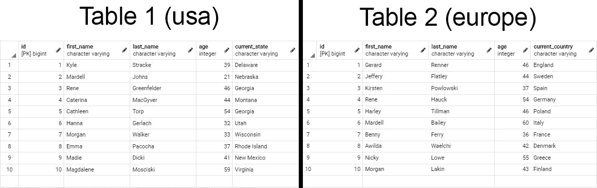

这两个表都有相似的列和具有相似值的行，以及具有不同值的不同列和行，这对于解释联接如何工作是非常完美的。

让我们用第一种也是最常见的连接类型:内部连接来比较这两个表。

## 内部联接(内部联接)

内部联接是两个表中匹配的一组记录。如果要查找出现在两个不同表中的一行数据，可以使用内部联接。内部联接不会改变正在查询的两个表，但是会基于基本的布尔比较创建一组新的数据:等于(=)，不等于(！idspnonenote)。=)、大于(>)、大于等于(> =)、小于( =)。

INNER JOIN 子句是对称的，这意味着它将同等地查询两个表，以便确定我们的布尔比较的结果，并且无论您从哪个表中选择，或者与哪个表连接，返回的数据集都将产生相同的结果。

另一种思考方式是，INNER JOIN 子句是包含性的，或者它将包含新数据集中布尔比较返回 true 的所有内容。

我遇到的理解内部连接如何工作的最好方法是通过维恩图:

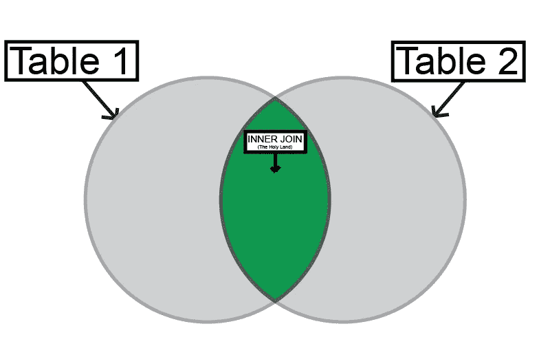

绿色阴影的中间部分代表了我们的内部连接将要做的事情。假设我们希望找到两个列表中名字相同的所有人:

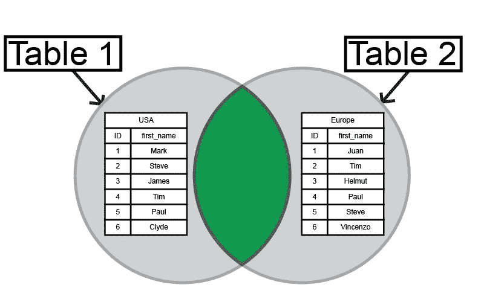

内部连接将比较两个表，然后返回一组新的数据，其中我们编写的布尔比较为真，我们将得到出现在两个列表中的所有人的姓名:

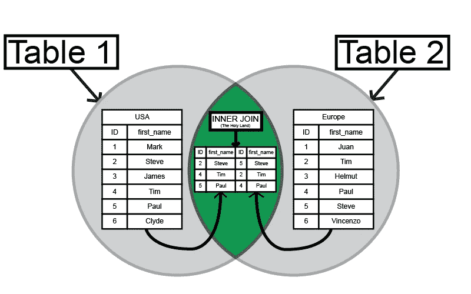

那么我们如何编写一个内部连接子句呢？

这是我所知道的最简单的样板内部连接:

```
SELECT * FROM <table1> INNER JOIN <table2> ON <table1.column_name> <comparison operator> <table2.column_name>;
```

一些 SQL 向导可能知道一个更简单的方法，但是我想在这篇博客中把重点放在基础上。

让我们将查询细分如下:

```
SELECT * FROM <table1>
```

在我们的查询中选择表 1 中的所有列，以便我们可以与表 2 进行比较。

```
INNER JOIN <table2>
```

调用 INNER JOIN 子句，这样 SQL 就知道我们要比较哪个表

```
ON <table1.column_name>
```

调用 ON 语句，这样我们可以选择要在表 2 中比较表 1 中的哪一列

```
<comparison operator>
```

我们的布尔表达式(=，！=, >, >=,

```
<table2.column_name>;
```

最后，我们从表 2 中选择一列与表 1 进行比较。请记住，为了使内部联接能够工作，两列必须具有相同的名称和相同的数据类型(char、text、integer、bigint 等)。否则，我们的布尔比较将总是返回 false，我们将在结果数据集中看不到任何东西。

因此，让我们使用 boiler plate SQL 查询，并将其应用于数据库中的两个人员列表。

首先，让我们继续使用上面的文氏图，在两个表中找到所有名字相同的人:

```
SELECT * FROM usa INNER JOIN europe ON usa.first_name = europe.first_name;
```

如果我们运行这个查询，我们现在应该看到一个新的 4 行表，其中包含 SQL 在两个列表中找到名字相同的人的所有情况。

另一方面，由于性能问题，以及它可能使事情变得有点混乱的事实，使用*操作符(意味着“all”)通常不是最佳实践:

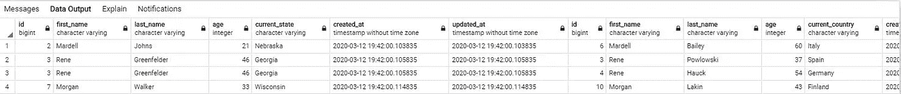

让我们通过明确说明我们想要查看哪些列来解决这个问题:

```
SELECT first_name, last_name, current_state, current_country FROM usa INNER JOIN europe ON usa.first_name = europe.first_name;
```

如果我们运行这个查询，SQL 将会混淆并抛出一个错误:

```
ERROR: column reference “first_name” is ambiguous
LINE 1: SELECT first_name, last_name, current_state, current_country…
```

别担心。这仅仅意味着我们还需要指定这些列来自哪个表，因为我们的两个表都包含相同的列名。如果我们想在数据集中查看这些信息，我们还需要添加两个表中的列名。

为了便于阅读，我还将开始将查询分成单独的行，我还发现如果将查询分成多行，会更容易理解。SQL 对换行符的使用非常宽松，所以您可以随意使用它们:

```
SELECT usa.first_name, usa.last_name, current_state, europe.first_name, europe.last_name, current_country
FROM usa
INNER JOIN europe
ON usa.first_name = europe.first_name;
```

这将返回我们的内部连接，其中包含两个表中出现的所有名字，以及我们希望在结果中查看的所有数据:

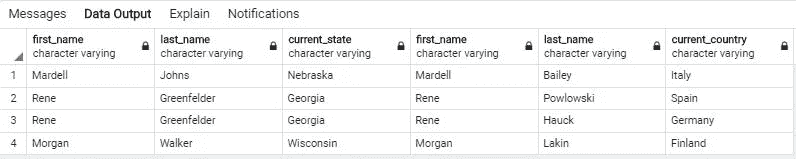

如果我们想知道我们找到相似名称的次数，我们还可以加入一个聚合函数和一个 GROUP BY 子句，以及一些别名，这样我们就可以知道我们的数据集中返回的列，以及一个 ORDER BY 子句，以找出数据集中最常见的名称:

```
SELECT usa.first_name AS usa_first_names, europe.first_name AS europe_first_names, COUNT(*) AS similarities
FROM usa
INNER JOIN europe
ON usa.first_name = europe.first_name
GROUP BY usa.first_name, europe.first_name
ORDER BY COUNT(usa.first_name = europe.first_name) DESC;
```

下面是我们的查询应该返回的内容

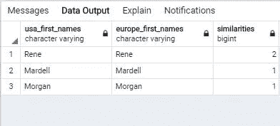

太好了。

内部连接非常强大和灵活，可以很快变得相当复杂。

## 外部连接(完全外部连接)

与内部联接相反的是外部联接。外部连接是一组只存在于被比较的一个表中的记录。如果要查找出现在一个表中而不是另一个表中的数据行，可以使用外部联接。与内部联接一样，外部联接不会改变您正在查询的两个表，并且还会基于布尔比较创建一组新的数据。

OUTER JOIN 子句也是对称的，但是不包含。它是唯一的。这意味着它将从布尔比较中排除返回 true 的数据，并返回所有产生 false 的数据。

因此，在我们的文氏图中，外部连接应该是这样的:

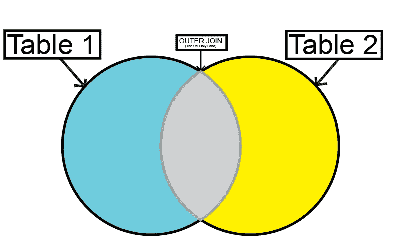

两个外面的圆圈是蓝色和黄色的阴影，因为它代表了我们的外部连接将要做的事情，返回每个表唯一的所有数据。

因此，如果我们再次将其应用到我们的人员列表中，我们希望找到所有具有唯一名称的人员:

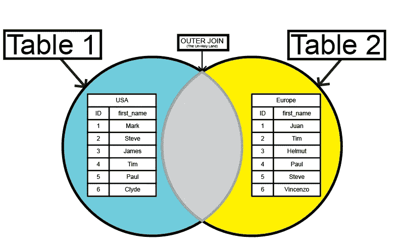

外部连接将比较这两个表，然后返回一组新的数据，其中我们编写的布尔比较为假，我们将得到我们国家特有的所有人名:

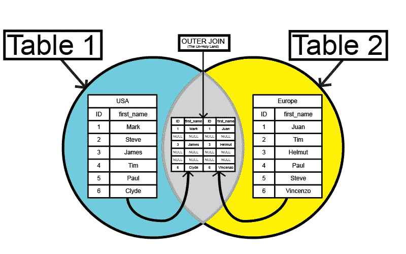

这里需要注意的重要一点是，只要布尔比较返回 true，OUTER JOIN 子句就会将 NULL 插入到它返回的数据集中。

我们稍后会解决这个问题。

那么，对于外部连接，我们的锅炉板查询看起来像什么呢？

嗯……基本上是一样的:

```
SELECT *
FROM <table1>
FULL OUTER JOIN <table2>
ON <table1.column_name> <comparison operator> <table2.column_name>
```

让我们在我们的数据库上试试这个:

```
SELECT *
FROM usa
FULL OUTER JOIN europe
ON usa.first_name = europe.first_name
```

下面是我们的外部连接现在返回的内容:

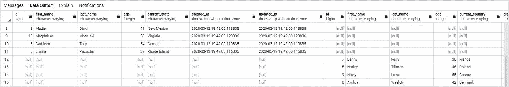

嗯…这太乱了...

我们可以通过使用 WHERE 操作符、or 操作符和 is 操作符来解决这个问题。如果我们指定要在布尔比较为空的地方进行连接，我们将得到唯一的行:

```
SELECT usa.first_name, europe.first_name
FROM usa
FULL OUTER JOIN europe
ON usa.first_name = europe.first_name
WHERE usa.first_name IS null
OR europe.first_name IS null
```

我们的查询结果是:

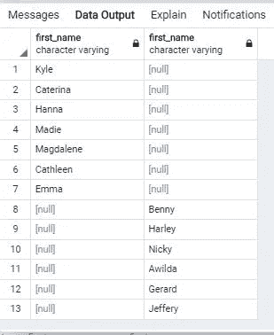

看起来好多了。但是让我们去掉空值，把一切都清理干净。

我们可以使用 CONCAT 函数来合并我们的列，因为我们的行中没有数据重叠，并且每一行都包含唯一的信息。我们还可以为要加入的新列分配一个新别名，并将所有内容合并到一列中:

```
SELECT CONCAT(usa.first_name, europe.first_name) AS first_names
FROM usa
FULL OUTER JOIN europe
ON usa.first_name = europe.first_name
WHERE usa.first_name IS null
OR europe.first_name IS null
```

它应该让我们的外部连接返回两个表中所有唯一名称的一列:

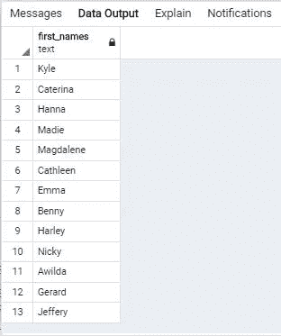

很好。

## 左外连接和右外连接(左连接和右连接)

我将把左外连接和右外连接组合在一起，因为除了一个键的不同之外，它们的操作实际上是相同的，稍后我将对此进行解释。

首先，我将从左连接开始。从语法上讲，您可以同时使用左外连接或左连接，这取决于您的喜好。它们的功能相同，但我喜欢非常明确，所以我将坚持使用左外连接。

左外部联接返回您选择的第一个(或左)表中的所有行，以及出现在您与之联接的第二个(或右)表中的匹配项。

左连接和右连接是 SQL 中 6 个连接子句中最不常见的(SELF JOIN 是另一个，但我在这里不讨论它)，但了解它们仍然很重要。

下面是我们的文氏图:

左外部联接:

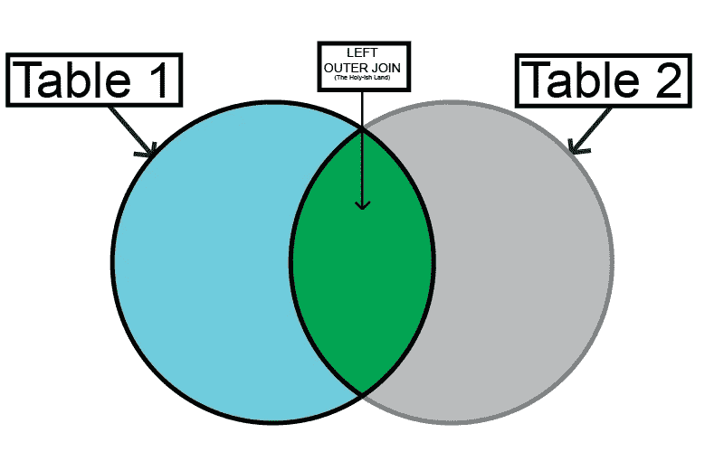

右外部联接:

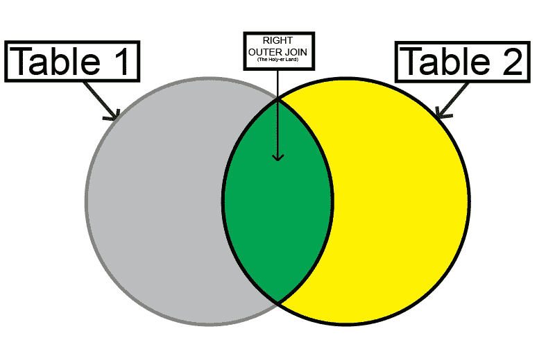

以前，选择和联接表的顺序无关紧要，因为内部联接和外部联接都是对称操作的。

左外连接和右外连接的操作是不对称的，这意味着根据您使用的子句，SQL 将从左(第一个)或右(第二个)表中提取所有数据，以及从您要连接的表中提取匹配项。来自每个表的数据流不平衡。

在我们数据库中两个人员表的上下文中，左外连接和右外连接将如何返回数据:

左外部联接:

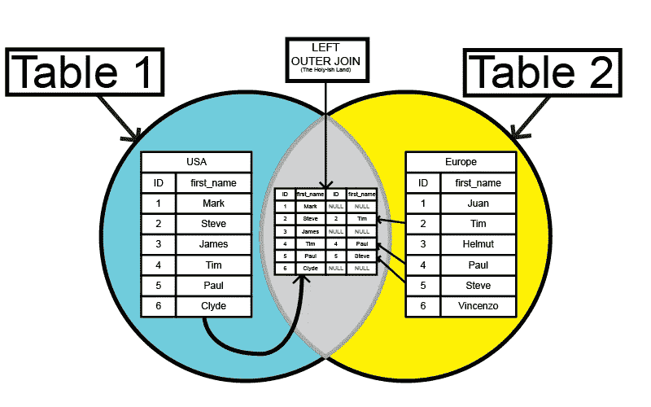

右外部联接:

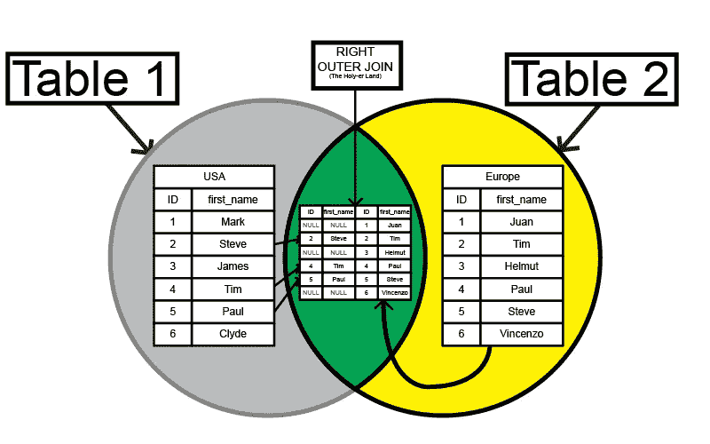

与外部连接一样，没有匹配的列用 NULL 填充，我们可以使用 WHERE 从任意一个表中获取唯一的行。

让我们在姓名和人员列表中使用它:

```
SELECT *
FROM usa
LEFT OUTER JOIN europe
ON usa.first_name = europe.first_name
```

这将返回美国人的所有名字，以及同名的欧洲人的名字:

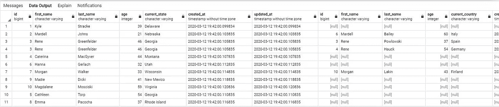

这同样适用于 RIGHT OUTER JOIN，除了我们将获得所有来自欧洲的人，以及美国同名人的名字。我们所要做的就是切换我们要选择和连接的表，并调用 RIGHT OUTER JOIN:

```
SELECT *
FROM europe
RIGHT OUTER JOIN usa
ON europe.first_name = usa.first_name
```

我们做到了:

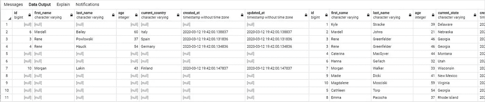

我们仍然可以使用 WHERE 语句来获取唯一的行，并根据我们使用的子句返回来自美国和欧洲的人名的唯一列表:

左外部联接:

```
SELECT *
FROM usa
LEFT OUTER JOIN europe
ON usa.first_name = europe.first_name
WHERE europe.first_name IS null
```

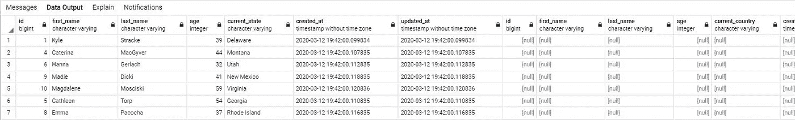

右外部联接:

```
SELECT *
FROM europe
LEFT OUTER JOIN usa
ON europe.first_name = usa.first_name
WHERE usa.first_name IS null
```

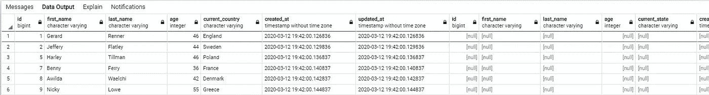

答对了。

## 工会(工会/工会所有人)

UNION 可能是所有 JOIN 子句中最简单的。

联合就像洗牌一样。它将两个或多个 SELECT 语句的结果组合成一个数据集。根据您使用的 SQL 版本，UNION 还可能将第一个查询中的行放在第二个查询的行之前、之后或之间。不过这真的不是问题，因为我们可以使用 ORDER BY 子句对组合数据集中的行进行排序。

如果你想看联合的维恩图…好吧…给你:

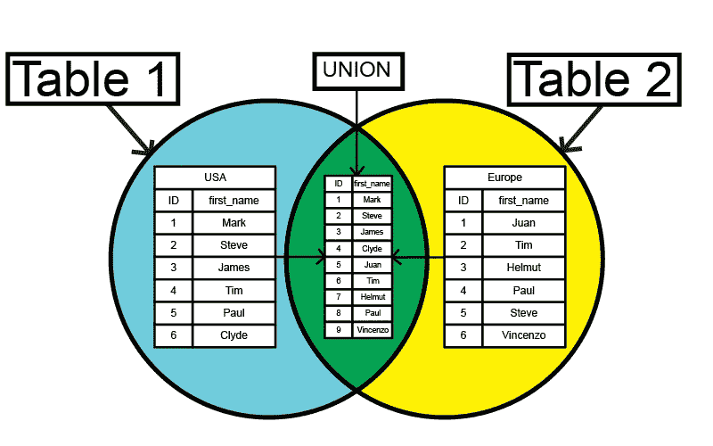

相当直接。

除了一个关键的区别之外，UNION 和 UNION 都在相同的领域中起作用。

UNION 会删除重复的行，而 UNION ALL 不会。

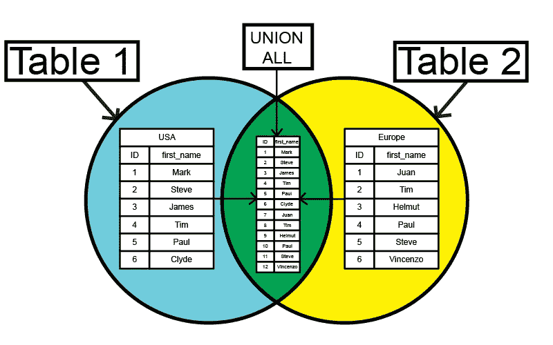

不过还是有一些和工会的约定。两个 SELECT 子句必须返回相同数量的列，并且两列必须具有相同的数据类型。

让我们看一些基本的例子:

```
SELECT first_name
FROM usa
UNION
SELECT first_name
FROM europe
```

这将返回一个新的数据集，其中包含我们从两个表中选择的两列，合并为一列:

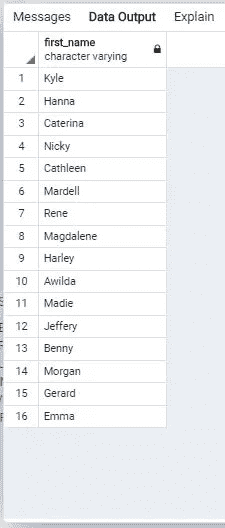

UNION ALL 以相同的方式编写，但应该返回一个包含重复项的完整数据集:

```
SELECT first_name
FROM usa
UNION
SELECT first_name
FROM europe
```

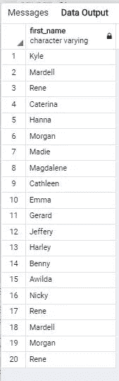

# 耶特。