# SQL 连接—简单指南

> 原文：<https://levelup.gitconnected.com/sql-joins-a-simple-guide-7fe666535095>

如果您正在使用 SQL 关系数据库，在某些时候您将使用 **JOIN** s。规范化数据被组织并分布在多个表中，通常由一个公共列*键*(或多个键)链接。我们用**连接** s 到*把数据集合在一起*。因此**加入** s 是一个需要把握的重要概念。互联网上到处都有 SQL `JOIN`文章和指南，我将再添加一篇…

自我推销:

如果你喜欢这里写的内容，尽一切办法，把这个博客和你最喜欢的帖子分享给其他可能从中受益或喜欢它的人。既然咖啡是我最喜欢的饮料，如果你愿意，你甚至可以给我买一杯！

在本文中，我使用 Oracle SQL 作为示例`JOIN`查询。您正在使用的 SQL 实现应该有可比较的`JOIN` s。但是，所有的 SQL 数据库并不完全相同，因此请务必咨询您的供应商的文档以了解任何具体问题或说明。

这篇文章的示例查询来自下面显示的两个表。它们在结构和设计上都非常简单，每个都包含一个名为 **NUM_COL** 的`NUMBER`列，列中有`INTEGER`值:

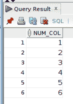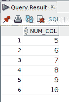

## SQL 联接:联接的类别

基本上有两种类型或类别的`JOIN`:

*   `INNER JOIN`—`INNER JOIN`仅当表中的数据值匹配时，才返回相关表中的组合行。
*   `OUTER JOIN`—`OUTER JOIN`返回目标表之间涉及的行，无论数据之间是否匹配。

## SQL 联接:自然联接

一个`NATURAL JOIN`在目标表之间的任何同名列上执行`JOIN`。默认情况下，`NATURAL JOIN`是`INNER JOIN` ，但也可以与`OUTER JOIN`一起使用:

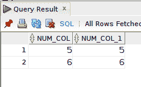

自然连接的查询结果。

因为*这个* `NATURAL JOIN`查询是一个`INNER JOIN`类型，所以只返回匹配的行。两个表 **NUM1_TAB** 和 **NUM2_TAB** 都有返回列值为 5 和 6 的行。

(提示:与其他`JOIN`类型不同，表别名前缀不能用在`NATURAL JOIN`中的实际*连接列*上。在我们的例子中，`SELECT`列表中的两个 **NUM_COL** 列名都没有表别名前缀。)

## SQL 联接:使用关键字

`USING`关键字还基于在`JOIN`所涉及的表中找到的同名列连接表行。`USING`适用于`INNER`和`OUTER JOIN`类型。

`USING`语法是:

`USING(column_name)`

由于两个目标表都有一个名为 **NUM_COL** 的列，我们可以在`USING`关键字后的括号中指定该列，以对以下内容执行`JOIN`:

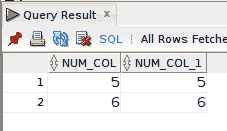

使用关键字查询结果。

同样，因为这个查询是一个`INNER JOIN`类型，所以只返回匹配的行，如`NATURAL JOIN`示例所示。

(**提示**:与`NATURAL JOIN`相同，当使用`USING`关键字时，不能在连接列上使用表别名前缀。)

## SQL 联接:内部联接

您将使用或遇到的最常见的`JOIN`类型之一是`INNER JOIN`。虽然有一个地方可以容纳`OUTER JOIN` s，并且通常`OUTER JOIN`是获取所需数据的唯一方式，但是内部连接经常被使用。`INNER JOIN`通过 on 关键字使用了一个显式的*连接条件*。

在使用`NATURAL JOIN`和`USING`关键字的示例查询中，*连接条件*在某种程度上是为我们考虑的，使用`**INNER JOIN**`，我们必须自己指定它。

(**提示**:关键字`INNER`是可选的，可以完全省略。)

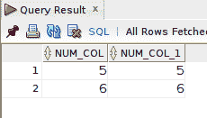

内部联接的查询结果。

在这个示例查询中，返回相同的查询结果。然而,*连接条件*是在该行指定的:

`ON N1.NUM_COL = N2.NUM_COL;`

## SQL 联接:列不明确

在前面包含`NATURAL JOIN`和`USING`关键字的例子中，查询中不允许使用表别名列前缀。但是，对于具有相同名称的列的内部`JOIN`，如果没有它们，我们将会得到一个不明确的错误。无论是在`ON` *加入条件*还是`SELECT`条款列表中被省略；

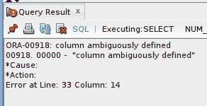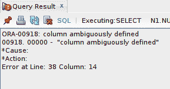

因为`INNER JOIN`中涉及的两个表都有一个名为 **NUM_COL** 的列，并且它包含在`SELECT`列表中，所以我们必须在查询中通过用别名前缀限定的*来区分它们。列上的表别名前缀解决了这个不明确的问题。*

我坚持每周写一封关于我正在学习并感兴趣的 SQL/PHP 的邮件。如果这听起来像是你想参与的事情，请使用此[注册表格](https://digitalowlsprose.ck.page/1b35a06295)进行订阅。谢谢大家！

## SQL 联接:左外部联接

到目前为止，我们使用的`JOIN`返回目标连接表中数据行匹配的结果。现在是时候了解一下`OUTER JOIN` s 了。正如本文前面提到的，一个`OUTER JOIN`从目标`JOIN`表中返回匹配和不匹配的行。

但是，那看起来像什么？

我们从一个`LEFT OUTER JOIN`开始。在下面的示例查询中，请注意在 FROM 子句中列出了 **NUM1_TAB** 和 **NUM2_TAB** 表，用`LEFT JOIN`关键字分隔开(关键字`OUTER`是可选的):

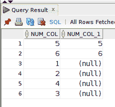

从表 **NUM1_TAB** 返回所有行。同样，返回 **NUM2_TAB** 中匹配的行列值 5 和 6。但是，如果 **NUM_COL** 列与 **NUM2_TAB** 表中的**列不匹配，则返回`NULL`。回想一下 **NUM2_TAB** 表的数值范围是 5–10，其中 **NUM1_TAB** 表包含范围值 1–6。**

因此，从技术上讲，两个表中唯一匹配的行是列值为 5 和 6 的行。

## SQL 联接:右外部联接

`LEFT OUTER JOIN`的反义词是`RIGHT OUTER JOIN`。在这种类型的`JOIN`中，所有行都从由`RIGHT JOIN`关键字指定的表中返回。在`FROM`子句中列出的第一个表(在本例中为查询 **NUM1_TAB** )返回任何匹配的行，但是，如果没有匹配，则为这些行返回`NULL`:

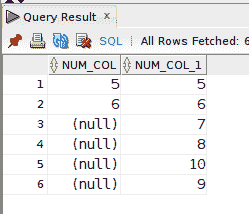

## SQL 联接:完全外部联接

如果我们想结合从`LEFT JOIN`和`RIGHT JOIN`获得的功能，我们可以使用`FULL OUTER JOIN`。

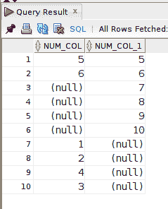

(**提示**:和其他`OUTER JOIN`一样，`OUTER`关键字对于`FULL JOIN`是可选的。)

我们可以`ORDER BY`其中一个表列，并对结果集进行排序，以进一步查看和理解底层操作。

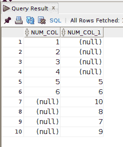

在`FULL JOIN`查询结果中，为两个表的数据返回匹配和不匹配的行。对于不匹配的行，返回`NULL`。我们可以清楚地看到，行-列值 5 和 6 是两个表之间仅有的共同行。

## SQL 联接:交叉联接

我们将讨论的最后一个`JOIN`是`CROSS JOIN`。返回连接表行的笛卡尔积。在`CROSS JOIN`中没有`ON`连接规范或`USING`关键字。

为了演示一个`CROSS JOIN`，我将使用下面的两个表格。

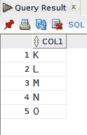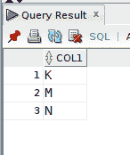

对于`CROSS JOIN`，在**表 1** 中的每一行将与**表 2** 中的每一行连接。由于**表 1** 中有 5 行，而**表 2** 中有 3 行，下面的`CROSS JOIN`查询返回 15 行:

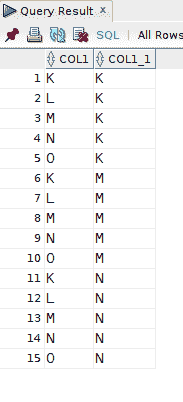

一如既往，如果你有任何问题或看到代码中的任何错误，请通过评论让我知道。建设性的意见有助于我提供准确的博客帖子，我非常感激。

喜欢你读过的？看到什么不正确的吗？请在下面评论，感谢阅读！！！

# 行动的号召！

感谢你花时间阅读这篇文章。我真心希望你发现了一些有趣和有启发性的东西。请在这里与你认识的其他人分享你的发现，他们也会从中获得同样的价值。

访问 [Portfolio-Projects 页面](https://wp.me/P28ctb-3KD)查看我为客户完成的博客帖子/技术写作。

如果你愿意，请给我买杯咖啡！太感谢了！

要在最新的博客文章发表时收到来自本博客(“数字猫头鹰散文”)的电子邮件通知(绝不是垃圾邮件)，请点击“点击订阅！”按钮在首页的侧边栏！(如有任何问题，请随时查看 [Digital Owl 的散文隐私政策页面](https://wp.me/P28ctb-3gI):电子邮件更新、选择加入、选择退出、联系表格等……)

请务必访问[“最佳”](https://joshuaotwell.com/where-blog_post-in-digital-owls-prose-best-of/)页面，收集我的最佳博客文章。

[Josh Otwell](https://joshuaotwell.com/about/) 作为一名 SQL 开发人员和博客作者，他热衷于学习和成长。其他最喜欢的活动是让他埋头于一本好书、一篇文章或 Linux 命令行。其中，他喜欢桌面 RPG 游戏，阅读奇幻小说，并与妻子和两个女儿共度时光。

免责声明:本文中的例子是关于如何实现类似结果的假设。它们不是最好的解决方案。所提供的大多数(如果不是全部)示例都是在个人发展/学习工作站环境中执行的，不应被视为生产质量或就绪。您的特定目标和需求可能会有所不同。使用那些最有利于你的需求和目标的实践。观点是我自己的。*原载于 2021 年 8 月 11 日 https://joshuaotwell.com***。**