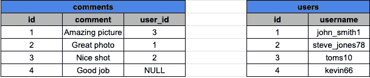
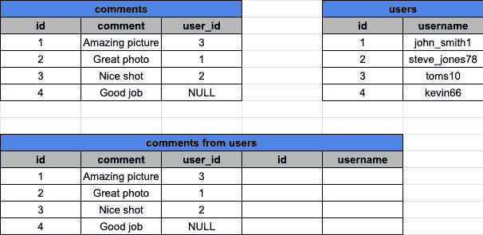
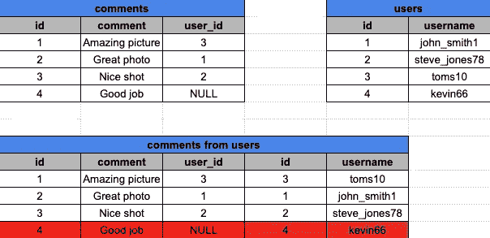
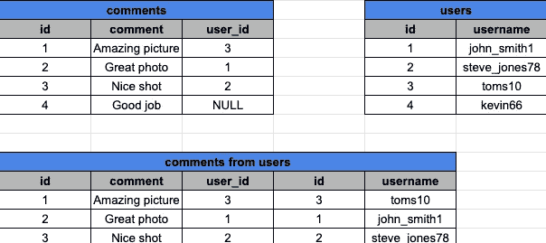
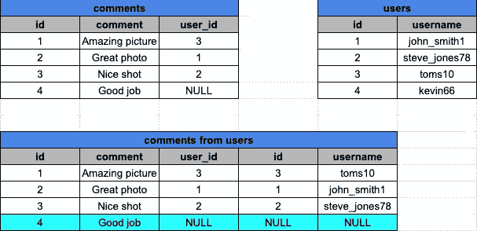
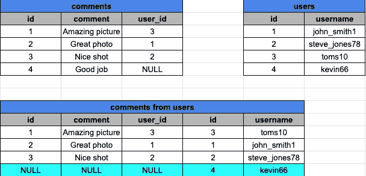
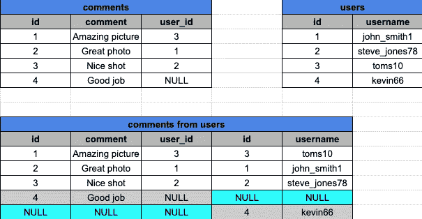

# SQL 用简单的英语连接

> 原文：<https://levelup.gitconnected.com/sql-joins-in-plain-english-c43379368396>

## 内、左、右和全联接是如何工作的

卡斯帕·鲁宾在 [Unsplash](https://unsplash.com/photos/fPkvU7RDmCo) 上的照片

我记得我第一次发现 SQL 连接的时候。我去谷歌上看看它们是如何工作的。然后可能有数百个图形看起来非常相似，有两个圆圈，交叉的路径弹出来，我认为这个图形是开发人员在考虑 SQL 连接时最常见的想象。但是我觉得 SQL 连接可能有点混乱，尽管一旦你理解了连接实际上是如何工作的，互联网上的图表就很有意义。

假设我们有两张表:

## 内部连接

现在如果我们想要一个简单的连接，就像这样:

我们可以想象已经创建了一个新表，如下所示:

我们已经放入了初始表中的所有数据，现在只需要将 users 表中的条目匹配到 comments 表中。我想把它想象成一个 *foreach* 循环，遍历每一行，看看条件是否满足。在我们的例子中 *users.id = comments.user_id。*

因此，我们已经将前三行与 users 表中的有效用户进行了匹配。但是，第四行不匹配，因为 id 等于 4 的注释没有有效的 user_id。所以我们删除了最后一行，最终结果如下所示。

关于内部连接，需要记住的重要一点是，我们只保留与第二个表中的行匹配的行，其他的都从最终结果中删除。

## 左连接

快速移动到左边路口。我们将首先使用相同的两张表。

现在我们要执行 LEFT JOIN 命令。

我们将会得到这样的结果:

与内连接相比，唯一的区别是，当我们进行左连接时，初始表中的所有数据将保持原样，如果我们没有与被连接的表匹配的数据，则该表中的值将默认为 NULL。简单的想法是，无论第二个表上是否有匹配，来自命令“FROM comments”的内容都将一直存在。

## 右连接

现在，左连接和右连接之间的唯一区别是，这一次，来自被连接的表的内容将被显示，即使它与我们从中选择数据的初始表不匹配。

sql 命令如下所示:

最终的结果会略有不同。

## 完全连接

完全加入是我们列表中的最后一个，它在某种程度上是左派和右派的结合。即使没有匹配，我们也需要显示两个表中的行。

所以如果我们再执行一次新命令。

所以现在我们需要记录第一个表和第二个表中的条目。首先，我们需要像进行左连接一样获取行，然后像进行右连接一样添加一个额外的行。

最终结果将会是:

我们的结果表中有 5 行，因为我们记录了两个表中的所有数据，并且因为有两行不匹配，所以需要分别添加它们。

## 结论

理解 SQL JOIN 非常重要，因为它们在处理大数据时非常强大和有用，所以我希望这些解释有所帮助，如果有任何问题，请提问，因为我很乐意讨论它们。

 [## 通过我的推荐链接加入 Medium-Ivan Stoev

### 作为一个媒体会员，你的会员费的一部分会给你阅读的作家，你可以完全接触到每一个故事…

medium.com](https://medium.com/@ivan.zstoev/membership)