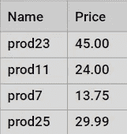
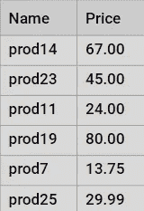
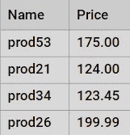

# 存储过程中的 SQL 参数

> 原文：<https://levelup.gitconnected.com/sql-parameters-in-stored-procedures-faf38d8af088>

## 学习在 SQL 存储过程中使用参数，使您的代码更加通用和可靠。


在本教程中，我们将深入研究存储过程。了解如何向其传递一个或多个参数。这将导致存储过程的结果根据输入的参数值而改变。

# 带一个参数的存储过程

我们将创建一个示例来展示参数是如何工作的。假设我们有一个包含大量信息的产品表。我们可以向存储过程添加一个参数，以返回价格低于输入价格的产品:

```
CREATE PROCEDURE usp_find_products
  (@max_price AS DECIMAL)
AS
BEGIN
    SELECT
        name, price
    FROM 
        products
    WHERE
        price <= @max_price
END;
```

让我们来分析这个例子:

*   我们在过程`usp_find_products.`中添加了一个名为`@max_price`的参数，每个参数都必须以`@`符号开始。为了指定参数的数据类型，我们使用了`AS DECIMAL`，但是我们也可以直接使用`DECIMAL`。传递的参数必须用左括号和右括号括起来。
*   然后我们在`WHERE`子句中使用`@max_price`，只过滤价格小于或等于`@max_price`的产品。

要执行`usp_find_products`存储过程，在这种情况下，您应该传递一个参数:

```
EXEC usp_find_products 50;
```



如果将参数更改为 100，将返回不同的结果:

```
EXEC usp_find_products 100;
```



# 多参数存储过程

当编写带有几个参数的存储过程时，这些参数用逗号分隔。

让我们修改前面的存储过程`uspFindProducts`来确定最高价格和最低价格。

```
ALTER PROCEDURE usp_find_products(
    @min_price AS DECIMAL
    ,@max_price AS DECIMAL
)
AS
BEGIN
    SELECT
        name, price
    FROM 
        products
    WHERE
        price >= @min_price AND
        price <= @max_price
END;EXECUTE uspFindProducts 900, 1000;
```

然后，我们执行存储过程，并向它传递两个参数值:`EXECUTE usp_find_products 100, 200;` ，例如，它返回以下输出:



通常，最好使用命名参数来执行存储过程。下面的代码将与前面的调用一样执行:

`EXECUTE usp_find_products @min_list_price = 900, @max_list_price = 1000;`

# 定义可选参数

在前面的所有示例中，都需要为所有定义的参数传递值。但是 SQL 允许我们为一个参数定义一个默认值，这将让参数在没有明确地在 EXECUTE 上传递它的情况下使用这个值。

请参见下面的存储过程示例:

```
ALTER PROCEDURE usp_find_products(
    @min_price AS DECIMAL = 0
    ,@max_price AS DECIMAL = 1000
)
AS
BEGIN
    SELECT
        name, price
    FROM 
        products
    WHERE
        price >= @min_price AND
        price <= @max_price
END;
```

我们改变了存储过程，将`0`指定为`@min_price`参数的默认值，将`1000`指定为`@max_price`的默认值。

然后，您将能够在不传递`@min_price`和`@max_price`的值的情况下执行:`EXECUTE usp_find_products.` 将`0`和`1000`作为默认值，并将返回符合这些条件的产品。

请注意，在调用 execute 时，您仍然可以将值传递给可选参数。在这种情况下，您可以不传递任何参数值，也可以传递任何一个参数值，或者同时传递两个参数值。如下例所示:

```
EXECUTE usp_find_products; 
EXECUTE usp_find_products @min_price=10; 
EXECUTE usp_find_products @min_price=10, @max_price=100;
```

知道你也可以设置一个参数默认值为`NULL`。请注意，这通常是一种应该避免的技术。

# 输出参数

存储过程也可以有输出参数。例如，让我们修改前面的过程，通过输出参数`@count`返回产品数量:

```
ALTER PROCEDURE usp_find_products(
    @min_price AS DECIMAL = 0
    ,@max_price AS DECIMAL = 1000
    ,@count INT OUTPUT
)
AS
BEGIN
    SELECT
        name, price
    FROM 
        products
    WHERE
        price >= @min_price AND
        price <= @max_price
    SELECT @count = @@ROWCOUNT;
END;
```

上面我们创建了一个名为`@count`的输出参数来存储找到的产品数量:`@count INT OUTPUT.`我们将选择查询(`@@ROWCOUNT`)返回的行数赋给了`@count`参数。

`@@ROWCOUNT`是一个系统变量，它采用前面的 select 语句返回的行数的值。

使用输出参数可以检索存储过程内部计算的数据，并将其放入参数中，以便在过程外部使用。

在本教程中，您已经学习了如何使用具有一个或多个参数的存储过程。您还学习了如何创建可选参数和使用输出参数。

感谢您的阅读，祝您度过愉快的一天！继续编码。