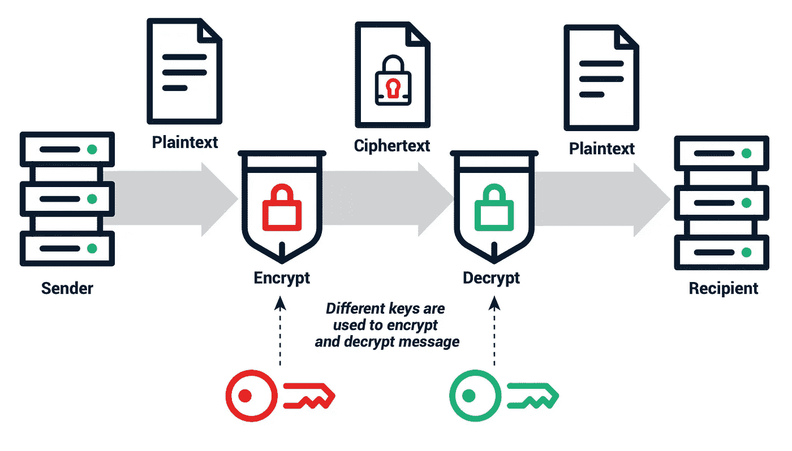
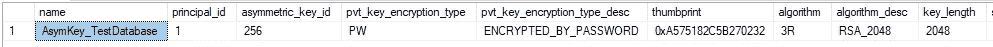
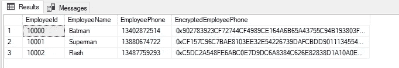
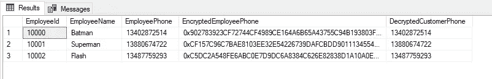
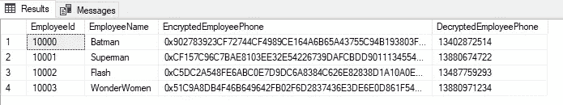
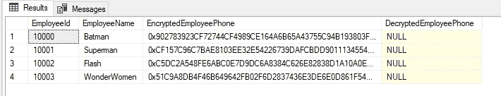
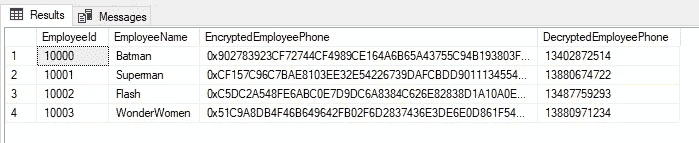

# SQL Server:使用非对称密钥的列加密

> 原文：<https://levelup.gitconnected.com/sql-server-column-encryption-using-asymmetric-keys-fa9ea1bd69ea>

SQL Server 可以使用对称密钥来加密列，但是这种方法安全性较低。在本文中，我们展示了如何使用非对称密钥在 SQL Server 中实现列加密，并保护用户的关键核心隐私数据列。


# 不对称加密过程

与对称加密不同，非对称加密使用不同的密钥进行加密和解密。用于加密的密钥称为公钥，用于解密的密钥称为私钥。不对称加密提供了更好的安全性。下图显示了不对称加密过程:



不对称加密过程如下:

1.  数据接收者首先创建私钥和公钥，然后将公钥发送给数据发送者(图中未显示)。
2.  数据发送方使用公钥将明文加密成密文。
3.  发送方通过网络将密文发送给接收方。
4.  接收方接收密文，并使用私钥解密数据以获得最终的明文数据。

在非对称加密过程中，私钥不通过网络传递。因此，私钥不会被窃取，提供了更高的安全性。

# 实现非对称密钥列加密

下一节详细描述了如何使用非对称加密在 SQL Server 中实现列加密。

SQL Server 2005 或更高版本通过使用对称密钥和非对称密钥来支持列加密。以下部分解释了使用非对称密钥加密手机号码的具体实现步骤和过程。

# 创建测试数据库

创建一个名为`TestDatabase`的专用测试数据库。

```
-- Step 1 ¨C Create MSSQL sample database
USE master
GO
IF DB_ID('TestDatabase') IS NOT NULL
    DROP DATABASE [TestDatabase]
GOCREATE DATABASE [TestDatabase];
GO
```

# 创建一个测试表

在`TestDatabase`中，创建一个名为 EmployeeInfo 的专用测试表

```
-- Step 2 ¨C Create Test Table, Initialize data & verify
USE [TestDatabase]
GO
IF OBJECT_ID('dbo.EmployeeInfo', 'U') IS NOT NULL
    DROP TABLE dbo.EmployeeInfoCREATE TABLE dbo.EmployeeInfo
(
EmployeeId     INT IDENTITY(10000,1)   NOT NULL PRIMARY KEY,
EmployeeName   VARCHAR(100)            NOT NULL,
EmployeePhone  CHAR(11)                NOT NULL
);-- Initialize Table
INSERT INTO dbo.EmployeeInfo
VALUES ('Batman','13402872514')
,('Superman','13880674722')
,('Flash','13487759293')
GO-- Verify data
SELECT * 
FROM dbo.EmployeeInfo
GO
```

在原始数据中，用户电话号码以明文形式存储，这意味着任何有权访问表数据的人都可以获得电话号码，如下所示:

# 创建实例级主密钥

在 SQL Server 数据库中的实例级别创建主密钥(在 Master 数据库下使用 CREATE MASTER KEY 语句):

```
-- Step 3 ¨C Create SQL Server Service Master Key
USE master;
GO
IF NOT EXISTS(
    SELECT *
    FROM sys.symmetric_keys
    WHERE name = '##MS_ServiceMasterKey##')
BEGIN
    CREATE MASTER KEY ENCRYPTION BY 
    PASSWORD = 'MSSQLSerivceMasterKey'
END;
GO
```

# 创建数据库级主密钥

在用户数据库中的 TestDatabase 下，创建主密钥:

```
-- Step 4 ¨C Create MSSQL Database level master key
USE [TestDatabase]
GO
IF NOT EXISTS (SELECT * 
                FROM sys.symmetric_keys 
                WHERE name LIKE '%MS_DatabaseMasterKey%')
BEGIN        
    CREATE MASTER KEY ENCRYPTION BY PASSWORD =   'TestDatabaseMasterKey@3*';
END
GO
```

# 创建非对称密钥

在用户数据库下，创建非对称密钥并用密码加密它们:

```
-- Step 5 ¨C Create MSSQL Symmetric Key
USE [TestDatabase]
GO
IF NOT EXISTS (SELECT * 
                FROM sys.asymmetric_keys 
                WHERE name = 'AsymKey_TestDatabase')
BEGIN
    CREATE ASYMMETRIC KEY AsymKey_TestDatabase
    WITH ALGORITHM = RSA_2048
    ENCRYPTION BY PASSWORD = 'Password4@Asy'
    ;
END
GO
```

# 查看非对称密钥

您可以使用以下查询语句来查看非对称密钥:

```
USE [TestDatabase]
GOSELECT *
FROM  sys.asymmetric_keys
```

结果如下所示:



# 修改表格结构

接下来，我们需要修改稳定结构并添加一个 varbinary(max)类型的新列，用于存储加密的电话号码密文(假设我们将新列命名为“EncryptedEmployeePhone”)。

```
-- Step 6 ¨C Change your table structure
USE [TestDatabase]
GO 
ALTER TABLE EmployeeInfo 
ADD EncryptedEmployeePhone varbinary(MAX) NULL
GO
```

# 初始化新列中的数据

添加新列后，我们将表的 EmployeePhone 列中的存档数据加密为密文，并将其存储在新列 EncryptedEmployeePhone 中。为此，我们使用 EncryptByAsymKey 函数来加密 EmployeePhone 列，如以下语句所示:

```
-- Step 7 ¨C init the encrypted data into the newly column
USE [TestDatabase]
GOUPDATE E
SET EncryptedEmployeePhone= ENCRYPTBYASYMKEY(ASYMKEY_ID('AsymKey_TestDatabase'), EmployeePhone)
FROM dbo.EmployeeInfo AS E;
GO-- Double-check the encrypted data of the new column
SELECT * FROM dbo.EmployeeInfo
```

我们可以看到，表中`EncryptedEmployeePhone`列的数据在使用非对称密钥加密后，变成了`EmployeePhone`列的密文数据。



# 查看加密数据

将电话号码加密成密文后，我们需要使用 DecryptByAsymKey 函数将其解密成明文。让我们看看能否成功解密 EncryptedEmployeePhone 字段。

```
-- Step 8 ¨C Reading the SQL Server encrypted data
USE [TestDatabase]
GO-- Now, it is time to list the original phone number, encrypted phone number, and decrypted phone number.
SELECT 
    *,
    DecryptedEmployeePhone = CONVERT(CHAR(11), DECRYPTBYASYMKEY(ASYMKEY_ID('AsymKey_TestDatabase'), EncryptedEmployeePhone, N'Password4@Asy'))
FROM dbo.EmployeeInfo;
GO
```

该查询语句显示了以下结果，其中 EmployeePhone 列和 DecryptedEmployeePhone 列中的数据相同，表明加密和解密成功。



# 添加新数据

既然加密和解密后归档的数据是相同的，让我们看看如果添加新数据会发生什么:

```
-- Step 9 ¨C What if we add a new record to the table.
USE [TestDatabase]
GO-- Performs the update of the record
INSERT INTO dbo.EmployeeInfo(EmployeeName, EmployeePhone, EncryptedEmployeePhone)
VALUES ('WonderWomen', '13880975623', ENCRYPTBYASYMKEY( ASYMKEY_ID('AsymKey_TestDatabase'), '13880975623'));  
GO
```

# 更新电话号码

现在，我们尝试更新用户电话号码:

```
-- Step 10 ¨C So, what if we update the phone number
USE [TestDatabase]
GO-- Performs the update of the record
UPDATE E
SET EncryptedEmployeePhone = ENCRYPTBYASYMKEY( ASYMKEY_ID('AsymKey_TestDatabase'), '13880971234')
FROM dbo.EmployeeInfo AS E
WHERE CONVERT(CHAR(11), DECRYPTBYASYMKEY(ASYMKEY_ID('AsymKey_TestDatabase'), EncryptedEmployeePhone, N'Password4@Asy')) = '13880975623'
GO
```

# 删除电话号码明文列

假设一切按预期进行，我们可以删除明文电话号码列“EmployeePhone”:

```
-- Step 11 ¨C Remove old column
USE [TestDatabase]
GO 
ALTER TABLE EmployeeInfo
DROP COLUMN EmployeePhone;
GOSELECT 
    *,
    DecryptedEmployeePhone = CONVERT(CHAR(11), DECRYPTBYASYMKEY(ASYMKEY_ID('AsymKey_TestDatabase'), EncryptedEmployeePhone, N'Password4@Asy'))
FROM dbo.EmployeeInfo
GO
```

结果如下所示:



存档的数据、新添加的数据、更新的数据，一切都按预期进行。理论上，这篇文章可以到此为止。然而，还有两个问题。新创建的用户可以访问表数据吗？如果没有，我们如何授予新用户对表数据的访问权限？

# 添加新用户

假设我们添加了一个名为 EncryptedDbUser 的新用户:

```
-- Step 12 ¨C Create a new user and access the encrypted data
USE [TestDatabase]
GO 
CREATE LOGIN EncryptedDbUser
WITH PASSWORD=N'EncryptedDbo@3*', CHECK_POLICY = OFF;
GOCREATE USER EncryptedDbUser FOR LOGIN EncryptedDbUser;GRANT SELECT ON OBJECT::dbo.EmployeeInfo TO EncryptedDbUser;
GO
```

# 作为新用户查询数据

我们使用新创建的用户并在 SSMS 打开一个新的连接来查询数据:

```
-- Step 13 ¨C OPEN a new connection query window using the new user and query data 
USE [TestDatabase]
GOSELECT
*,
DecryptedEmployeePhone = CONVERT(CHAR(11), DECRYPTBYASYMKEY(ASYMKEY_ID('AsymKey_TestDatabase'), EncryptedEmployeePhone, N'Password4@Asy'))
FROM dbo.EmployeeInfo
GO
```

此新用户无法成功解密 EncryptedEmployeePhone。DecryptedEmployeePhone 字段的解密值为空。这意味着新用户无法明文查看用户电话号码，防止未知用户获取此类核心数据。



# 向新用户授予权限

新添加的用户无权查看加密列。要授予新添加的用户查看加密列中数据的权限，我们可以使用以下语句:

```
--Step 14 ¨C Grant permissions to EncryptedDbUser
USE [TestDatabase]
GOGRANT VIEW DEFINITION ON 
    ASYMMETRIC KEY::[AsymKey_TestDatabase] TO [EncryptedDbUser];
GO
GRANT CONTROL ON 
    ASYMMETRIC KEY::[AsymKey_TestDatabase] TO [EncryptedDbUser];
GO
```

# 作为新用户再次查询数据

授予所需的权限后，如果新用户运行“以新用户身份查询数据”一节中的查询语句，则该用户可以获得加密列中的明文数据。

```
-- Step 13 ¨C OPEN a new connection query window using the new user and query data 
USE [TestDatabase]
GOSELECT
*,
DecryptedEmployeePhone = CONVERT(CHAR(11), DECRYPTBYASYMKEY(ASYMKEY_ID('AsymKey_TestDatabase'), EncryptedEmployeePhone, N'Password4@Asy'))
FROM dbo.EmployeeInfo
GO
```

第二个查询的结果如下所示:



# 摘要

我希望我能够展示非对称加密是如何工作的，以及 SQL Server 是如何通过使用非对称密钥保护用户核心数据来实现列加密的。