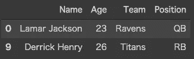

# SQL v. Pandas:基本语法比较和备忘单

> 原文：<https://levelup.gitconnected.com/sql-v-pandas-basic-syntax-comparison-cheat-sheet-498289372d45>

在开始使用 Python 中的 Pandas 之前，我已经使用 SQL 好几年了。我最终习惯了它，但是当我开始的时候，我在它们之间的语法差异中挣扎。

我想在这篇文章中收集语法比较，也作为备忘单。我将提到基本语法，但如果有另一个例子在这篇文章中不存在，请让我知道！


[https://github.com/shotin93/sql-v-pandas](https://github.com/shotin93/sql-v-pandas)

# 资料组

我将使用这个数据集。

```
import pandas as pddf_list = [
  ["Lamar Jackson", 23, "Ravens", "QB"]
  , ["Russell Wilson", 31, "Seahawks", "QB"]
  , ["Aaron Donald", 29, "Rams", "DT"]
  , ["Patrick Mahomes", 24, "Chiefs", "QB"]
  , ["Michael Thomas", 27, "Saints", "WR"]
  , ["Christian McCaffrey", 24, "Panthers", "RB"]
  , ["George Kittle", 26, "49ers", "TE"]
  , ["DeAndre Hopkins", 28, "Cardinals", "WR"]
  , ["Stephon Gilmore", 29, "Patriots", "CB"]
  , ["Derrick Henry", 26, "Titans", "RB"]
]
df_columns = ["Name", "Age", "Team", "Position"]
players = pd.DataFrame(data=df_list, columns=df_columns)
```


演员

# 挑选

全部提取:

```
SQL: SELECT * FROM playersPandas: players
```

一些列的投影:

```
SQL: SELECT Name, Age FROM playersPandas: players[["Name", "Age"]]
```


顶部一些行的选择:

```
SQL: SELECT TOP 5 * FROM playersPandas: players.head(5)
```


独特:

```
SQL: SELECT DISTINCT Position FROM playersPandas: players["Position"][~players["Position"].duplicated()]
```

# 在哪里

带条件的特定行的选择:

```
SQL: SELECT * FROM players WHERE Position = 'QB'Pandas: players[players.Position == "QB"]
also: players[players["Position"] == "QB"]
```


特定行的选择和某些列的投影

```
SQL: SELECT Name, Age FROM players WHERE Position = 'QB'Pandas: players[["Name", "Age"]][players.Position == "QB"]
```


不是:

你必须用“~”而不是“不是”。

```
SQL: SELECT * FROM players WHERE NOT Position =='QB'Pandas: players[~(players.Position == "QB")]
also: players[~(players["Position"] == "QB")]
```


和/或:

```
SQL: SELECT Name, Age FROM players WHERE Position = 'QB' AND Age < 30Pandas: players[["Name", "Age"]][(players.Position == "QB") & (players.Age < 30)]
```


```
SQL: SELECT Name, Age FROM players WHERE Position = 'QB' OR Position = 'RB'Pandas: players[["Name", "Age"]][(players.Position == "QB") |(players.Position == "RB")]
```


你必须用括号把操作符括起来。

否则，您将得到一个 TypeError:无法对 dtyped [int64]数组和类型为[bool]的标量执行“rand_”

```
# without brackets
players[["Name", "Age"]][players.Position == "QB" & players.Age < 30]
```


你还必须用' & '和' | '来代替' and '和' or '。

否则，您将得到一个 ValueError:一个序列的真值是不明确的。使用 a.empty、a.bool()、a.item()、a.any()或 a.all()。

```
# using 'and'
players[["Name", "Age"]][(players.Position == "QB") and (players.Age < 30)]
```


当你想这样查询的时候；

```
SELECT Name, Age FROM
players
WHERE (Position = 'QB' AND Age < 25) OR (Position = 'RB' AND Age < 25)
```

你必须写作；

```
players[["Name", "Age"]][
(
    (players.Position == "QB") & (players.Age < 25)
) | (
    (players.Position == "RB") & (players.Age < 25)
)]
```


不是:

在:

```
SQL: SELECT * FROM players WHERE Position IN ('QB', 'RB')Pandas: players[players.Position.isin(["QB", "RB"])]
```


比如:

```
SQL: SELECT * FROM players WHERE Team LIKE '%ns%'Pandas: players[players.Team.str.contains("ns")]
```



# 以...排序

按 1 列排序:

```
SQL: SELECT * FROM players ORDER BY NamePandas: players.sort_values("Name")
```


按 2+列排序:

```
SQL: SELECT * FROM players ORDER BY Age, NamePandas: players.sort_values(["Age", "Name"])
```


DESC:

```
SQL: SELECT * FROM players ORDER BY Age DESC, NamePandas: players.sort_values(["Age", "Name"], ascending=[False, True])
```


# 分组依据

计数:

```
SQL: SELECT COUNT(*) AS COUNT FROM players GROUP BY PositionPandas: players.groupby("Position").agg({"Name": "count"}).rename(columns={"Name": "COUNT"})
```


总和:

```
SQL: SELECT SUM(Age) AS Age FROM players GROUP BY PositionPandas: players.groupby("Position").agg({"Age": "sum"})
```


AVG:

```
SQL: SELECT AVG(Age) AS Age FROM players GROUP BY PositionPandas: players.groupby("Position").agg({"Age": "mean"})
```


排名:

```
SQL: SELECT *, RANK() OVER (ORDER BY Age DESC) FROM playersPandas: 
players["AgeRank"] = players.Age.rank(ascending=False)
players
```


等级+分区依据

```
SQL: SELECT *, RANK() OVER (PARTITION BY Position ORDER BY Age DESC) FROM playersPandas: 
players["AgeRank"] = players.groupby("Position")["Age"].rank(ascending=False)
players
```


密集:

```
SQL: SELECT *, DENSE_RANK() OVER (ORDER BY Age DESC) FROM playersPandas: 
players["AgeRank"] = players.Age.rank(method="dense", ascending=False)
players
```


# 更新

```
SQL: UPDATE players SET Age = 0 WHERE Age = 24Pandas: players.loc[players.Age == 24, "Age"] = 0
```


# 加入

请看我的另一篇文章！

[](https://medium.com/@sh_in/sql-v-pandas-join-57642dc3ce76) [## SQL v. Pandas:加入

### 在开始使用 Python 中的 Pandas 之前，我已经使用 SQL 好几年了。我最终习惯了，但是我…

medium.com](https://medium.com/@sh_in/sql-v-pandas-join-57642dc3ce76)