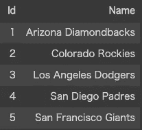
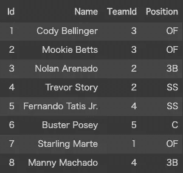
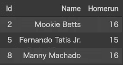
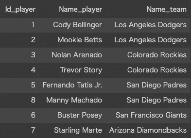
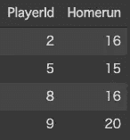
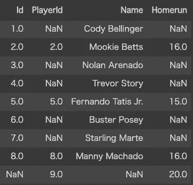

# SQL v. Pandas:加入

> 原文：<https://levelup.gitconnected.com/sql-v-pandas-join-57642dc3ce76>

在开始使用 Python 中的 Pandas 之前，我已经使用 SQL 好几年了。我最终习惯了它，但是当我开始的时候，我为它们之间的语法差异而挣扎。

当您学习 pandas 时，您最终会想如何像在 SQL 中一样在 pandas 中实现 join。我打算在这篇文章中写下这件事。

在开始之前，我收集了本文中的基本语法和比较。另请参见:

[](https://medium.com/@sh_in/sql-v-pandas-basic-syntax-comparison-cheat-sheet-498289372d45) [## SQL v. Pandas:基本语法比较和备忘单

### 在开始使用 Python 中的 Pandas 之前，我已经使用 SQL 好几年了。我最终习惯了，但是我…

medium.com](https://medium.com/@sh_in/sql-v-pandas-basic-syntax-comparison-cheat-sheet-498289372d45) 

# **数据集**

```
import pandas as pddf_team = [
  [1, "Arizona Diamondbacks"]
  , [2, "Colorado Rockies"]
  , [3, "Los Angeles Dodgers"]
  , [4, "San Diego Padres"]
  , [5, "San Francisco Giants"]
]
team_columns = ["Id", "Name"]
teams = pd.DataFrame(data=df_team, columns=team_columns)
```



组

```
df_player = [
  [1, "Cody Bellinger", 3, "OF"]
  , [2, "Mookie Betts", 3, "OF"]
  , [3, "Nolan Arenado", 2, "3B"]
  , [4, "Trevor Story", 2, "SS"]
  , [5, "Fernando Tatis Jr.", 4, "SS"]
  , [6, "Buster Posey", 5, "C"]
  , [7, "Starling Marte", 1, "OF"]
  , [8, "Manny Machado", 4, "3B"]
]
player_columns = ["Id", "Name", "TeamId", "Position"]
players = pd.DataFrame(data=df_player, columns=player_columns)
```



演员

```
#To make example easier, only 3 players
df_homerun = [
  [2, 16]
  , [5, 15]
  , [8, 16]
]
homerun_columns = ["PlayerId", "Homerun"]
homeruns = pd.DataFrame(data=df_homerun, columns=homerun_columns)
```


本垒打

# 什么是加入？

JOIN 是一种 SQL 语法，它将 2+个数据集(表)合并成一个数据集。比如如上，你如何定义属于道奇队的球员？

首先，您在 teams 数据集中搜索并找到 Id 为 3 的 Dodgers。然后，你用 TeamId: 3 在玩家数据集中搜索。

这不难，但是道奇队球员的本垒打呢？您找到道奇队的所有球员，并在全垒打数据集中搜索所有球员。

JOIN 语法使得这个过程被跳过。您可以同时显示球队名称、球员姓名和全垒打。

联接大致有两种模式:内部联接和外部联接。让我们看看如何在熊猫中编写每个连接模式。

# 内部连接

内部联接是

*   按指定的列合并 2 个数据集。
*   保留一些在两个表中都有列值的行。

在 SQL 中，我们可以写如下:

```
SELECT
  p.Id
  ,p.Name
  ,h.Homerun
FROM players p
INNER JOIN homeruns h
  ON p.Id = h.PlayerId
```

运筹学

```
SELECT
  p.Id
  ,p.Name
  ,h.Homerun
FROM players p, homeruns h
where p.Id = h.PlayerId
```

在熊猫身上:

```
player_homerun = pd.merge(players, homeruns, left_on="Id", right_on="PlayerId", how="inner")
```



player_homerun[["Id "，" Name "，" Homerun"]]

如果表有几个键，您可以将“on”参数设置为 list。

```
player_homerun = pd.merge(players, homeruns, left_on=["Id", "xx", ...], right_on=["PlayerId", "xx", ...], how="inner")
```

但是如何同时查询不同数据集中的同名列比如球员的“名字”和球队的“名字”呢？

您可以为每列使用后缀。

在熊猫身上:

```
player_team = pd.merge(players, teams, left_on="TeamId", right_on="Id", how="inner", suffixes**=**["_player", "_team"])
```



player_team[["Id_player "，" Name_player "，" Name_team"]]

当然，您可以稍后重命名该列。

```
player_team = player_team.rename(
  columns={
    "Id_player": "PlayerId"
    ,"Name_player": "PlayerName"
    ,"Name_team": "TeamName"
  }
)
```


player_team[["PlayerId "，" PlayerName "，" TeamName"]]

# 左/右外部连接

左(右)连接是外部连接的一种。什么是左(右)连接？

在前面的例子中，我们只能查询在 homeruns 数据集中有记录的球员。但是，我们如何保留球员数据集中的所有球员，同时查询全垒打值？这就是左连接出现的地方。

您可以选择左表或右表，即使一些记录只存在于您选择的表中，这些记录也会出现，这与 withINNER JOIN 不同。

在 SQL 中:

```
SELECT
  p.Id
  ,p.Name
  ,h.Homerun
FROM players p
LEFT JOIN homeruns h
  ON p.Id = h.PlayerId
```

在 Pandas 中，将连接类型设置为“how”参数:

```
player_homerun = pd.merge(players, homeruns, left_on="Id", right_on="PlayerId", how="left")
```


player_homerun[["Id "，" Name "，" Homerun"]]

如果没有与左表对应记录，则 SQL 中的值为 NULL，Pandas 中的值为 NaN。

# 完全外部连接

顺便问一下，我们如何查询两个表中的所有记录？例如，homeruns 数据集是这样的:



本垒打

球员数据集中不存在 id 为 9 的球员。如果你想查询所有的球员和所有的本垒打，你怎么做呢？使用完全连接。

在 SQL 中:

```
SELECT
  p.Id
  ,p.Name
  ,h.Homerun
FROM players p
FULL JOIN homeruns h
  ON p.Id = h.PlayerId
```

在熊猫身上:

```
player_homerun = pd.merge(players, homeruns, left_on="Id", right_on="PlayerId", how="outer")
```



player_homerun[["Id "，" PlayerId "，" Name "，" Homerun"]]

你可以找到 PlayerId:9 的 Id 是 NaN。

关于 SQL 和 Pandas 之间 JOIN 的基本语法比较就到此为止。感谢您的阅读。