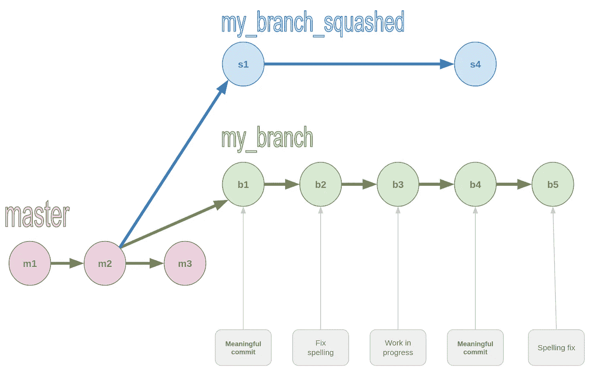
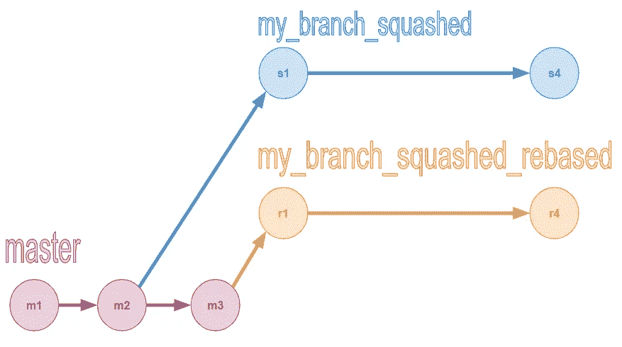
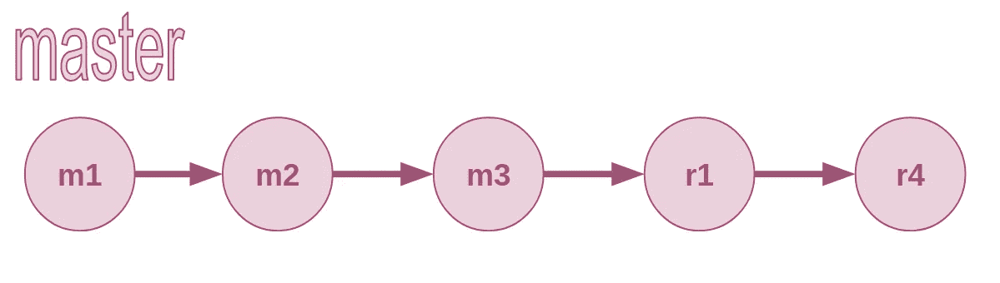

# 挤压和重置——我合并 Git 分支的方法

> 原文：<https://levelup.gitconnected.com/squash-and-rebase-my-method-for-merging-git-branches-3b43c52675b6>

## 我发现 Git 有点像咖啡。一旦我找到了适合自己的方法，我就会坚持下去。

今天我想和你分享我合并 Git 分支的方法(不，这不是另一个关于[合并 vs. rebase](https://dev.to/erikaheidi/pick-squash-drop-rebase-comic-607) 的帖子)。
像今天的第一杯浓缩咖啡一样，让我们开门见山地开始吧:

现在，让我们把它分解，了解这里发生了什么。

# 1.挤压分支中的所有提交

我使用 Git 的方式是，每当我有一个新的想法时，我就打开一个新的分支。我可以有一个主要功能分支和一些较小的分支来测试新的想法。我一天犯几次罪；有时候一个小时会有几个提交——每次我想办法进行下一步。

当我想要将我的分支合并到主分支(或者将我的迷你分支合并到主特性分支)时，这种频繁提交的习惯带来了挑战——然后我有许多对主分支没有价值的提交。此外，如果我想稍后使用 *rebase* ，这些提交可能会导致不必要的冲突。

幸运的是，我可以使用*挤压*来丢弃那些可牺牲的提交。*压缩提交*意味着重写 Git 历史以只包含有意义的提交，我推荐使用[交互式 rebase](https://dev.to/rlxdprogrammer/advanced-git-tutorial-interactive-rebase-369l) ( [希伯来语](https://algoritmim.co.il/2020/01/11/make-your-commit-the-best-with-interactive-rebase/))来实现这一点。

准确地说，我们将:

1.  转到我们要合并的分支。
2.  开一家新分店`my_branch_squashed`。
3.  在`my_branch`之前，将`my_branch_squashed`重置在来自主机的最后一次提交之上。

从 my_branch 上的最新提交打开 my _ branch _ squashed。在 my_branch (m2)之前重新基于最近的主提交。在 rebase 之后，my _ branch _ squashed 上唯一的提交将直接出现在 m2 之后。

# 2.基于母版重设基础

现在我们有了一个在主提交之后只有有意义的提交的分支，我们准备在最近的主提交上重新确定这个分支的基础。

从 my _ branch _ squaded 上的最新提交打开 my _ branch _ squashed _ rebased。重新基于主文件。在 rebase 之后，my _ branch _ squashed _ rebased 上的新提交将紧跟在最新的主提交之后。

> 注意:有些人会说`my_branch_squashed_rebased`是多余的，master 上的 rebase 可以直接从`my_branch_squashed`开始。我的哲学是总有捷径可走；在 Git 和一般的软件开发中。我现在不是在寻找能节省我一点时间的捷径；我一直在寻找能(大部分)节省我很多时间的方法。将这一理念应用到本文的合并方法中:我更喜欢有多个带有指示性名称的分支，而不是更少但毫无意义的分支。

# 3.无冲突合并

如果到目前为止我们做了所有的事情，我们有一个名为`my_branch_squashed_rebased`的分支，它只有有意义的提交，在 master 上的最新提交之后。

现在我们可以毫不费力地合并这个分支，知道不会有冲突。

合并之后，您将只向 master 添加有意义的提交。

# 4.奖励剧集—删除旧分支

现在我们有了所有这些树枝…我们该怎么处理这些绿色的废物呢？

一旦我确定我做的一切都是正确的，我会等几天再确认，然后我用三个简单的步骤删除我的旧分支:

1.  从本地存储库中删除分支。
2.  从远程存储库中删除分支。
3.  *修剪*分支:删除我的*本地*库中*远程*分支的内存。

# 收场白

我喜欢使用 Git，并发现它是最重要的现代开发工具。但是 Git 的问题是我不知道我不知道的事情。即使我知道我不知道什么，也很难理解要寻找什么…

这就是为什么当我找到对我有用的东西，完成工作，解决问题时，我会坚持下去。我也努力分享知识，这样其他人也可以从我的经历中受益。

所以希望这篇帖子对你有帮助！

当你需要 Git 的某样东西，却不知道自己需要 Git 的什么东西时。