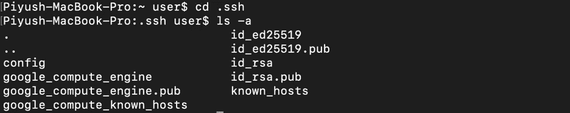

# SSH 代理解释道

> 原文：<https://levelup.gitconnected.com/ssh-agent-explained-cf947034e63d>

解释 SSH、SSH 代理和 ProxyJump 的简单指南。

# 介绍

SSH(安全外壳)广泛用于安全地连接到远程服务器。保护连接最常见的方法是使用密码。这种方法的缺陷是，有时密码是可预测的，而且很脆弱，因此很容易被猜到。另一个缺点是对密码复杂性的限制。尽管密码在通过网络传输时是加密的，但与其他身份验证方法相比，使用自动化脚本的暴力破解技术可以轻松地解密正常长度的密码。幸运的是，SSH 提供了一种更好的安全认证方法。SSH 代理消除了通过密码进行的身份验证。在这篇文章中，我们将看看 SSH 代理是如何工作的，它的安全风险是什么，以及如何减轻它们。

# 背景

## 通过 SSH 连接

当您第一次连接到远程服务器时，会出现一个提示，要求您确认远程服务器的真实性。

```
$ ssh [-p] user@hostname-or-ip.com
```

其中–p 是服务器的端口号，是可选的。


如果输入 yes，服务器的公钥被添加到一个名为****已知主机****的文件中。这意味着您的计算机认为该服务器是可信的。因此，下次您尝试建立到同一台服务器的连接时，将不会提示您再次证明其真实性。这种机制被称为**豆腐**(**T**rust**O**n**F**first**U**se)，客户端使用它来建立到 ***尚未信任的*** 服务器的连接。当客户端第一次成功建立连接时，该服务器的标识存储在客户端的本地信任数据库中。**

**接下来，输入服务器的密码。**

****

**这样，您就成功地连接到了远程服务器。**

****

****指纹**是必要的，因为它们是您连接的服务器的身份。现在，假设网络之外的某个人拦截了您的 SSH 连接，并将其路由到一个不同的 IP 地址，您会立即知道该活动，因为您必须对该 IP 进行身份验证。让我们看几个场景。**

****场景 1** :你尝试使用“ **ssh piyush@127.0.0.1** ”建立到一个已经过认证的服务器的连接。一个未知的攻击者控制了连接，并更改了提供给 ssh 的 IP 地址。假设 IP 是 127.1.2.3，有效地将您的指令更改为“ **ssh piyush@127.1.2.3** ”。因为您没有预料到攻击，所以您认为您的机器不会要求服务器进行身份验证，因为它已经被信任了。相反，会再次要求您进行身份验证，但这次是针对攻击者的服务器。这就是你知道有人在偷听的方法。**

****场景 2** :当攻击者进入你的文件系统，改变你的可信服务器的指纹。当您尝试连接到该服务器时，ssh 会抛出一个警告，指出“**远程主机标识已经更改**”。**

****

**场景 1 假设使用豆腐建立的服务器身份验证是真实的，并且客户机完全信任服务器提供的标识。但是您如何知道所提供的服务器标识是合法的呢？这就是豆腐失败的地方，不利于安全。**

****场景 3** :你第一次尝试在客户端和服务器之间建立连接。如果客户端的连接被暴露，攻击者可以渗透它，然后将它重新路由到不同的机器。该机器仍然通过提供其公钥来响应，客户端计算机要求用户验证该公钥。但是用户并不总是做出正确的决定。豆腐假设攻击者在初始连接期间不存在，正如我们已经看到的，这可能是危险的。**

## **SSH 和密钥**

**SSH 本身是安全的，但是如果您的密码被泄露或者很容易被猜到，那么您很容易受到来自外部的攻击。因此，一个可能的解决方案是根本不使用密码，而是使用密钥。**

**密钥是连接到服务器的安全方式，并且总是成对生成。密钥对由一个公钥和一个私钥组成。密钥对在数学上是联系在一起的，这意味着使用公钥加密的数据只能由拥有相应私钥的人解密。公钥存储在远程服务器上，而私钥存储在客户端上。因此，当您需要连接到服务器时，只需使用您的私钥进行身份验证，您就会自动登录。但是在幕后，这个过程可能是这样的:**

1.  **客户端将密钥对 ID 发送给服务器。**
2.  **服务器检查其信任数据库( *authorized_key 文件*)以找到与给定 ID 匹配的公钥。**
3.  **一旦找到成功的匹配，服务器就生成一个唯一的随机挑战(类似于一个随机数)，使用它的公钥对它进行加密，并将其发送回客户端。**
4.  **如果客户端拥有相应的私钥，它将能够解密该质询。**
5.  **另一个称为会话密钥的密钥由客户端和服务器共享，用于加密通信。**
6.  **客户端将解密的质询与会话密钥相结合以生成一个值。该值被散列并作为加密质询的答案发送回服务器。**
7.  **服务器对通过组合会话密钥和原始解密质询生成的值进行哈希运算。如果两个哈希匹配，则证明客户端拥有相应的私钥，因此客户端通过了身份验证。**

**要生成一对密钥，使用 **ssh-keygen** 。**

```
**$ ssh-keygen**
```

****

**随即，系统会提示您输入位置和密钥的 ***密码*** 。如果不指定位置，将使用默认位置。在上面的例子中，默认位置是 Users/user/。ssh/并且文件以 ***id_rsa*** 的名称保存。对于本例，您可以将密码保持为空。**

****密码短语**存储在本地，用于加密静态私钥。你可能认为它违背了没有密码的目的，但它是一个额外的安全层。它只验证您的密钥，而不像密码那样验证服务器。因此，即使您的公钥被泄露，也无法使用，因为密码短语只有您知道。**

**正在调查 **~/。ssh** 目录我们可以用**找到我们的公钥。pub** 扩展名( *id_rsa.pub* )和不带扩展名的私钥( *id_rsa* )。**

****

**要使用您的私钥访问您的服务器，您需要首先使用 ***ssh-copy-id*** 将公钥放在您的服务器上。**

```
**$   ssh-copy-id [-p] -i ~/.ssh/id_rsa.pub user@host.com**
```

****

**ssh-copy-id 接收一个输入公钥文件(使用**–I**标志)并将其存储在远程服务器的/中。ssh 文件夹中的 **authorized_keys** 文件。在底部，您还可以看到添加的键的数量。**

**登录的话，用 **ssh <服务器 IP >** 就可以了。不会提示您进行任何身份验证，您可以直接登录。**

****

**现在，从客户机和服务器上删除旧的密钥，这次用一个密码创建一个新的密钥。另外，记得将公钥复制到远程服务器。**

****

**尝试使用新密钥连接到您的服务器。**

**这一次，您的服务器会要求您输入密码来验证您的密钥，然后才允许您访问服务器。**

****

**尝试断开连接，然后重新连接到服务器。**

****

**这一次，它会再次要求您输入密码，即使您之前已经输入过。每次登录时都要输入密码，这很烦人，但幸运的是有一个解决方案。**

# **SSH 代理**

**SSH 代理管理 SSH 的密钥。使用 SSH 代理，密码缓存在内存中，因此您只需使用一次，对于后续的每个连接，您只需登录即可。**

****注意** : *如果你正在连接一个使用 Linux GUI 的服务器，****ssh-agent****已经在运行了。如果您连接到一个堡垒服务器，您需要启动 ssh-agent* 。**

**使用 ***ssh-add*** 添加您的私钥。**

```
**$   ssh-add <private-key>**
```

****

**ssh-add 是 ssh-agent 的网关。它的工作原理如下图所示:**

****

**当您使用 ssh-add 添加加密的私钥时，系统会提示您输入密码。这个密码短语只需输入一次，然后 ssh-add 解密并将其发送给 ssh-agent。**

**为了理解 ssh-agent 做什么，让我们看一下客户机和服务器之间的握手。**

****

**1.客户端尝试使用 ssh 连接。**

**2.然后，服务器生成一个唯一的随机挑战，并要求客户端使用私钥签名。**

**3.然后，客户机将该责任转发给 ssh-agent，ssh-agent 对该质询进行签名，并将其转发给服务器。**

**4.如果服务器信任客户机的公钥，只有在那时它才检查签名的真实性。**

**5.如果检查成功，并且客户端提供的私钥实际上是可信的，则在客户端和服务器之间建立连接。**

****注意:** *无论何时使用 ssh 建立连接，密钥都不会暴露，也不会通过网络发送。如上所述，ssh-agent 代表私钥对服务器发送的消息/请求进行签名，对该密钥执行一些与密钥相关的操作，并将操作结果传递给服务器。***

## **SSH 代理转发**

**假设你通过 ssh 连接到一个 ***堡垒主机*** 。现在，您想登录 Github 并克隆一个 repo。但是要登录 Github，您需要本地机器上的 ssh 密钥。那么，如何从你的 bastion 主机连接到 Github 服务器呢？**

********

**如上所示，您可以将 Github repo 克隆到您的本地机器上，但是不能从 bastion 主机上克隆。**

**一个可能的解决方案是将您的私钥从本地机器复制到 bastion 主机，并从该主机登录 Github。这种做法不安全，会使您的密钥容易被连接到这个 bastion 主机的任何人使用。**

**SSH 代理转发通过一个跳转服务器(也称为 ***跳转框*** 或 ***委托代理*** )透明连接到你的远程服务器，解决了这个问题。这不需要从本地机器上复制密钥。在上面的例子中，bastion 主机是跳转服务器，Github 是远程服务器。**

****

**要启用 SSH 代理转发，请在跳转服务器上运行以下命令。**

```
**$ ssh -A <user@distant-server-ip -or-name>**
```

****-**标志打开第二个通道，将请求转发回本地机器。**

**让我们测试一下与 Github 的连接。**

****

**既然您能够成功连接，现在您可以将 Github repo 克隆到您的跳转服务器上。**

****

****注意:** *对于 macOS 用户，ssh-agent 将密钥存储在 macOS Keychain 中。根据钥匙串设置，您可能需要在重新启动后解锁钥匙，并重新输入密码。通过将密码存储在钥匙串中，ssh-agent 将在需要时自动使用它们。***

## **SSH 代理的漏洞**

**当您使用 SSH 代理转发时，会打开一个 ***套接字*** 用于与远程主机通信，这是一个安全风险。让我们假设你通过一个跳转服务器连接到一个远程服务器。如果其他任何人以 root 权限连接到跳转服务器，他们可以通过套接字秘密地访问您的本地 SSH 代理，并可以在其他机器上伪装成您。**

****

## **风险缓解**

**要保护 SSH 代理转发，您可以使用以下技术:**

**1.**密码**:您可以使用 ***ssh-add-x*** 锁定您的 ssh-agent。这用密码保护您的 ssh-agent，因此，即使在同一个网络上，用户也需要密码才能登录到您的 shell。您还可以使用 ssh-add-X 解锁您的 ssh-agent。**

**2.**生物特征**:您可以使用一个名为“ ***Sekey*** 的备用 ssh 代理。不使用密码，您可以使用您的指纹登录 ssh-agent。在 macOS 上，触控 ID 将用于登录。**

**3. **ProxyJump** :除了使用 SSH 代理之外，您还可以使用另一种方法，通过使用 ProxyJump 的跳转服务器连接到远程服务器。**

# **ProxyJump 跳转**

**当您使用 SSH 代理时，它会自动打开一个新的套接字，用于跳转服务器和远程服务器之间的通信。ProxyJump 不会打开新的套接字。相反，它通过一个跳转服务器将本地 SSH 客户机的标准输入和输出转发到远程服务器。可以把它想象成 SSH 会话中的 SSH。ssh 从不在跳转服务器上运行。取而代之的是，一个名为 ***sshd*** 的程序连接到一个远程服务器，并将该会话的控制权交还给本地 SSH。由于套接字从来不是由跳转服务器创建的，因此连接不会被拦截，从而更加安全。**

## **设置 ProxyJump**

**要设置 ProxyJump，您需要在~/中创建一个配置文件。ssh 文件夹。如果您已经有了该文件，请确保不要覆盖它，而是在文件末尾添加以下指令。**

```
**Host   jump-server
    HostName 127.0.0.1
    User piyush
    Port 2222

   Host distant-server
    ProxyJump jump-server
    HostName github.com
    User git**
```

**在哪里，**

*   **跳转服务器和远程服务器是主机名的别名。**
*   **User 是被授权建立连接的用户名(拥有私钥来验证连接的用户)。**
*   **Port 是主机的端口号。**
*   **ProxyJump 是充当本地客户端和远程服务器之间的代理的服务器的名称。**

**而不是使用**

```
**$   ssh -p 2222 piyush@127.0.0.1**
```

**你可以简单地使用**

```
**$ ssh jump-server**
```

**要创建 ProxyJump 连接，请使用:**

```
**$ ssh -J <jump-server-alias> <distant-server-alias>**
```

**现在，您可以使用跳转服务器在本地主机和远程服务器之间建立连接。**

****

**这样，你就成功地建立了联系。**

# **结论**

**使用 SSH 代理，您必须进入跳转服务器，然后手动连接到远程服务器。它也有安全问题。但是通过使用 ProxyJump，您可以在本地机器上立即安全地建立连接。**