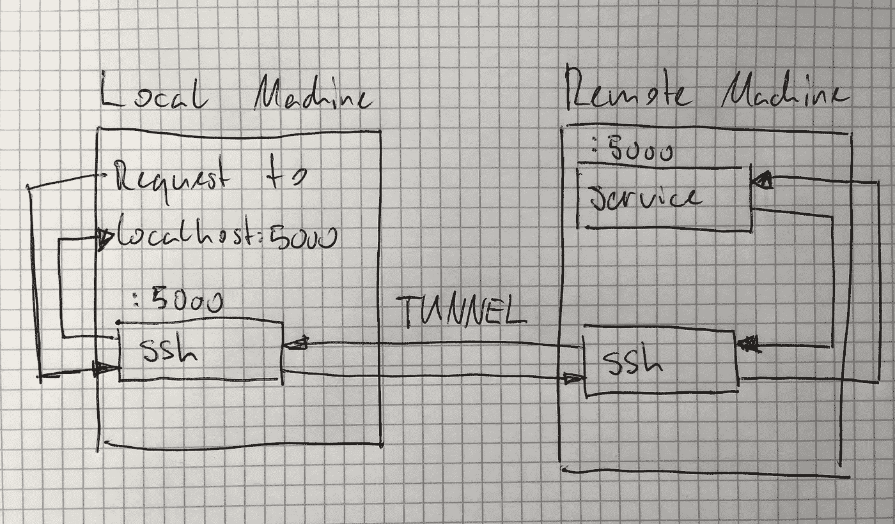

# CLI 中的 SSH 常见用法

> 原文：<https://levelup.gitconnected.com/ssh-from-cli-common-usages-bcbf7bc98cc9>

## 从创建密钥对到复制文件，再到设置端口转发


Marc Rentschler 在 [Unsplash](https://unsplash.com/s/photos/shell?utm_source=unsplash&utm_medium=referral&utm_content=creditCopyText) 上拍摄的照片

# 创建 SSH 密钥对

密钥对将用于身份验证。您将获得两个文件，一个是私钥，另一个是公钥。私钥保存在您的主机上。公钥是您分发给其他系统的。

系统现在可以验证您是否被授权；当您发送一些用您的私钥签名(加密)的数据时，系统可以用存放的公钥解密它。这些键是互补的。一个可以撤销另一个的操作。这允许您在不共享验证工具(私钥)的情况下证明您的身份。请确保您永远不会共享私钥。(关于此主题的详细说明[在此处](https://www.ssh.com/ssh/keygen/))

```
$ [ssh-keygen](http://man7.org/linux/man-pages/man1/ssh-keygen.1.html) -t rsa
```

默认情况下，密钥将存储在(`~`为用户主页):

*   `~/.ssh/id_rsa`(私钥)
*   `~/.ssh/id_rsa.pub`(公钥)

# 复制公钥

为了授权自己访问服务器，您必须将公钥复制到远程服务器上的`~/.ssh/[authorized_keys](https://www.ssh.com/ssh/authorized_keys/)`文件中。有各种方法可以实现这一点。

## 使用`ssh-copy-id`

```
$ [ssh-copy-id](https://linux.die.net/man/1/ssh-copy-id) -i ~/.ssh/id_rsa.pub user@host
```

## 使用 Bash 命令

```
cat ~/.ssh/id_rsa.pub | ssh user@host "mkdir -p ~/.ssh && chmod 700 ~/.ssh && cat >>  ~/.ssh/authorized_keys"
```

## 用手

只需`cat ~/.ssh/id_rsa.pub`，复制公钥并将其附加到服务器上的`~/.ssh/authorized_keys`。

# 禁用密码验证

一旦设置了公钥身份验证，就可以在服务器上禁用密码身份验证。

1.  在您的服务器上，编辑`/etc/ssh/sshd_config`并设置`PermitRootLogin without-password`。
2.  然后重启 ssh 守护进程`sudo systemctl reload sshd.service`。

# 连接到远程服务器

```
$ [ssh](http://www.man7.org/linux/man-pages/man1/ssh.1.html) user@host
```

> **注意:**要实现这一点，公钥必须存放在远程服务器上。

# 用备用私钥连接

```
$ ssh -i /path/to/privatekey user@host
```

# 使用密码验证连接

系统会提示您输入密码。

```
$ ssh -p user@host
```

# 安全地将密码作为 CLI 参数传递

当不能通过 STDIN 交互输入密码时，这很有用。(例如，在 CI/CD 管道或任何其他非交互环境中。)

```
[sshpass](https://linux.die.net/man/1/sshpass) -p "PASSWORD" ssh user@host
```

# 绕过 StrictHostKeyChecking

绕过您是否信任遥控器的交互式问题。对于非交互式上下文(如 CI/CD 管道)非常有用。

```
ssh -o StrictHostKeyChecking=no user@host
```

# 在服务器上执行命令

```
$ ssh user@host "ls -l"
```

# 在服务器上执行本地脚本

```
ssh user@host "bash -c" < /path/to/local/script.sh
```

# 复制文件:本地→服务器

```
[scp](http://man7.org/linux/man-pages/man1/scp.1.html) /local/file user@host:/remote/file
```

# 复制文件:服务器→本地

```
scp user@host:/remote/file /local/file
```

# 递归复制文件夹

服务器→本地

```
scp -r user@host:remote/folder /local/folder
```

本地→服务器

```
scp -r /local/folder user@host:remote/folder
```

# 端口转发

这个想法是将本地端口接收的所有数据转发到远程端口，这样本地机器上的`localhost:port`就像远程机器上的`localhost:port`。



使用端口转发，发送到 localhost:5000 的数据将最终发送到服务器上的 localhost:5000

它基本上是用 ssh 屏蔽远程服务，从而享受 ssh 认证和加密的好处。

您可能希望这样做的原因有:

*   您要访问的服务器端口受防火墙保护。
*   服务器上的服务只接受来自本地主机的连接。(可能是因为没有提供身份验证，或者提供的身份验证很弱。)
*   加密数据传输。
*   将认证从服务外包给 ssh。

只要端口 22 (ssh)打开，您就可以创建到远程服务器上任何端口的隧道。

```
ssh -L port:localhost:port -N -f -l user host
```

这将把本地机器上的`localhost:port`转发到远程机器上的`localhost:port`。关于这个命令中选项的详细参考，我建议参考[手册页](http://www.man7.org/linux/man-pages/man1/ssh.1.html)。

# 终止端口转发

```
# find the right PID (second column)
[ps](http://man7.org/linux/man-pages/man1/ps.1.html) aux | grep ssh
# soft kill
[kill](http://man7.org/linux/man-pages/man2/kill.2.html) PID
# hard kill
kill -9 PID
```

# 在 GitHub 上设置 SSH 验证

1.  `cat ~/.ssh/id_rsa.pub`并将内容复制到你的剪贴板上。
2.  在 GitHub 设置中，进入“SSH 和 GPG 键”，点击[新建 SSH 键](https://github.com/settings/ssh/new)。
3.  给它一个合适的标题，并从剪贴板中粘贴公钥。

现在，您可以使用 SSH url 克隆 GitHub 存储库。

如果您想将已经克隆的存储库从 HTTPS 迁移到 SSH，您必须更改远程 url，例如:

```
$ git remote set-url origin [git@github.com](mailto:git@github.com):user/repo.git
```

> N **ote:** 如果希望从多台机器上进行 ssh 访问，推荐的方式是在每台机器上生成一个密钥对，并将每个公钥添加到 GitHub 中。不要在多台机器上共享同一个密钥对。我们是专业人士。我们不做那种事。

# 在 GitLab 上设置 SSH 验证

转到 [SSH Keys](https://gitlab.fhnw.ch/profile/keys) 并按照 GitHub 章节中的描述进行操作。

# 使用 SSH 在 CI/CD 管道中连接到服务器

该过程是针对 GitLab CI/CD 管道描述的，但对于各种 CI/CD 提供者来说，方法是相同的，因为它们都提供了某种管道变量，您可以在其中传递私钥。

这是私钥离开本地机器的罕见情况之一。我们需要在 GitLab 存放私钥，在我们想要访问的服务器上存放公钥。然后，我们可以安全地将私钥注入到 CI/CD 管道中，以便连接到服务器并完成我们的工作(例如，部署某些东西)。

1.  生成 SSH 密钥对(确保更改默认名称/目录):`[ssh-keygen](http://man7.org/linux/man-pages/man1/ssh-keygen.1.html) -t rsa`
2.  将公钥(id_rsa.pub)添加到服务器上的`~/.ssh/authorized_keys`。建议为 CI/CD 管道创建一个具有有限权限的专用用户。如果这样做，将密钥存储在`/home/dedicated-user/.ssh/authorized_keys`中。
3.  将一个**文件变量**添加到您的 CI/CD 设置中，将您的私钥文件(id_rsa)的内容作为变量值，将 **ID_RSA** 作为变量名。您可以在 GitLab 的*存储库设置→ CI/CD →变量→添加变量*中添加 CI/CD 变量
4.  执行管道时，GitLab 会将 **ID_RSA** 变量的内容复制到一个文件中，并将文件路径存储在 **$ID_RSA** env 变量中。这意味着我们可以用它来认证我们的服务器。但是首先我们必须设置适当的权限，否则 ssh 不会接受身份文件。所以在你的管道中，首先执行`chmod og= $ID_RSA`
5.  现在像往常一样在您的管道中使用 ssh`ssh -i $ID_RSA user@host command`。您可能需要预先安装 ssh，这取决于您的管道执行器。对于 debian `apt-get update && apt-get install openssh-client`，对于 alpine `apk update && apk add openssh-client`。

# 参考

*   [如何设置 SSH 密钥](https://www.digitalocean.com/community/tutorials/how-to-set-up-ssh-keys--2)
*   [SSH 密钥和公钥认证](https://www.ssh.com/ssh/keygen/#ssh-keys-and-public-key-authentication)
*   [SSH 中的 Authorized_keys 文件](https://www.ssh.com/ssh/authorized_keys/)
*   [ssh-copy-id 手册页](https://linux.die.net/man/1/ssh-copy-id)
*   [ssh 手册页](http://www.man7.org/linux/man-pages/man1/ssh.1.html)
*   [sshpass 手册页](https://linux.die.net/man/1/sshpass)
*   [scp 手册页](http://man7.org/linux/man-pages/man1/scp.1.html)
*   [ps 手册页](http://man7.org/linux/man-pages/man1/ps.1.html)
*   [杀人狂页面](http://man7.org/linux/man-pages/man2/kill.2.html)