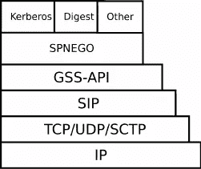
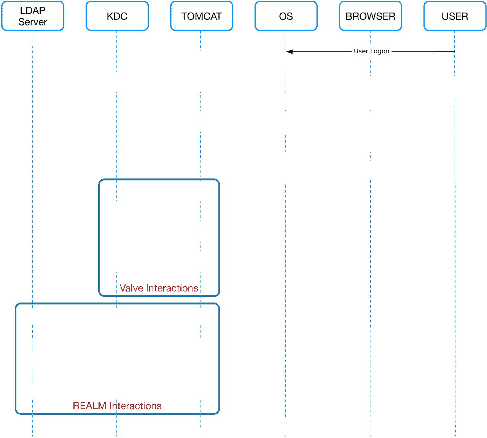

# 使用 Kerberos 进行单点登录

> 原文：<https://levelup.gitconnected.com/sso-with-spnego-and-kerberos-8794f8ad5162>

## [网络安全](https://rakiabensassi.medium.com/list/software-engineering-7a179a23ebfd)，[软件工程](https://rakiabensassi.medium.com/list/software-engineering-7a179a23ebfd)

## 基于浏览器的 Spnego 和 Keberos 认证

照片由[杰佛森·桑多斯](https://unsplash.com/@jefflssantos?utm_source=medium&utm_medium=referral)在 [Unsplash](https://unsplash.com?utm_source=medium&utm_medium=referral) 上拍摄

*你可以在 Udemy 上查看我的* ***视频课程****:*[*如何识别、诊断、修复 Web Apps 中的内存泄漏*](https://www.udemy.com/course/identify-and-fix-javascript-memory-leaks/) *。*

在希腊神话中，Kerberos(或 Cerberus，冥府之犬)是一种三头犬，守护冥界大门，防止死者离开。在我们今天的故事中，我们不谈论 Kerberos，而是 Kerberos，即单点登录(SSO)身份验证中使用的协议。

# 什么是单点登录？

目前，许多 web 应用程序要求用户注册一个新帐户。随着 web 应用程序的激增，期望用户记住每个应用程序的不同用户名和密码已经变得不切实际。单点登录(SSO)协议(Kerberos、SAML、OpenID 等)允许用户使用一个 ID 和密码访问不同的应用程序。用户登录以访问连接的系统，或者使用轻量级目录访问协议(LDAP)和存储在(目录)服务器上的 LDAP 数据库来完成。

由于 SSO 共享集中式身份验证服务器，用户不必多次主动输入他们的凭据。认证服务器提供一种网络服务，应用程序用它来认证用户的凭证(通常是帐户名和密码)。当客户端提交有效凭据时，它会收到一个加密票证，随后可以使用该票证访问各种服务。

如果用户注销某个资源，或者某个资源以编程方式使会话无效，则所有保留的授权数据都将被移除，并且该过程将重新开始。在资源会话超时的情况下，如果存在与该用户关联的其他有效资源会话，SSO 会话不会失效。

 [## 编译器与解释器:了解它们的区别以及何时使用它们

### 编译器和解释器的类型和用例

medium.com](https://medium.com/better-programming/compiler-vs-interpreter-d0a12ca1c1b6) 

# 麻省理工学院开发的安全认证系统

*Kerberos* 是一种网络认证协议，它基于*票证(安全令牌)*工作，允许通过非安全网络通信的节点以安全的方式相互证明自己的身份。

要使用安全服务，用户需要从票证授予服务(TGS)获得票证，票证授予服务是一种运行在网络服务器上的服务。在获得票之后，用户从认证服务(AS)请求服务票(st ),认证服务是在同一网络上运行的另一个服务。然后，用户使用 ST 来认证所需的服务。TGS 和 AS 都运行在称为密钥分发中心(KDC)的封闭服务中。

Kerberos 认证过程(动画由[拉基娅·本·萨希](https://medium.com/u/a5a3141be597?source=post_page-----8794f8ad5162--------------------------------)制作)

[流程](https://docs.oracle.com/cd/E37670_01/E41138/html/ol_kerberosauth_sec.html)中的步骤是:

1.  客户端将主体名称和一个 TGT 请求发送到 KDC。
2.  KDC 生成会话密钥和包含会话密钥副本的 TGT，并使用票证授予服务(TGS)密钥来加密 TGT。然后，它使用主体的密钥来加密已经加密的 TGT 和会话密钥的另一个副本。
3.  KDC 将会话密钥和加密 TGT(票据授予票据)的加密组合发送给客户端。
4.  客户端使用主体的密钥提取会话密钥和加密的 TGT。
    当客户端想要使用服务(通常是为了获得对本地或远程主机系统的访问权)时，它使用会话密钥来加密加密 TGT 的副本、客户端的 IP 地址、时间戳和服务票据请求，并将此项发送到 KDC。
5.  KDC 使用其会话密钥和 TGS 密钥的副本来提取 TGT、IP 地址和时间戳，这允许它验证客户端。如果客户端及其服务请求都有效，KDC 会生成一个服务会话密钥和一个服务票证，其中包含客户端的 IP 地址、时间戳和服务会话密钥的副本，并使用服务密钥来加密服务票证。然后，它使用会话密钥来加密服务票据和服务会话密钥的另一个副本。
    服务密钥通常是运行服务提供商的系统的主机主体密钥。
6.  KDC 将服务会话密钥和加密服务票据的加密组合发送给客户端。
7.  客户端使用其会话密钥的副本来提取加密的服务票据和服务会话密钥。
    客户端将加密的服务票连同主体名称和用服务会话密钥加密的时间戳一起发送给服务提供者。
8.  服务提供商使用服务密钥来提取服务票据中的数据，包括服务会话密钥。
    服务提供商为客户启用服务，通常是授权访问其主机系统。

如果客户端和服务提供者位于不同的系统上，它们可以各自使用自己的服务会话密钥副本来保护服务会话的网络通信。

请注意关于身份验证握手的以下几点:

*   密钥从不通过客户端、KDC 和服务提供商之间的任何通信信道明文发送。
*   在身份验证过程开始时，客户端和 KDC 共享主体密钥，KDC 和服务提供者共享服务密钥。委托人和服务提供者都不知道 TGS 密钥。
*   在该过程结束时，客户端和服务提供者共享一个服务会话密钥，它们可以使用该密钥来保护服务会话。客户端不知道服务密钥，服务提供者也不知道主体的密钥。
*   客户端可以使用 TGT **请求在票证有效期内访问其他服务提供商**，票证有效期通常为 ***一天*** 。如果 TGT 在会话处于活动状态时到期，会话管理器会更新它。

 [## 哎呀，你不小心合并到了错误的分支。你该怎么办？

### 如何撤销推送或与 Git 合并？

levelup.gitconnected.com](/git-workflow-devops-69e5a9071be1) 

## Spnego

由于 Kerberos 不是唯一的身份验证协议，我们需要后退一步，在身份验证过程中引入另一个参与者:Spnego。
SPNEGO 代表简单且受保护的 GSS_API 协商机制，用于扩展基于 Kerberos 的 SSO 环境，以便在*web 应用中使用，因为它被设计用于客户端-服务器 ***桌面*** 环境，并且通常不用于 web 应用或瘦客户端环境。*

*Spnego 是一种与验证者协商使用什么安全协议的机制。例如 Kerberos、NTLM、Digest 或 Basic.5t6*

**

*具有 SPNEGO 协商机制和底层安全机制的 GSS-API 协议栈*

1.  *客户端计算机上的应用程序(如 web 浏览器)试图访问 web 服务器上受保护的页面。*
2.  *服务器响应需要授权。*
3.  *然后，应用程序向 Kerberos 密钥分发中心(KDC)请求服务票。*
4.  *获得票证后，应用程序将其包装在一个为 SPNEGO 格式化的请求中，并通过浏览器将其发送回 web 应用程序。*
5.  ****web 容器*** (Tomcat，JBoss EAP，…) ***运行已部署的 web 应用*** 解包请求，认证票。认证成功后，将授予访问权限。*

*因此，正如你所看到的，我们刚刚介绍了游戏中的下一个玩家:它是 web 容器，在我们的例子中是 tomcat。所以现在是时候来看看这个场景的更多细节了:)*

## *雄猫*

*Tomcat 提供了一种比 servlet 过滤器更通用的低级 HTTP 请求拦截模式: **valves** 。然而，仅仅使用一个阀门并不能让你检查角色。这就是我们提供自定义**领域**的原因。*

*[Tomcat](https://dzone.com/articles/do-not-publish-configuring-tomcat-single-sign-on-w)中的 SSO 处理起来像一个两步过程:*

*   *首先，身份验证由 valve 组件处理，该组件允许在 HTTP 请求到达 servlet 容器之前对其进行处理。阀门负责 ***认证*。***
*   *然后，授权由 Real 处理，Real 与 Active Directory 一起工作以获得与由 valve 认证的用户相关联的组信息(用户名、组、角色)。领域负责 ***授权*。***

*下面的序列图更详细地显示了发生的交互:*

**

*Spnego 序列图*

1.  *用户登录 Windows，通过密钥分发中心(KDC)进行身份验证。对于 Windows，KDC 将是主域控制器。*
2.  *操作系统接收用户的 TGT 令牌。*
3.  *当用户试图连接到 Tomcat 服务器时，会协商身份验证机制*
4.  *用户的令牌被传递给 Tomcat，然后 Tomcat 用 KDC 验证它。*
5.  *一旦用户通过了身份验证，Tomcat 就会从 LDAP 服务器中检索他的角色(在 Windows 中是 Active Directory，它是一种专门处理用户名和密码等身份信息的数据库)*
6.  *并决定他是否有权访问(200 OK)他在服务器上请求的资源。*

# *参考*

*[1] [一般安全概念概述](https://access.redhat.com/documentation/en-us/red_hat_jboss_enterprise_application_platform/7.4-beta/html/security_architecture/overview_of_general_security_concepts)*

*[2] [关于 Kerberos 认证](https://docs.oracle.com/cd/E37670_01/E41138/html/ol_kerberosauth_sec.html)*

*[3] [对会话发起协议的通用安全服务 API 认证支持](https://www.researchgate.net/publication/230585165_Generic_Security_Services_API_authentication_support_for_the_Session_Initiation_Protocol)*

*[4] [配置 Kerberos/SPNEGO 单点登录认证](https://www.ibm.com/docs/en/elm/7.0.3?topic=management-configuring-kerberosspnego-sso)*

# *想要更多吗？*

*我为一群聪明、好奇的🧠人写关于工程、技术和领导力的文章💡。 [**加入我的免费电子邮件简讯独家访问**](https://rakiabensassi.substack.com/) 或在此注册媒体。*

**你可以在 Udemy 上查看我的* ***视频课程****:*[*如何识别、诊断、修复 Web Apps 中的内存泄漏*](https://www.udemy.com/course/identify-and-fix-javascript-memory-leaks/) *。**

* [## 为什么编码标准很重要，以及如何衡量开发速度

### 熟悉一个新项目需要多长时间

levelup.gitconnected.com](/learning-velocity-and-coding-standards-10952f6c9640)  [## 承诺、可观察和流之间有什么区别？

### 现代编程中的三种风格

medium.com](https://medium.com/javascript-in-plain-english/promise-vs-observable-vs-stream-165a310e886f)*