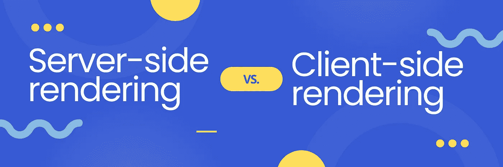
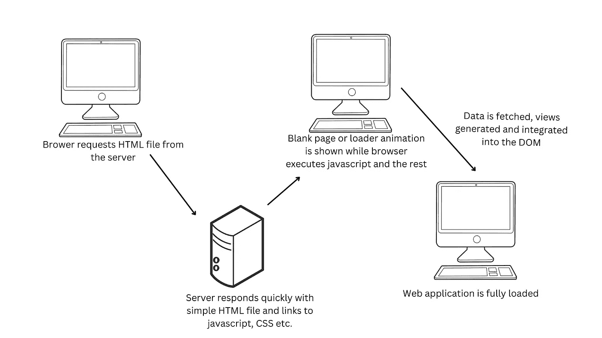
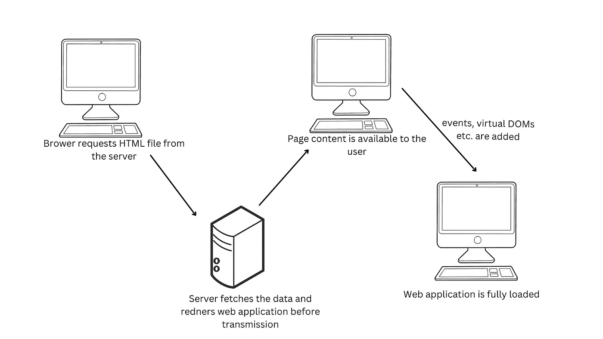

# SSR，该不该用？

> 原文：<https://levelup.gitconnected.com/ssr-should-you-use-it-dec6a5366193>

服务器端渲染可能是一把双刃剑。阅读下面的文章，看看它是否适合你。

# 介绍

自从互联网出现以来，我们可以在服务器端呈现网页。那时的网站相当简单，它们的目的是通知用户。他们很少或者根本没有互动。SSR 的工作方式是完全渲染整个网页，然后将 HTML 文件返回给客户端使用。对于较小的包大小和静态页面，这在一段时间内非常有效。

但是随着时间的推移，网站变成了网络应用。它们变得更加复杂。它们使用户能够聊天、分享图片和文档、购物等。总而言之，它们变得高度互动，这也是 SSR 开始慢慢失去人气，客户端渲染开始占据中心舞台的地方。

# CSR 与 SSR

客户端渲染是在浏览器中渲染网页，而不是在网站的服务器上。这是当今大多数 Javascript 框架的默认设置。CSR 在初始加载时请求一个带有浏览器链接的 HTML 文件。Javascript 然后获取这些链接，并将网页组合在一起。CSR 的一个主要缺点是，由于所有的负担都在浏览器上，它会很快增加几秒钟的渲染时间，从而导致糟糕的用户体验。CSR 应用程序也常常难以获得良好 SEO 结果，在速度较慢的设备上表现不佳。

使用 SSR，服务器完全呈现整个页面，然后向浏览器发送 HTML 文档，浏览器随后显示网站的内容。这意味着内容可以更快地获得，这对 SEO 和索引有积极的影响。另一方面，SSR 的一个主要缺点是安全性，因为与 CSR 相比，服务器和浏览器之间的通信要多得多。更多的请求也意味着更多的费用。SSR 非常适合静态页面，但是对于更具交互性和更复杂的页面内容，频繁的页面重载和请求实际上会导致性能下降和页面渲染变慢。由于嵌入了水合状态，SSR 应用程序也趋向于具有更大的 HTML 文件。

# 谷歌爬虫

开发者决定实现 **SSR** 的主要原因之一是 **SEO** 和**性能提升**，以及随之而来的**更好的用户体验**。但是要理解 SEO 和 SSR 的关系，我们先来看看索引是如何工作的。

在本文中，我们将以 googlebot，或者更多人所知的 Google 网络爬虫为例。Googlebot 分三个阶段工作:

*   爬行，
*   渲染，
*   索引。

Googlebot 通过 HTTP 请求获得一个网站。首先，Googlebot 检查 robots.txt 文件，看是否允许 URL。有一个选项可以阻止谷歌机器人索引你的网站。如果是这种情况，它将不会发出 HTTP 请求并跳过这个 URL。如果没有，Googlebot 将抓取网站并解析其 HTML。当 Googlebot 资产允许时，Chromium 呈现页面并执行 Javascript。然后，Googlebot 使用呈现的页面进行索引，并再次解析 HTML，扫描允许爬行的链接。然后，它将这些链接放入一个队列中，并重复这个过程。这样做的结果是一个索引网页。这意味着 Googlebot 经历的整个过程，决定了你的网页在结果队列中的位置。

# 结论

那么现在，选哪个呢？SSR 还是 CSR？通常，web 应用程序两者都使用。它们通常被称为混合应用程序。例如，网飞使用 SSR、React(这是一个库，所以 CSR 是默认的)和预取的组合。它对静态页面使用 SSR，对其余页面使用 React 和预取。我最近刚读了一篇[的文章](https://medium.com/dev-channel/a-netflix-web-performance-case-study-c0bcde26a9d9)，关于他们如何优化他们的网络应用，作者得出的结论之一如下:

> 网飞决定做出的权衡是使用 React 服务器呈现登录页面，但同时预取 React /注册流程的其余代码。这不仅优化了首次加载性能，还优化了注册流程其余部分的加载时间，因为它是一个单页面应用程序，所以要下载的 JS 包要大得多。

我希望这能帮助你做出更容易的决定。如果你有任何进一步的问题，请在下面留言。