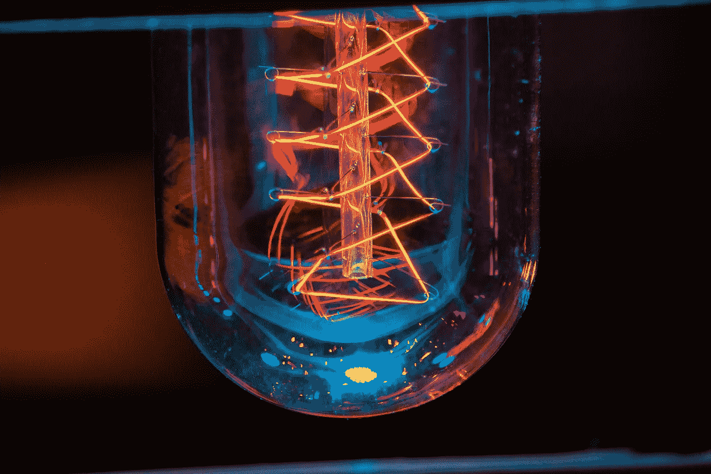
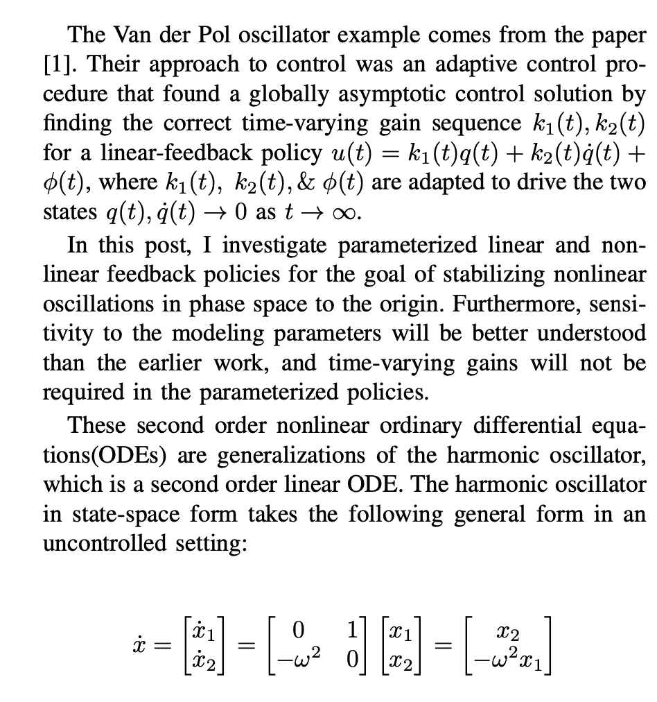
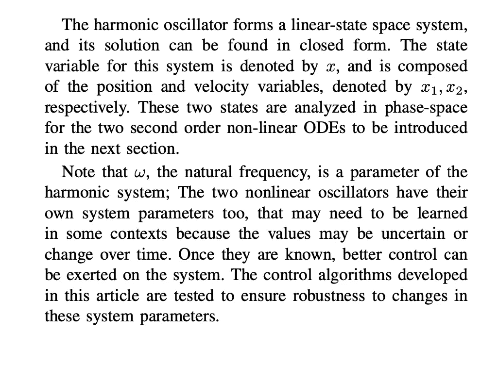
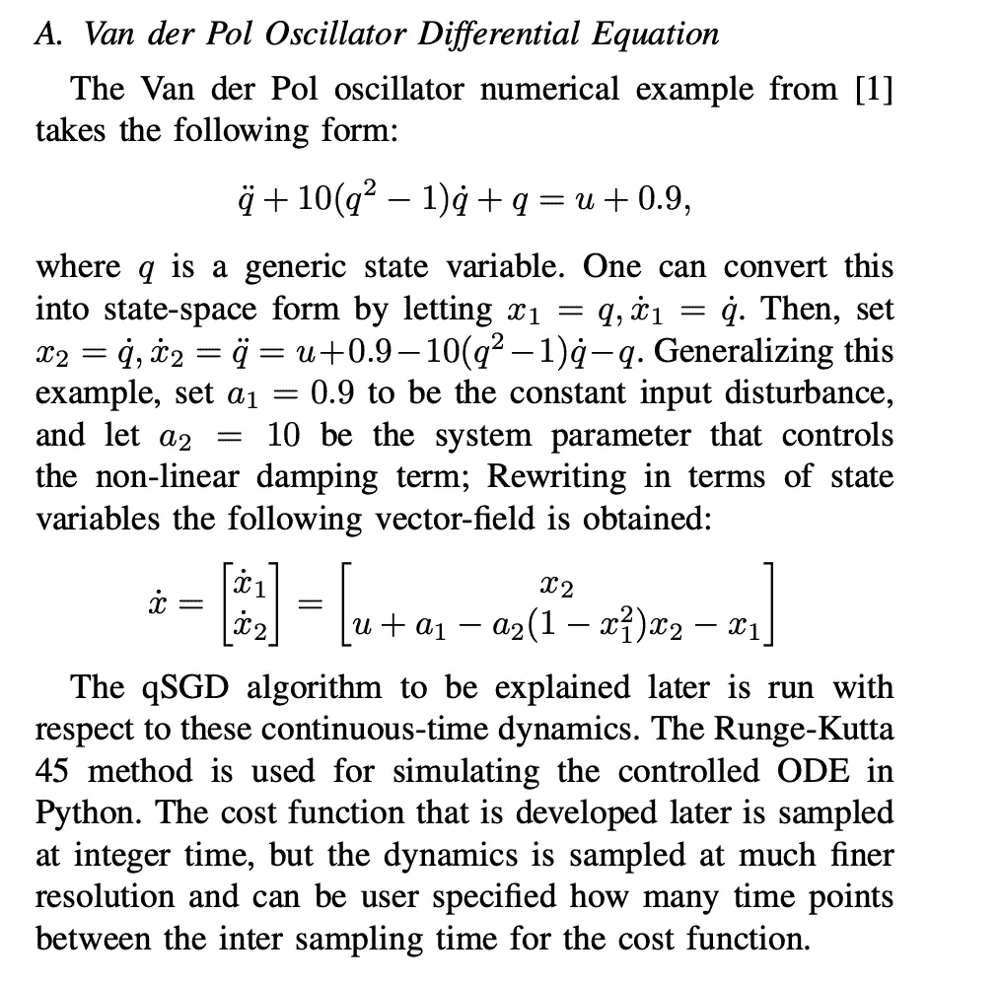
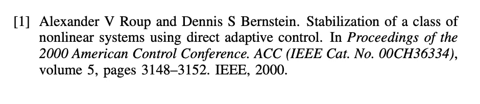

# 用强化学习(RL)稳定范德波尔非线性振子——第一部分

> 原文：<https://levelup.gitconnected.com/stabilizing-the-van-der-pol-nonlinear-oscillator-using-reinforcement-learning-rl-part-1-e6132d25be08>

# 介绍

你见过的大多数 RL 问题可能都是用离散时间动力学来描述的，这些动力学具有有限数量的状态、控制或观察值，采用马尔可夫决策过程(MDP)格式。然而，当潜在的动态是连续的，例如范德波尔振荡器时，最好使用连续时间、连续状态和连续控制技术来学习控制系统。如果动力学确实是常微分方程，那么让我们不要通过近似动力学来丢弃任何信息。

特别是，本文探讨了连续状态和控制强化学习方法稳定到非线性振荡的起源。范德波尔振荡器是本文研究的连续状态控制系统，控制振荡的方法是准随机梯度下降法(qSGD)。通过对算法的性能分析，明确了对建模误差的敏感性。

因为这个研究项目有很多可移动的部分，所以教程和演示将被分成几篇中型文章。第一部分包括背景和模拟环境。第二部分包括非理想条件下的测试和算法设计。第三部分包括控制目标和建议的数据分析。第四(最后)部分总结并展示了所有的结果和见解。

# 背景

# 模拟环境

*首先关注本博客，从今天开始了解 RL、Python 和其他高价值主题；如果你想留在圈子里，永远不会错过我的故事，然后订阅我的电子邮件列表。* ***考虑成为媒介会员，以获得无限制访问我的作品和其他作者的作品:***

 [## 用我的推荐链接加入灵媒——凯莱布·鲍耶，理学硕士

### 阅读凯莱布·m·鲍耶和(媒体上许多其他天才作家)的每一个故事。您的会员费直接…

medium.com](https://medium.com/@CalebMBowyer/membership) 

*下次见，*

*迦*

参考资料:

