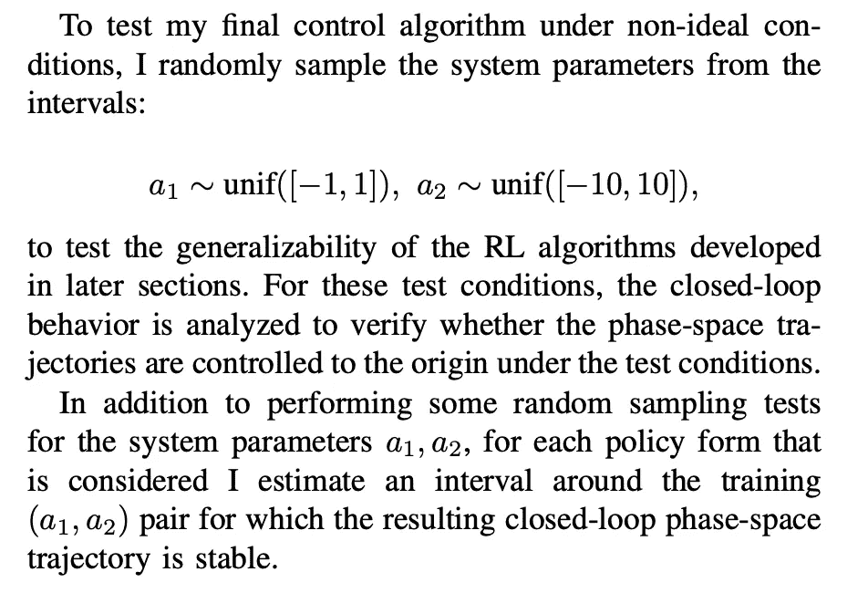
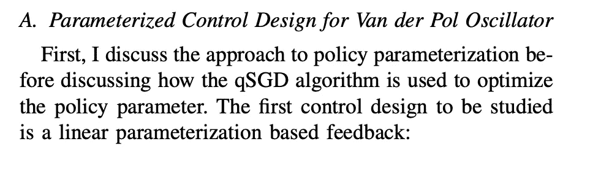
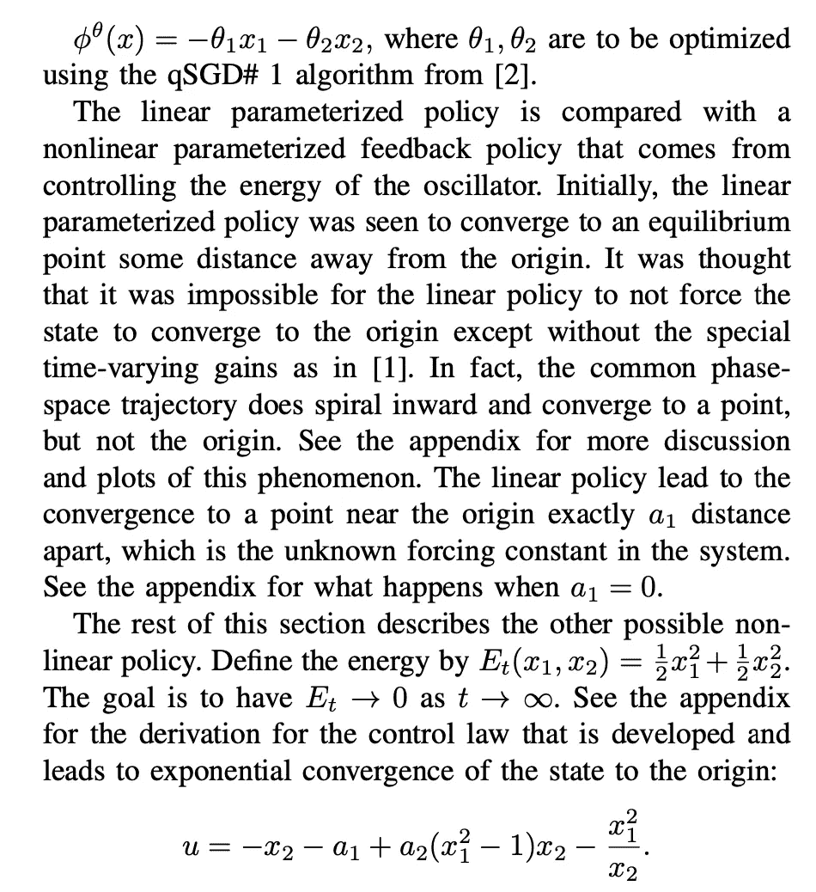
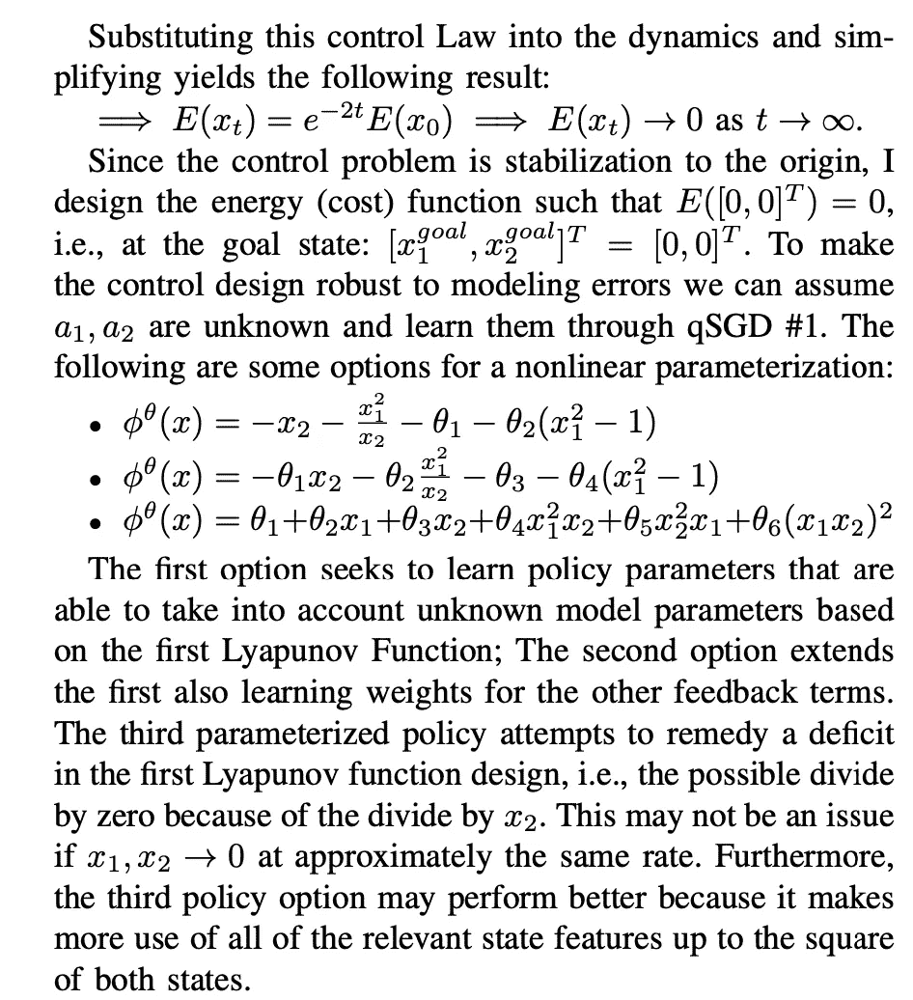
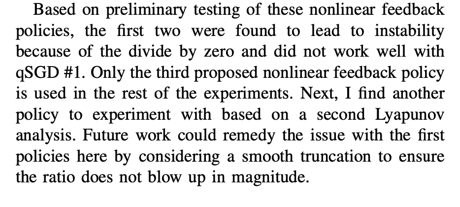
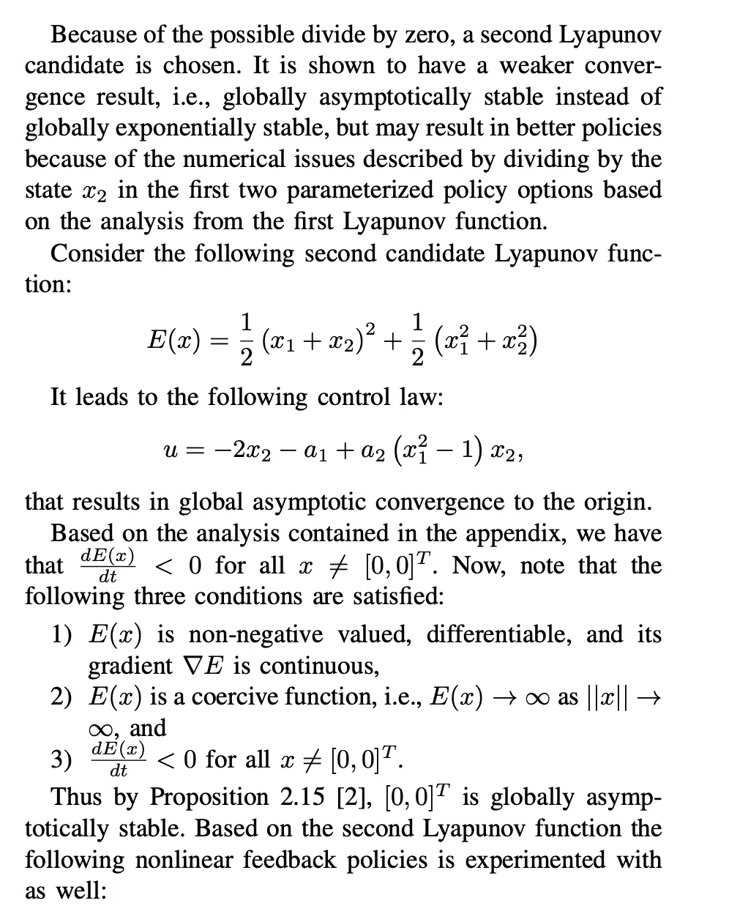
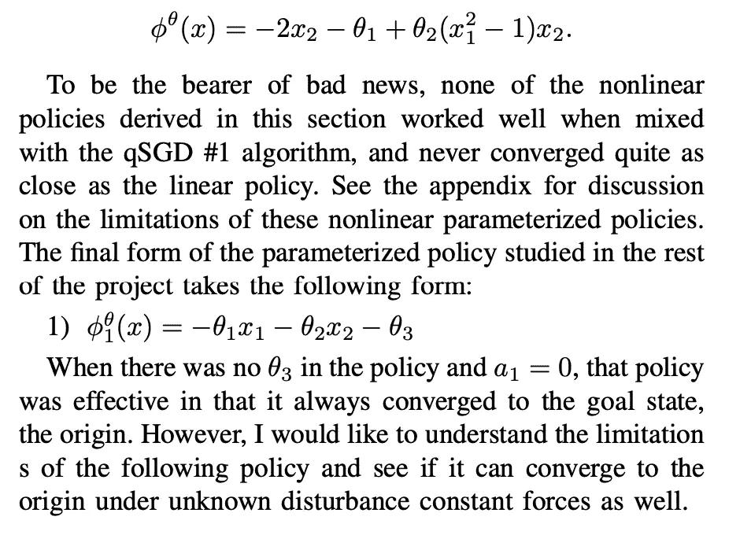
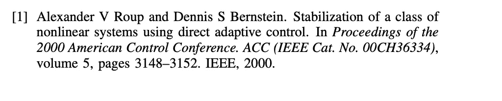
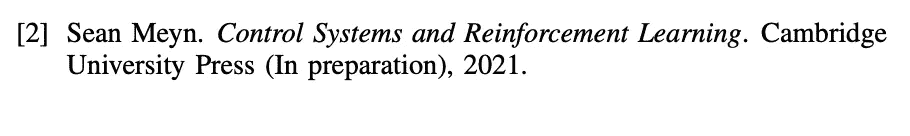

# 用强化学习(RL)稳定范德波尔非线性振子——第二部分

> 原文：<https://levelup.gitconnected.com/stabilizing-the-van-der-pol-nonlinear-oscillator-using-reinforcement-learning-rl-part-2-4510e79fb015>

照片由[分形哈桑](https://unsplash.com/@tetromino?utm_source=unsplash&utm_medium=referral&utm_content=creditCopyText)在 [Unsplash](https://unsplash.com/s/photos/oscillator-physics?utm_source=unsplash&utm_medium=referral&utm_content=creditCopyText)

在上一篇文章中，我介绍了使用 RL 控制范德波尔振荡器的背景以及实现的仿真环境:

 [## 用强化学习(RL)稳定范德波尔非线性振子——第一部分

### 介绍

medium.com](https://medium.com/@CalebMBowyer/stabilizing-the-van-der-pol-nonlinear-oscillator-using-reinforcement-learning-rl-part-1-e6132d25be08) 

本文继续讨论在非理想条件下进行的测试，这一点非常重要，因为大多数研究人员只在“完美”条件下测试他们的 RL 算法。然后，讨论了已实现的 RL 算法设计。

# 非理想条件下的测试

# 算法设计

*首先关注这个博客，从今天开始学习 RL、Python 和其他高价值的话题；如果你想留在圈子里，永远不会错过我的故事，然后订阅我的电子邮件列表。* ***考虑成为中级会员，以获得对我和其他作者的作品的无限制访问:***

 [## 用我的推荐链接加入灵媒——凯莱布·鲍耶，理学硕士

### 阅读凯莱布·m·鲍耶和(媒体上许多其他天才作家)的每一个故事。您的会员费直接…

medium.com](https://medium.com/@CalebMBowyer/membership) 

*下次见，*

*迦*

# 参考资料:

