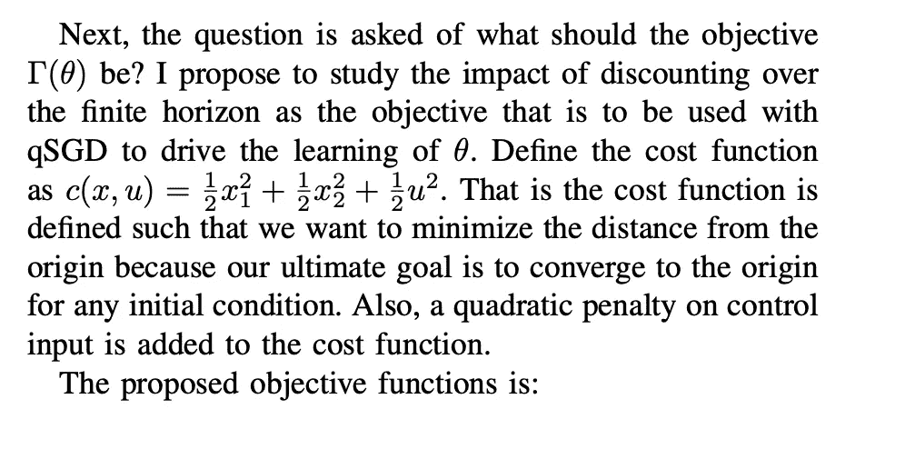
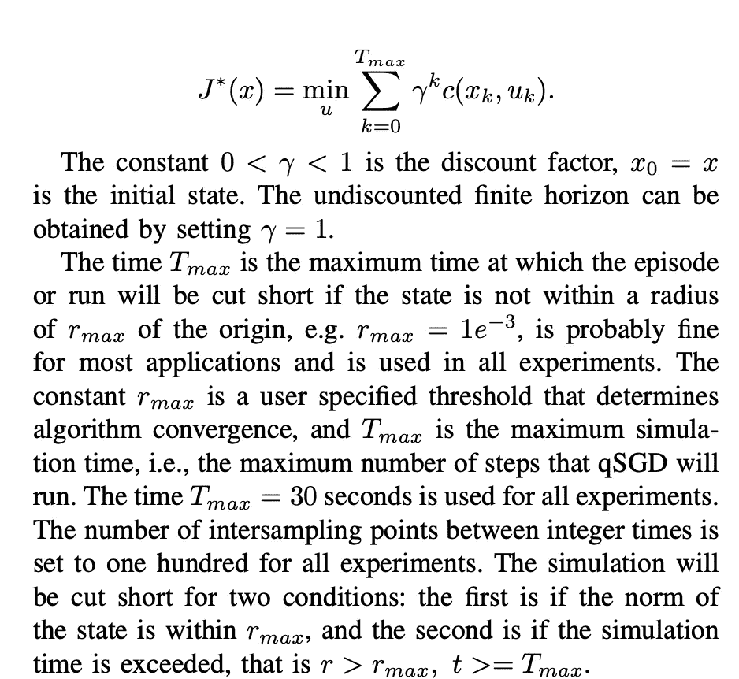
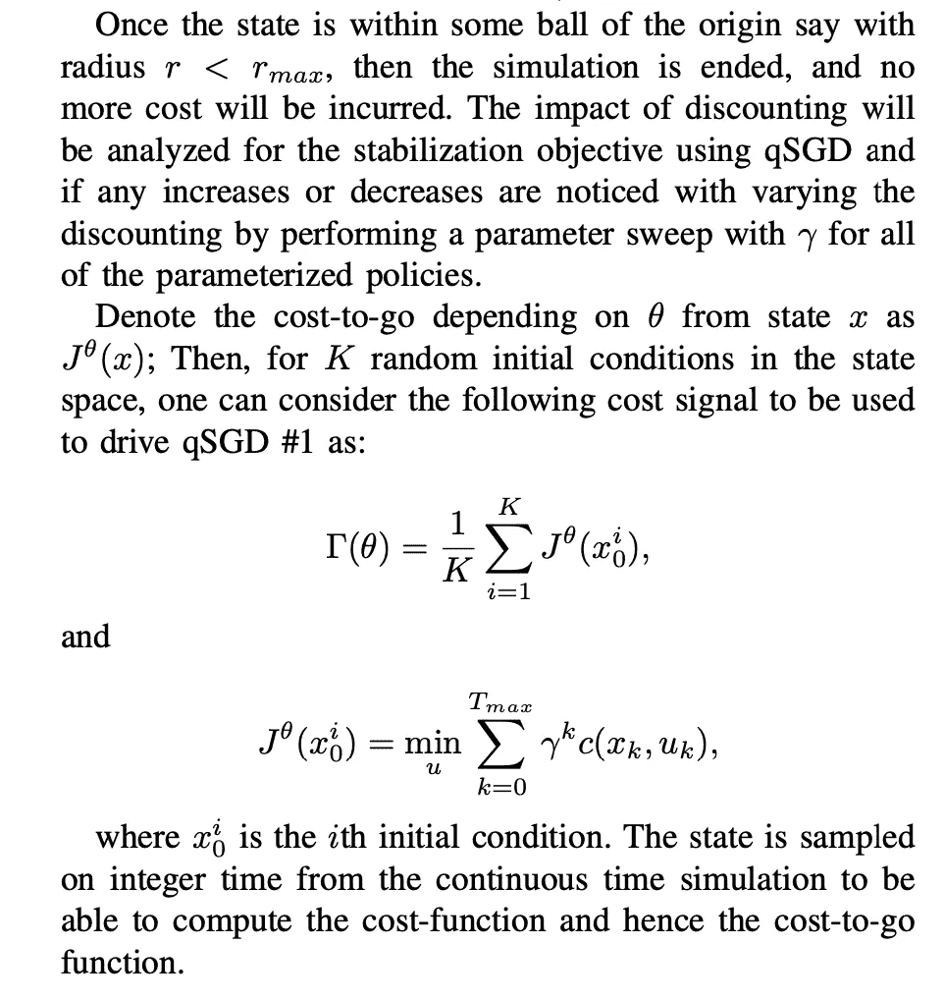
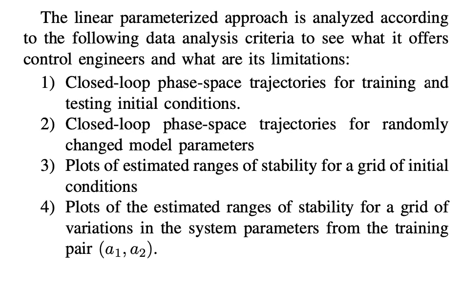
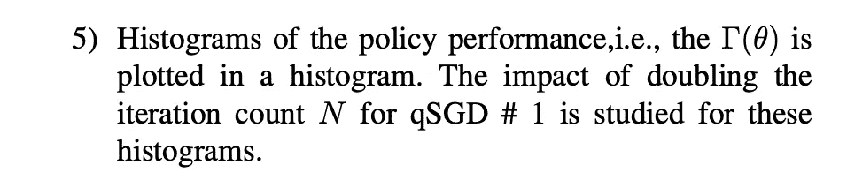

# 用强化学习(RL)稳定范德波尔非线性振子——第三部分

> 原文：<https://levelup.gitconnected.com/stabilizing-the-van-der-pol-nonlinear-oscillator-using-reinforcement-learning-rl-part-3-419851bd7949>

[史蒂夫·哈维](https://unsplash.com/@trommelkopf?utm_source=unsplash&utm_medium=referral&utm_content=creditCopyText)在 [Unsplash](https://unsplash.com/s/photos/oscillator?utm_source=unsplash&utm_medium=referral&utm_content=creditCopyText) 上拍照

本系列教程的最后一部分是关于使用 RL 和连续空间技术的非线性控制，其中提到了在非理想条件下测试 RL 算法的重要性；同时给出了算法设计:

 [## 中等

### 编辑描述

medium.com](https://medium.com/p/4510e79fb015/edit) 

本文继续教程系列，首先回顾控制目标，然后列出这个项目的建议数据分析。

# 控制目标

# 数据分析

*首先关注这个博客，从今天开始学习 RL、Python 和其他高价值的话题；如果你想留在圈子里，永远不会错过我的故事，然后订阅我的电子邮件列表。* ***考虑成为中级会员，以获得对我和其他作者的作品的无限制访问:***

 [## 用我的推荐链接加入灵媒——凯莱布·鲍耶，理学硕士

### 阅读凯莱布·m·鲍耶和(媒体上许多其他天才作家)的每一个故事。您的会员费直接…

medium.com](https://medium.com/@CalebMBowyer/membership) 

*下次见，*

*迦*