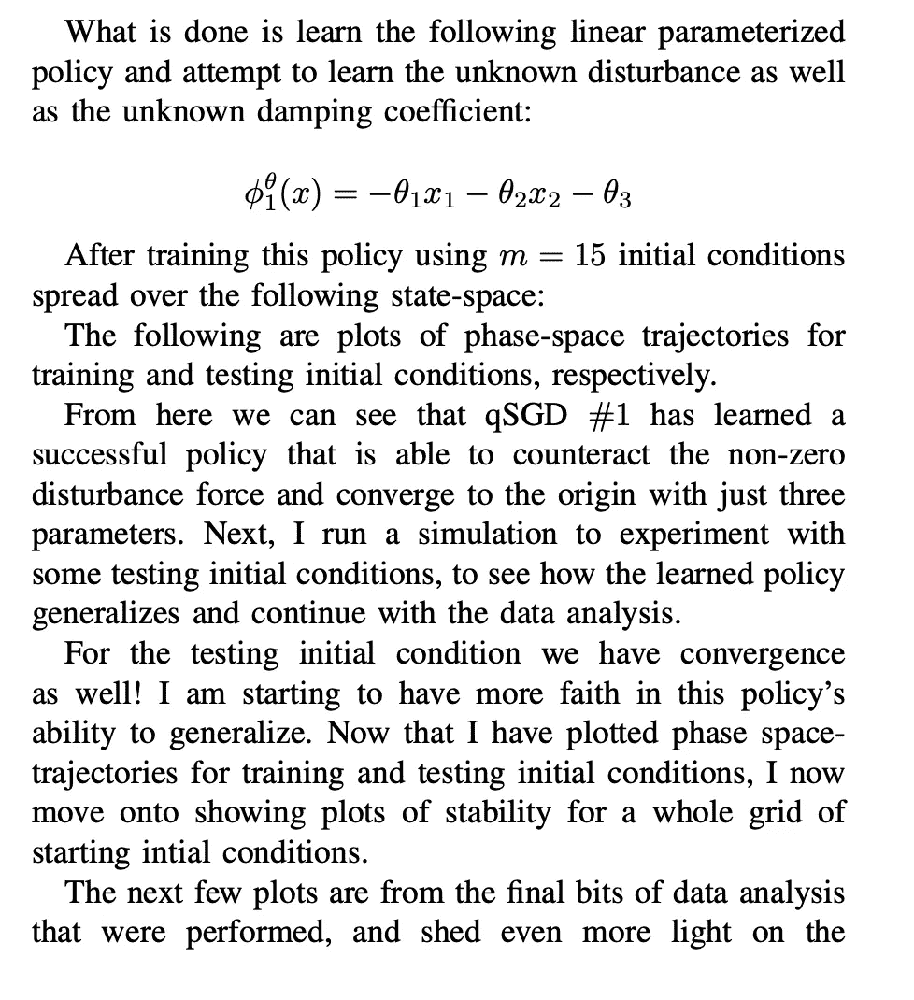
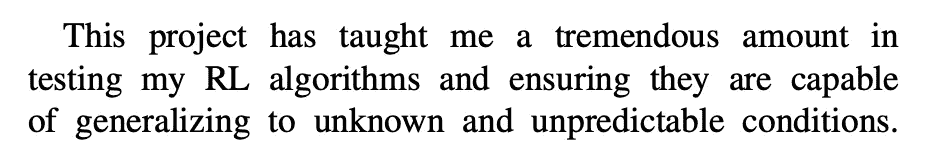

# 用强化学习(RL)稳定范德波尔非线性振子——第四部分

> 原文：<https://levelup.gitconnected.com/stabilizing-the-van-der-pol-nonlinear-oscillator-using-reinforcement-learning-rl-part-4-e17fcbcc9c15>

Pixabay 在 Pexels 上拍摄的照片

在关于控制范德波尔振荡器的 RL 教程系列的最后一部分中，我们将查看实验结果并收集见解。此外，我显示了详细的数学证明的收敛性分析使用提出的控制律。

# 李亚普诺夫控制分析

# 策略失败示例:

# 线性参数化政策校正

# 结论

*首先关注本博客，从今天开始了解 RL、Python 和其他高价值主题；如果你想留在圈子里，永远不会错过我的故事，然后订阅我的电子邮件列表。* ***考虑成为媒介会员，以获得无限制访问我的作品和其他作者的作品:***

 [## 用我的推荐链接加入灵媒——凯莱布·鲍耶，理学硕士

### 阅读凯莱布·m·鲍耶和(媒体上许多其他天才作家)的每一个故事。您的会员费直接…

medium.com](https://medium.com/@CalebMBowyer/membership) 

*下次见，*

*迦*

# 参考

