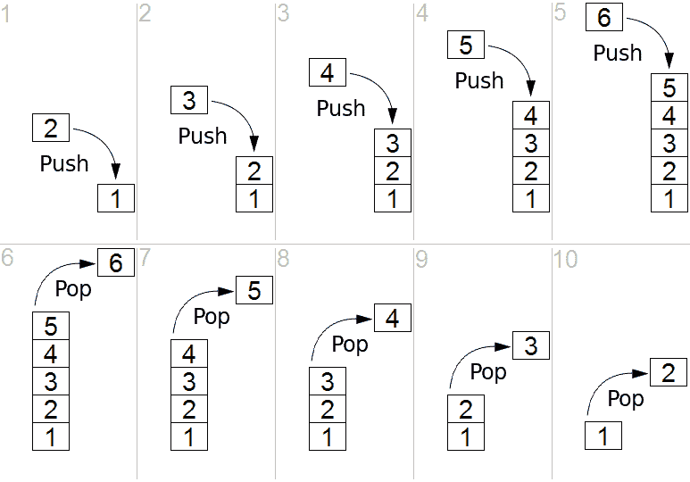
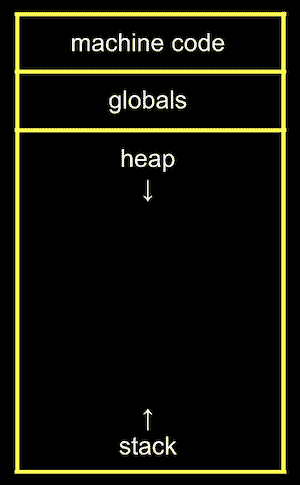
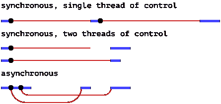

# 堆栈数据结构、调用堆栈和事件循环(在 JavaScript 中)

> 原文：<https://levelup.gitconnected.com/stack-data-structures-the-call-stack-and-the-event-loop-in-javascript-b52468cf08ee>

# 复习:什么是数据结构？

数据结构可能很可怕——这个概念就像先有鸡还是先有蛋的学习，理解一个概念需要理解另一个概念，而理解另一个概念又需要理解第一个概念。嗯……圆形。

哈佛大学[计算机科学入门](https://cs50.harvard.edu/)课程中对数据结构的友好定义是:“数据结构是在内存中组织数据的更复杂的方式，允许我们以不同的布局存储信息。”

数据结构的一些[例子](https://en.wikipedia.org/wiki/Data_structure)有:*数组*，*关联数组*，*记录*，*链表*，*树*，*尝试*， ***栈*** ，**队列** 。各有什么利弊？这超出了我的工资级别(目前)，问维基百科。或者[大卫·马兰](https://cs.harvard.edu/malan/)。

为了至少对为什么有这么多数据结构感到舒服，用一个类比将这个想法带入物理世界是有帮助的:我选择食物存储。食物储存在具有不同属性(例如纸板与塑料)和不同形状(例如软袋与玻璃罐)的容器中，这取决于食物的属性*以及如何获取食物的*优化。理论上，我们可以出售罐装的所有食物，从功能上来说，这将满足我们的需求。但是更有效的储藏容器是存在的，因为我们获取食物的方式——想想冰淇淋、意大利面和鸡蛋——非常不同，我们希望它的储藏方式能反映这一点。类似地，工程师必须使用更多定制的解决方案，而不仅仅是数组或关联数组，即使这些通常在功能上已经足够了。

为什么要学习数据结构？嗯，理解不同数据结构的属性与编写有效的算法是密切相关的:好的算法利用特定数据结构的优势来使程序更快或存储更精简。

因此，数据结构、它们的差异以及优缺点都很重要。今天我们来仔细看看**栈**的结构。

# 什么是栈数据结构？

让我们进入 Wikipedia 对堆栈数据结构的定义:

堆栈是一种抽象数据类型，用作元素的集合，有两个主要的操作:

*   向集合中添加元素(推送)
*   移除最近添加但尚未移除的元素(pop)

第一个关键词是栈是一个*抽象*数据类型。我们在这里简单逗留一下。从**原语**数据类型(例如布尔、整数)我们可以构建**复合**类型(例如数组、关联数组)然后**抽象**数据类型，它们定义*行为*而不是*实现*。

含义:栈可以用数组、链表、哈希表等来实现。，只要它具有以下特征和行为:

1.  线性的
2.  整齐的
3.  数据只能从一端访问

所以堆栈是一个线性的元素集合，按照后进先出的顺序访问( **LIFO** )，因此使用了“push”和“pop”。

具有推送和弹出操作的堆栈运行时的简单表示— [维基百科](https://en.wikipedia.org/wiki/Stack_%28abstract_data_type%29)

对于额外的上下文，考虑堆栈的“对立面”队列可能会有所帮助，队列共享前两种行为，但数据被添加到一端并从另一端检索—先进先出(FIFO)。

## 程序设计语言中栈的使用

堆栈数据结构最适合于:

*   字符串反转函数
*   回溯功能(例如，在迷宫中寻找路线，遍历树)
*   呼叫 stacks！

# 那么什么是调用栈呢？

在我们计算机的内存中，我们的程序需要存储的不同类型的数据被组织成不同的部分:

你电脑的内存— [哈佛 CS50 笔记](https://cs50.harvard.edu/)

这里的'**栈**'部分是我们的调用栈，程序中的函数被调用时使用的临时内存。每个函数、它的参数和变量都被推入调用堆栈，形成一个堆栈框架。堆栈帧就是内存位置。如果一个函数调用另一个函数，堆栈会增加一帧。当函数返回(完成)时，它们被从堆栈中移除(并且它们所占用的内存被清除)。

堆栈的主要目的是维护当前正在运行的子程序(想想*方法*，或者*函数*)的记录，以及它一旦执行完毕应该返回的位置。

[Mozilla](https://developer.mozilla.org/en-US/docs/Glossary/Call_Stack) 用 JavaScript 解释了这一点(如果你喜欢，还可以用一个[动画](https://felixgerschau.com/javascript-event-loop-call-stack/)):

*   当脚本调用一个函数时，[解释器](https://en.wikipedia.org/wiki/Interpreted_language)将其添加到调用堆栈中，然后开始执行该函数。
*   由该函数调用的任何函数都被添加到调用堆栈中更高的位置，并在到达它们的调用处运行。
*   当当前函数完成时，解释器将它从堆栈中取出，并从上次代码清单中停止的地方继续执行。
*   如果堆栈占用的空间超过了分配给它的空间，就会导致“堆栈溢出”错误 [1](https://docs.google.com/document/d/1uF_T0nXlOn51MuX4WEp5ZYzB_NQzrpaaO04CKf3zbZ0/edit#heading=h.lyw97jhob1m3) (这个错误是为了纪念一个登录页面没有人访问的网站而命名的)。

# 很酷的故事，但是我真的需要理解什么是调用栈吗？

理解堆栈数据结构和调用堆栈是计算机科学的一个基本概念。虽然我们通常不*需要*来理解这一点——调用栈的细节通常隐藏在高级编程语言中——拥有一个坚实的心智模型不仅仅意味着更高效的调试，还意味着更好的应用程序设计。

然而，更直接的是，正如本文开头所提到的，对这样一个概念的更深入理解会对理解一个相邻的、相关的概念的难易程度产生巨大的影响。让我们利用这些关于栈和调用栈的信息来访问(或重温)其中一个相关的话题:异步编程。我们将在 JavaScript 中探索这一点。

# 越来越高级:调用堆栈和事件循环

> “传统上，程序只是运行一次，然后终止。这种类型的程序在计算的早期非常普遍，缺乏任何形式的用户交互。这仍然经常使用，特别是在命令行驱动的程序中。任何参数都是事先设置好的，程序启动时一气呵成。”— [维基百科，事件循环](https://en.wikipedia.org/wiki/Event_loop)

(可以理解的)现代流行的 GUI 应用程序需要更灵活的东西:[异步输入/输出](https://en.wikipedia.org/wiki/Asynchronous_I/O) (I/O)。这是一种允许*其他*处理在输入/输出传输完成之前继续进行的处理形式。一个向文件写入 100 亿位数字的程序可以在提交输入之前提示用户输入一个新的文件名和*，开始将数字写入一个临时文件，以后再重命名。也就是说，它在输入“传输”的同时运行不严格依赖于输入的功能。另一种选择是同步 I/O(或阻塞 I/O ),它可以在用户输入时让系统资源空闲，或者 web api 从云数据库获取数据，等等。*

雄辩的 JavaScript 为同步和异步编程提供了极好的视觉和描述:

单线程和多线程同步程序执行与异步程序执行的比较— [雄辩的 Javascript](https://eloquentjavascript.net/11_async.html)

> “粗线代表程序正常运行的时间，细线代表等待网络的时间。在同步模型中，网络花费的时间是给定控制线程的时间线的一部分。在异步模型中，从概念上启动网络操作会导致时间线的分割。启动动作的程序继续运行，动作与它一起发生，并在完成时通知程序。— [雄辩的 JavaScript](https://eloquentjavascript.net/11_async.html)

web 当然可以利用异步 I/O，对吗？例如，让 Bing 在我输入谷歌搜索的同时处理自动填充建议。但是 JavaScript——网络语言——本质上是*同步*:它是单线程的，意味着只有一个调用栈，意味着它一次只能处理一个子程序(函数)。

JavaScript 通过使用*事件循环*来实现异步行为([并发](https://web.mit.edu/6.005/www/fa14/classes/17-concurrency/))——一种持续测试外部事件并调用适当的例程来处理它们的编程结构(读:代码块)。

现在，让我们最后来看看(或重温)这些部分是如何组合在一起的。

JavaScript 事件循环、调用堆栈和队列的可视化——灵感来自 [MDN](https://developer.mozilla.org/en-US/docs/Web/JavaScript/EventLoop)

上图显示:

*   一个*消息队列*(思考函数)，就像一个等待区。每条消息都包含一个对函数的引用，调用该函数来处理该消息。
*   一个*堆栈*，一个框架用于基础框架函数中的每一级“嵌套”函数
*   *堆*，这是一个大部分非结构化的内存区域，用于存储我们程序的数据(您可能已经注意到前面的内存图中的*堆*)。记住 JavaScript 中的一切(几乎)都是对象可能会有帮助，所以*堆*是存储*一切*的地方:函数、变量、参数等等。*堆栈*和*事件循环*只保存每个对象的地址。
*   控制整个表演的*事件循环*

最后，让我们来看一个例子:假设我们还在必应上，我们输入我们的搜索，然后点击“搜索”。

1.  一个连接到“搜索”按钮的事件监听器被触发，并将一条**消息**添加到*队列*中，该队列包含对比如说一个 *getSearchResults* 函数的引用。
2.  如果调用堆栈为空，则从*队列*中移除**消息**，并调用其对应的函数( *getSearchResults* )，在调用堆栈中创建新的堆栈框架。
3.  从 *getSearchResults* 内部调用的任何函数本身当然会被添加到调用堆栈中(当函数返回时，它们的堆栈帧将被移除)。
4.  任何**异步**函数(即函数[本身](https://stackoverflow.com/questions/9516900/how-can-i-create-an-asynchronous-function-in-javascript)被配置为异步)的调用都是一样的。因此 *getSearchResults* 被运行，并且通过由执行 getSearchResults 请求的工作者保存的回调函数( *displaySearchResults* )的指令向 Bing 发出请求。
5.  *getSearchResults* 的同步部分已经完成，所以它的帧被从堆栈中移除。
6.  堆栈中所有其他函数的处理将继续，直到堆栈再次为空，即消息已被完全处理。只有当调用堆栈为空时，事件循环才会检查队列中的消息，如果队列中包含消息，则将最旧的(记住队列是 FIFO)消息推送到调用堆栈中运行。
7.  当 Bing 返回我们的搜索结果时，一条消息与提供的回调函数 *displaySearchResults* 一起排队，我们又回到了开始的地方(一旦清除了前面的消息),一个空的调用堆栈和一条等待回调函数的消息(该列表的第 2 步)。很快，我们将会在页面上看到我们对“谷歌”的搜索结果。

(引用时文章内链接的资源)