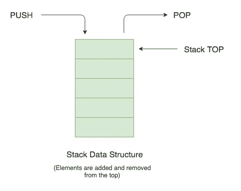

# C++中的堆栈

> 原文：<https://levelup.gitconnected.com/stack-in-c-50b1a19d4c98>


[真诚媒体](https://unsplash.com/@sincerelymedia?utm_source=medium&utm_medium=referral)在 [Unsplash](https://unsplash.com?utm_source=medium&utm_medium=referral) 上拍摄的照片

欢迎读者，在这个博客中，我们将学习堆栈的基础知识和它们的编码实现。还将简要介绍内置函数和方法。因此，让我们立即开始我们关于堆栈的学习之旅。

# 什么是堆栈？

堆栈是一种线性数据结构，具有以连续方式存储的数据元素。它遵循 **LIFO 顺序，即后进先出顺序**，其中插入到末尾的元素首先弹出。只能从顶部推动或弹出一个元素。如果你把它和一摞书比较一下，你会对 stack 有更好的理解。


照片由 [Claudia Wolff](https://unsplash.com/@kaimantha?utm_source=medium&utm_medium=referral) 在 [Unsplash](https://unsplash.com?utm_source=medium&utm_medium=referral) 上拍摄

看一下上面的图片，放在书库最后的书在书库的最上面，可以很容易地从书库中取出来。另一方面，放在书架第一位的书在底部，是最后一个弹出的。

这是一个非常简单的数据结构，但有很好的应用，有些事情只能用栈来完成。

# 堆栈的应用

*   符号的平衡。
*   中缀到后缀/前缀的转换。
*   重做-撤销许多地方的功能。
*   web 浏览器中的向前和向后功能。
*   用于算法，如汉诺塔，树遍历，股票跨度问题，直方图问题。
*   在像拓扑排序和强连通分支这样的图形算法中。

# 流动

在继续讨论堆栈的实现之前，我们将首先讨论在执行堆栈操作时最常出现的两个词，它们是:

## 下溢

在下溢情况下，堆栈的所有元素都被移除，即堆栈中没有元素，堆栈为空。如果有人试图从这个空堆栈中再移除一个元素，这种情况称为下溢。

## 泛滥

溢出情况发生在固定大小的堆栈中。在这种情况下，堆栈变满，即所有空间都被占用，如果在堆栈中再插入一个元素，则无法完成，堆栈将因数据超过其容量而溢出。

# 建筑堆栈

现在我们来看看堆栈是如何构成的。我将使用一个类而不是结构，我将使用一个向量来实现一个堆栈，因为它使我们的工作容易得多，如果你曾经尝试过使用简单的数组来实现堆栈，你就会看到这一点。如果不是，只要看看代码，你就会明白你自己。



```
class stack{
	private:
	vector<int> v;

	public:
	void push(int data){
		v.push_back(data);
	}

	bool isEmpty(){
		return v.size() == 0;
	}

	int top(){
		return v[v.size()-1];
	}
	void pop(){
		if(!isEmpty()){
			v.pop_back();
		}
	}
};
```

我们使用了一个 vector v，并声明它是私有的，这样就没有人可以直接访问它。我们已经制定了使用访问堆栈的方法。有四种基本的堆栈操作。

## 推送()

推入操作用于在堆栈顶部插入。我们已经使用 vector 的 push_back 方法在 stack vector 的末尾添加了一个新元素，显然这是我们栈的顶部。现在你可以看到使用 vector，我们的工作变得简单多了。

## 流行()

弹出操作用于弹出堆栈的最顶层元素。我们使用了 vector 的 pop_back 方法来实现。要弹出，我们首先检查堆栈是否为空，如果不为空，则元素可以弹出，否则满足**下溢**条件。

## 顶部()

Top 是指栈顶的元素。此方法用于获取位于堆栈顶部的元素。在一个数组实现中，我们必须更新 top 的值，当调用这个方法时，返回索引 top 处的元素，但是在我们的例子中，返回 vector 的最后一个元素将完成我们的工作，我们不需要保留 top 变量或更新它。这里使用向量有一个明显的优势。

## isEmpty()

在这个方法中，我们检查堆栈是否为空，并在弹出操作中使用它来避免“下溢”情况。无论向量的大小是否为零，它都返回一个 bool 结果。

还有一个方法， **IsFull()。**它与数组一起使用，检查堆栈是否已满，但对于 vector，我们没有预定义任何大小，因此没有大小上限，如 10 或 10000。这就是我们在实现中没有使用它的原因。

# 另一个实现

还有另一个使用链表的实现。栈顶由 head 表示，所有的插入将是 insertion_at_head，删除也将从头开始，如果下一个节点指向 NULL，将满足下溢条件，并且将不存在 isFull 条件。

我建议你自己尝试用链表实现 stack。理解这些概念会对你有很大帮助，而且非常简单，我已经给了你一些足够多的提示。

# 堆栈 STL

这些库有非常高效的代码，具有更好的空间和时间复杂度。要使用 stack STL，你需要包含 stack 头，然后你可以声明任何你想要的数据类型的 stack。

```
#include<stack>  // To include stack library
stack<int> s; // stack of integers.
```

现在你可以直接使用 stack 的所有方法，而不需要事先编码。基本方法是:

**按下** →在堆栈顶部插入元素。

**弹出** →移除栈顶元素。

**top →** Top 方法用于访问栈顶元素。

**清空→** 检查底层容器是否为空

```
#include <iostream>       
#include <stack> using namespace std;
int main (){
  stack<int> m; for (int i=0; i<5; ++i) 
       m.push(i);           **//Using Push operation to insert element** cout << "Element at top is " << m.top() << endl; cout << "Popping out elements...";
  while (!m.empty()){       **//using empty method**     cout <<' '<< mystack.top();**//top to see the element at top**
     m.pop();               **//Using pop to pop out elements**
  } return 0;
}**Output:**Element at top is 15
Popping out elements... 4 3 2 1 0
```

**size →** 返回堆栈中元素的数量。

```
#include <iostream>       
#include <stack>          

using namespace std;
int main (){ stack<int> m;
  cout << "size: " << m.size() << endl;

  for (int i=0; i<5; i++) 
       m.push(i);
  cout << "size: " << m.size() << endl;

  return 0;
}**Output:**size: 0
size: 5 
```

**放置** →在栈顶就地构造元素。

```
#include <iostream>      
#include <stack>          
#include <string> using namespace std;     
int main (){ stack<string> m;

  m.emplace ("First sentence");
  m.emplace ("Second sentence");

  cout << "m contains: "<<endl;
  while (!m.empty()){
    cout << m.top() << endl;
    m.pop();
  }

  return 0;
}**Output**:mystack contains:
Second sentence
First sentence
```

**交换** →交换堆栈的内容。

```
#include <iostream>  
#include <stack> using namespace std;
int main (){stack<int> stack1, stack2;
  stack1.push(10); 
  stack1.push(20); 
  stack1.push(30);

  stack2.push(40); 
  stack2.push(50);

  stack1.swap(stack2);

  cout << "Elements of stack1: " << endl;
  while (!stack1.empty()){
    cout << stack1.top() << endl;
    stack1.pop();
  }cout << "Elements of stack2: " << endl;
  while (!stack2.empty()){
    cout << stack2.top() << endl;
    stack2.pop();
  }   return 0;
}**Output:** Elements of stack1: 
50
40
Elements of stack2: 
30
20
10 
```

你可以自己看看 STL 让我们的工作变得有多简单，正如我之前告诉你的，这些是非常有效的。

# 结束了

我们已经看到了堆栈的基础知识，它的内置方法，以及在 C++中的实现。


Adi Goldstein 在 [Unsplash](https://unsplash.com?utm_source=medium&utm_medium=referral) 上拍摄的照片

我希望你已经理解了所讨论的内容，如果你喜欢这篇文章，请留下你的掌声。
继续编码，快乐编程:——)