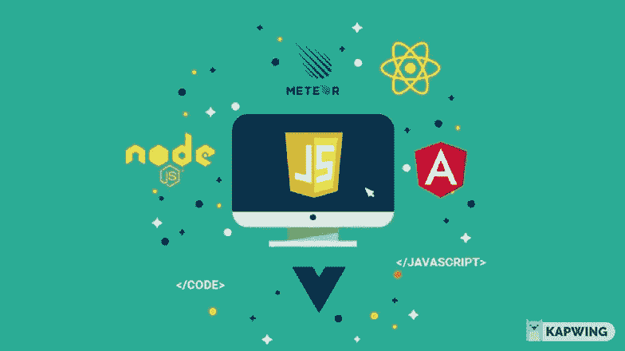

# 栈和工具，您应该学会如何更快地成为全栈开发人员

> 原文：<https://levelup.gitconnected.com/stack-tools-you-should-learn-to-become-a-full-stack-developer-faster-55b1560a87c1>

## 掌握这些工具，更快成为全栈开发者。

全栈开发人员是指 ***理解、设计和编写*** 程序的每一个方面，从用户界面到服务器的程序员。

[@vincentdnl](https://twitter.com/vincentdnl)

完整的工作描述可能看起来令人害怕，但不要因此而退缩。你作为一个人成长得越多，开始创造一个产品，你就会越喜欢它。

许多公司不是雇佣许多非常专业的人，而是寻找能够跨越多个领域和职位的开发人员。

这是 ***极具成本效益的*** ，但它也允许一个人监督和理解一个项目的所有方面，防止误解和知识壁垒。

本帖将讨论 ***栈和工具，用于学习更快成为全栈开发者*** 和增加你的市场需求的建议；我精心挑选了可以帮助您实现这一目标的技术和工具。

# 全栈开发人员必须了解这三层。

*   ***表示层—*** 该层负责应用的前端或用户界面。
*   ***业务逻辑层—*** 业务逻辑层是表示层和数据层之间的桥梁。它规定了应用程序的行为方式和交换的数据。
*   ***数据库层—*** 该层处理与应用后端的数据库连接。

# Java Script 语言

***“JavaScript 是互联网的胶带”——查理·坎贝尔***

Javascript 被用来开发大多数使互联网在现代生活中如此重要的功能和应用。它是一种编程语言，主要由 Web 浏览器使用，为用户提供动态的交互式体验。

由 Kapwing 制成

**以下是你必须学习 JavaScript 的理由:**

*   JavaScript 是一种非常灵活的编程语言。掌握之后选项是无限的:可以在客户端(前端)使用 Vue.js，在服务器端(后端)使用 Node.js。
*   您还可以使用 React.js、React Native 和 Electron 来创建 web、移动和桌面应用程序，并深入研究机器学习。
*   在 2021 年的[栈溢出开发者调查中，JavaScript 位列最受欢迎编程语言第一名。此外，](https://insights.stackoverflow.com/survey/2021#technology-most-loved-dreaded-and-wanted)[72%的企业](https://devskiller.com/it-skills-report-2020/)需要 JavaScript 开发者的服务。在美国，JavaScript 开发人员的平均年薪大约是 11.2 万美元。

# 为什么要先学香草 JS 再学框架？

不止我一个人这么想。如果你看一下 [Odin 的项目路径](https://www.theodinproject.com/paths)，你会注意到他们优先考虑 JS 而不是框架或 [freeCodeCamp](https://www.freecodecamp.org/) ，一个大的学习网站，主要关注 JS。

[hashnode.com](https://hashnode.com/post/react-js-vs-vanilla-js-cku6mrs0c01psjls129xc9iis)

*其中一个原因是框架利用了许多迭代方法，所以不仅仅是语法问题。*

***了解普通的 JavaScript 将使您能够理解——甚至有助于——JS 框架，并帮助您选择最适合您需求的框架。***

# 表示层—前端

## html 5/CSS3/引导程序

[psdwizard.com](https://psdwizard.com/blog/26-css-puns-that-are-very-humorous-and-interesting/)

***HTML5 和 CSS 是互联网的基础。***

***HTML*** 定义了网页的核心结构。它是一种标记语言，您的浏览器可以理解并使用它在需要的地方排列网页的各种元素。它不是一种编程语言。

CSS 帮助你使你的网站更加时尚。此外，B **ootstrap** 有助于使它们成为移动友好的响应设计。

# Vue。射流研究…

如果你想为你的用户创造引人入胜的、独特的、无缝的体验，单页应用程序(SPAs)是一个不错的选择。

单页应用程序(SPA)是通过动态修改当前页面而不是从服务器加载全新页面来持续进行互操作的单个页面。

Vue Js 是最受欢迎的水疗馆之一。虽然 **React** 和 **Angular** (框架)是选择，但我推荐从 Vue 开始，因为它对初学者友好，比 React 或 Angular 更容易掌握。尽管 React 使用了更多的 JS+html (JSX)混合类型语法，但它有一个更熟悉、更容易学习的类似 JavaScript 的语法。入门只需要基本的 HTML、CSS、JS 知识。

*学习了 Vue 之后，使用 React 或 Angular 就很容易了。在这一切之下，它们都基于相同的概念。*

# 后端—应用层:Node.js + Express

Node.js 是一个开源的跨平台的 JavaScript 运行时环境。它通常被认为是初学程序员的最佳开端之一。

***它是用户友好的***——由于它的语法和 JavaScript 是一种解释型语言的事实，开发人员可以在任何需要的时候进行全栈工作，而无需学习其他语言。

***提供实际的、真实世界的应用*** —它提供快速的同步过程。它可以用在 web 的服务器端和客户端，允许双向交互以自由地交流和共享数据。以开发物联网、实时应用和微服务而闻名。

***高需求*** —现成的模块、对更少服务器的需求以及卓越的可扩展性是当今许多公司在其技术堆栈中采用 Node.js 的主要原因。例如，网飞使用 Node.js 将启动时间减少了 70%。

查看最流行的预构建 Node.js 框架 **Express** ，它可以帮助您更快速地构建服务器端 web 应用。它简化了 Node.js 编程，并为开发人员提供了额外的服务器端工具。

# 数据库—数据层

在设计应用程序时，您几乎肯定会需要一个数据库，因为您需要存储数据。

**关系数据库**(比如 MySQL/Postgres SQL)在表**、**中存储数据，而**非关系数据库**(比如 MongoDB)可以以键值对、图形、列和文档的形式存储数据。

[pinterest.com](https://www.pinterest.com/britneylarson1/dba/)

**MongoDB** 已经成为 JavaScript 和 Node.js 的首选数据库之一，我个人建议这样做。

它是著名的 MEAN 和 MERN 堆栈中的“M ”,通常被认为比 MySQL 等传统数据库系统更具可伸缩性和通用性。然而，你还是可以学习。两者都有自己的一套优缺点和市场需求。

熟悉各种工具也很重要，例如:

# 浏览器开发工具

***很管用，但不知道为什么……***

作为一名有抱负的软件开发人员，我总是在寻找新的工具和技术，让我的工作更简单、更高效。当第一次向我介绍 DevTools 时，我花了一段时间才完全理解它们。在使用它们的过程中，不言而喻，它们能极大地节省时间。

每个现代的网络浏览器都有一套强大的开发工具，允许开发人员访问浏览器和网络应用的内部工作。您可以检查正在使用的样式、脚本、API 调用等等。调试页面可以帮助您找出问题所在。如果你想检查不同的设计如何影响你的网站，你可以打开或关闭它们，或者完全改变它们。

# 版本控制系统 Git

随着项目规模的增加，越来越多的人开始参与进来，跟踪所有修改过的文件变得越来越困难。我们需要一个**版本控制系统**来解决这个问题，而 **Git** 就是最流行的一个。

Git 使得跟踪您和您的团队在项目中所做的所有变更变得简单。你们都可以访问同一个代码库，这些代码库可以单独更新，然后合并在一起。您不需要一直保持连接，因为项目存储在本地和远程。

假设你正在开发一个新的网站功能。您创建一个分支来避免影响主源代码。当你使用这个新功能时，你在一个实时网站上收到一个解决问题的请求，这是在它完成之前。你从主分支中建立一个单独的分支，完成你的工作，并将这个固定的分支合并到中央单元中。现在，您可以在新特征分支上工作，而不必担心在修复分支中所做的修改。

# 请不要忽略这最后一条建议！

尽管市场上有这么多具备这些技能的专业人士，但我看到公司很难找到合适的人，而且拥有这些技能的人也非常稀缺。

在招聘开发人员时，我参与了许多技术面试过程。我经常看到倾向于成为全栈工程师的人倾向于一次学习太多的东西，并把它们列在简历上(为了尽快进入市场或看起来有竞争力)。结果，他们对一切都只知道一半。这种尝试是不必要的，因为您会发现很难有效地调试或生成解决方案。你可能认为你能把事情做好，但这还不够！

掌握一个，你就能理解其余的。学会如何操作它们就足够了。

# 结束某事…

学习所有这些并不容易，但这是值得的，而且全栈开发是令人愉快的！

当我打算成为一名全栈开发人员时，我选择了我上面解释的栈，如果我开始写关于全栈开发的一切，我将不得不写一本书。

***测试、安全性、最佳实践、部署、云以及其他主题不在本文讨论范围之内。***

至少，找出要使用的**标准** **数据结构和算法**，因为在设计应用程序时需要它们。然而，毫无疑问，我很快会再写一篇关于他们的文章。

如果你还有什么想知道和学习的，请联系我。

干杯！

***关注我*** *跟上我将要写的新文章！*

# 分级编码

感谢您成为我们社区的一员！在你离开之前:

*   👏为故事鼓掌，跟着作者走👉
*   📰查看[升级编码出版物](https://levelup.gitconnected.com/?utm_source=pub&utm_medium=post)中的更多内容
*   🔔关注我们:[Twitter](https://twitter.com/gitconnected)|[LinkedIn](https://www.linkedin.com/company/gitconnected)|[时事通讯](https://newsletter.levelup.dev)
*   🚀👉 [**软件工程师的顶级工作**](https://jobs.levelup.dev/jobs?utm_source=pub&utm_medium=post)