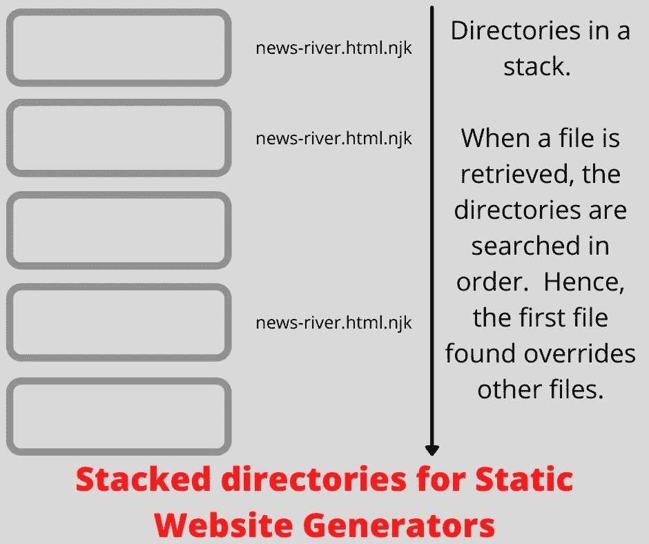
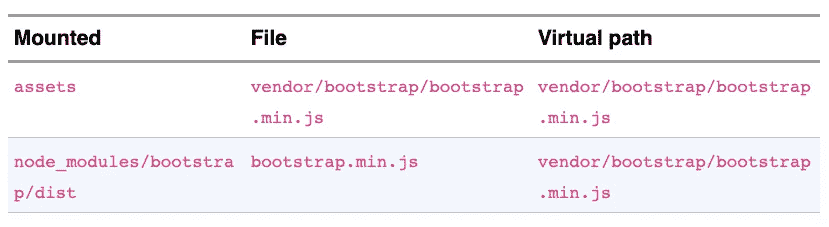
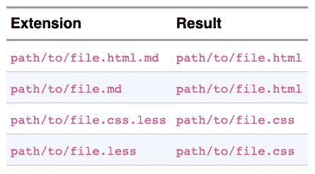

# 堆叠目录—静态网站生成器的目录/文件监视器

> 原文：<https://levelup.gitconnected.com/stacked-directories-a-directory-file-watcher-for-static-website-generators-1b0d2daf3cfb>

当一个静态网站生成器可以自动观察源文件，自动重建任何改变的页面，自动更新浏览器标签时，这是非常方便的。让网页自动重建几乎和所见即所得编辑器一样好。一些静态生成的网站项目需要复杂的目录配置。从 AkashaCMS 项目中分离出来的一个新的 Node.js 包旨在支持这种复杂的目录关系，同时自动监视这些目录中的文件，并发出可以驱动自动重建已更改或添加的文件的事件。



我在 2013 年开始开发 AkashaCMS】，目标是在低端共享主机上支持高流量网站，同时使用现代 JavaScript 和 CSS 技术。长长的功能列表中缺少的是自动重建页面以获得完整预览和早期检测错误的能力。实现该功能导致了对 AkashaCMS 的重大重写，其核心是一个新的独立模块，可以由任何静态网站生成器使用。

该模块*堆叠目录*，处理复杂的目录层次关系，覆盖文件的能力，以及自动扫描目录层次中的变化(添加、更改和删除)。在使用中，应用程序提供了一个要查看的目录列表，以及它们与*渲染输出目录*中的位置的关系。

*堆栈目录*模块的范围是

*   配置了一个或多个要监视其文件的目录
*   目录之间的优先顺序，例如给定文件可以存在于多个目录中，要使用的文件位于优先级最高的目录中
*   在虚拟文件系统空间中定位目录
*   检测对文件的更改、新文件的添加和现有文件的删除，发出相应的事件

我们所说的*虚拟文件系统空间*是指一个静态生成的网站被构建到的目录。一些这样的项目需要聚集来自多个源目录的内容，其中一些是为了呈现到网站的子目录中

这个包不支持将内容呈现到 HTML/CSS/etc 中，也不包含在页面重建后自动重新加载浏览器的特性。相反，它意味着将*堆叠目录*构建到一个更大的系统中，该系统具有这些和其他特性。在*堆栈目录*存储库中有一个示例静态网站生成器，名为 SimpleCMS，它展示了一种使用这个包来支持自动重建网站内容的方法。

# 重写静态网站项目配置中的任何文件

上图展示了*堆叠目录*的一个核心特性。它来自 AkashaCMS 的一个核心原则，即每个文件都可以被覆盖。但是，这意味着什么呢？

考虑一个在网站中实现博客的模块。博客的一个特点是按时间倒序排列的索引(博客的*新闻河*)。这意味着博客模块将包括模板，以协助格式化博客文章内容，新闻河流和其他博客工具。问题是，静态网站生成器如何支持定制那些模板？主题包可能需要定制这些模板，网站所有者也是如此。

这就是文件覆盖发挥作用的地方。

在 AkashaCMS 中有四个目录栈:a) *文档*是文档文件所在的地方，b) *资产*是像图像或 CSS 或 JavaScript 这样的文件，它们被简单地复制到输出目录中，c) *布局*是覆盖整个页面的模板，d) *片段*是用于格式化特定元素的模板。刚刚描述的主题化任务由*部分模板*处理。

上图描述了*部分*目录堆栈和一个文件`news-river.html.njk`的作用。这个模板是使用 Nunjucks 语法编写的，并且与格式化一条*新闻河*有关。在该图中，每个框是*部分*目录堆栈中的一个目录。这张图片中最上面的方框可能是网站本身。第二个盒子可以是打包的主题，提供由其他插件提供的模板的特定主题实现。第四个盒子可能是博客模块。该模块提供了默认的`news-river.html.njk`模板，而主题模块和网站都用自己的实现覆盖了它。

报告给应用程序的是堆栈中最顶层的文件。

这是一个用例，覆盖文件以支持可定制性。

# 从多个来源组合静态网站内容

另一个用例是从几个来源收集内容。营销团队、技术出版团队、支持团队都有内容要在网站上展示。但是每个团队都有自己的管理，自己的时间表，并且可能有自己的 Git 存储库来存储内容文件。这些想法引出了另一个概念:


静态生成的网站将被渲染到输出目录中。我们将该目录视为一个*虚拟*路径层次结构，不同的源目录实际上被*挂载*到这个虚拟层次结构中的一个位置。例如，`/news`的源目录不需要命名为`news`，可以有任何名称。渲染系统应该安排渲染文件进入渲染输出目录的`news`目录。

一个相关的例子是网站上使用的前端框架。例如，Bootstrap 框架反过来需要 PopperJS，您可能希望使用像 Font Awesome 这样的图标库。每个框架都有自己的发行版，需要放在像`/vendor/bootstrap`或`/vendor/fontawesome`这样的目录中。

要考虑的最后一个特性是监视文件，自动重建任何发生变化的内容，并使用重建的内容自动更新 web 浏览器选项卡。显然，这样一个功能需要浏览各种相关的目录，在渲染时将文件映射到正确的位置，以闪电般的速度做一切事情，因为现代人非常不耐烦，想要马上得到一切。

AkashaCMS 的子项目 Stacked Directories 旨在处理跟踪文件以支持刚才描述的需求。它是为在 AkashaCMS 中使用而设计的，但是可以被任何其他项目使用。见鬼，除了静态网站生成器之外，它甚至对其他应用程序也很有用。

# 安装堆叠目录包

*堆叠目录*包只通过 *npm* 库发布。因此，在 Node.js 项目中的安装是:

```
$ npm install @akashacms/stacked-dirs
```

请随意将该命令音译为您喜欢的包管理器，如 Yarn。

源代码在:[https://github.com/akashacms/stacked-directories](https://github.com/akashacms/stacked-directories)

项目文件:[https://akashacms.github.io/stacked-directories/](https://akashacms.github.io/stacked-directories/)

现在我们已经将它安装在一个项目目录中，让我们看看如何使用 Stacked Directories 模块。

首先，在 Node.js 源代码中:

```
import { DirsWatcher } from '@akashacms/stacked-dirs'; 
...
const docsWatcher = new DirsWatcher('documents');
```

`DirsWatcher`是一个包含代码的类，它在幕后管理一个 *Chokidar* 实例。您可以根据应用程序的需要创建尽可能多的该类的实例。例如，AkashaCMS 使用四个实例，一个跟踪文档文件，另一个跟踪资产，另一个跟踪页面布局模板，最后一个跟踪部分模板。传递给构造函数的字符串，在本例中是`documents`，用作这个 DirsWatcher 实例的名称。这个类对名字不做任何事情，所以你可以用任何你喜欢的方式使用它。

DirsWatcher 实例本身不做任何事情。这意味着它不会开始监视任何目录，直到它被告知要监视哪些目录，我们还没有做到这一点。一旦你提供了一个目录列表，它将开始扫描这些目录，并发出事件。我们将在下一节回顾这些事件。

必须遵循的结构是:

```
import { DirsWatcher } from '@akashacms/stacked-dirs';
... 
const docsWatcher = new DirsWatcher('documents');// Configure event listeners -- see next sectiondocsWatcher.watch([
    // list of directory descriptors
]);
```

在 *watch* 方法中，我们提供了要监视的目录列表。为了捕捉所有事件，有必要在调用 *watch* 之前设置事件监听器。

每个目录描述符都是一个具有以下部分或全部字段的对象:

*   `mounted` -要引用的文件系统目录
*   `mountPoint` -虚拟文件空间内的位置
*   `ignore` -一个或多个“全局”模式，指示要忽略的文件

例如:

```
assetsWatcher.watch([
{
      mounted: 'assets', mountPoint: '/',
     ignore: [
         '**/.DS_Store',
         '**/.placeholder'
     ]
},
{
   mounted: 'node_modules/bootstrap/dist',
   mountPoint: 'vendor/bootstrap'
},
{
   mounted: 'node_modules/jquery/dist',
   mountPoint: 'vendor/jquery'
},
{
   mounted: 'node_modules/popper.js/dist',
   mountPoint: 'vendor/popper.js' 
}
]);
```

这有四个条目，显示了每个字段的用法。

*   *挂载的*字段是文件系统中的一个位置，可以是相对的也可以是绝对的。
*   *挂载点*字段是虚拟文件空间内的一个位置
*   `/`的*挂载点*值意味着该目录被*挂载到虚拟空间的根目录*。
*   *忽略*字段列出了要忽略的文件的“全局”模式。这种类型的模式在许多工具中使用，关于精确的格式，请查看 Node.js 的 Minimatch 包。

此示例演示了如何将目录装入虚拟空间。但是它没有明确演示目录堆栈。考虑一下如果这些文件存在会发生什么:



这是我们列表中的两个目录，包含具有相同虚拟路径的文件。虚拟路径是通过将*挂载点*值连接到目录中的路径来计算的。但是，你可能想知道什么是虚拟路径？

*虚拟路径*不是文件系统中源目录的路径。相反，它是*渲染输出目录*中的路径。呈现的输出目录是最终将部署到服务器的内容。在*堆栈目录*中有一个虚拟路径的方面**而不是**被处理，这就是在渲染文件时发生的文件名转换。例如，降价文件的扩展名为`.md`，但被渲染为扩展名为`.html`的文件。但是它被认为超出了*堆栈目录*了解转换算法的范围，因为它不渲染文件。

堆叠目录要做的是找到所有具有相同虚拟路径的文件，并一起报告它们。我们将在后面讨论的对象将第一个匹配的文件显示为主要结果，在其他地方它列出了所有匹配的文件。

在这个例子中，`assets`中的文件可以说是*隐藏*或*覆盖`node_modules/bootstrap/dist`中的文件。*

更明确的目录堆叠演示包括将以下内容放在上述数组的前面:

```
{
     mounted: 'assets-overlay', mountPoint: '/',
     ignore: [
         '**/.DS_Store',
         '**/.placeholder'
     ]
}
```

在这种情况下，您在同一个挂载点上有两个目录。因为`assets-overlay`目录在`assets`前面，所以它的文件会隐藏`assets`中任何对应的文件。

# 由 DirsWatcher 实例发出的事件

现在我们已经看到了如何配置堆叠目录，让我们来讨论一下从 DirsWatcher 实例发出的事件。

DirsWatcher 类是 EventEmitter 的子类。这意味着它有所有熟悉的方法来发出事件，并让应用程序订阅这些事件。

完整的推荐应用程序结构是:

```
const watcher = new DirsWatcher('watcher-name');watcher.on('change', (name, vpinfo) => { ... });
watcher.on('add', (name, vpinfo) => { ... });
watcher.on('unlink', (name, vpinfo) => { ... });
watcher.on('ready', (name) => { ... });await watcher.watch([ ... ]);
```

换句话说，目前有四个事件:

*   `add` - DirsWatcher 在关注的目录中发现了一个新添加的文件
*   `change` - DirsWatcher 发现被监视目录中的现有文件发生了变化
*   `unlink` - DirsWatcher 检测到一个现有文件不再存在
*   `ready` - DirsWatcher 已完成对监视目录的初始扫描

第一次启动 DirsWatcher 实例时会发生*初始扫描*。它扫描目录，并为找到的每个文件发出`add`事件。一旦扫描完所有文件，它就会发出一个`ready`事件。之后，只有在添加新文件、更改或删除现有文件时，它才会发出事件。

`vpinfo`对象包含一个描述给定文件的文件堆栈的简化数据对象。这里有一个例子:

```
{
   fspath: 'documents-overlay/affiliate.html.md',
   vpath: 'affiliate.html.md',
   mime: 'text/markdown',
   mounted: 'documents-overlay',
   mountPoint: '/',
   pathInMounted: 'affiliate.html.md',
   stack: [
     {
       fspath: 'documents-overlay/affiliate.html.md',
       vpath: 'affiliate.html.md',
       mime: 'text/markdown',
       mounted: 'documents-overlay',
       mountPoint: '/',
       pathInMounted: 'affiliate.html.md'
     },
     {
       fspath: 'documents-example/affiliate.html.md',
       vpath: 'affiliate.html.md',
       mime: 'text/markdown',
       mounted: 'documents-example',
       mountPoint: '/',
       pathInMounted: 'affiliate.html.md'
     }
   ]
}
```

在这种情况下，文件`affiliate.html.md`出现在堆栈中的两个目录中。顶层元素描述了堆栈的最前面的条目。`stack`字段包含栈中每个文件的描述。

这些字段的含义是:

*   `fspath` -这是主机文件系统中的路径名
*   `vpath` -虚拟文件系统中的路径
*   `mime` -文件的 MIME 类型
*   `mounted`-*安装了该文件所在目录条目的*字段。
*   `mountPoint`-*挂载*的虚拟文件系统位置
*   `pathInMounted` -相对于`mounted`目录的文件名
*   `stack` -所有目录中具有相同`vpath`值的文件的完整列表

前面我们说过 DirsWatcher 不计算渲染的虚拟路径。该计算必须在应用程序中处理。在 AkashaCMS 中，接收 DirsWatcher 事件的类计算呈现的虚拟路径，将其添加为`renderedPath`字段。

# simple CMS——一个简单的静态网站生成器，使用 DirsWatcher 在几个小时内完成

最后，让我们看看如何在应用程序中使用 DirsWatcher。它正在 AkashaCMS 的核心 AkashaRender 中使用，但是那里有太多的代码来制作一个有效的例子。相反，在 Github 资源库中，你会发现 *SimpleCMS* ，这是一个超精简的静态网站生成器。这个例子是在几个小时内构建的，作为 DirsWatcher 的临时测试工具。

在存储库中，您可以找到一个名为`test`的目录，以及另一个名为`example`的目录。`test`目录下有一个普通的单元测试套件，其中包含一些样本文件的目录。`example`目录包含`simplecms`和`project`，前者是 SimpleCMS 的实现，后者是我们可以使用 SimpleCMS 呈现的部分项目。

在`example/simplecms/index.mjs`中找到以下代码:

```
import { DirsWatcher } from '@akashacms/stacked-dirs';
// import { DirsWatcher } from '../../lib/watcher.mjs';
import path from 'path'; import { promises as fs } from 'fs';
import { render, renderedPath } from './render.mjs';
import yaml from 'js-yaml';
```

这将导入所需的包和函数。您会注意到有两行用于导入 *DirsWatcher* 。在实际的示例代码中，您会找到第二个，但是在常规应用程序中，您会找到第一个。

有一个模块我们不会在本文中讨论，`render.mjs`，它包含一个简单的渲染引擎。

```
// Read the configuration from a YAML fileif (process.argv.length < 2 || !process.argv[2]) {
     console.error('USAGE: node index.mjs config.yaml');
     process.exit(1); 
} let ymltxt = await fs.readFile(process.argv[2], 'utf8'); 
let cfg = yaml.load(ymltxt);  
let batchmode = cfg.batchmode;  
const docsDirectories = cfg.dirs.documents;  
export const renderedOutput = cfg.dirs.output; 
export const layoutsDir = cfg.dirs.layout; 
export const partialsDir = cfg.dirs.partial; // Do initializations in the Render module 
import { init } from './render.mjs'; 
init(layoutsDir, partialsDir); ////////////// END OF CONFIGURATION SECTION
```

这将读取一个 YAML 文件，该文件必须在命令行中命名，它将包含配置设置。这个部分通过调用`render.mjs`中的`init`函数结束。该模块包含用于呈现文件的代码。因为本文关注的是使用 DirsWatcher，所以我们不会展示该文件中的内容。

```
const docsWatcher = new DirsWatcher('documents');docsWatcher.on('ready', async (name) => {
     console.log(`documents ready ${name}`);
     if (batchmode) await close(); 
}) 
.on('change', async (name, info) => {
     console.log(`documents change ${name} ${info.vpath}`, info);
     try {
         await render(info);
     } catch (err) {
         console.error(`documents change ERROR `, err.stack);
     } 
}) 
.on('add', async (name, info) => {
     console.log(`documents add ${name} ${info.vpath}`, info);
     try {
         await render(info);
     } catch (err) {
         console.error(`documents add ERROR `, err.stack);
     } 
}) 
.on('unlink', async (name, info) => {
     console.log(`documents unlink ${name} ${info.vpath}`, info);
     try {
         await fs.unlink(
             path.join(renderedOutput, renderedPath(info.vpath)));
     } catch (err) {
         console.error(`documents unlink ERROR `, err.stack);
     } 
}); docsWatcher.watch(docsDirectories); async function close() {
     await docsWatcher.close(); 
}
```

这是我们配置和使用 DirsWatcher 实例的地方。

SimpleCMS 对世界的看法非常简单，因为只有一个 DirsWatcher 实例。该实例用于跟踪文档文件。对于页面布局模板和其他模板，它们是在`layoutsDir`和`partialsDir`变量中命名的单个目录。

接下来要注意的是对事件的响应。对于*添加*和*更改*事件，它只是调用`render`函数。但是，对于 *unlink* 事件，它会从渲染输出目录中删除相应的文件。最后，对于*就绪*事件，如果处于*批处理*模式，它会关闭 DirsWatcher，其副作用是导致脚本退出。

在一个功能更全的 CMS 中，你可能会以不同的方式处理这个问题。例如，将数据保存到索引中是很有用的，一个目的是允许呈现一个页面引用存储在另一个页面中的数据。此外，不是简单地调用`render`函数，而是应该使用一个*工作队列*来确保同时工作的数量不会淹没系统。

*add* 和 *change* 事件意味着要么有一个新的内容文件，要么有一个已更改的内容文件，我们必须将其渲染到输出目录中的一个文件中。

在 DirsWatcher 中，并不是每次添加或更改都会触发这些事件。相反，只有当添加或更改是针对目录堆栈中最前面的文件时，才会触发它们。考虑前面显示的`affiliate.html.md`例子。`documents-overlay`中的文件是堆栈中最前面的文件。有四个有趣的场景:

1.  文件`documents-overlay/affiliate.html.md`改变，触发*改变*事件。
2.  堆栈中有一个比`documents-overlay`优先级高的目录，其中添加了一个名为`affiliate.html.md`的文件。在这种情况下，会触发*添加*事件。
3.  文件`documents-example/affiliate.html.md`被更改。在这种情况下，它不是堆栈中最前面的文件，因此不会触发任何事件。
4.  另一个目录在堆栈中的优先级低于`documents-overlay`，其中添加了一个名为`affiliate.html.md`的文件。在这种情况下，不会触发任何事件，因为新文件不是堆栈中最前面的文件。

`render`功能主要是将一个文件(比如 Markdown 文件)转换成一种对网站有用的格式。它支持两种 Markdown 文件，呈现为 HTML，可选的布局模板。它还支持将更少的文件编译成 CSS。`render`函数还支持简单地将文件复制到渲染输出目录中，因为不是所有的文件类型都需要转换。

*unlink* 事件需要一些更深入的思考。假设您的目录栈对于给定的虚拟路径有两个文件，就像前面显示的`affiliate.html.md`例子一样。有三种情况需要考虑:

1.  文件`documents-overlay/affiliate.html.md`被删除。在这种情况下，文件`documents-example/affiliate.html.md`现在是堆栈中最前面的文件。你可以说这个文件已经被揭开或取消隐藏。结果是触发了一个*变更*事件，显示`documents-example/affiliate.html.md`为主要文件。
2.  文件`documents-example/affiliate.html.md`被删除。在这种情况下，它不是堆栈中最前面的文件，也不会触发任何事件。
3.  如果堆栈中只有一个文件，并且该文件被删除。在这种情况下，没有其他文件具有相同的虚拟路径，因此触发了 *unlink* 事件。

我们在 unlink 处理程序中看到一个函数`renderedPath`被调用。该函数获取一个虚拟路径名(`vpath`)，并将其转换为输出目录中该文件的路径名。例如,`epub/chap5/b/chap5b.html.md`中的`vpath`必须成为输出目录中的`epub/chap5/b/chap5b.html`。具体来说，此函数使用以下算法重写路径的基本名称部分(最后一个斜杠之后的部分):



双扩展名模式(`.html.md`)是因为这是 AkashaCMS 中使用的文件名模式。想法是在文件名中记录文件的格式和输出格式。

最后要讨论的事件是*就绪*。如前所述，该事件在初始文件扫描完成时触发。结果是为堆栈中每个目录中的每个文件发送了一个 *add* 事件。

如果应用程序的目标是不断地监视要重建的文件，那么 DirsWatcher 实例应该继续运行。但是，如果目标只是简单地建立网站然后退出，那么 *ready* 活动是考虑退出的好时机。使用 SimpleCMS，所有文件都调用了 *render* 函数，因此所有文件都被渲染或复制到输出目录中。

该实现调用`DirsWatcher.close`，其作用是关闭监视文件更改的模块(Chokidar)。只要有活动的事件侦听器，Node.js 进程就会继续执行。这意味着一旦所有对`render`的调用执行完毕，将不再有事件监听器，Node.js 将退出。

# 运行简单的 SimpleCMS 示例

在堆栈目录库中，有几个测试文件的目录。在`example/simplecms`目录中，我们有一个配置文件，列出了作为输入目录的那些测试目录。即:

```
# batchmode: false   # For continuous execution 
batchmode: true dirs:
     documents:
         - mounted: '../project/documents-overlay'              
           mountPoint: '/'
         - mounted: '../../test/documents-example'           
           mountPoint: '/'
         - mounted: '../../test/documents-epub-skeleton'
           mountPoint: 'epub'
     output: ../project/out
     layout: ../project/layouts
     partial: ../../test/partials-base
```

这个配置对象直接对应于前面显示的代码。

在`example/simplecms/package.json`中，你会发现这个`scripts`部分:

```
"scripts": {
     "start": "node index.mjs" 
},
```

这样，我们可以通过运行`npm start`来运行 SimpleCMS，但是我们必须这样做以避免它崩溃:

```
$ npm start -- cfg.yaml
```

使用 npm，`--`之后的任何内容都会附加到执行的命令行中。因此，这相当于运行`node index.mjs cfg.yaml`，好处是`package.json`为您记住了命令字符串。

在这种配置下，文档文件来自指定的目录。`documents-overlay`目录是为了让我们试验叠加文件，以了解这是如何工作的。`documents-epub-skeleton`目录显示挂载到一个子目录中。

渲染将输出到`project/out`，`project/layouts`目录包含布局模板。`test`目录的各种子目录包含针对 AkashaCMS 项目格式化的文件，它们不会直接用于 SimpleCMS。

最后，因为`batchmode`被设置为`true`，该命令将读取所有文件，渲染它们，然后退出。

如果您运行一次，您将看到一个显示 *Add* 事件的跟踪，随后是对 *renderMarkdown* 的调用。每个文件都会发生这种情况，然后很快就结束了，你就在命令行了。新创建的`out`目录包含`.html`文件，检查这些文件会有所帮助。将模板和内容文件与输出文件进行比较非常有用。

例如，研究`test/documents-example/markdown.html.md`。最上面是这个:

```
--- 
layout: default.html.ejs 
title: Markdown example 
tags: Markdown 
---
```

这个 *Frontmatter* 是一个 YAML 格式的块，使用灰质包进行解析。标签声明使用哪个布局模板。其他行作为元数据结束，在呈现布局模板时提供。目前 SimpleCMS 支持 EJS 或 Nunjucks 模板。

这个文件的主体是一个标准的 Markdown 测试文档，它实现了 Markdown 的大部分功能。你将在`project/out/markdown.html`中找到生成的模板，你可以将它与`default.html.ejs`模板进行比较，看看它们是如何组合在一起的。

要切换到连续渲染模式，在`cfg.yaml`中进行以下更改:

```
batchmode: false   # For continuous execution 
# batchmode: true
```

这改变了对*就绪*事件的响应，使得 DirsWatcher 实例不被关闭。这会导致 SimpleCMS 不退出，并继续响应 DirsWatcher 事件，如上所述。

先说文件`example/project/documents-overlay/affiliate.html.md`。这将覆盖另一个文件`test/documents-example/affiliate.html.md`。

对该文件进行任何更改都会导致以下响应:

```
documents change documents affiliate.html.md {
   fspath: '../project/documents-overlay/affiliate.html.md',
   vpath: 'affiliate.html.md',
   mime: 'text/markdown',
   mounted: '../project/documents-overlay',
   mountPoint: '/',
   pathInMounted: 'affiliate.html.md',
   stack: [
     {
       fspath: '../project/documents-overlay/affiliate.html.md',
       vpath: 'affiliate.html.md',
       mime: 'text/markdown',
       mounted: '../project/documents-overlay',
       mountPoint: '/',
       pathInMounted: 'affiliate.html.md'
     },
     {
       fspath: '../../test/documents-example/affiliate.html.md',
       vpath: 'affiliate.html.md',
       mime: 'text/markdown',
       mounted: '../../test/documents-example',
       mountPoint: '/',
       pathInMounted: 'affiliate.html.md'
     }
   ]
} 
renderedPath affiliate.html.md ==> affiliate.html 
renderMarkdown affiliate.html.md ==> ../project/out/affiliate.html
```

我们看到一个 *Change* 事件，带有预期的 *vpinfo* 对象，描述堆栈中的两个文件。然后它计算 *renderedPath* ，最后呈现 Markdown。

将其名称更改为`example/project/documents-overlay/affiliate-foo.html.md`会导致以下事件:

```
documents change documents affiliate.html.md {
   fspath: '../../test/documents-example/affiliate.html.md',
   vpath: 'affiliate.html.md',
   mime: 'text/markdown',
   mounted: '../../test/documents-example',
   mountPoint: '/',
   pathInMounted: 'affiliate.html.md',
   stack: [
     {
       fspath: '../../test/documents-example/affiliate.html.md',
       vpath: 'affiliate.html.md',
       mime: 'text/markdown',
       mounted: '../../test/documents-example',
       mountPoint: '/',
       pathInMounted: 'affiliate.html.md'
     }
   ]
} 
renderedPath affiliate.html.md ==> affiliate.html 
renderMarkdown affiliate.html.md ==> ../project/out/affiliate.html
 documents add documents affiliate-foo.html.md {
   fspath: '../project/documents-overlay/affiliate-foo.html.md',
   vpath: 'affiliate-foo.html.md',
   mime: 'text/markdown',
   mounted: '../project/documents-overlay',
   mountPoint: '/',
   pathInMounted: 'affiliate-foo.html.md',
   stack: [
     {
       fspath: '../project/documents-overlay/affiliate-foo.html.md',
       vpath: 'affiliate-foo.html.md',
       mime: 'text/markdown',
       mounted: '../project/documents-overlay',
       mountPoint: '/',
       pathInMounted: 'affiliate-foo.html.md'
     }
   ] 
} 
renderedPath affiliate-foo.html.md ==> affiliate-foo.html 
renderMarkdown affiliate-foo.html.md ==> ../project/out/affiliate-foo.html
```

我们首先得到一个*更改*事件，接着是一个*添加*事件。*变更*事件将`affiliate.html.md`最前面的文件描述为`test/documents-example/affiliate.html.md`。换句话说，该文件不再被`documents-overlay`中的文件隐藏。

*添加*事件是因为原来的`documents-overlay/affiliate.html.md`文件现在被命名为`documents-overlay/affiliate-foo.html.md`。换句话说，DirsWatcher 认为这是一个新添加的文件。

对于 SimpleCMS 来说，这看起来像是删除了`documents-overlay/affiliate.html.md`，显示了`test/documents-example/affiliate.html.md`，然后添加了`documents-overlay/affiliate-foo.html.md`。

我们已经演示了前面描述的部分事件，那么如果我们简单地添加一个新文件会发生什么呢？

```
documents add documents new-file.md {
   fspath: '../project/documents-overlay/new-file.md',
   vpath: 'new-file.md',   mime: 'text/markdown',
   mounted: '../project/documents-overlay',
   mountPoint: '/',
   pathInMounted: 'new-file.md',
   stack: [
     {
       fspath: '../project/documents-overlay/new-file.md',
       vpath: 'new-file.md',
       mime: 'text/markdown',
       mounted: '../project/documents-overlay',
       mountPoint: '/',
       pathInMounted: 'new-file.md'
     }
   ] 
} 
renderedPath new-file.md ==> new-file.html 
renderMarkdown new-file.md ==> ../project/out/new-file.html
```

这是一个新创建的文件，您可以在`project/out`目录中查看结果。正如所料，一个*添加*事件被触发，随后是呈现文件的`renderMarkdown`调用。

然后，如果我们简单地删除这个文件:

```
documents unlink documents new-file.md {
   fspath: '../project/documents-overlay/new-file.md',
   vpath: 'new-file.md',
   mime: 'text/markdown',
   mounted: '../project/documents-overlay',
   mountPoint: '/',
   pathInMounted: 'new-file.md'
} 
renderedPath new-file.md ==> new-file.html
```

触发了一个 *Unlink* 事件，请注意 *vpinfo* 对象没有`stack`字段。在目录堆栈中找不到匹配的文件，因为该文件已被删除。这样做的结果是计算渲染文件的文件名，并调用`fs.unlink`删除渲染文件。而且，确实，`project/out/new-file.html`就要没了。

# 摘要

DirsWatcher 类很容易成为自定义静态网站生成器应用程序的基础。SimpleCMS 的例子离一个有用的系统不远了。

DirsWatcher 已经准备好出发，看起来相当稳定。它是几年来为 AkashaCMS 开发代码的结果，并且已经使用 AkashaCMS 模块进行了深入测试。

*原载于*[*https://akashacms.com*](https://akashacms.com/news/2021/06/stacked-dirs.html)*。*