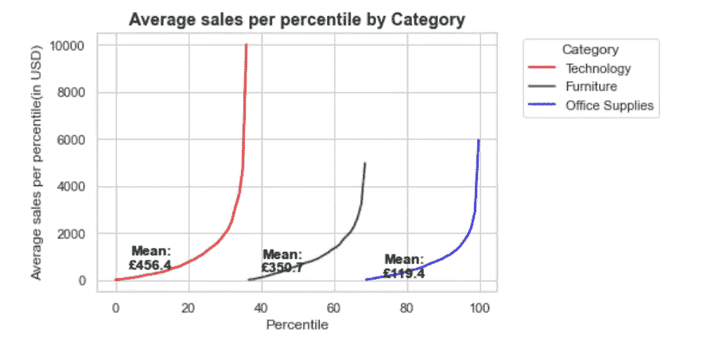

# 百分比堆积线:一种比较不同类别定量数据的新方法

> 原文：<https://levelup.gitconnected.com/stacked-lines-by-percentiles-a-new-way-to-compare-quantitative-data-across-different-categories-9686794e1048>

## 了解如何在 Python 中创建一个新的绘图，以便在一个绘图中有效地比较多个类别的数字数据。

作为一名数据分析师，我一直在寻找视觉上吸引人且有效的方式来传达数据见解。有一次，我无意中发现了一个类似这样的情节。

按类别分类的每百分位平均销售额:按作者分类的图片

这个图表的简单性和有效性让我震惊。该图完美地比较了不同类别的数字数据。它以 x 轴上的百分位数和 y 轴上的销售额为特征。在这个图表上，每个类别的销售额用一条线表示。然后，这些线中的许多线被水平堆叠，只占用它们对总销售额的贡献(占总销售额的百分比)一样多的空间。

从上面的情节中得到的关键信息是:

1.  “技术”领域的销售额最大，约占总销售额的 37%。接下来是“家具”，约占总销售额的 32%。其次是“办公用品”，占剩余的 31%。
2.  线条的形状也讲述了一个故事。在“技术”类别中，最大值是 10000，这是最高百分位数的平均值。“家具”的最高百分位数平均值为 5000，“办公用品”的最高百分位数平均值为 6000。相对平坦的“办公用品”曲线告诉你，这一类别的最大销售额不到 2000 英镑，很少会达到 6000 英镑。
3.  这三个类别的平均值也显示了哪个类别的高价值产品更多。

现在我们已经看到了这些情节是多么有信息价值，让我们言归正传，学习创造一个这样的情节。

## 创建一条线

让我们先为一个产品类别画一条线。稍后，我们可以在下一步中将多行堆叠在一起。

该图的数据取自[这里的](https://www.kaggle.com/rohitsahoo/sales-forecasting)。它是来自美国几个城市的销售数据，涵盖各种产品类别、子类别、客户群和地理位置。让我们简单地看一下数据及其列。

数据框的头部:作者提供的图像

我们将首先为产品类别“办公用品”创建一个图。为此，我们首先按此类别过滤数据，然后按客户对数据进行分组，添加每个客户的销售额。然后，每个客户的总销售额按升序排序。

产品类别-办公用品中每个客户的总销售额:作者图片

根据上面的数据，这个群体有 787 名消费者。这 787 个客户被分成 100 个百分点，每个百分点大约有 7 或 8 个客户。首先按照总销售额的顺序对客户进行排序，然后使用一个函数对其进行平均分配，从而将客户划分为百分位数。

下面提供了将消费者平均分配到百分位数的代码。这段代码包括一些例子来更好地解释这个函数是如何工作的。

一旦客户被分成百分位数(第 14 行)，我们就计算每个百分位数的总销售额(第 17 行)、每个百分位数的客户数量(第 18 行)以及每个百分位数的平均销售额(第 19 行)。

如此计算的汇总数据显示如下。

按客户和每百分位平均销售额汇总的数据:按作者分类的图片

一旦所有的计算都完成了，剩下的就是在 y 轴上绘制每百分位的平均销售额，在 x 轴上绘制百分位。这是在第 22–23 行完成的，平均值显示在上面代码片段的第 24–25 行。

“办公用品”类别中每百分位平均销售额的折线图:作者图片

尽管办公用品的最大销售额是 8000，但该线的形状强烈表明大多数销售额都很适中。事实上，大约 90%的销售额低于 2000 英镑。

## 水平堆叠多行

如果我们知道如何绘制一条直线，就很容易将它们水平堆叠起来。x 轴(百分位数)被分成与堆叠类别一样多的段。创建单行的代码与我们之前看到的相同。

如果我们把这段代码放在一个函数中，它会更容易使用。该函数的参数有:-绘图所基于的列名、当前正在为其创建折线图的列值(类别)、低值和高值。参数“下限值”和“上限值”是百分位数(x 值)的范围，我们希望该线位于该范围内。完整的代码如下。

我们现在必须确定每个类别对总销售额的贡献。我们通过按列名对数据进行分组并计算总销售额来做到这一点。然后，通过将每个类别的销售额除以总销售额，可以计算出百分比。这是在上面的第 27–28 行中完成的。下面是显示总销售额和每个类别占总销售额的百分比的结果数据框。

按类别划分的销售额及其占总销售额的百分比:按作者划分的图像

根据上表,“技术”数据应绘制在百分位数 0-36 之间,“家具”数据应绘制在百分位数 37-69 之间，而“办公用品”数据应绘制在剩余的百分位数 70-100 之间。

我们通过运行一个循环(下面的第 49 行)来实现这一点，该循环遍历所有的类别值，并使用函数 agg_df_by_category()重复聚合数据(第 54 行)。然后，数据被绘制成一个线形图(第 57-62 行),位于上述每个类别的百分位值之间。下面是创建百分比堆积折线图的完整代码。

按产品类别的百分位图的堆积线:按作者的图像

为不同的列概括和应用堆叠线的代码是非常容易的，因为它被放在一个函数中，并将列名作为参数传递。对于 customer-segment、region 和 ship-mode 列，我们可以做出与上面类似的图。

按客户细分的每个百分点的平均销售额:按作者的图像

细分市场的百分比堆积线图显示,“消费者”细分市场的销售额最大(50%)，其次是“企业”(30%)，然后是“家庭办公”细分市场。这三个部分的平均值非常相似。

按运输方式分类的每百分位平均销售额:按作者分类的图片

按运输模式划分的每百分位平均销售额显示，“标准”模式占总销售额的 60%，“二级”占 19%，“一级”占 17%，“当日”仅占 5%。然而，值得注意的是，尽管当天交付的峰值明显短于其他运输方式，但其平均值高于标准和一流。这是一种典型的模式，价值较高的物品一般倾向于当天送达，价值较低的物品通常采用标准和二等送达。

各地区每百分位平均销售额:按作者分类的图片

每个地区的平均销售额绘制成堆叠线。所有四个部分看起来具有相似的形状和特征。尽管东部在总销售额方面排名第二，但其平均销售额高于西部。它的峰值是所有地区中最高的，表明这个地区一定发生了一些高价值的销售。通过查看人口统计数据来进一步分析这一趋势，以确定该地区是否比其他地区拥有更多富裕客户，这将是一件有趣的事情。

## 创建堆叠线图的面格网

我们已经看到这些图表是多么的强大和有洞察力；比较两个或三个类别的趋势无疑会更加有用。这可以通过使用小平面网格来实现。这是通过将数据框(按所需列过滤)传递给 stacked_line_plot()方法，然后在面格网中使用它来完成的。尽管详细的代码可能超出了本文的范围，感兴趣的读者可以在这里找到它。

以下是跨不同消费者细分市场的产品类别的多面网格示例

按产品类别和客户群划分的每个百分点的平均销售额

这个图给我们提供了很多有用的信息。
1。家庭办公室似乎在三个类别的技术上花费最多。“技术曲线”的形状和 x 轴跨度及其平均值证明了这一点。
2。“家具”产品类别在“消费者”细分市场中的销售额位居第二，而“办公用品”在“企业”和“家庭办公”细分市场中的总销售额位居第二。尽管“家具”的平均销售价值高于“办公用品”。

按运输方式和产品类别划分的类似图表如下

按运输方式和产品类别划分的平均每百分位销售额

该图还提供了一些有趣的观察结果，例如:

1.  “技术”部门从“当天”发货中获得的销售额最多。它的平均值也是所有细分市场和产品类别中最高的。只有一小部分办公用品是当天交货的。
2.  有趣的是，“办公用品”是最受欢迎的“二类”商品，而“技术”排在第三位。

这就结束了关于百分位数堆积线图的帖子。完整的代码可以在[这里](https://github.com/hgarg01/Stacked-lines-by-percentiles)找到。感谢您抽出时间阅读本文。我希望你学到了新的东西。我的一些其他受欢迎的文章可以在[这里](https://medium.com/analytics-vidhya/a-complete-guide-to-twitter-sentiment-analysis-part-two-7349550bdea9)和[这里](https://medium.com/analytics-vidhya/calendar-heatmaps-a-perfect-way-to-display-your-time-series-quantitative-data-ad36bf81a3ed)找到。如果这篇文章值得你花时间，请随意鼓掌并跟随[。如果没有，请告诉我如何才能做得更好。继续读，继续学！！](https://hgarg01.medium.com/)