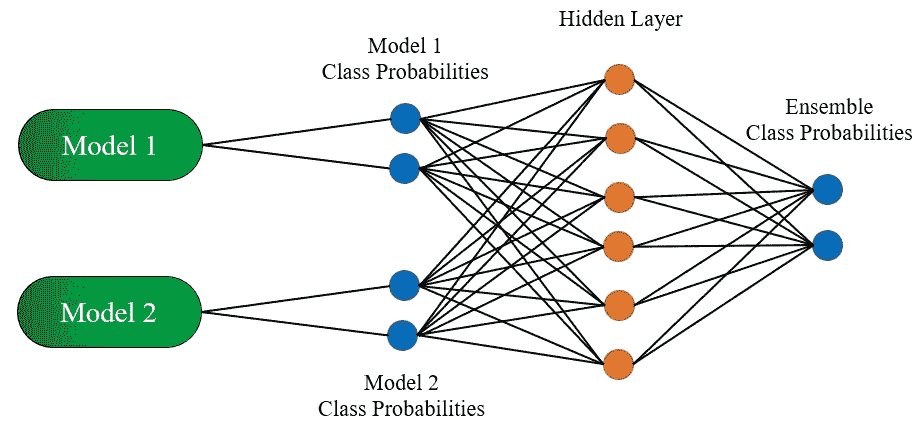
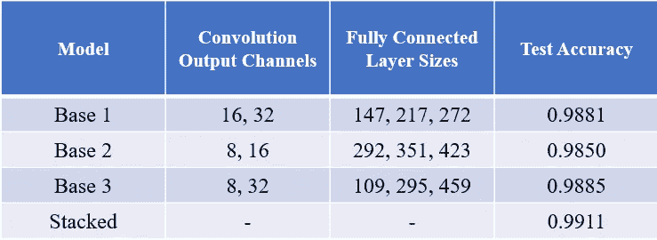
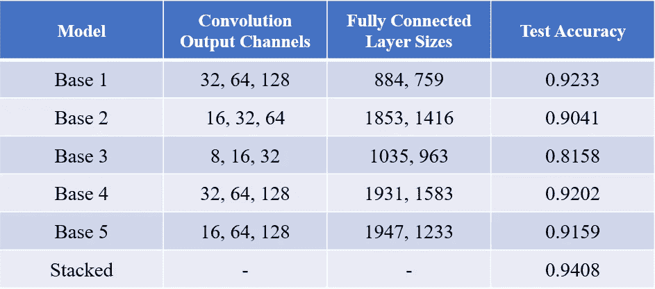
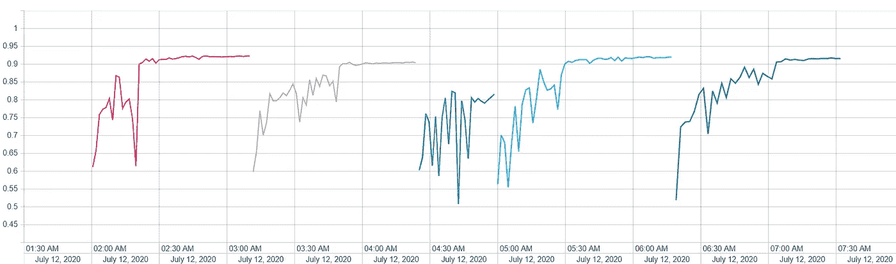
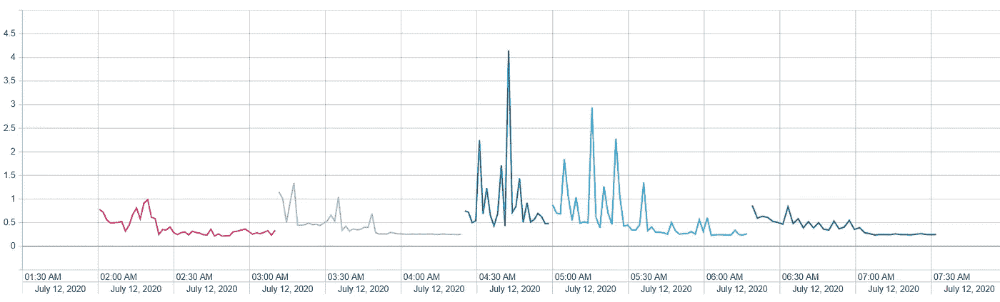

# 堆叠卷积神经网络

> 原文：<https://levelup.gitconnected.com/stacking-convolutional-neural-nets-c1e9dded5ce3>

## 直觉和实施

**简介**

“你好，世界！”我叫马修，这是我第一次进入灵媒界。我是一名数据科学家，用数字和计算机构建事物。无需为我的人生故事费心；你们都不是为此而来。

这篇文章旨在触及两个要点:

1.  为堆叠模型开发一种*直觉*。我见过很多很好的解释——对五岁的孩子来说是装袋和提袋，但很少是堆装。
2.  为*使用 Keras 的子类化技术实现*一个堆叠神经网络提供了一个指导性的例子。

事不宜迟…

# **直觉和元学习者**

艾丽莎、鲍比和卡尔文(照片由[布鲁克·卡吉尔](https://unsplash.com/@brookecagle?utm_source=medium&utm_medium=referral)在 [Unsplash](https://unsplash.com?utm_source=medium&utm_medium=referral) 上拍摄)

**故事时间**

让我们回到上学的日子，想象一个叫卡尔文的漂亮的年轻人。他的带回家的微积分考试明天就要到期了，尽管老师警告说在小组中工作会削弱他的整体教育，但我们都知道他要做什么:那天晚些时候，我们会发现他和他的朋友艾丽莎和鲍比一起，作为一个人匆忙通过考试。

首先，让我们来了解一下这群朋友。艾丽莎是一个正直的学生，不管什么科目，她每次考试都得 A。然而，她对自己的智力相当自负，不太可能接受别人的建议或意见。Bobby 比较普通，但她对级数收敛有一定的天赋，这是这次考试的主题之一。卡尔文呢。我不想这么说，但是如果不是因为他的两个朋友，他会不及格的。谢天谢地，他们不介意帮助他。

几天后，考试成绩被发了回来:

艾丽莎:92%

鲍比:83%

*亦儒:94%*

盛怒之下，艾丽莎对他吼道:“这怎么可能！？你甚至都没学会你这个笨蛋的材料！”卡尔文轻声笑着回答道:“但我当然知道你们两个。”他抄袭了 Alyssa 的大部分答案，但是当她的系列相关答案与 Bobby 的不同时，他站在 Bobby 一边。现在他只能希望没有突击测验…

元学习和集成

让我们从这里开始概括:A 型=艾丽莎，B 型=鲍比，还有，请击鼓…C 型=卡尔文。艾丽莎和鲍比都从教科书和练习题中学习更传统的方法，但卡尔文采取了不同的学习方法。他没有学习材料，而是学习了艾丽莎和鲍比如何学习和表演的细节和复杂性！这正是元学习:学习*关于*学习。

跨过机器学习的桥梁，我们可以直接利用这个概念。当数据科学家在用于分类问题的潜在模型的广阔空间中摸索时，找到合适的模型可能会成为一项艰巨的任务。即使是能够精确定位更好模型的专家也将有几个自由度来通过超参数进行探索。最终，我们可能会有一些不同的型号，它们具有不同程度的性能。现在，该如何选择？

尽管选择表现最好的模型很有诱惑力，但要知道准确性(或者你用来衡量“模型良好性”的任何指标)并不能完全衡量你的*整套*模型所学到的东西。是的，艾丽莎总体上可能比鲍比更好，但鲍比有他的优势，如果我们能找出如何将他们与艾丽莎结合在一起，我们就有可能超越他们两个人的表现。这让我们想到了集合模型的概念:统一使用多个模型来获得更好的结果。

“组装”是一个宽泛的概念，有几种实现方式。一对流行的夫妇被称为装袋和助推。前者使用相同的基础模型，但它适用于原始数据的不同的重新采样版本(引导)。然后将这些模型聚合成一个整体。这种方法对于减少模型方差很有用。后一种技术，boosting，侧重于训练一系列模型，其中每个连续的模型旨在纠正先前模型的错误；这种技术更能减少模型偏差。这两个概念值得充分讨论。

**堆叠**

照片由 [Unsplash](https://unsplash.com?utm_source=medium&utm_medium=referral) 上的 [Samrat Khadka](https://unsplash.com/@samrat_khadka?utm_source=medium&utm_medium=referral) 拍摄

另一种集成方法，堆叠，将是本文余下部分的重点。堆叠背后的想法与我们上面的学生示例完全一致:采用两个或更多执行相同分类任务的基础模型，并让一个新模型(元学习者)采用所有基础模型的预测，并组装自己的预测。这正是发生在艾丽莎、鲍比和卡尔文之间的事情。好消息是，这个故事的结果也可以应用到机器学习上…

有一个警告。

还记得我们说过卡尔文没有他的朋友和他们的大脑会不及格吗？不幸的是，这个*也是*的延续。如果我们在一个二元分类问题上采用两个模型，这两个模型与一个只是猜测的模型表现差不多，那么我们的元学习者不会学习 jack。我们需要基础模型具有一定水平的能力，这样元学习者才能对他们给出的预测做些什么。这符合古老的数据咒语:垃圾进，垃圾出。

随着我们逐步实现堆叠模型，我们将把重点从一般模型缩小到图像分类的神经网络。我假设读者对神经网络有一个大致的了解，所以如果这对你来说是全新的，我建议你先学习一下。下图是二元分类任务的堆叠模型示例，可能是一个有用的参考:

简单堆叠模型(基本模型以通用形式保留)

# **实现**(**好玩的东西)**

在我们开始之前，让我们先对我们将使用的所有工具进行一个顶级总结:

1.  Keras，TensorFlow 2 (gpu 加速)，Python 3
2.  [MNIST 数字作为我们的玩具数据集](http://yann.lecun.com/exdb/mnist/)
3.  [狗对猫 Kaggle 数据集](https://www.kaggle.com/c/dogs-vs-cats)

我们的攻击计划是首先创建一个 CNN 作为基础模型。这本身就能够很好地执行图像分类。我们将在模型的细节上允许一些灵活性，这样我们可以创建许多在结构上互不相同的 CNN。接下来，我们将创建一个完整的模型，包括训练 CNN 和将所有的基础链接到一个元学习者(一个简单的 ANN)。最后，我们将把这个堆叠模型应用到实际数据集，看看它的表现如何。我们开始吧。

**基本模型(卷积神经网络)**

首先，让我们建立一个基本模型。我们将研究 LeNet 架构，这是一种常见的图像分类方法。LeNet 由两部分组成:特征提取部分和分类部分。前者负责挑选出图像的“相关”部分，而后者仅由其名称来解释。参见[此处](https://www.pyimagesearch.com/2016/08/01/lenet-convolutional-neural-network-in-python/)以获得关于 LeNet 的更详细的描述，或者跟随接下来的两段以获得一个大概的想法。

*特征提取:*

一旦一个输入图像被输入到我们的 CNN，它就被传递到一个卷积层，然后到一个 max pooling 层，该层对图像进行下采样，以便训练计算保持可行。然后，我们可以冲洗并重复这个过程几次，以使我们的模型在挑选特征时更加灵活。我在这里掩饰了一些细节，比如过滤器、过滤器大小和输出通道，但是对 CNN 层的完整解释超出了本文的范围；我们将把它留在广义的解释上。

*分类片:*

在特征提取部分之后，我们将得到一个形状(高度、宽度、通道数)的图像。所有的实际值都将直接取决于输入图像的大小和模型的特征提取部分，但我们目前需要知道的只是我们所看到的张量的结构。这个图像被传递到展平层，展平层将张量转换成一个长*高*宽*通道的向量。CNN 的其余部分则由完全连接的层执行，并在最后激活 softmax。请注意，我们需要指定最后一层，以便在数据中包含尽可能多的类别节点。

最后，让我们进入一些代码。我们将使用 Keras 及其[子类](https://keras.io/guides/making_new_layers_and_models_via_subclassing/)方案来构建这个模型；这对于创建不太标准的机器学习模型尤其有用。同样，如果你本质上是一个面向对象的程序员，这很可能适合你。对于感兴趣的读者，下面是自己运行的[源代码回购](https://github.com/Kylexi/ensemblenet)。*注意:为了简洁起见，对一些代码进行了修改。源代码和 Gists 不会完全相同。*

我们将从 Keras 父类 Model 开始工作。构建 Keras 模型(或 Keras 层)子类有两个必要的组件。首先，您需要更新初始化方法，以包含您将使用的所有图层。第二，您需要编写一个调用方法，指示输入如何流向模型中的最终输出。

基本模型实现

我们从初始化方法开始。我们在这里添加了一些参数，这将使我们能够灵活地调整我们的基本模型结构，以便我们可以在以后制作几个这样的坏男孩。参数 *dense_units* 和 *conv_features* 被假定为给出 LeNet 中密集层和卷积层细节的列表。例如， *dense_units =* [20，30]会给我们一个从展平图像到大小为 20 的向量的全连接层，后面是另一个大小为 30 的全连接层，而 *conv_features* = [16，32]会给我们一个具有 16 个滤波器的卷积层，后面是(在最大合并之后)另一个具有 32 个滤波器的卷积层。

您会注意到有几个批处理规范化和删除层:这些是相当常见的做法，是为了减少模型过度拟合。这是一个小小的手动波动，但完整的主题是另一天。另一件要注意的事情是，在初始化过程中，层不会按照它们将被使用的顺序出现；这是为了利用列表理解。

向下移动到我们的调用方法，我们实际上*做*构造层如何排序。我们的输入移动到卷积/最大池层的循环中，随后是全连接层的迭代。这对应于首先进行特征提取，然后进行分类。

因为我们继承了 keras。模特，我们现在可以继续编辑和安装我们的 CNN 了…但这不是我们所追求的。相反，我们希望生成几个 CNN，以便在一个更大的模型中使用。但是我们从哪里开始呢？嗯，我们需要另一个不符合我们刚刚写的方案的模型。我们需要编写另一个子类。

## 堆积模型(系综)

这里采用相同的策略:初始化模型层，然后在输入中以正确的顺序调用它们。“但是其中一层，元学习者的输入，完全依赖于其他模型，”你可能会想。好吧，我们不要想太多了！作为 init 方法的一部分，让我们训练出内部 CNNs *。我们将包括一种在实例化时传递基本模型编译/装配参数的方法。

一旦我们的基本模型训练完成，我们将关闭他们的能力，以接受进一步的训练。**这个理论上没有要求，对学习也不一定有帮助**。稍后会有更多关于**的报道。

然后定义我们的元学习层:这里唯一要注意的是，基本模型输出之后的全连接层被选择为基本模型中最后层的级联的两倍大。这是任意的，但一般来说，确保该层至少大于连接层是一个好主意。

最后，我们定义我们的调用方法。这里没有真正的惊喜。将输入数据输入每个基本模型，连接输出，然后就是一个标准的 MLP。

## **结果和讨论**

我不打算深入研究与数据清理相关的代码；我将简单地在这里和那里给出一些相关部分的快速描述，但请随意深入研究[项目回购](https://github.com/Kylexi/ensemblenet)。我们将从可靠的老歌开始。

*MNIST 数字*

该数据集易于使用，并且易于在上实现高分类精度。出于这个原因，这里使用堆叠模型实际上只是一种检查，以确保我们的理论和实现正确工作。请注意，由于 MNIST 数字是一个相当平衡的数据集，因此准确性是一个可以接受的度量选择。

我们将制作三个基本模型，并改变卷积层和全连接层的大小，使它们彼此略有不同。对于卷积层，通常的做法是将输出通道设置为 2 的幂(这背后有一个硬件优化)。我们还希望特性集扩展到网络中，因此我们将确保从最小到最大对输出通道的数量进行排序。对于密集层…我没有特别的理由选择任何尺寸，所以让我们从[100，500]中取样。下面是模型及其测试精度的总结。

MNIST 堆叠模型摘要

叠加模型似乎如预期的那样工作:我们看到与单个模型相比，整体精度有所提高；虽然，涨幅挺小的。将所有的努力投入到这个数据集的集成中是*不值得花费时间*。至少我们可以放心我们的实现功能。继续前进。

*狗对猫*

[这个数据集](https://www.kaggle.com/c/dogs-vs-cats)由狗和猫的图像组成，有 12，500 张图像用于训练。同样，这是一个平衡的数据集，因此让我们使用准确性作为衡量标准。由于这项任务比上一项更困难，我们将使用 5 个具有更多卷积输出通道和更大密集层的基本模型进行分类。

由于这个分类模型更复杂，为了避免过度拟合，使用了早期停止和学习率降低(在验证损失平台上)。还使用了数据扩充(水平翻转、小旋转、剪切和小宽度/高度移动)来提高模型精度。使用 RMSProp 优化器，通过批量梯度下降，在最大 50 个时期内进行训练。我要感谢 [Kaggle 用户 *Uysim*](https://www.kaggle.com/uysimty) ，他的[内核](https://www.kaggle.com/uysimty/keras-cnn-dog-or-cat-classification)对于完成部分数据处理非常有价值。

狗与猫堆叠模型摘要

更好！当在我们最好的基本模型和我们的集合之间比较时，我们在测试准确性上有显著的增加。既然我们花时间列出了训练方法的细节(更不用说进行实际训练的时间了)，让我们奖励自己一个在整个试衣期间每个基础模型的验证准确性/损失的好视觉。

验证准确性，基本型号 1–5(按从左到右的顺序显示)

验证损失，基本型号 1–5(从左至右依次显示)

上面的图很好地提醒了我们这些超参数的选择会对我们的模型产生多大的影响。考虑到我们最弱和最强的基础模型，我们发现在最终验证准确性方面有近 12%的差异。

推测一下，可以说 1 号基本型就是我们的‘阿丽莎’。如果不直接查看将一切与元学习者联系起来的密集层权重，就不可能知道我们的堆叠模型对每个基础模型的利用程度。对于我们的“鲍比”,我完全不知所措:它可能是基础模型的任何组合。

但我们可以肯定地说，我们的“卡尔文”，即元学习者，事实上确实从我们的基本模型中学到了一些有益的东西，并超越了它的同伴。准确性的提高是否值得花费时间来构建集合本身，这是每个人都必须自己决定的事情。

或者，如果你有老板、投资者或股东，他们很可能会以很低的分贝告诉你。永远记住你手头的目标，以及“足够好”对你意味着什么。

## **收尾思路**

我担心的一个问题是，第三个基本模型(由从 8 到 16 到 32 的卷积滤波器组成)在拟合过程中不稳定。很可能需要大量的过滤器来处理狗和猫的数据集。它的 4 个同行在几乎所有方面都表现得更好，进一步证明了这一点。

我对这个模型很满意，因为它展示了堆叠背后的想法。有趣的是，狗对猫的验证准确率达到了大约 94%，和我在文章开始时给 Calvin 的分数一样。这不是有意的，而是一个愉快的意外。

还有待改进和探索其他途径。我想探索的一个特别的途径是用完全不同的基础模型实现一个集成，扩展到神经网络的可能性(和限制)之外。在这个现有的框架内，其他仍然可以调整的东西包括 CNN 的过滤器大小，更深的网络，以及许多其他的超参数调整。

对于那些已经读到这里的人，谢谢你的时间。如果您有任何意见/建议/批评，请留言。无论是理论、编码还是写作，我都有很多需要改进的地方。

**星号**

(*)如果任何读者对这一特定部分的更好方法有想法或建议，我将非常乐意倾听。在生产环境中，我确信有更理想的方式来实现这一点。

(**)我在上面提到过，一旦堆叠模型上的训练开始，我就选择让我的基础模型“不可训练”。这一选择完全是基于这样一个事实，即整个过程是在一台家用电脑上完成的。诚然，我的家用电脑还不错，但我肯定不能一次在我的 GPU 上安装所有 5 个基本模型的重量加上元学习者的重量。更不用说训练这样一只野兽的时间会比训练 5 个基地然后让它们固定下来要糟糕得多。值得注意的是，这种选择也有一些数学上的后果:固定基础模型对我们的堆叠模型的损失函数施加了约束。如果你打算组建一个合奏团，请记住这一点。

在我的主网站查看更多信息:http://matthewcampbell.io