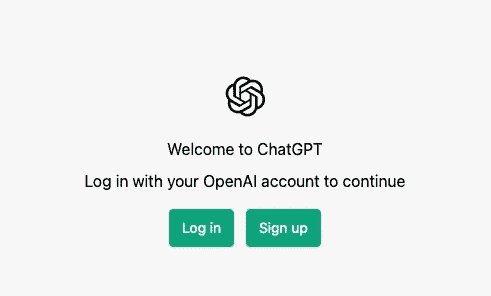
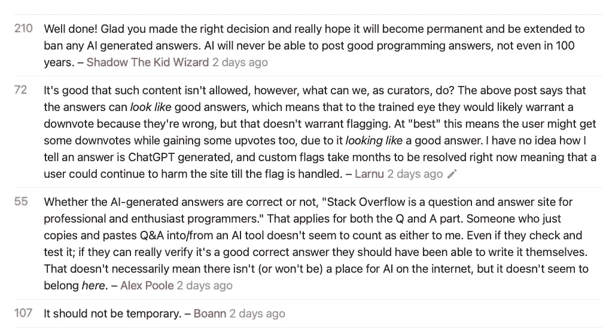

# Stackoverflow 禁止了 ChatGPT，但这还不够

> 原文：<https://levelup.gitconnected.com/stackoverflow-banned-chatgpt-but-it-isnt-enough-abcc9037a407>

人工智能大师必须首先建立一些更明智和持久的社区


马库斯·温克勒在 [Unsplash](https://unsplash.com?utm_source=medium&utm_medium=referral) 上的照片

在 OpenAI 的高级聊天机器人(是的，我就是这个意思)聊天 GPT 首次发布后不久，互联网上充斥着人工智能生成的诗歌和对困难科学主题的解释。

我是通过我的 LinkedIn feed 得到“聊 GPT”的第一条消息的，在那里，我的前老板写了一首诗，含糊地称赞了艾。除此之外，由于人工智能的出现，我看到了一些社交媒体，从有趣的诗歌到职业生涯末日的预测。

我渴望尝试聊天 GPT。然而，当我尝试时，OpenAI 由于一个登陆页面循环而阻止了我。尽管我还有剩余的 OpenAI 学分，这还是发生了。也许是向下的——我不知道。



作者截图

当我睡在上面时，我看到了梦。我看到自己一个接一个地吐槽，在 5N 分钟内写了 N 篇中型文章。当我把它们上传到 Medium 后，我的浏览量就像臭名昭著的冒泡排序复杂度一样飙升。我不仅成为了编程领域的顶级作家，而且我的粉丝数在一周内达到了 50K。

一种令人向往的恐惧爬上了我的心头:如果这是我作为一名程序员的成功巅峰，我真的需要尝试其他的尝试。

这是一些样品:(你可以偷，以后记在我账上😜)

*   函数式编程如何工作
*   继承和多态的区别是什么
*   谷歌面试三大问题(附解答)

当我醒来时，它们已经粉碎了。

我了解到“聊天 GPT”被 StackOverflow 暂时禁止了。

# 为什么聊天 GPT 被 StackOverflow 封禁:

显然，许多 StackOverflow 用户试图使用 OpenAI 最新的聊天机器人聊天 GPT 来回答技术问题。

问题有两个方面:

*   在 StackOverflow 上有大量用户使用 ChatGPT AI 回答问题
*   答案的质量比人类生成的平均答案要低得多

第二点需要在这里详细说明。当谈到 StackOverflow 时，回答质量是什么意思？Stackoverflow 管理员[简洁地描述了](https://meta.stackoverflow.com/questions/421831/temporary-policy-chatgpt-is-banned):

```
The primary problem is that while the answers which ChatGPT produces have a high rate of being incorrect, they typically look like they might be good and the answers are very easy to produce. There are also many people trying out ChatGPT to create answers, without the expertise or willingness to verify that the answer is correct prior to posting.
```

从以下观点来看，StackOverflow 的推理没有错:

*   一个旨在**训练人们**的论坛可以得到试图解释的答案。StackOverflow 是开发人员蜂拥而至进行故障诊断的地方。故障排除需要具有微米级精度的答案。
*   StackOverflow 有一个非常高的标准，不仅是答案，还有问题。其版主历来不鼓励新手程序员过早发布问题。这种做法对许多人来说似乎不公平，但它旨在训练开发人员尝试用更好的术语进行搜索，或者用相关的细节重新表述他们的问题。通常，他们会直截了当地拒绝他们。 **还是** *这是一个基于观点的问题*。这是很多早期开发者讨厌的痛点(包括我自己)。但从长远来看，这是非常有益的，因为它增强了一个人的关键肌肉，这对成为一名健壮的程序员很有用。
*   StackOverflow 还通过其强大的向上投票/向下投票系统来实施其过滤器。因此，过早的问题很容易就结束了。糟糕的答案也会被否决。
*   最重要的是，这个系统是由志愿评审员执行的，他们贡献时间来剔除重复的内容，并评估提问者的努力和回答者的诚意(主要应该包括正确工作的代码)。

当人工智能支持的答案充斥网站时，所有这些审核规则都被扔出窗外。

他们的动机？快速获得高销售代表来美化他们的简历。他们的损失？大多数情况下，什么都没有。

这最后一点使得版主无法维持论坛的质量栏。毕竟，如果有人可以张贴答案来赚取快速代表，同样可以张贴问题。因为问题也能赢得代表。

更多的问题，更多的答案，更多的代表没有风险。无节制的蛮荒西部将比预期的更快实现。

以下规则不仅适用于技术领域，也适用于世界各地:

> 当做某事的摩擦/风险最小化时，就会有大量不合格的供给/投入。

如果只是简单的妥协质量的话会好很多。最糟糕的情况通常涉及生存威胁。

对于也有公共 API(包括 StackOverflow)的网站(他们通常希望人类参与者有平均的输入统计数据)，一个拥有相当快的 AI 引擎的开发人员可以构建一个管道:

*   使用一些原始 NLG 的提示生成(例如，*如何<推/拉/重置/删除>提交到 Git 从 Git 提交？*、*生成最佳排序/搜索/插入/删除算法*等等。)
*   向公共 API 大量发布提示
*   处理响应
*   以略好于 API 预算的价格(GPT +公共网站 API 费用)向用户提供服务/内容

正如任何人都可以看到的，这可能相当于几次 DDoS 攻击的公开可能性——比他们在整个历史中可能解决的要多得多。

有人可能会说，发布到 API 会花钱，而网站可以处理这样的流量，因为它被计算在内。正确，有两点:

*   当回报/风险因子更大时，单个恶意参与者可以无限期地切换 API 密钥来利用系统
*   通过智能网络抓取，可以绕过后端网关守护设备。

这两个只是像我这样的非黑客可以想到的简单的基本场景。一知半解的 AI 知识，没有伦理道德的海盗，可以把世界搞得天翻地覆。

StackOverflow 的版主们一定预见到了这个远比看起来更近的未来，因此立即禁止了它。

大多数用户/版主很快欢呼这个决定。一些人甚至将禁令永久化。本质上，他们在如何解决这个问题上存在分歧，但他们同意全力以赴解决这个问题。



来源: [StackOverflow](https://meta.stackoverflow.com/questions/421831/temporary-policy-chatgpt-is-banned)

# 结论:

我写了很多关于 [GPT 对作家的影响](https://medium.com/geekculture/why-writers-should-be-afraid-of-gpt-3-cd6db085b303)。我还写了关于 [DALLE-2 对创意产业的影响](https://uxdesign.cc/is-openais-dall-e-text-to-image-good-enough-c97bb87e9a0b)。

我对艾的快速到来没有异议。

是的，我担心我作为程序员的未来。如果聊天 GPT 3.0 开始发布全功能的代码，我可能需要在年老之前退休。

我还担心媒体上的顶级作家可能会购买一百万个 GPT 信用点，把像我这样的小作家赶出去。在这种情况下，我的替代退休计划(包括每周在巴厘岛写作 4 小时)也将被取消。

但是这种恐惧告诉我，当我不能战斗时，我必须适应。我会适应这个更新的未来，让 AI 增强+赋能我的事业。

但是我最害怕的不是过时。这是一个关于无情利用支持系统的故事，支持系统为知识引擎提供动力。在这种情况下，该系统恰好是 StackOverflow。

所有的技术创新(包括人工智能)都建立在 60 年的基础之上。这些建筑大多建在政府资助的大学和军事实验室里。公司后来来了，只是为了捞油水。

六七十年代有 IBM。然后是微软和苹果。在互联网时代和后互联网时代，亚马逊、谷歌、脸书和其他公司蜂拥而至，利用免费的研究成果和开源软件。

早期(甚至是 www 出现之前)的开发者涌入新闻组这样的社区。StackOverflow 来得相当晚，但它的社区根植于互联网出现之前的知识共享精神。当然，它也有相当一部分对管理者独裁的抱怨。但是考虑到它的结构和影响，这是微不足道的。

> 让世界受到人工智能保护的责任应该落在那些为了赚钱而建造的地方身上。

相比之下，虚拟的大型科技社区则不然。他们的 GitHub repos 有成千上万未被追踪、未解决的问题。孤立问题、答案完全不可靠的问题、没有 OP 响应就关闭的问题以及不可读/不存在的文档。

他们的门户网站论坛资金不足，管理混乱。如果你不相信，试着把你真正的技术问题贴在以下任何一个地方:

*   [谷歌开发者社区](https://developers.google.com/community)
*   [亚马逊开发者论坛](https://developer.amazon.com/support)
*   [苹果开发者论坛](https://developer.apple.com/forums/)
*   [微软开发者社区](https://developer.microsoft.com/en-us/community/)
*   [脸书开发者社区](https://developers.facebook.com/community/)

如果你问他们的 DevOps 访问量最大的网站是什么，答案会是 StackOverflow。没有 StackOverflow，编程的世界是不可想象的。

Python 是新一代最受欢迎的语言，也是数据科学家的语言，它之所以获得这个称号要归功于 StackOverflow。《GPT》的制作者在发布第一个测试版之前可能已经访问了 SO 十亿次。

人工智能怪物，无意中受到最新聊天机器人武器的鼓舞，无缘无故地威胁到它的存在。

我没有问题要问他们。他们是无头怪物。

我的问题是针对武器制造商的，其中包括 GPT(就此而言，任何先进的人工智能引擎)的制造商和所有者——这些人厚颜无耻地出售他们测试版神经引擎的令牌。

他们能在 StackOverflow 的规模上创造并维持强健的、运转良好的、有道德的社区吗？他们能为开发者社区服务那么长时间吗？

在 StackOverflow 发生的事情是一个警报。

让这个世界受到人工智能保护的责任应该落在为赚钱而建造的地方身上。(他们通过什么机制让它发生超出了本文的范围。也许建立一个组织，资助他们领域之外的免费社区，只是为了与人工智能相关的伤害和恶作剧。我不知道。)

他们的优先权？保护为*服务的地方。

比如 StackOverflow。

*从技术上讲，目前 StackOverflow 是一个商业实体。但就本文而言，其商业模式的规模并不具备将其视为商业的资格。

想为 Medium 写作？想看完每一个介质故事？使用此链接成为会员[。你的会费的一部分将支持**笔磁铁**的写作。](https://tipsnguts.medium.com/membership)

想在每次 Pen Magnet 发布时收到电子邮件吗？[点击这里加入他的订户名单](https://tipsnguts.medium.com/subscribe)。

[**笔磁铁**](https://tipsnguts.medium.com/) 是流行的高级开发者访谈电子书的作者:

[**高级开发人员面试综合方法(40+例题)**](https://tipsnguts.gumroad.com/l/crrzat/)