# Python 中的堆栈和队列

> 原文：<https://levelup.gitconnected.com/stacks-and-queues-in-python-b2e8b4dbd876>

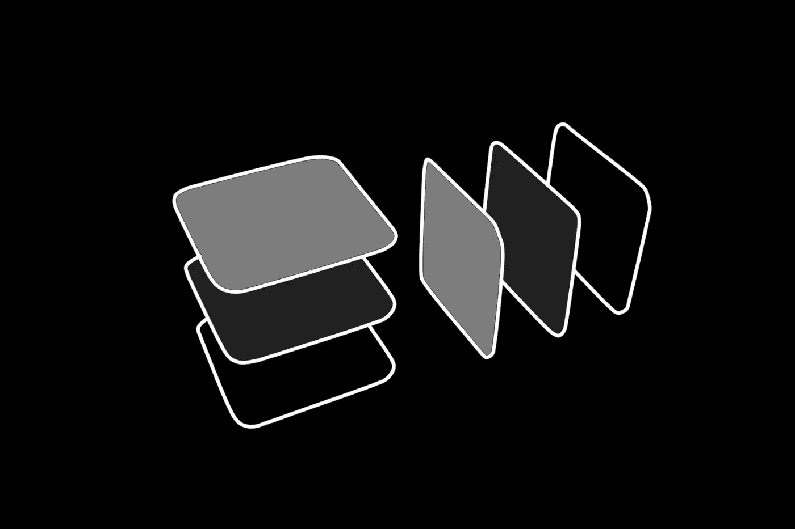

## 学习两种流行的线性数据结构。

## 为什么要看这个？

堆栈和队列(*读作 kyo͞o 或 kiu* )是简单而强大的数据结构，可以帮助您处理各种情况，其中需要一些有序的操作或逻辑，并且您的数据恰好适合堆栈或队列。它们作为编码面试问题也相当受欢迎，所以最有可能在考试中出现。

```
ℹ️ Linear data structures maintain a sequence and ordered relationship to the previous/next element, non linear data structures on the other hand can branch like a [tree](https://medium.com/swlh/making-data-trees-in-python-3a3ceb050cfd) or have multiple relationships, let's keep it simple and use some graphic examples to explain both...
```

## 基础知识:解释煎饼的堆叠:

```
**# Using lists:**
pancakeStack = []
```

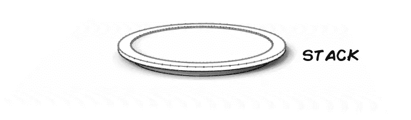

```
# The operation of adding things to a stack is called **PUSH,** but it's implemented with **append** in lists**:**pancakeStack.**append**('Pancake #1') 
```

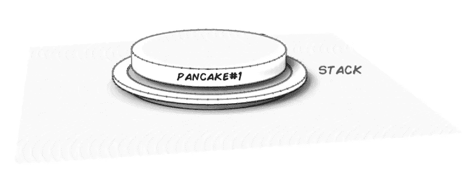

```
pancakeStack.append(**'Pancake #2'**)
```

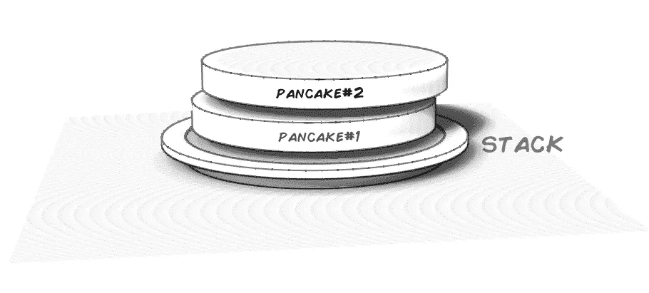

```
pancakeStack.append(**'Pancake #3'**)
```

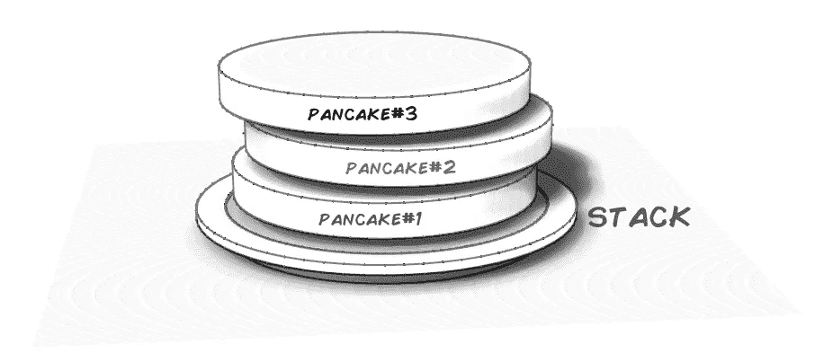

```
**print(pancakeStack)**>> **['Pancake #1', 'Pancake #2', 'Pancake #3']**
```

作为数据结构的堆栈的关键行为是添加和移除元素的方式，所以现在我们已经添加了一些元素，移除元素是以**后进先出** `**LIFO**`的方式完成的:

```
# The operation of removing things from a stack is called **POP** and matches the list method:pancakeStack.**pop()** print(pancakeStack)>> **['Pancake #1', 'Pancake #2']**
```

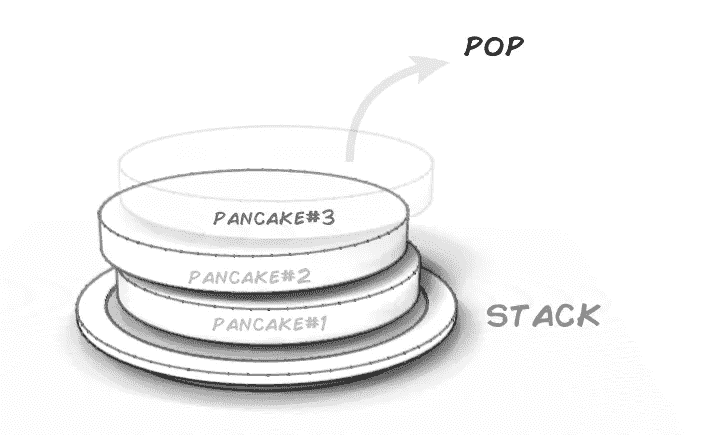

```
# If you repeat the pop operation, you remove the next element on the stack...pancakeStack.**pop()** print(pancakeStack)>> **['Pancake #1']**
```

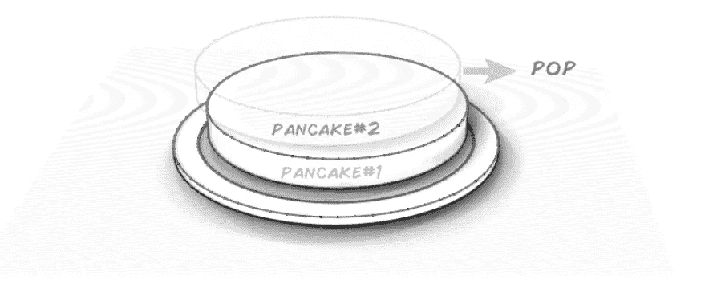

```
# One last pop operation and you are left with an empty p̶l̶a̶t̶e̶ stack:pancakeStack.**pop()** print(pancakeStack)>> **[]**
```

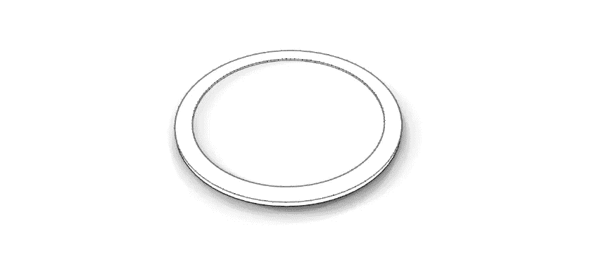

```
👋👋 Hi there 👋👋 all my content is free for Medium subscribers, if you are already a subscriber I wanted to say thank you ! 🎉 If not and you are considering subscribing, you can use my membership referral link, you will be supporting this and other high quality content, Thank you !**⭐️⭐** [**Subscribe to Medium !**](https://k3no.medium.com/membership) **⭐️⭐️**
```

## 基础知识:解释售票亭排队的原因:

```
# Let's start once more with an empty list which will be our queue. **ticket_queue = []**
```

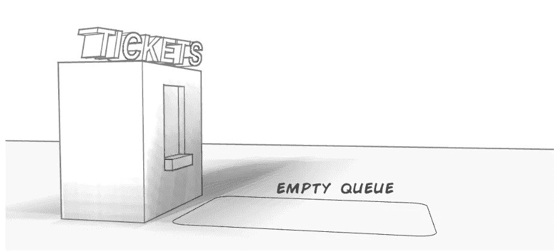

```
# Adding elements is the same as with stacks, only here it's called enqueue or enqueuing (*but still uses the append list method*):ticket_queue.**append**('Customer # 1')
```

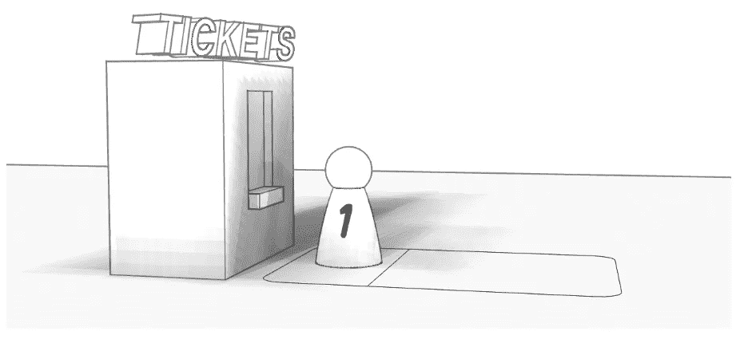

```
# Let's add 2 more customers:**ticket_queue.append('Customer # 2')
ticket_queue.append('Customer # 3')**print(ticket_queue)>> ['Customer # 1', 'Customer # 2', 'Customer # 3']
```

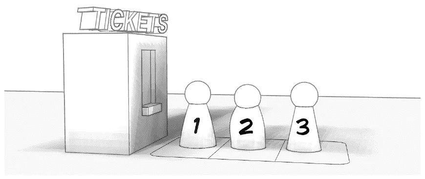

与堆栈不同，当移除元素时，队列以**先入先出**的方式从开始移除它们，这也被称为`dequeue`或`dequeuing`:

```
# The only difference here is the index given to **pop(),** which refers to the first element in the list:print(“Served:" + **ticket_queue.pop(0)**)**Served:Customer # 1**print(ticket_queue)>> **['Customer # 2', 'Customer # 3']**
```

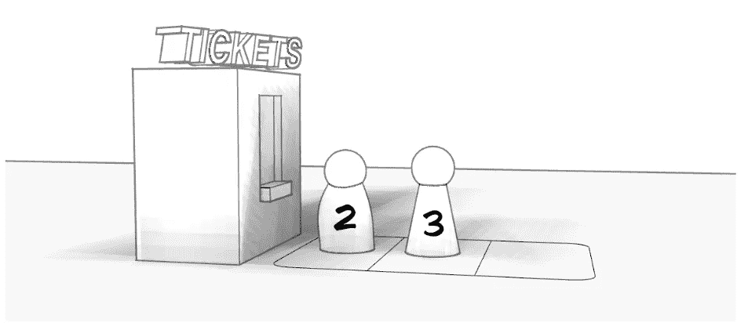

```
You can continue removing or dequeuing elements in the same way:print("Served: " + **ticket_queue.pop(0)**)
>> Served: Customer # 2

print("Served: " + **ticket_queue.pop(0)**)>> Served: Customer # 3print(ticket_queue)**>> []**
```

以下是两者的简短摘要比较:

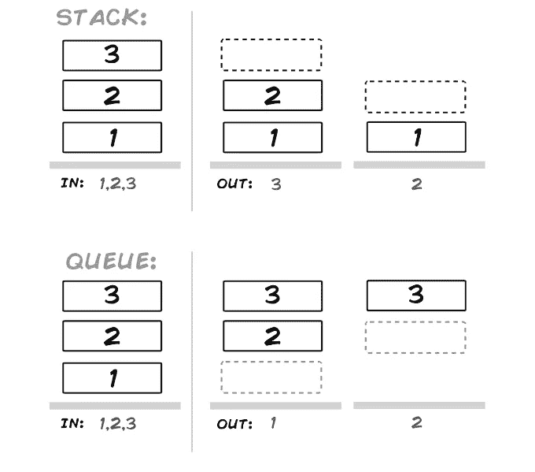

## 使用

如果你要在程序的某个地方实现一个`**undo**` 函数，那么`**stack**`将是一个完美的选择。当操作发生在用户界面上时，你可以推送它们，当撤销命令被调用时，你可以弹出它们。

比方说，当数据到达或输入到脚本中时，您需要对一些数据进行一系列操作。A `**queue**` 是存储(*入队*)数据的好地方，稍后将数据发送到下游进行处理。

所以顺序 FIFO(先进先出)，LIFO(后进先出)操作是主要用途。点击此处阅读关于堆栈和队列的其他观点:

[](https://stackoverflow.com/questions/2074970/stack-and-queue-why) [## 堆栈和队列，为什么？

### 有人问我为什么以及何时应该使用堆栈或队列数据结构，而不是数组/列表？你能举个例子吗…

stackoverflow.com](https://stackoverflow.com/questions/2074970/stack-and-queue-why) 

## 复杂性和替代实施:

```
The original reason (*for me at least*) to write this article came when reviewing someone else's code and finding an import for collections deque, the good news is that if you've been following the examples, you already know most of what collections deque does , so what follows is a brief overview...
```

而列表`[]`似乎非常适合您的一般堆栈和队列需求。如果你需要更多的性能和一些额外的功能还有其他的选择，一个流行的是`[**collections deque**](https://docs.python.org/2/library/collections.html#deque-objects)` **:**

```
**# STACK:** The syntax is identical (except the deque object), but as mentioned you get better performance... **from collections import deque**pancakeStack = **deque()****Adding elements:**pancakeStack.**append**('Pancake #1')
pancakeStack.**append**('Pancake #2')
pancakeStack.**append**('Pancake #3')print(pancakeStack)
# >> deque(['Pancake #1', 'Pancake #2', 'Pancake #3'])**Removing elements:**pancakeStack**.pop()**print(pancakeStack)
# >> deque(['Pancake #1', 'Pancake #2'])**Get removed element:**print(pancakeStack.**pop()**)
# >> Pancake #2
 ---------------------||--------------------- **# QUEUE:** The syntax is also similar,the only difference is when removing elements you use **popleft.****from collections import deque****ticket_queue = deque()****Adding elements:**ticket_queue.**append**('Customer # 1')
ticket_queue.append('Customer # 2')
ticket_queue.append('Customer # 3')print(ticket_queue)
# >>> deque(['Customer # 1', 'Customer # 2', 'Customer # 3'])**Removing elements:**print(ticket_queue.**popleft()**)
# >>> Customer # 1print(ticket_queue)
# >>> deque(['Customer # 2', 'Customer # 3'])
```

您可能会发现还有一些其他有用的功能。这些适用于列表和队列:

```
**# Length of queue or stack** 
print(**len(pancakeStack)**)
# >> **3****# count items that match x:**
print(**pancakeStack.count('Pancake #1')**)
# >> **1****# Add a bunch of pancakes in one go:**pancakes = ['Pancake #4','Pancake #5','Pancake #6']pancakeStack.**extend**(pancakes)['Pancake #1', 'Pancake #2', 'Pancake #3', 'Pancake #4', 'Pancake #5', 'Pancake #6']**# Reverse the queue or stack:**pancakeStack.**reverse()**# >> ['Pancake #6', 'Pancake #5', 'Pancake #4', 'Pancake #3’... ------------- **Deque only:** -------------**# Rotate the stack... Move N elements from the end to the start :**
pancakeStack.**rotate(1)**>> [**'Pancake #6'**, 'Pancake #1', 'Pancake #2', 'Pancake #3', 'Pancake #4', 'Pancake #5']pancakeStack.**rotate(2)** # on the original order...>> [**'Pancake #5', 'Pancake #6'**, 'Pancake #1', 'Pancake #2', 'Pancake #3', 'Pancake #4']**#You can also do the inverse, moving elements from the front of the stack or queue to the back:**pancakeStack.**rotate(-1)** ['Pancake #2', 'Pancake #3', 'Pancake #4', 'Pancake #5', 'Pancake #6', **'Pancake #1'**]**# For the full feature set of deque, check the docs:**
```

 [## 8.3.集合-高性能容器数据类型- Python 2.7.17 文档

### 源代码:Lib/collections.py 和 Lib/_abcoll.py 这个模块实现了专门的容器数据类型，提供了…

docs.python.org](https://docs.python.org/2/library/collections.html#deque-objects) 

```
**More complex:** While beyond this overview, there is yet another way of implementing stacks and queues in python, only this time it is aimed at threaded programming :**Python queue class:** [https://docs.python.org/3/library/queue.html](https://docs.python.org/3/library/queue.html)
```

## 结论:

就像编码中的许多事情一样，堆栈和队列一开始可能看起来令人生畏，但是通过正确的类比，它们会变得更容易理解。这里的类比特别管用，因为这些数据结构在日常生活中随处可见，而且非常匹配。如果你今天早上买了咖啡，你很可能是排队的一部分，就像物品和情况无处不在一样。

通过使用列表，在 python 中实现堆栈和队列也非常简单，如果您在野外遇到 deque，我希望介绍 deque 也会对您有所帮助。

感谢阅读！