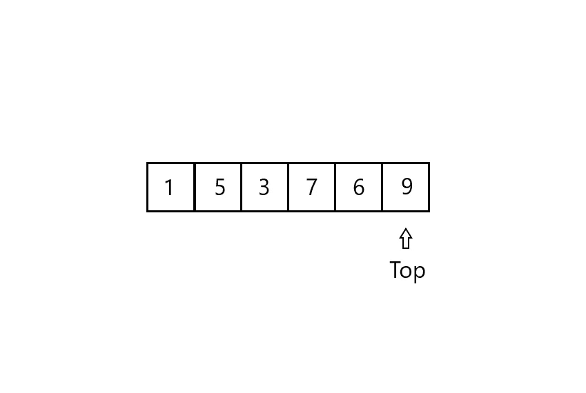
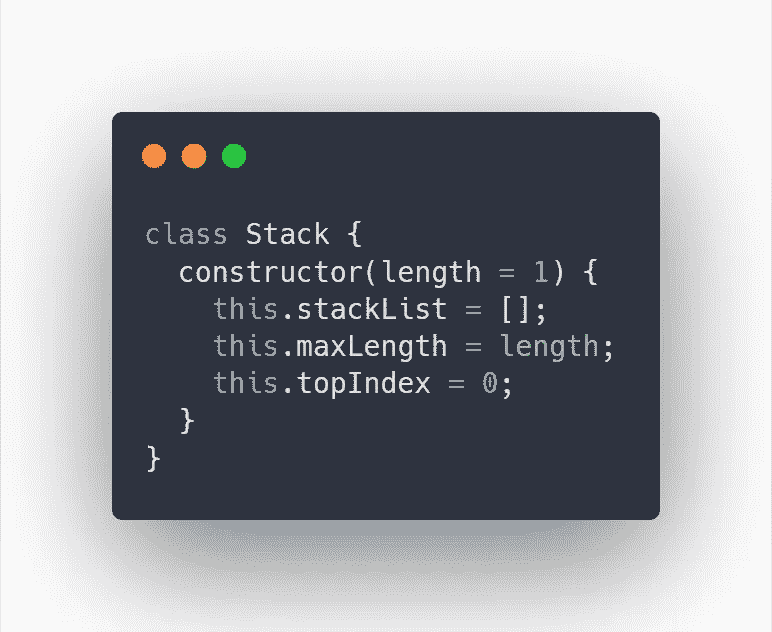
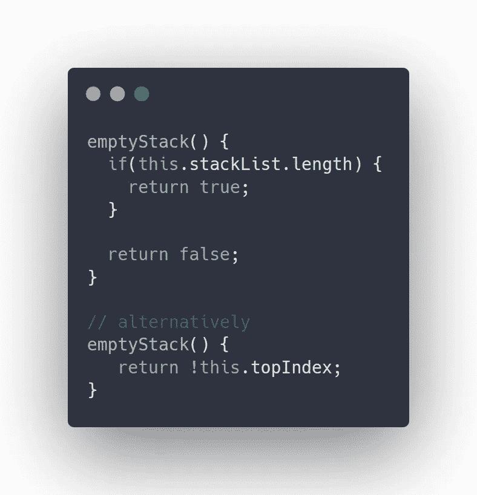
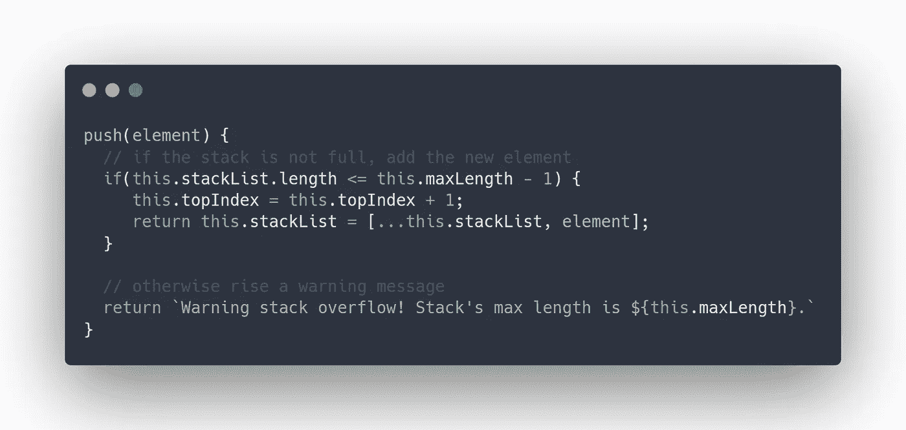
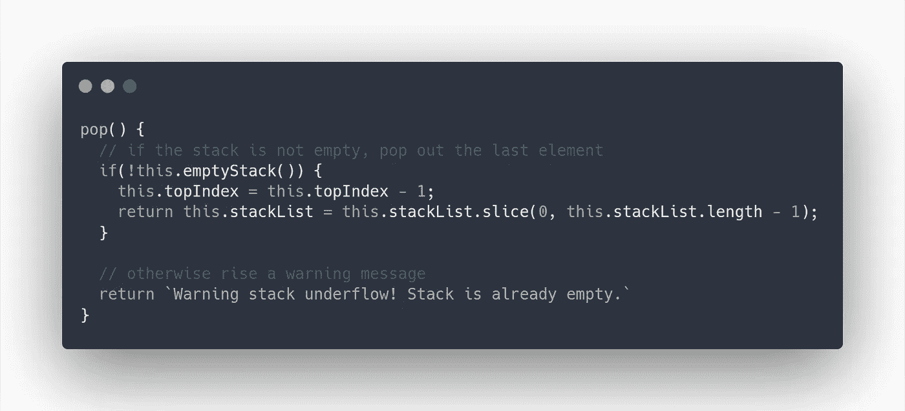
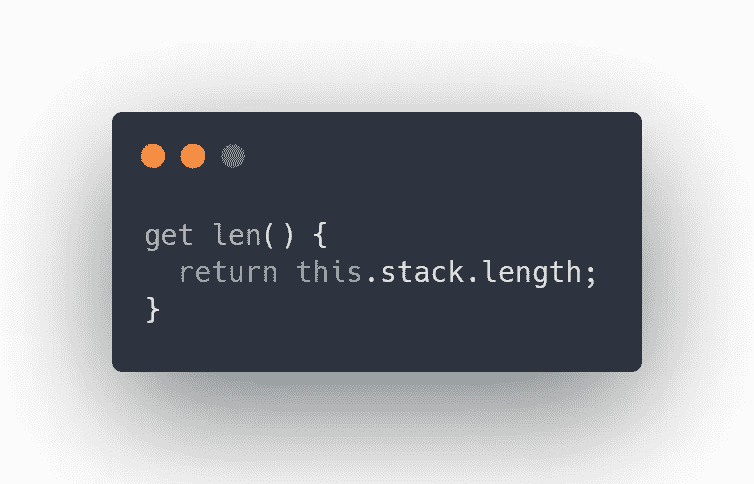
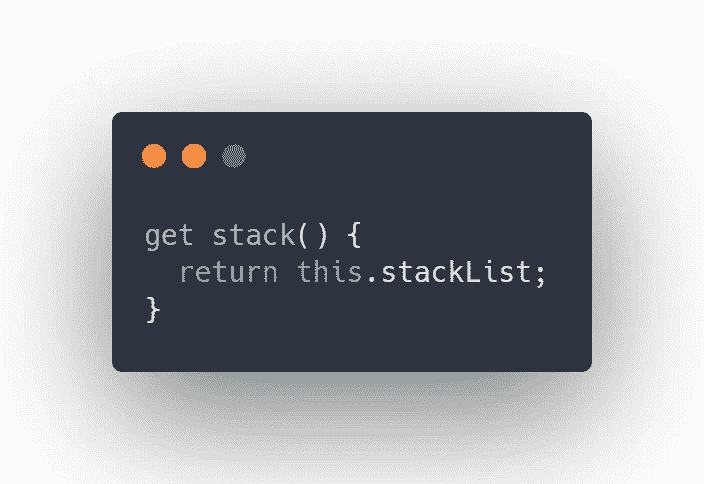
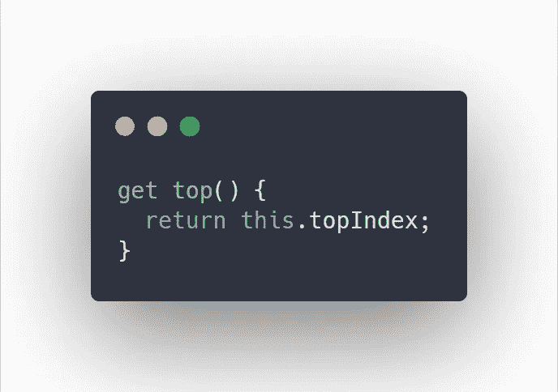

# 栈:JavaScript 中的数据结构

> 原文：<https://levelup.gitconnected.com/stacks-data-structures-in-javascript-106ecc0e147e>

戴夫·古德洛在 T2 Unsplash 网站上拍了一张美丽的照片

**栈**和**队列**是众多原始数据结构中的一种。当你想学习数据结构时，这是一个很好的起点。在本文中，我们将讨论栈，它们的实际实现，当然还有 JavaScript 语言中的实现。

堆栈是动态集合，其中通过**删除**操作从集合中删除的元素是预先指定的。在堆栈中，从集合中删除的元素是最近插入的元素:堆栈执行后进先出或 **LIFO** 策略。你可以把一堆看作是我们喜欢的薯片的容器，就像品客薯片或薯条一样。

当你在生产中往容器里装满薯片时，你是从最后一个放入容器的薯片开始吃，而不是第一个。这是现实生活中许多 LIFO 政策或 stack 政策的例子之一。你也可以想到饼干或硬币，放在对方身上。

让我们假设我们有 n 个元素。

最初堆栈有一个 top 参数。顶部显示了最后一个元素在堆栈中的位置。

堆

在这个例子中，我们的栈顶是 6，因为第 6 个元素是栈的最后一个元素。如果我们没有 9，那么堆栈的顶部将是 5(第 5 个元素是堆栈的最后一个元素)。当我们试图将一个元素添加到一个已满的堆栈中时，就会发生堆栈溢出。但是当我们试图从一个空堆栈中弹出一个元素时，就会发生堆栈下溢。

当栈中有 n 个元素时，栈就满了，就像我们的例子一样。让我们开始创建一个堆栈。

# 初始化堆栈

首先，你应该初始化你的堆栈。堆栈逻辑对 3 个主要参数起作用。

用类初始化堆栈

1.  堆栈本身(this.stackList)
2.  堆栈的最大长度(this.maxLength，可选)
3.  栈顶(this.topIndex)

栈的主要操作是*空栈检查*、*推送*和*弹出*操作。

# 空栈

空堆栈操作检查堆栈是否为空。

堆栈中的 emptyStack 操作

# 推

Push 操作在堆栈末尾添加一个元素。

堆栈中的推送操作

# 流行音乐

弹出操作弹出(移除)堆栈的最后一个元素。

堆栈中的弹出操作

# 附件

我还添加了一些其他的帮助方法(操作),这样用户可以获得更多关于他的栈的信息。

## 检查堆栈的长度

堆栈长度获取方法

## 检查堆栈本身

堆叠吸气方法

## 检查堆栈的顶部参数

栈顶吸气剂法

# 摘要

最后我们得到了什么？我们有一个堆栈，它类似于一个带有 push、pop 和 length 方法的数组，但是在内存使用方面有更多的功能和效率。

我认为我们将涉及的下一个数据结构是**队列**数据结构，它有更多有趣的逻辑。

此外，你可以找到完整的代码通过导航[这里](https://github.com/danomov/DataStructuresAndAlgorithmImplementations)。

感谢您的阅读，我们很快会再见的🤟

> 我讲述的其他数据结构主题:
> 
> [单链表](https://link.medium.com/hu38fRRvAbb)
> 
> [LRU 缓存](https://link.medium.com/z8tBxNIvAbb)