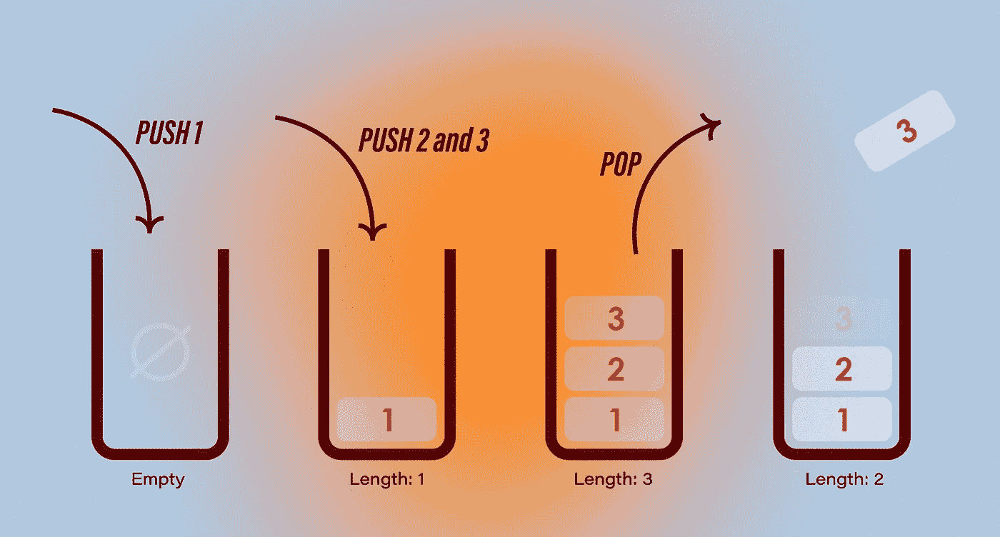
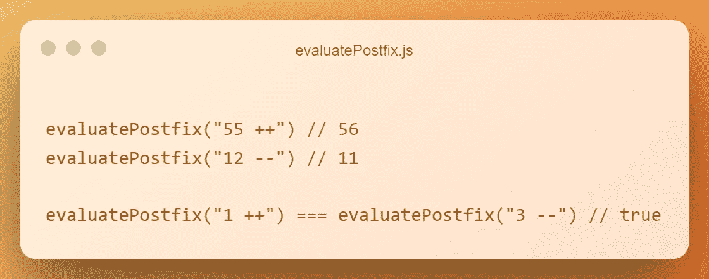

# 栈:JavaScript 中更深层的数据结构

> 原文：<https://levelup.gitconnected.com/stacks-the-deeper-data-structures-in-javascript-6f51f341a282>

## 数据结构和算法

## 默认情况下，JavaScript 有 6 种本地数据结构，但是可以通过创建自定义数据结构来扩展它们。

照片由[法库里安设计](https://unsplash.com/@fakurian?utm_source=medium&utm_medium=referral)在 [Unsplash](https://unsplash.com?utm_source=medium&utm_medium=referral) 上拍摄

自从 JavaScript 发明以来，人们对它有一种不变的思考方式，这就是它的 web 方面。他们没有错，因为它的确是为了赋予网页生命而发明的。然而，现在已经不是 2007 年了，从那以后，JavaScript 的发展和覆盖面的扩展远远超出了它的预期。

在本系列中，我将从`Stack`开始，通过在 JS 中实现自定义数据结构并在算法中使用它们来解决问题，来关注 JavaScript 的数据结构和算法方面。

# 什么是堆栈？

堆栈是一种线性数据结构，可以按一定的顺序保存值。其[时间复杂度](https://www.geeksforgeeks.org/understanding-time-complexity-simple-examples/)为 O(1 ),这意味着输入数据的长度不影响算法的复杂度。

在一个基本的[堆栈](https://en.wikipedia.org/wiki/Stack_(abstract_data_type))实现中，我们有 4 个操作，它们是压入、弹出、窥视或检查堆栈的空值。

## 后进先出原则

您可以将 Stack 视为一个容器，可以在最后一个元素的顶部添加项目，并可以按照与添加项目相反的顺序逐个检索项目。

插图由 [**作者**](https://candurmuss.medium.com/) 创作

因此，如果不弹出您添加的第一个项目，就无法访问它。[这个](https://www.geeksforgeeks.org/lifo-last-in-first-out-approach-in-programming/)叫做*后进先出*原则。

# 让我们实施它

在 JavaScript 中实现堆栈有很多种方法。你可以使用类和数组或者链表。我将使用名为`Stack`的类来实现它。

所以，首先创建一个名为 stack 的类，在构造函数中，设置`maxSize`和 Stack。我想让这个结构灵活一点。所以，如果`maxSize`没有通过，它可以无限增长。

现在我们有了我们的`Stack`类，我们可以开始实现基本的操作，即推送、弹出、扫视和检查是否为空。

要推送项目，我们必须首先检查堆栈的大小，如果足够大，我们将推送项目。为了一次推送多个项目，我们使用 rest (…)操作符。

从堆栈中弹出和查看项目彼此相似。然而，在`pop`方法中，我们将弹出一个项目并将其作为输出返回，而在`peek`中，我们只是返回最后一个元素，而不是将其从堆栈中移除。

为了拥有一个`Stack`，我们必须实现的最后一个方法是`isEmpty`。如果堆栈的长度为 0，这个方法将返回`true`。

恭喜你！我们有一个完全有效的`Stack`结构，可以用在我们的项目和算法中。这里是栈的[完整源代码](https://github.com/XenoverseUp/stack/blob/main/Stack.js)。我给它添加了更多的功能。

# 这种结构用在哪里？

堆叠是如此普遍，以至于你几乎可以在任何地方看到这种模式，从一个马铃薯片到一堆盘子。然而，在计算机科学中，堆栈通常用于函数、解析器、编译器和回溯算法中。

## 模仿编译器

在这一部分中，我将尝试从头开始重新创建 JavaScript 的增量或减量后缀。然后我会试着用我创建的函数计算一些表达式。

以下是我打算在决赛中做的:

我要做的第一件事是实例化一个`Stack`，并使用我从`evaluatePostfix`函数的参数中获得的数据填充它。因此，我将表达式拆分为数字和后缀运算符。然后一个一个弹出，这样我就可以分别拥有数字和运算符。

之后，我要做的就是创建一个`switch-case`语句，并根据操作符返回结果。除了增量和减量，我还实现了自己的后缀，默认情况下不在 JavaScript 中，它们是`**`和`//`。

在我的 GitHub repo 中，我为 Stack 实现了更多的算法和特性。如果你想看完整的源代码，这里是我的 [Github repo](https://github.com/XenoverseUp/stack) 。

# 结论

在这个故事中，我解释了什么是栈，并且只用 JavaScript 实现了一个栈。使用我创建的自定义结构来解决问题非常有趣。在接下来的故事中，我将实现更多的数据结构，比如队列、链表等等。

订阅获取您的订户专属故事。

如果你喜欢我的文章，一定要鼓掌，如果你想指出什么，你可以留下回应。如果你也想在其他平台上关注我的工作，[这是我的简历](https://bio.link/candurmuss)。下一个故事再见。

喜欢看这样的故事，想支持我当作家？考虑[报名成为媒介会员](https://candurmuss.medium.com/membership)。每月 5 美元，你可以无限制地阅读媒体上的故事。如果你[用我的链接](https://candurmuss.medium.com/membership)注册，我会赚一小笔佣金。

 [## 通过我的推荐链接加入 Medium—Can dur mus

### 作为一个媒体会员，你的会员费的一部分会给你阅读的作家，你可以完全接触到每一个故事…

candurmuss.medium.com](https://candurmuss.medium.com/membership) 

## 有关系的

 [## 队列:JavaScript 中更深层的数据结构

### 除了 6 种基本的数据结构，你知道你可以用 JavaScript 实现你自己的数据结构吗？

medium.com](https://medium.com/fractions/queues-the-deeper-data-structures-in-javascript-63d0f558a3a2)  [## web assembly vs JavaScript:WASM 能在 Benchmark 上打败 JavaScript 吗？

### 许多人认为 WASM 快如闪电，最终会淘汰 JavaScript。然而，有几点可以…

javascript.plainenglish.io](https://javascript.plainenglish.io/webassembly-vs-javascript-can-wasm-beat-javascript-in-benchmark-cd7c30faaf7a)  [## 仅 CSS:创建具有完整功能的基本工具提示

### JavaScript 是 web 开发的流行男孩，但是如果你尝试一下 CSS，你会发现它实际上有多强大…

javascript.plainenglish.io](https://javascript.plainenglish.io/css-only-create-a-basic-tooltip-with-full-functionality-6ab80dceb644)