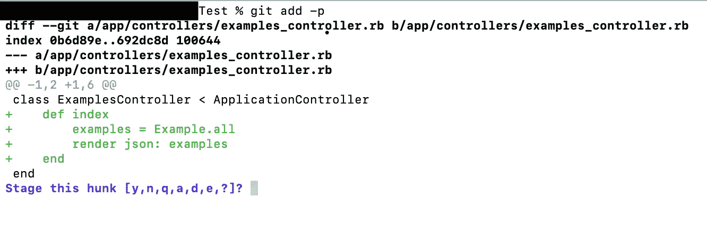
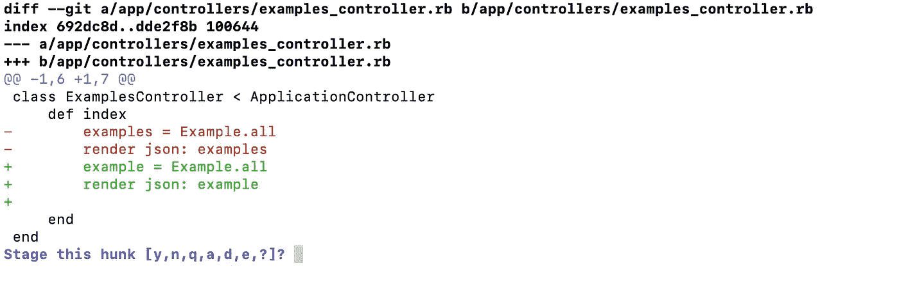
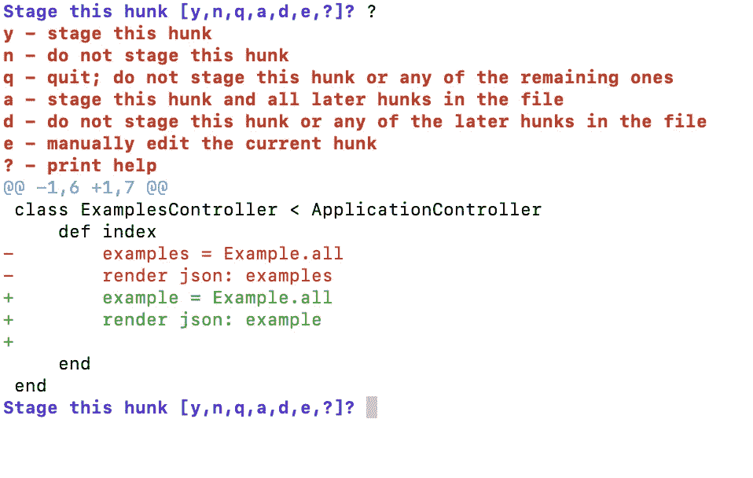
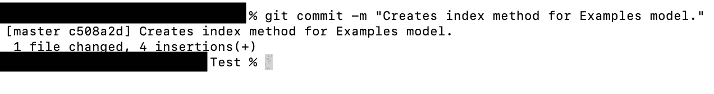

# 使用“Git 添加补丁”进行提交

> 原文：<https://levelup.gitconnected.com/staging-commits-with-git-add-patch-1eb18849aedb>

作为一名开发人员，很少有比开始一个新项目更令人兴奋的事情了。绘制一个领域模型来绘制后端逻辑，创建一个前端线框来决定它在 web 浏览器或移动设备上的布局，然后最终编写代码来实现您的愿景，这一过程可能会令人兴奋。过去，当我开始从事新项目时，很容易进入状态，忘记我学习编码时学到的最早的课程之一:

> “早承诺，常承诺；记住，你每写两行代码就应该提交一次”——一个明智的指导者

当我最终第一次真正提交时(我不好意思说在那之后还有很多提交)，它看起来通常是这样的:

```
$ git add .$ git commit -m “I added a bunch of code.”$ git push origin master
```

如果您不熟悉 Git，请允许我快速地向您介绍一下。在第一行中，我们将刚刚编辑的所有代码添加到 git 暂存区。在第二行中，我们将提交/保存分段代码到我们的本地 git 存储库。最后，在最后一行，我们将这些更改上传到在线存储库。这种提交方式在您刚刚开始并且还不熟悉 git 过程时可能是好的，但是当您开始处理更复杂的项目时，它可能会导致进一步的复杂化。

直到与一位更有经验的开发人员交谈，我才了解到一种更高级的创建 git 提交的方法，`git add -p`。在这篇文章中，我将描述为什么应该进行小规模提交，这个命令是如何工作的，以及它将如何允许您开始进行更有针对性、更有影响力和更细粒度的提交，以及养成更频繁地提交的习惯。

## **为什么小规模提交很重要？**

一个行业惯例是，开发人员应该编写小而易读的提交，但是为什么呢？这有几个原因。首先，做一个小的承诺会让你更容易跟踪你所做的改变。如果您无意中破坏了应用程序，较小的提交还允许您快速进行修复。此外，做一个小的提交可以让其他可能查看你的源代码的开发人员理解你在添加一个更新或者一个特性的时候在做什么

## **什么是*“git add-patch”***

`git add -p` 是`git add --patch`的缩写，它是一个 git 选项，允许您进行更具体的提交。它的工作原理是，它将遍历您代码中所有的新变化，并一次显示其中的大块内容，让您决定想要登台或不登台的内容。

要在进行一些更改后使用此命令，只需运行以下命令:

```
git add -p// or git add --patch
```

一旦你这样做，你会看到一个类似这样的消息:



如果我们查看粗体文本，我们可以看到自上次提交以来，我们所在的文件发生了什么变化。如果我们看绿色文本，我们会看到添加到文件中的内容。如果我们对已经存在的代码进行任何更改，它看起来会像这样:



这里，我们的旧代码用红色标记，新编辑的代码用绿色标记。我们在这里看到的最后一行是问我们想用这段代码做什么，并为我们提供了各种选项。这就引出了一个问题——每个选项意味着什么？

要获得每个选项的简单描述，只需点击“？”然后回来。此文本将在您的终端中弹出:



关于更深入的描述，请继续阅读以下内容:

```
**y - stage this hunk -** this command adds the current hunk to staging meaning it is ready.
**n - do not stage this hunk -** this command won’t add the current hunk to staging.
**q - quit; do not stage this hunk or any of the remaining ones -** this command quits out of the staging process.  Any hunks before this one that has been added to staging will still be staged but the current hunk and all hunks after will be ignored.
**a - stage this hunk and all later hunks in the file** - this command works similar to the `git add .` call. It will stage all changes made from this hunk on.
**d - do not stage this hunk or any of the later hunks in the file -** this command will not stage this hunk or any hunks in the same file.
**e - manually edit the current hunk-** this command opens vim and allow you to edit the hunk of code in your terminal.
**? - print help -** this opens up the menu above.*//One option not printed here is:* **s - split this hunk** - this option is only available if the current hunk of code has an unchanged line of code between edits.  This will split the hunk into two separate hunks allowing you to stage them individually.
```

我发现最有用的命令是' y '，' n '，' s '和'？'。但是，我在不同的时间都用过。对于每一个代码块，您可以选择是否暂存，它将循环到下一个代码块，直到循环完您所做的所有编辑，或者选择退出该过程。

完成转移过程后，您可以创建更直接的提交:



## **为什么要用它**

我推荐几个理由，说明为什么您应该现在就开始使用这种分段技术进行提交！首先:如果您在编程时碰巧进入了这个区域，并且忘记了提交，这是一个很好的实践，它将允许您解析您的代码，隔离任何编辑，并决定在任何给定的提交中哪些应该提交，哪些不应该提交。第二:这个过程也允许你在提交之前再做一次编辑。第三:从更个人的角度来说，我发现自从使用这个提交选项后，我开始养成了小规模提交的习惯。

## **结论**

是一项伟大的 git 技术，它将允许您进行更小更具体的提交，并且是对任何人的 git 工作流程的一个伟大补充。感谢阅读！