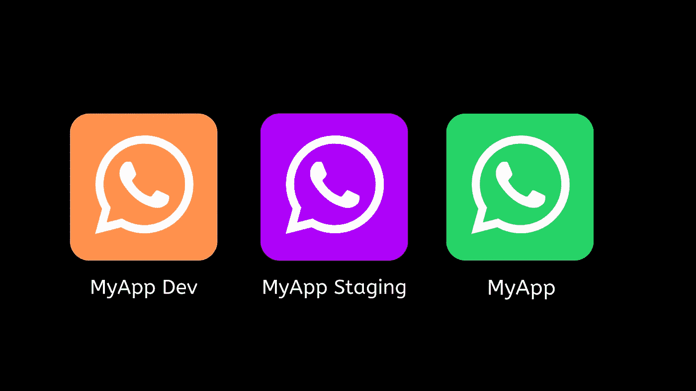

# 0.60.x (Android)中 React Native 的暂存环境设置

> 原文：<https://levelup.gitconnected.com/staging-environment-setup-for-react-native-in-0-60-x-android-8748d7f36e6b>



在我们的 android 应用程序最初发布后，我们想要一个使用不同应用程序配置和秘密的登台环境。手动更改和替换文件既耗时又烦人。所以在这篇文章中，我将讲述我们如何为我们的 android 应用程序设置升级版本。

**步骤 1:** 在`**android/app/build.gradle**`中添加暂存构建变体

```
buildTypes{      
   //... add below lines inside buildTypes
    **releasestaging** {
            initWith release    
            applicationIdSuffix ".**releasestaging**" 
            matchingFallbacks =  ['release']
        }
  // ...
}
```

让我们快速地看一下这个片段中的内容。属性允许您从其他构建类型中复制配置。`**applicationIdSuffix**`属性允许给默认的`applicationId`添加一个后缀，这是区分从发布和登台变量生成的包名所必需的。`**matchingFallbacks**`用于指定给定构建类型的替代匹配。`matchingFallbacks`只有在你有任何原生包如 react-native-firebase，react-native-device-info 等时才需要。

**注意:**在命名构建变体时，确保它以`**release**` 开头，否则您必须编辑[node _ modules/react-native/react . gradle](https://github.com/facebook/react-native/blob/0.60-stable/react.gradle)。你可以参考[这个链接](https://github.com/facebook/react-native/issues/25601#issuecomment-510856047)关于如何支持一个没有发布前缀的名字。

**第二步:**在`**android/app/build.gradle**`中配置**赫尔墨斯路径**

```
if (enableHermes) {
  def hermesPath = "../../node_modules/hermesvm/android/";
  debugImplementation files(hermesPath +"hermes-debug.aar")
  releaseImplementation files(hermesPath +"hermes-release.aar")
**//** add this line to configure hermes for staging
**releasestagingImplementation files(hermesPath +"hermes-release.aar")**} else {
      implementation jscFlavor
 }
```

**步骤 3:(可选)如果你正在使用 react-native-firebase**

为了让每个构建类型有不同的`google-firebase.json`文件，我们必须像这样组织项目结构:

```
android/
    app/
       google-services.json
       src/debug/google-services.json
       src/releasestaging/google-services.json
       src/development/google-services.json
```

同样将`android/app/src/releasestaging/google-services.json`中的包名改为`com.yourappname.releasestaging`(与`/android/app/build.gradle`中给出的构建类型的 applicationSuffixId 相同)

**步骤 4:更改应用程序名称和图标以区分构建类型**

现在让我们将名称和图标更改为 YourApp Staging
要更改**应用程序图标**，我们必须将 **ic_launcher.png** 放入 Staging 文件夹，如下所示

```
**android/app/src/releasestaging**
├── google-services.json
└── res
    ├── mipmap-hdpi
    │   ├── ic_launcher.png
    │   └── ic_launcher_round.png
    ├── mipmap-mdpi
    │   ├── ic_launcher.png
    │   └── ic_launcher_round.png
    ├── mipmap-xhdpi
    │   ├── ic_launcher.png
    │   └── ic_launcher_round.png
    ├── mipmap-xxhdpi
    │   ├── ic_launcher.png
    │   └── ic_launcher_round.png
    ├── mipmap-xxxhdpi
    │   ├── ic_launcher.png
    │   └── ic_launcher_round.png
    └── values
        └── strings.xml
```

更改`**releasestaging/res/values/strings.xml**`中的**应用名称**

现在，您可以使用`**react-native run-android --variant=releasestaging**`生成临时构建