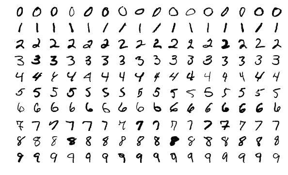

# 标准偏差 MNIST

> 原文：<https://levelup.gitconnected.com/standard-deviation-mnist-6fc6b5e0830e>



[https://commons.wikimedia.org/wiki/File:MnistExamples.png](https://commons.wikimedia.org/wiki/File:MnistExamples.png)

# 量子启发的算法

在使用密集角度编码的[量子 MNIST](https://towardsdatascience.com/quantum-mnist-f2c765bdd478) 和使用[振幅编码的](/amplitude-encoding-dd89dc84170d) [784 维量子 MNIST](https://towardsdatascience.com/784-dimensional-quantum-mnist-f0adcf1a938c) 之后，我使用经典解释的[量子算法](/comparing-quantum-states-c6445e1e46fd)对[量子启发的 MNIST](https://bsiegelwax.medium.com/quantum-inspired-mnist-6e33466d991b) 进行了实验，该算法可用于量子机器学习(QML)任务，如[量子分类](https://medium.com/swlh/quantum-classification-cecbc7831be)和[量子聚类](/quantum-clustering-c498b089b88e)。只使用加法和减法，该方法达到了 72%的准确率，这比猜测好得多，比一些卷积神经网络(CNN)学生的尝试好，但明显比 Kaggle 提交的结果差。

这是我第一次尝试提高量子启发的 MNIST 的准确性，同时希望保留量子启发的 MNIST 的相对简单性。

## MNIST 数据集

这就引出了一个问题，“MNIST 是什么？”对于那些不熟悉它的人来说，MNIST 是一个流行的手写数字数据集，数字 0 到 9。它之所以受欢迎，是因为它经过了彻底的测试，并且非常干净，这使得学生可以专注于构建和训练他们的图像分类模型，而不是他们的数据。

MNIST 数据集中的每个数字由大约 6000 幅图像表示。每个图像包含排列在 28×28 网格中的 784 个像素。每个像素都有一个从 0 到 254 的值，代表其强度。我曾经取了每一个数字，并计算了它的 784 个像素的平均亮度值，结果是平均 0，平均 1，等等。

在我最初的量子 MNIST 实验中，我将 784 个像素压缩成 16 个值，只映射到 8 个量子位，我担心所有 10 个数字会模糊在一起。我对 784 维的量子 MNIST 也有类似的担忧，但由于振幅值很小，只有 1024，它们的平方必须等于 1。但是，有了量子激发的 MNIST，除了计算手段之外，不需要经典的预处理。测试数字的值保持不变。而且，很快。因此，如果我要用平均值以外的任何东西来表示训练数字，现在似乎是一个尝试的好时机。

## 标准偏差

自从我最初的量子 MNIST 实验以来，我一直在考虑的两个选项是标准差和宁滨。宁滨非常广泛，有多种方法，所以我用标准差作为一种简单、温和的数字表示法。

该算法总体上只增加了两个主要步骤:计算每个数字每个像素的标准偏差，然后增加每个像素的两次比较。对于量子启发的 MNIST，我将每个测试像素值与每个训练数字对应的平均像素值进行了比较。对于这个实验，我还将每个测试像素值与相应的平均像素值减去标准偏差，以及相应的平均像素值加上标准偏差进行了比较。因此，将每个测试数字与更广泛的零表示、更广泛的一表示等进行比较。

```
.
.
.Target: 9
Actual: 9

Correct: 50%
```

## 结果

仅使用平均值，并使用前 100 个测试数字，量子 MNIST 的准确率为 72%。保持一切完全相同，只增加这些标准差比较，准确率下降到 50%。正如我在最初的量子 MNIST 实验中所担心的那样，这些数字似乎变得模糊了。然而，值得注意的是，猜测的准确率只有 10%，一些传统的 MNIST 方法表现更差。因此，这仍然不是解决 MNIST 问题的最糟糕的方法，但它正朝着错误的方向前进。

## 反馈请求

我为什么要写落后的进步？因为我在分享数据和代码，实际上，数据在代码中，在 [GitHub](https://cb.run/L9vp) 上。也许有人能发现 ID10T 错误。或者，也许有人可以建议一种不同的方法。无论哪种方式，量子启发的 MNIST 消除了模型、权重、激活函数、优化器…你通常用来分类图像的一切。归根结底，这仍然是基于简单的加法和减法。基本算术能打败猜测；它能和经典机器学习抗衡吗？我希望得到反馈。

## 下一步

正如我在量子启发的 MNIST 文章中所写的，传统的 MNIST 不做像素与像素的比较。卷积神经网络(CNN)使用像素组和多层比较。也有 Kaggle 提交达到超过 99%的准确率。因此，在等待关于标准偏差的使用和/或误用的反馈时，我可以努力使量子启发的 MNIST 更像 CNN，也许更像 Kaggle，同时仍然保持它相对简单。