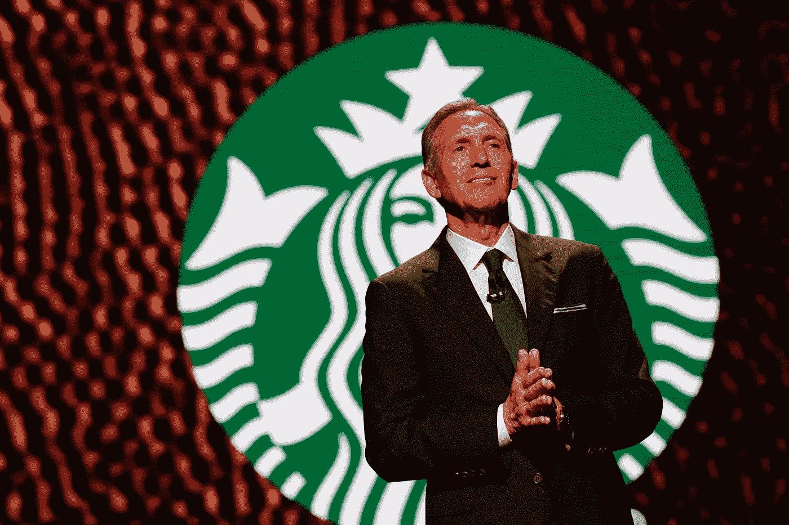
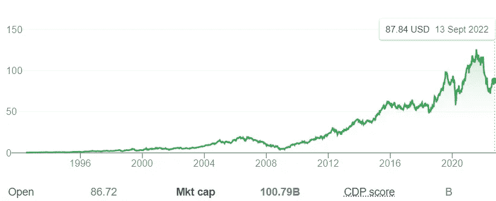
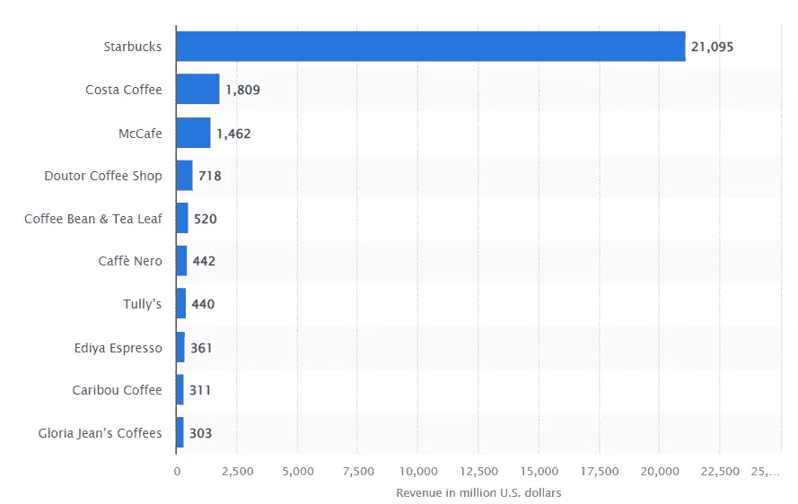

# 星巴克的 NFT 项目粉碎了他们的竞争。

> 原文：<https://levelup.gitconnected.com/starbucks-just-murdered-coffee-shops-11e42ab039d7>

就像亚马逊杀死书店一样。你只是还看不出来。

杰森·雷德蒙|法新社|盖蒂图片社

霍华德·舒尔茨是将咖啡全球化的人。在星巴克出现之前，人们喝的咖啡是淡的。

据说 70 年代的咖啡很糟糕。

到 80 年代初，星巴克已经有三家店出售磨碎的印尼咖啡，供你带回家自制。

那一定是场精彩的演出。

舒尔茨在 29 岁加入公司一年后去了一趟意大利，继续他的研发工作。

他立即注意到咖啡店周围的剧院和社区的感觉，这使他意识到星巴克不是咖啡业务的正确部分。

真正的生意和机会是将咖啡和目的地结合起来，在商店里创造一种社区感。

多好的主意啊。

他跑回家和星巴克的创始人谈论他的经历。

他们拒绝了。

并且持续拒绝了将近两年。

因此，正如任何优秀的企业家一样，舒尔茨离开了公司，开始经营他的意大利咖啡店连锁店。

不出所料，星巴克发现自己陷入了财务困境，创始人带着舒尔茨收购公司的提议回来了。

舒尔茨在 1987 年以 380 万美元收购了星巴克，其中包括六家门店和分期付款的选择权。

据[谷歌财经](https://www.google.com/search?q=how+much+is+starbuckk+worth+today&oq=how+much+is+starbuckk+worth+today&aqs=chrome..69i57j0i13j0i22i30j0i390l3.9276j1j7&sourceid=chrome&ie=UTF-8)报道，星巴克现在价值**1007.9 亿美元**

以 **26，500** 的系数补偿舒尔茨的原始投资

# 由舒尔茨及其早期愿景领导的星巴克正在发布自己的 NFT 平台。

星巴克奥德赛将于今年晚些时候推出。新的数字体验将已经非常成功的忠诚度奖励计划与 NFT 平台相结合。

该平台是建立在侧链多边形，不需要您使用加密钱包。它将允许客户赚取和购买数字资产，从而获得专属体验和奖励。

他们完全消除了摩擦，创造了比去咖啡店更身临其境、更便捷的体验。

绝对是天才。

它让 NFTs 成为了他们数字社区的访问券，但是他们故意避免强调这项技术。

他们把消费者体验放在第一位，让更多非技术人员加入他们的 Web3 平台。他们甚至摒弃了科技术语，不再提及 NFT 这个词；相反，他们的收藏品被称为“旅行邮票”。

也没有提到汽油费，提供捆绑价格。

引用星巴克现任 CMO·布雷迪·布鲁尔的话说；

> “它恰好建立在区块链和 web3 技术的基础上，但老实说，客户可能甚至不知道他们正在做的是与区块链技术的互动。它只是使能者，”

奖励会员将使用其现有的忠诚度计划凭证登录网络应用程序，参与星巴克奥德赛体验。他们绝对不会知道区块链事务层的情况。

[在此加入等候名单](https://waitlist.starbucks.com/#/landing)

# 星巴克刚刚对其竞争对手进行了黑仔式的打击。

就收入而言，它是世界上最重要的咖啡连锁店，其收入是最接近的竞争对手 Costa Coffee 的十倍以上。

这个咖啡巨头没有表现出放缓的迹象。

【Statista.com】T4

星巴克已经遥遥领先于任何最接近的竞争对手。原因显而易见。

他们不怕创新，并拥有一个具有前瞻性思维和适应性的领导团队。

挑战叙事的霍华德舒尔茨 DNA 贯穿星巴克，尤其是当其他人拒绝他们的想法时。

我要去喝杯卡布奇诺。

在 [Medium](https://t.co/0WsCUfngD2) 、 [LinkedIn](https://www.linkedin.com/in/jayden-levitt-aa93511b9/) 或 [Twitter](https://twitter.com/JaydenLevitt) 上关注我。

*本文仅供参考；不应将其视为财务、税务或法律建议。在做出任何重大财务决定之前，请咨询财务专家。*