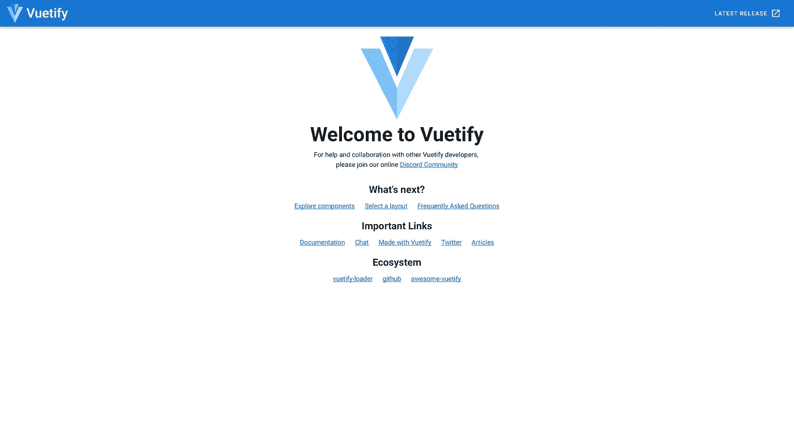
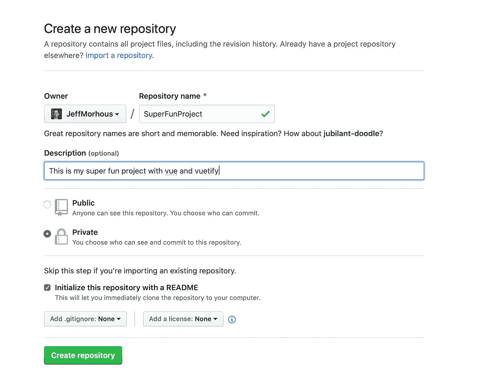
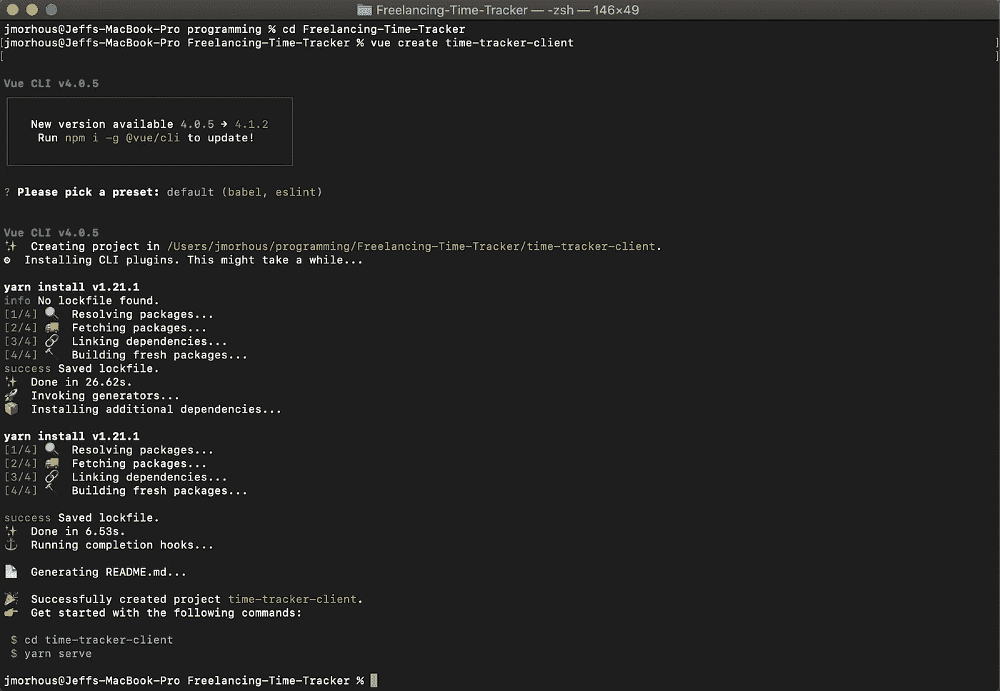

# 用 Vue.js 启动一个新的应用程序并 Vue 化

> 原文：<https://levelup.gitconnected.com/start-a-new-application-with-vue-js-and-vuetify-dad9778bd5e3>

## 如何毫不费力地组装一个遵循材料设计的前端 web 应用程序。



标准验证模板

[**Vue.js**](https://vuejs.org/v2/guide/) 是一个由充满活力和激情的社区创建和维护的开源 JavaScript 框架。尽管对网络应用程序世界来说，Vue 相对来说是*的新生事物，但它正迅速超越更受欢迎的替代产品 React 和 Angular。*

虽然非常有用，但 Vue.js 本身并不一定漂亮。当然，我们可以构建我们需要的所有组件，定制 CSS 以适应我们的设计模式，但是有一种更简单的方法。 [**Vuetify**](https://vuetifyjs.com/en/) 是一个遵循材料设计概念的组件框架。简而言之，它是一个巨大的 UI 库，与 Vue 配合得非常好。像表单、按钮、应用程序栏甚至微调器这样的东西几乎可以立即使用，将我们的前端工作加速到令人难以置信的速度。除此之外，它几乎确保了我们遵循一致的设计模式，这提高了我们的用户体验！

现在，让我们言归正传。

## 步骤 0(可选):版本控制💪

当您开始项目时，开始版本控制总是一个好主意。前往 github.com，创建一个新的存储库，您可以随意命名。单击“使用自述文件初始化此存储库”按钮，然后点击“创建存储库”



在 Github 上创建新的存储库

接下来，通过 SSH 或 HTTP 从命令行克隆您的 repo，使用

```
$ git clone <the-link-github-provides>
```

在您的终端中，进入刚刚克隆的目录

```
$ cd <my-repo-name>
```

如果你不熟悉 git 并且想熟悉它，那么[“Git-it”是一个很棒的教程](http://jlord.us/git-it/)，它可以帮你完成入门所需的几乎所有东西。

## 步骤 1:安装 Vue Cli

Vue CLI(命令行界面)是迄今为止创建 Vue.js 项目所需的脚手架的最快和最简单的方法。

这里有一些关于安装它的[文档](https://cli.vuejs.org/guide/installation.html)，但是如果您已经安装了 npm，那么在我们的终端中运行以下内容就很简单了

```
$ npm install -g @vue/cli
```

## 步骤 2:创建 Vue 项目

现在我们已经安装了命令行界面，要创建一个新项目，我们只需要在命令行中运行以下命令。

```
$ vue create my-app
```

当然，你应该将“我的应用程序”替换为你想要的应用程序名称！这里会提示您一些定制选项，但我一直很喜欢默认设置。



运行$ vue create 后我的控制台输出

启动您选择的代码编辑器。对于大多数事情，[我使用 VS 代码](https://code.visualstudio.com)。它很轻量级，可定制性令人难以置信，更不用说是免费的，非常适合 Vue.js 开发。

您现在已经创建了一个功能性的 Vue.js 应用程序！这是一个承诺的好地方😃

## 步骤 3:添加虚拟化🔮

将你的工作目录移动到刚刚创建的应用程序中(当然，用你给 *vue create* 命令起的名字替换我的应用程序)

```
$ cd my-app
```

然后，我们只需运行以下命令，就可以设置我们的应用程序来使用 Vuetify

```
$ vue add vuetify
```

要查看新的漂亮的 web 应用程序，运行启动脚本(yarn serve 或 npm run dev)并在浏览器中查看它！

正如命令行工具推荐的那样，这是提交更改的好地方

## 步骤 4 及以后:添加组件和定制

现在您已经将 Vuetify 连接到 Vue 上，添加复杂而吸引人的组件就像添加一个命令行程序一样简单。浏览文档，看看哪些组件可能对您有用。看看下面的资源，看看你能做些什么。实际上让组件做事情更像是 Vue.js 的技能，所以他们的文档和各种教程会对你有帮助。

## 🧐资源

[vue . js 网站和文档](https://vuejs.org/v2/guide/)

[验证网站和文档](https://vuetifyjs.com/en/)

[Git-it 教程](http://jlord.us/git-it/)

此外，如果您有任何问题/疑问，请随时回复或发微博给我！

喜欢这篇文章？请鼓掌并在此[或在 twitter 上关注我！](http://twitter.com/jeffmorhous)您可以关注我的更多旅程，并在[我的网站上查看我的项目。](http://jeffmorhous.com)