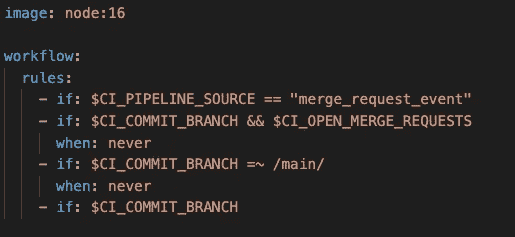
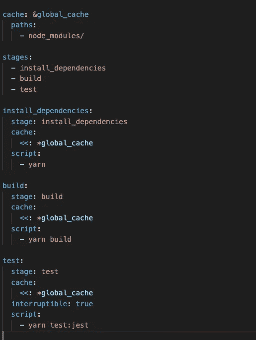
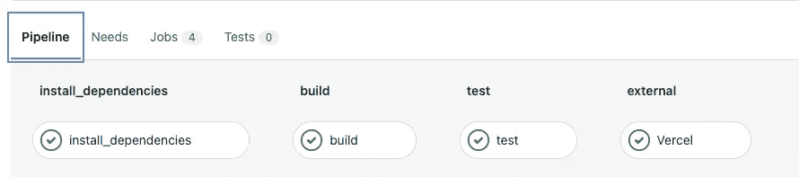
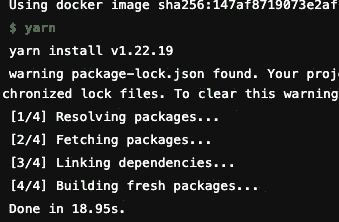
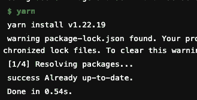

# 在 5 分钟内开始构建您的第一个 GitLab CI 管道

> 原文：<https://levelup.gitconnected.com/start-building-your-first-gitlab-ci-pipeline-in-under-5-minutes-793fe161c071>

CI 或持续集成是一种软件开发实践，其中运行自动化测试和构建。

开发人员每天都会推送代码变更，一天多次。对于每次向存储库的推送，您可以创建一组脚本来自动构建和测试您的应用程序。这些脚本有助于减少您在应用程序中引入错误的机会。

今天，我将撰写一篇关于如何为前端应用程序编写 GitLab CI 的简明教程，其中包含 3 个基本步骤:

*   安装依赖项
*   构建包
*   运行单元测试

首先，让我们创建`.gitlab-ci.yml`文件，并为配置项和工作流输入一个图像

`image`关键字是 Docker 执行器用来运行 CI/CD 作业的 Docker 映像的名称。在本教程中，我将`image`设置为`node:16`，这意味着项目将在节点版本 16 上运行。

而`workflow`是控制何时创建管道。我设置了规则，所以只有当用户提交或创建合并请求时才创建管道(但不是在`main`分支上)

这是`.gitlab-ci.yml`文件的其余部分。后面我会解释`cache`部分。首先，我们必须为我们的管道定义 3 个直接的阶段。

对于每个阶段，我们必须定义`stage`和`script`。如果你熟悉`yarn`，这些非常容易理解:

*   `yarn`是安装需要的依赖项
*   `yarn build`是构建到项目
*   `yarn test:jest`我的脚本要用我的标志运行`jest`吗

`interruptible`允许用户中断阶段。好了，我们现在完成了，让我们看看管道是否运行正常

不用 Vercel 就不要烦`Vercel`这个工作了。

现在为了理解上面的`cache`部分是如何工作的，让我们看看`install_dependencies`作业

差不多要 19 秒才能完成。但这只是第一次，通过为`node_modules`定义`cache`

这是为后来的管道后的结果:

不到一秒钟，很了不起吧？如果您添加了新的依赖项，请不要担心，`install-dependencies`任务会解决这个问题。

这只是一个关于如何编写 GitLab CI 的基本教程，您可以添加更多的作业、更多的规则或其他图像，只需找到编写 CI 管道的最佳方式，您可以使用[文档](https://docs.gitlab.com/ee/ci/yaml/)进行深入挖掘

# 遗言

虽然我的内容对每个人都是免费的，但是如果你觉得这篇文章有帮助，[你可以在这里给我买杯咖啡](https://www.buymeacoffee.com/kylele19)