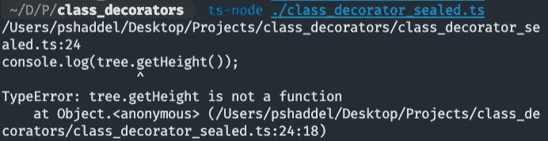

# 开始实现你自己的类型脚本类装饰器

> 原文：<https://levelup.gitconnected.com/start-implementing-your-own-typescript-class-decorators-84a49f560dea>


类装饰者

## 什么是室内设计师？

它是一种结构设计模式，通过将这些对象放在包含行为的特殊包装器对象中([引用](https://refactoring.guru/design-patterns/decorator))，可以将新的行为附加到这些对象上。

**Typescript 类装饰器定义:** *类装饰器应用于类的构造函数，可用于观察、修改或替换类定义。(* [*参考*](https://www.typescriptlang.org/docs/handbook/decorators.html#class-decorators) *)*

## 幕后是怎么回事？

你的类装饰器实际上是一个简单的函数**在运行时作为函数**被调用**，它得到*一个参数*，那就是**类**的构造函数。如果*类装饰器*返回一些东西，它将被用作类的构造器。这些事情听起来可能令人困惑，但在看了一些代码之后，就会一目了然了。**

# 设置

为了运行 Typescript 代码，我们需要使用 Typescript 编译器来编译它们。

我们需要一个`tsconfig.json`文件:

tsconfig.json

我们必须启用`experimentalDecorators`。还有，目标不能少于`ES5`。

如果您不想使用`tsconfig`文件，您可以直接传递这些选项:

```
tsc --experimentalDecorators // If you installed tsc globaly
npx tsc --experimentalDecorators // If you installed tsc in your current directory
```

现在，通过在当前目录下运行`tsc`，类型脚本文件将被编译成 Javascript 文件，我们可以使用 Node 运行它们。([参考](/start-writing-your-own-typescript-method-decorators-c921cdc3d1c1))

# 定义一个类装饰器

我们想要创建的第一个类装饰器只是在控制台上记录一条消息，告诉我们它正在运行。

简单的类装饰器

现在，如果我编译并运行这段代码，我会在控制台上看到:


运行代码的结果

这里的类装饰器是一个函数，它将类的*构造函数*作为它的参数，并在控制台上简单地记录一些东西。我们可以看到**在**运行类的构造函数之前，它运行*类装饰器*。

让我们看一个例子，我们可以在装饰器中传递我们的构造函数:

尝试在类装饰器中覆盖类的构造函数

为了从*类装饰器*对类的构造函数做一些改变，我们必须返回一个类，这个类是**对**基类的扩展。

Typescript 编译器强迫我们这样做(返回一个扩展基类的类)。

**为什么编译器强迫我们这样做？因为否则我们返回的类型与基类不兼容。**

如果发生了什么还不清楚，你应该记得类实际上是函数(你可以在这里找到很多有用的注释)。

类别与功能

现在我们知道了这一点，把类装饰器看作一个高阶函数。这在某种程度上类似于[方法装饰器](/start-writing-your-own-typescript-method-decorators-c921cdc3d1c1)的实现。

如果我们想在所有的类上使用一个类装饰器呢？通过使用 Typescript 泛型，这是可能的。看一下这个例子:

具有泛型类的类装饰器

我们可以在所有的类上使用这个类装饰器。

```
<T extends { new (...args: any[]): {} }>
```

这是泛型的定义，如果你想知道为什么它扩展了`{ new (...args: any[]): {}`，你应该知道我们期望一个构造函数，这就是我们如何告诉编译器检查它。

这里的`T`是泛型类，我们可以通过在第 4 行扩展它来返回新的构造函数。

在第 5 行和第 6 行，我们向类添加了两个时间戳成员。现在这个装饰器包装的每个类都有两个时间戳`created_at`和`updated_at`。

让我们在控制台上看看结果:


时间戳装饰器

正如我们看到的，类有两个额外的成员`updated_at`和`created_at`

**我们能访问这两个额外的属性吗？**


调用装饰者添加的附加属性

> `*The Decorator does not change the Typescript Type*`

访问该属性的唯一方法是告诉编译器忽略该行。如果以时间戳为例，我们通常希望将它们传递给 ORM 或 ODM，以便在数据库中保存记录或文档，因此即使我们不直接调用它们，也不会有任何问题。这些属性将在对象中传递。

官方 TS 文档中提到的另一个真正有用的装饰器是**密封装饰器**。

# 密封装饰器

当我们密封一个类时，我们希望防止更多的功能和属性被添加或删除。让我们看看实际情况:

密封装饰器

我们密封了构造器和它的原型。如果我们试图这样改变构造函数(我们必须忽略编译器才能做到这一点):

改变原型

这将导致一个类型错误:



更改类原型的结果

如果我们不使用`@sealed`装饰器，结果将会是这样:


调用没有密封装饰器的`**getHeight**`

# 结论

类装饰器只是一个在运行时运行的函数，它可以改变类的行为。使用类装饰器和包装其他类在某些情况下可能有点棘手，如果你想给它们添加一些功能的话，因为装饰器不会改变 typescript 类型。

decorator 在 [Angular](https://angular.io) 和 [NestJS](https://docs.nestjs.com/) 中被广泛使用，因为这两个框架都使用 OOP 范例，你可以看看它们的文档和 decorator 的实现。