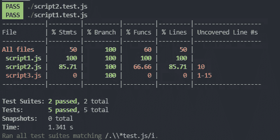
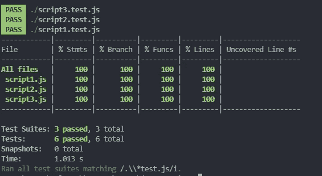

# 用 Jest 开始测试您的 JavaScript 代码

> 原文：<https://levelup.gitconnected.com/start-testing-your-javascript-code-with-jest-81e04f546a3e>


布莱克·康纳利在 [Unsplash](https://unsplash.com/s/photos/javascript?utm_source=unsplash&utm_medium=referral&utm_content=creditCopyText) 上的照片

# 为什么我们要为我们的代码编写测试？

当不止一个开发人员积极地对代码库进行修改时，问题和错误就会出现。也很难诊断出是谁提交了错误代码，或者错误的根本原因是什么。因此，在将这些内容引入代码库之前，最好采取预防措施。这可以通过编写测试来完成，可以由单个开发人员在他们的机器上进行本地测试，或者也可以在 CI/CD 管道中建立自动测试套件，当代码提交发生时就会触发这些测试套件。编写测试的另一个好处是，当我们为应用程序开发功能时，我们倾向于编写更好、更纯粹的功能，因为我们意识到最终必须为它们编写测试。

## ***不同类型的测试***

有不同类型的测试，这些是最常见的:

**单元测试**
单元测试用于测试源代码的最小单元(比如函数或者方法)。这是最容易实现的，也是各种类型中最常见的测试。

**集成测试**
这是为了测试代码库中不同组件或单元之间的交叉通信，例如涉及应用架构不同部分的认证功能。集成测试是在完成单个单元测试的前提下建立的。

**端到端测试** 端到端测试，顾名思义就是从头到尾测试软件的工作流程。当应用程序变得更大时，这真的很复杂，因此许多公司仍然进行手动测试。这个过程可以从启动浏览器开始，在地址栏中输入 web 应用程序的 URL，这是 UI 驱动的。然而，也有像 Selenium、Cypress 和量角器这样的工具来帮助自动化这种端到端的测试，尽管设置起来可能需要相当长的时间。

有相当多的测试库，为不同的目的和不同的编程语言服务。在本文中，我们将重点测试我们的 JavaScript 代码。更确切地说， **Jest** 是这篇文章的主角。

# 杰斯特:什么，为什么？

Jest 是一个流行的(尤其是对于 React 库)JavaScript 测试库。它提供了各种各样的方法和功能，涵盖了测试过程中的许多部分，包括断言、模拟和间谍、代码覆盖等。当你使用 create-react-app 框架时，Jest 已经内置了。在今天的文章中，我们将为您的 JavaScript 代码进行 Jest 的简单设置，以及如何开始本地测试我们的应用程序功能。

# 快速设置

首先，我们用 npm 初始化工作目录。

```
npm init -y
```

y 标志基本上意味着从 npm init 自动接受提示(而不是对每个提示都按 enter)。

接下来，我们从 npm 安装 Jest。我们只需要安装 Jest 作为开发依赖项，因为它只在开发阶段需要。

```
npm install jest — save-dev
```

安装后，您应该看到 Jest 包包含在 package.json 的 devDependencies 中。

现在，让我们从第一个例子开始:

**script1.js**

脚本 1 只是将两个数字相加并返回总和。

为了测试 script1.js，我们创建了另一个名为“script1.test.js”的文件(最好遵循为脚本命名测试文件的惯例)。在这个测试脚本中，我们可以添加以下 JavaScript 代码:

这是我们从 script1.js 导入 addNums 函数，并在这个脚本中执行测试。您可以从 Jest 中编写“test”或它的别名“it”(我们在脚本中使用的)来测试 addNums 函数。第一个参数是这个测试的名字，第二个参数是要测试的期望。该方法非常简单明了:期望函数将数字 4 和 5 相加，结果是 9。测试的第二行是测试通过 4 和 5 应该不会产生 10 的结果。简单。

为了运行这个测试，我们需要在 package.json 中配置“test”脚本来运行。您可以按如下方式配置它:

```
"scripts": {
    "test": "jest ./*test.js"
  }
```

这是告诉节点运行测试，并捕捉文件名的正则表达式。完成更改后，运行:

```
npm test
```

您应该会收到如下输出:

```
PASS  ./script1.test.js

Test Suites: 1 passed, 1 total
Tests:       1 passed, 1 total
Snapshots:   0 total
Time:        1.125 s
Ran all test suites matching /.\\*test.js/i.
```

这意味着您现在有一个测试套件(script1.test.js)和一个测试(一个“它”就是一个测试)。

如果不希望每次都键入*npm test*来运行测试，可以在 package.json 中配置测试脚本，如下所示:

```
"scripts": {
    "test": "jest --watch ./*test.js"
  }
```

每次在进行更改后保存文件时，npm 测试将会观察并自动触发以运行测试。

让我们看看第二个例子:

**剧本 2.js**

给定一个 db(一个 JS 数组)和一个搜索词，返回与该词匹配的名字(只有前 3 个匹配)。我们将 db 作为这个函数的依赖项注入的原因是，这个函数更容易重用，并且更容易用模拟数据库进行测试。
函数“functionNotTested”没有任何用途，只是向您显示测试覆盖范围。我们不打算为这个函数编写一个测试。

这个函数里要测试的东西似乎更多。首先，我们可以测试该函数是否返回带有所提供的搜索词的预期搜索结果。其次，我们希望该函数只返回搜索词的前 3 个匹配项。我们还可以检查是否将 null 或 undefined 作为参数传递给搜索项的函数，该函数可以正确地处理它并返回一个空数组。最后，我们还可以确保这个搜索函数区分大小写。我们不需要执行真正的数据库连接，因为这是一个单元测试。在测试与真实数据库的集成之前，我们应该确保这个函数能够像预期的那样与注入的数据库数组和搜索词一起工作。因此，我们可以简单地创建一个模拟 db 数组，并将其传递给函数(这就是编写可重用代码的好处)。这是我们可能构建的测试脚本:

这对你来说应该很有意义。如果函数遇到不存在的搜索项，或者接收 null 或 undefined 作为搜索项，那么函数应该返回一个空数组(JavaScript“filter”函数处理这个问题)。在最后一个测试中，我们希望搜索函数区分大小写，因此像“Lily …”和“… Li”这样的名字不应该出现在结果中。最后，函数“describe”用于将多个测试组合成一个整体。因此，当结果被打印出来时，这些测试将有一个名为“查找与数据库中的搜索词相匹配的名称的函数”的组名。“toEqual”可以用来测试 JavaScript 对象。

让我们看一下最后一个例子:

**script3.js**

我们将需要在第三个脚本中调用 API，因为我们正在使用 Node.js(并且浏览器获取 API 不可用)，您可以为 Node.js 安装同构获取:

```
npm install isomorphic-fetch
```

我们在这个例子中使用的 API 是 PokéAPI。通过将您想要查找的口袋妖怪传入 API 路径，可以方便地检索口袋妖怪信息。这个函数返回找到的口袋妖怪的名字、体重和身高。

到目前为止，我想介绍 Jest 的另一个功能:为您的代码提供测试覆盖的整体视图。

创建“script3.js”后，运行以下命令:

```
npm test — — coverage
```

您应该看到这个:



这显示了有多少百分比的测试覆盖了每个 JavaScript 文件，以及哪一行没有被覆盖。请记住，在我们的 script2.js 中有一个函数，我们没有为它编写任何测试，这就是 script2.js 没有得到 100%的原因。我们没有为 script3.js 编写任何测试用例，因此，它的测试覆盖率为 0%。

好了，我们可以开始编写 script3.js 的测试了，让我们先试试这个测试脚本:

因此，这个脚本试图调用 API，并检索要与预期值进行比较的数据。让我们尝试运行*npm 测试*:

```
> jest-testing@1.0.0 test C:\Users\Dylan Oh\source\repos\jest-testing
> jest ./*test.js

 PASS  ./script2.test.js
 PASS  ./script3.test.js
 PASS  ./script1.test.js

Test Suites: 3 passed, 3 total                                                                                                                                                                                                   
Tests:       6 passed, 6 total
Snapshots:   0 total
Time:        0.801 s, estimated 1 s
Ran all test suites matching /.\\*test.js/i.
```

耶！通过了！或者……真的是吗？

嗯，有一种方法可以知道这一点。我们可以添加一个函数来检查测试中通过了多少断言:

```
 expect.assertions(numberOfAssertionsExpected); 
```

让我们将它添加到 script3.test.js 中:

我们期望在这里完成 3 个断言，分别针对姓名、体重和身高。运行 *npm 测试*:

```
FAIL  ./script3.test.js
  ● Find the Pokemon from PokeAPI and return its name, weight and height

    expect.assertions(3);

    Expected three assertions to be called but received zero assertion calls.

      3 |
      4 | it("Find the Pokemon from PokeAPI and return its name, weight and height", () => {
    > 5 |     expect.assertions(3);
        |            ^
      6 |     fetchPokemon("bulbasaur", fetch).then(data => {
      7 |         expect(data.name).toBe("bulbasaur");
      8 |         expect(data.height).toBe(7);

      at Object.<anonymous> (script3.test.js:5:12)

 PASS  ./script2.test.js
 PASS  ./script1.test.js

Test Suites: 1 failed, 2 passed, 3 total                                                                                                                                                                                         
Tests:       1 failed, 5 passed, 6 total
Snapshots:   0 total
Time:        0.842 s, estimated 1 s
Ran all test suites matching /.\\*test.js/i.
npm ERR! Test failed.  See above for more details.
```

Opps…零断言调用。这里发生了什么？原因是，断言对异步调用一无所知，并且在检索数据之前，测试已经通过。因此，我们需要一种方法来告诉这些断言等待数据返回。

解决这个问题的一个方法是向测试方法的回调函数传递一个“done”函数，并把它放在断言之后。

并且，它通过并确保进行了三次断言调用。

```
PASS  ./script3.test.js
 PASS  ./script2.test.js
 PASS  ./script1.test.js

Test Suites: 3 passed, 3 total                                                                                                                                                                                                   
Tests:       6 passed, 6 total
Snapshots:   0 total
Time:        0.868 s, estimated 1 s
Ran all test suites matching /.\\*test.js/i.
```

更简单的方法是，我们可以只使用 ***返回*** 这个异步函数，Jest 足够聪明，可以等到结果返回。

这也将通过断言测试的预期。我个人建议使用 return 语句来返回承诺，并始终记得包括测试异步函数所需的断言调用次数，以确保断言真正被贯穿。

我们可以删除 script2.js 中不必要的函数，然后运行

```
npm test -- --coverage
```



在那里，我们有 100%的测试覆盖率。

无论是在本地测试还是在 CI/CD 管道上测试，为您的代码编写测试总是一个好的实践。这将有助于我们更早地发现潜在的错误，并迫使我们自己在某种程度上写出更好的代码。

请在 Medium、Twitter 或 Linkedin 上关注我，获取更多关于 web 开发、Web3 等主题的文章！

[](https://www.linkedin.com/in/dylan-oh-dick-loon/) [## Dylan Oh -软件工程师-信息员| LinkedIn

### 精通 ReactJs 的全栈开发。使用 NodeJs、C # ASP.NET Blazor、Typescript、NextJs 的经验

www.linkedin.com](https://www.linkedin.com/in/dylan-oh-dick-loon/)