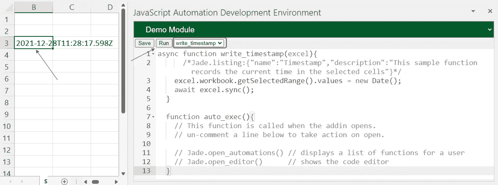

# 开始使用 JavaScript 来自动化 Excel

> 原文：<https://levelup.gitconnected.com/start-using-javascript-to-automate-excel-2cfe03ecad89>

# VBA 的问题

Visual Basic for Applications (VBA)创建于 90 年代，从那以后几乎没有改变过。除了其绝对过时的开发环境和独特的语法，VBA 作为恶意软件的高效工具，由于其访问核心操作系统进程的能力，也对公司构成了巨大的威胁。

是的，VBA 有它的优势，我个人认识一些因为高质量的 VBA 代码而赚了数百万美元的人。然而，有一种更快、更安全、更令人愉快的方式来自动化 excel:向 [JavaScript 自动化开发环境(JADE) Excel 插件问好。](https://appsource.microsoft.com/en-us/product/office/WA200003637?tab=Overview)

# 玉是什么？

JADE 使您能够使用 JavaScript 自动处理 Excel 工作簿范围内的所有事情，而无需启用宏。

因为您编写的 JavaScript 驻留在浏览器中，所以它无法访问主机上的任何操作系统功能。这意味着您所有的自动化代码都被限制在您的工作簿中，因此共享起来非常安全。

JADE 提供了一个环境，允许开发人员直接在工作簿中编写 JavaScript，它甚至可以使用 GitHub Gists 从云中提取代码模块。

# 简短的演示

让我们快速演示一下如何在 Excel 中使用 JavaScript 来自动放置时间戳。

首先，您需要将外接程序添加到 excel 工作簿中。如何操作的说明可以在[这里](https://support.microsoft.com/en-us/office/add-or-remove-add-ins-in-excel-0af570c4-5cf3-4fa9-9b88-403625a0b460)找到。

一旦插件启动并运行，选择*添加代码模块*

选择“添加代码模块”

输入模块的名称；在下面的例子中，名称是“演示”。

将模块命名为“Demo”

这将创建下面的代码编辑器。您可能想调整它的大小以更好地适应您的屏幕。

只需在 Excel 中编写、保存和运行 JavaScript 即可！

您会注意到 write_timestamp 当前显示在“函数名”下拉选择器中。单击“运行”按钮执行该功能，并将当前日期和时间写入活动单元格。

您也可以将时间戳更改为文本！

JADE 还附带了方便的错误消息，告诉您问题以及在哪里修复它。如果您忘记了右引号，您将看到以下内容:

运行您的脚本也会保存它。如果想保存而不运行，可以点击“保存”按钮。您可以安全地关闭并重新打开工作簿。您甚至可以将工作簿的副本发送给其他人，他们可以运行您编写的代码！

演示到此结束。你可以通过从微软插件应用商店获得[开始免费使用 JADE。](https://appsource.microsoft.com/en-us/product/office/WA200003637?tab=Overview)

# 更多资源

全玉教程

玉石支持页面:【https://support.jsvba.com/ 

Excel JavaScript API 概述:[https://docs . Microsoft . com/en-us/office/dev/add-ins/reference/Overview/excel-add-ins-reference-Overview](https://docs.microsoft.com/en-us/office/dev/add-ins/reference/overview/excel-add-ins-reference-overview)