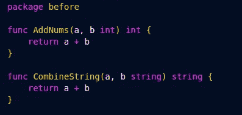
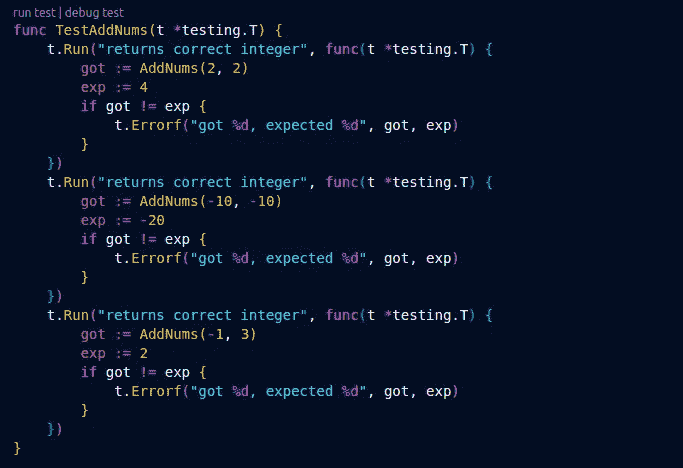
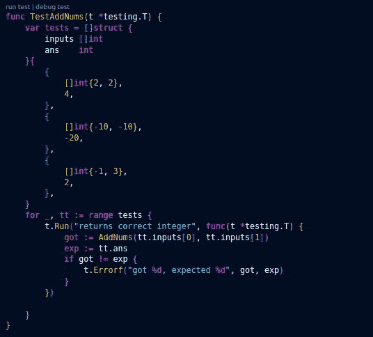
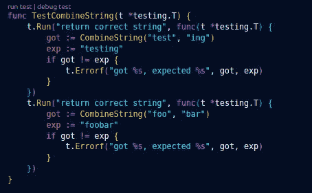
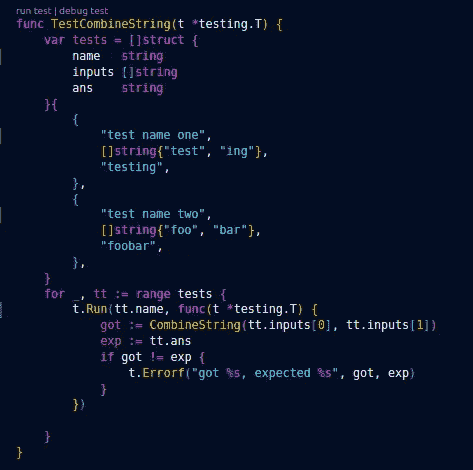

# 开始使用循环来编写测试！

> 原文：<https://levelup.gitconnected.com/start-using-loops-to-write-dry-go-tests-7bd4fe928349>

**场景。**

所以，你已经在你的 Go 程序中编写了一个新的函数，你正在测试它，或者更好的是，你已经遵循了 TDD 原则，你已经编写了你的测试和代码，现在正在寻求重构。构建它们的最佳方式是什么？

在本文中，我将介绍一种构建 go 测试的好方法，这种方法允许添加尽可能多的案例，而不需要额外的 boiler plate 代码。

首先让我们来看看两个函数。

**举个例子。**

基本 Go 功能

一个函数接受 2 个整数并将它们相加，另一个函数接受 2 个字符串。让我们看一个测试第一个函数的标准方法。

标准围棋测试

在这些测试中，我们研究一些可能的边缘情况(正整数+正整数，负整数+正整数，负整数+负整数)。如果我们看看这个，我们重复了很多锅炉板代码。现在让我们想象一下，我们想要添加更多的案例，重复代码的数量随着每个新案例的增加而增加。

最重要的干净编码原则之一是“干”——不要重复你自己，经常被忽视的是你的测试也应该遵循正确的编码原则。

那么，格式化这些测试以更好地坚持干代码的“可行”方法是什么呢？

相当简单的概念——我们将测试用例输入和预期答案存储在一个变量中，并在每个用例中循环——通常称为表驱动测试。

重构的 Go 测试

在上图中，我们声明了“tests”一个包含两个变量的结构片段:“inputs”是一个存储测试用例输入的 int 片段，以及“ans”是一个存储预期答案的 ans 片段。

然后，我们只需要循环测试变量，并对每个条目进行测试。

下面是另一个使用第二个函数合并两个字符串的例子。

重构前的 TestCombineString

在上面的最后一个例子中，我们还在“tests”结构中添加了另一个参数，这样我们就可以动态地命名每个测试用例。

**总结。**

应该在整个应用程序中遵循最佳编码原则，包括测试。上述测试模式的价值在于，它允许用很少的努力添加新的案例，并允许您保持您的测试套件干净和干燥！

此处提供代码示例—[https://github.com/MurrayCode/enhance_go_tests_with_loops](https://github.com/MurrayCode/enhance_go_tests_with_loops)