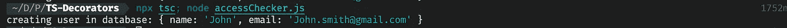

# 开始实现你自己的类型脚本方法装饰器

> 原文：<https://levelup.gitconnected.com/start-writing-your-own-typescript-method-decorators-c921cdc3d1c1>


## 什么是室内设计师？

它是一种结构设计模式，通过将这些对象放在包含这些行为的特殊包装器对象中([引用](https://refactoring.guru/design-patterns/decorator))，可以将新的行为附加到这些对象上。

当我们使用 Typescript 方法装饰器时，它们是帮助我们改变方法行为或对参数做一些事情的高阶函数。

**Typescript 方法装饰定义** : *方法装饰可以用来观察、修改或替换一个方法定义(* [*引用*](https://www.typescriptlang.org/docs/handbook/decorators.html#method-decorators) *)*

现在，让我们看看如何定义一个简单的方法装饰器。

## **设置**

为了运行 Typescript 代码，我们需要使用 Typescript 编译器来编译它们。

我们需要一个`tsconfig.json`文件:

我们必须启用`experimentalDecorators`。还有，目标不能少于`ES5`。

如果您不想使用`tsconfig`文件，您可以直接传递这些选项:

```
tsc --experimentalDecorators // If you installed tsc globaly
npx tsc --experimentalDecorators // If you installed tsc in your current directory
```

现在，通过在当前目录下运行`tsc`，类型脚本文件将被编译成 javascript 文件，我们可以使用 Node 运行它们。

## 定义一个方法装饰器

typescript 中方法装饰器的一般结构如下:

向装饰者传递参数
我们可以向装饰者传递一个变量，并且我们可以在装饰者内部访问它。我们在第 13 行传递了一个对象，它将成为第 1 行的参数。

return 函数有 3 个参数。
* ***目标*** :包含我们的目标(我们要用它做点什么的函数、类、属性)
**** key****:*在方法装饰器中，是方法的名字。
****描述符*** :这是一个属性描述符，它给了我们`descriptor.value`中的子函数(方法)，我们可以改变方法的行为。

如果你不熟悉属性描述符[，这篇文章](https://www.javascripture.com/PropertyDescriptor#:~:text=A%20PropertyDescriptor%20describes%20a%20property,treated%20as%20undefined%20or%20false%20.)将帮助你理解它，但是用简单的语言来说，它可以帮助我们定义一个对象的属性，我们有一些选项，或者我们可以对那个属性设置约束。

在第一个例子中，我们想做一些非常简单的事情，我们想在每次有人调用函数时记录它的名字。

**示例 1:函数名记录器**

函数记录器定义

我们在这个装饰器中所做的就是在第`7`行记录这个键。

***重要*** *:不能在类之外使用装饰器(装饰器在我们使用类的时候是有意义的)*

现在，如果我使用这个命令运行这个文件:`npx tsc; node loggerDecorator.js`
我可以在我的控制台中看到这个函数的名字:`Sum`。

**例 2:检查重复用户**

现在让我们写一些更真实的东西，看看我们如何使用描述符。我们想写一个装饰器来检查用户邮件是否重复。我们可以在我们的方法中实现类似这样的东西，但是如果我们想在代码中不止一次地使用它，一个 decorator 来检查这一点将会很有帮助，并且必须知道这只是一个假想的例子，向您展示它是如何工作的(*有无数种方法可以比示例更好地实现它:)不要陷入太多的困境*)。

让我们一行一行地看看这里发生了什么:

*第 1 行*:我们有一个`const` `userEmails`，它包含一个用户电子邮件的样本数组。这应该来自数据库。

*第 8 行*:如果用户没有被复制，我们想要运行子函数，所以我们需要将原始方法存储在一个变量中。

第 9 行:这就是我们改变函数的方法。我们可以在这里访问子函数的参数，因为我们可能有多个参数，我们需要像提取数组一样提取参数(通过使用`…`)。

第 11 行:我们正在检查邮件是否重复。我们希望第一个参数是用户对象，所以要访问它，我们必须使用`args[0]`，我们使用`indexOf`检查电子邮件是否存在，当元素不在数组中时，这个方法返回`-1`。如果电子邮件是重复的，我们将返回`null`,因此该方法将不会被调用。如果用户没有被复制，我们必须执行这个方法，所以我返回了`childFunction.apply(this, args)`,结果，如果用户没有被复制，这个方法将带着它的参数执行。

*第 21 行*:这是用户服务类，它有一个名为`createUser`的方法，我们使用我们的方法装饰器来检查用户是否重复。如果用户是重复的，我们应该在控制台中看不到什么，如果用户是唯一的，应该调用方法，因此，我们应该在控制台上看到日志。

*第 28 行*:我们从`UserService`类实例化，之后，我们在第 29-30 行使用了两次`createUser`方法。其中一个电子邮件以前被使用过，所以我们期望方法`createUser`对于电子邮件:`john.smith@gmail.com`的用户只被调用一次

这是我的控制台上的结果:



控制台中的代码结果

## **结论**

使用方法装饰器并不困难，如果我们使用类型脚本和面向对象编程，我们可以使用装饰器来改变方法行为。我们可以访问方法的参数和装饰器的参数，我们可以基于参数做一些事情。