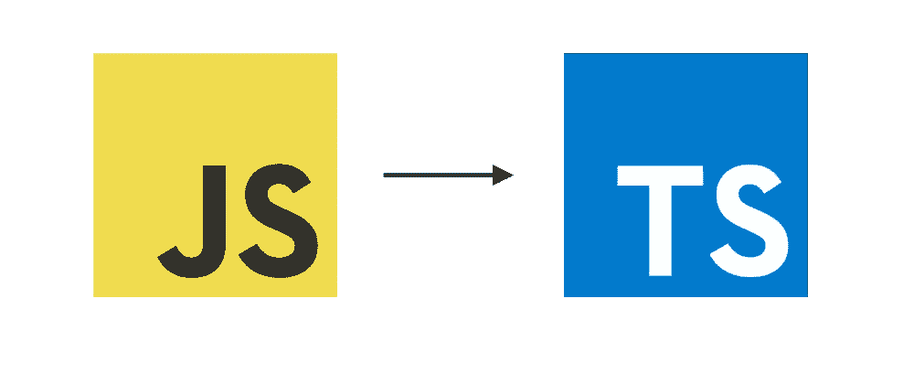
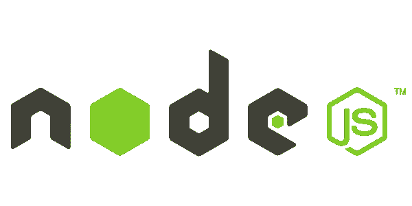
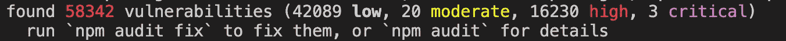

# 开始一个 React 项目？分五步提高标准。

> 原文：<https://levelup.gitconnected.com/starting-a-react-project-raise-the-bar-in-five-steps-8e847e9a05a>


到 2020 年， [React](https://reactjs.org/) 仍然是最广泛使用的前端开发 JavaScript 库和框架之一。

在这篇文章中，我想强调你可以从一开始就提高代码质量和开发人员敏捷性的五个步骤。

尽管实现细节是为 React 开发人员准备的，但这些原则适用于各种语言和框架。

## 1.使用类型脚本



TypeScript 可以定义为 JavaScript 的静态类型超集。换句话说，有效的 JavaScript 代码在 TypeScript 中是合法的([主要是](https://stackoverflow.com/questions/12710905/how-do-i-dynamically-assign-properties-to-an-object-in-typescript)), TypeScript 是 JavaScript 之上的一层，支持静态类型检查。

静态类型检查通过在编译时捕捉上游错误，在提高已发布代码的质量方面有着一致的、经过验证的跟踪记录。

然而，实际上，Intellisense(或智能代码完成的其他实现)会在编码时突出显示编译错误。例如，当我向 React 组件内的事件处理程序添加类型时，我的 Visual Studio 代码最近突出显示了以下错误:

```
...const [decimal, setDecimal] = useState<number>(0)const onChangeDecimal: ChangeEventHandler<HTMLInputElement> = e =>
  setDecimal(e.target.value)
}... Error: Argument of type 'string' is not assignable to parameter of type 'SetStateAction<number>'
```

TypeScript 还会增加开发团队的灵活性。通过提供嵌入式文档，它允许开发人员以更大的信心和减少的认知负荷来编写或重构代码。

毫不夸张地说，在 React 中使用 TypeScript 没有任何负面影响。如果你会写 JavaScript，学习曲线是适度的。大多数 JavaScript 库的类型定义[广泛可用](https://definitelytyped.org/)。设置您的项目就像运行`npx create-react-app <name> --template-typescript`一样简单。

## 2.实施节点版本



你是否曾经绕着圈子调试，却发现问题出在你的机器上有错误版本的*或*？你并不孤单。跨机器管理运行时环境配置将永远是软件工程过程的一部分。这就是为什么 Docker 是盒子里的重要工具。

通过对您的`package.json`做一点小小的调整，您可以通过强制实施 Node 版本并消除与拥有不同版本相关的不可预测性，使 React 应用程序的新贡献者的生活变得更加轻松。

在您的`package.json`中，添加一个`"[engines](https://docs.npmjs.com/cli/v6/configuring-npm/package-json#engines)"`字段:

```
{ 
 ...
 "engines": {
   "node": "<version(s)>"
  }
 ...
```

如果您正在使用`yarn`，如果使用错误的节点版本运行，任何命令都将失败。然而，如果您正在使用`npm`，您将需要添加一个`.npmrc`文件，并将`[engine-strict](https://docs.npmjs.com/cli/v6/using-npm/config#engine-strict)`设置为`true`。从项目根目录中，只需运行:

```
echo “engine-strict=true" > .npmrc
```

如果您使用了错误版本的节点，这将导致依赖项安装(`npm install`)失败。

## 3.引入自动化依赖性审计


如果您使用 NodeJS，您将熟悉来自您的包管理器的关于依赖性漏洞的警告:



生态系统发展迅速，新的漏洞被定期发现，您希望避免将任何“低”以上的产品投入生产。

你可能熟悉[dependent bot](https://dependabot.com/)——打开 pull 请求修复依赖漏洞的 GitHub 助手。尽管这可能很有帮助，但是依赖性审计也应该在您的 CI 管道中。

你可以用`[audit-ci](https://www.npmjs.com/package/audit-ci)`来实现这个。在您的 CI 服务器中，这将运行`npm audit`或`yarn audit`——它们扫描您的项目中已知的漏洞，如果在指定的阈值或以上发现任何漏洞，就会失败。

*   用`npm install --save-dev audit-ci`或`yarn add -D audit-ci`安装。
*   向您的`package.json`添加一个运行`audit-ci --moderate`的脚本。
*   将脚本添加到 CI 管道步骤中。

使用上述配置，如果发现“中等”或以上级别的漏洞，脚本将抛出错误。

*注意:npm 允许您通过运行* `*npm audit fix*` *自动修复大多数依赖漏洞。Yarn 目前没有本地的对等物。*

## 4.设置自动林挺和格式


在这个标题下，实际上有三个“问题”需要解决:

*   我如何通过静态代码分析来捕捉和防止不良模式？
*   我如何为格式化代码设置统一的标准？
*   如何防止与林挺或格式化相关的(污染)提交？

我对第一个问题的回答是没有创新——使用 [ESLint](https://eslint.org/) 。你可能想调整配置，但是 ESLint 现在是`create-react-app`包的一部分。将林挺步骤添加到您的 CI 渠道中，以进行自动化的代码质量审计。

要定义和实施格式规则，请使用[更漂亮的](https://prettier.io/)。它非常固执己见，并且提供有限的配置选项。这正是为了避免开发者对风格的争论。如果这与特定的偏好背道而驰，可以用 ESLint 定义样式规则。无论哪种方式，关键是要避免在拉请求中争论分号或双引号。

第三个问题可能被认为是迂腐的，但是我不喜欢在我的提交历史中看到类似“fix lint”的消息。为了避免这种情况，设置 [Husky](https://www.npmjs.com/package/husky) 来防止提交坏代码。通过`[lint-staged](https://www.npmjs.com/package/lint-staged)`或`[pretty-quick](https://www.npmjs.com/package/pretty-quick)`，它还可以自动 lint 暂存文件。

## 5.连接您的测试套件


不缺少阐述自动化测试的重要性或揭示特定方法的材料。在这里，我的意图仅仅是提倡尽早建立您的测试套件，以减少编写测试的认知负担。

从 Alice 的角度考虑一下，她是你的代码库的新贡献者。Alice 理解编写测试的重要性，但是截止日期是一个现实，交付特性是最重要的。

如果 Alice 有现成的、有意义的例子作为参考，她会发现编写测试更容易。拨打新端点的电话？很简单，使用 [Jest mocks](https://jestjs.io/docs/en/mock-function-api) 来代替 API 调用来检查这些测试。新的 React 组件？没问题，像这里一样用[酶](https://enzymejs.github.io/enzyme/)模拟 DOM 操作。新 Redux 动作？这个测试向您展示了如何使用[模拟商店](https://github.com/reduxjs/redux-mock-store)。

简而言之，以上测试角度需要*一些*时间来设置。与其遭受*而不是*编写测试的复合问题，不如尽早吸收设置成本，轻松编写测试，并享受复合的好处。

— — — —

*快乐编码！🚀*