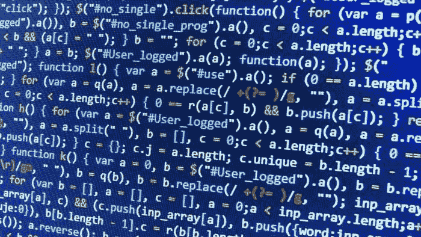
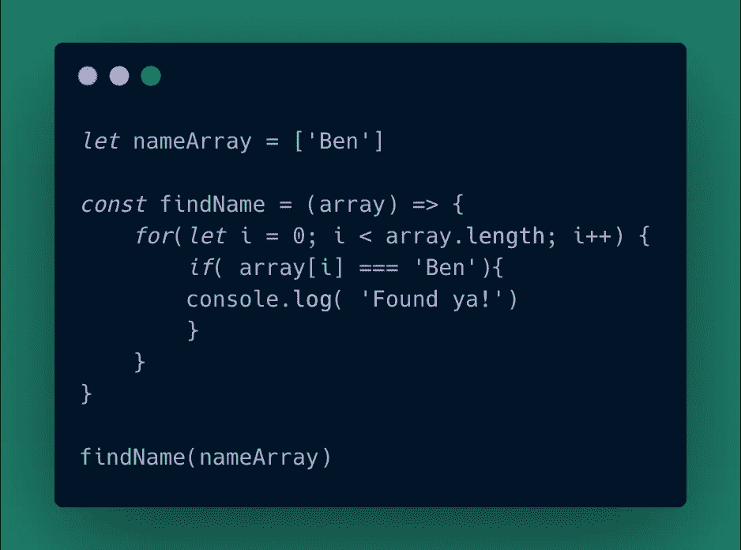
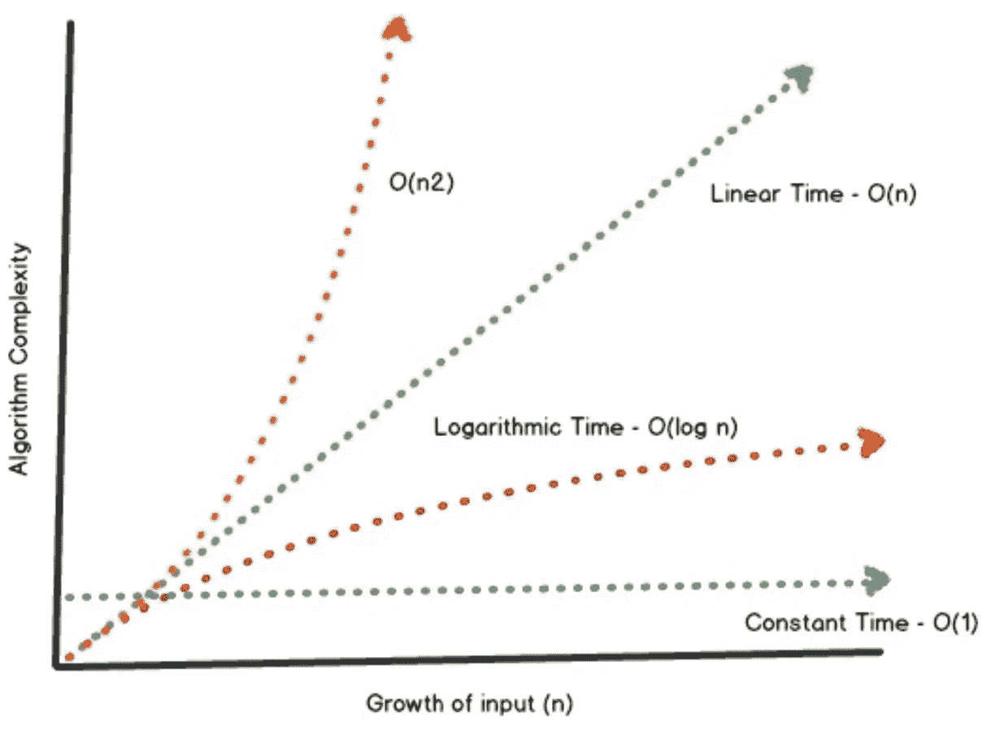
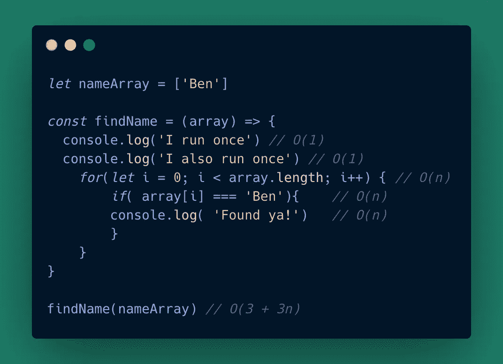
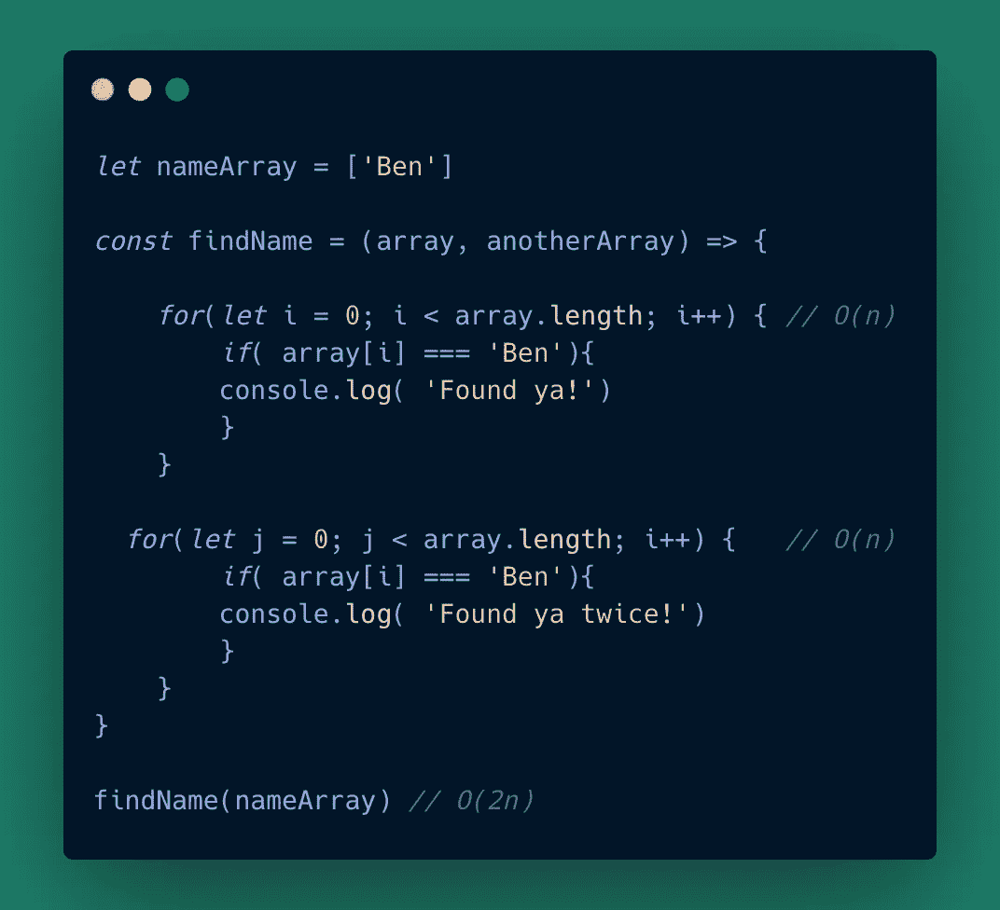
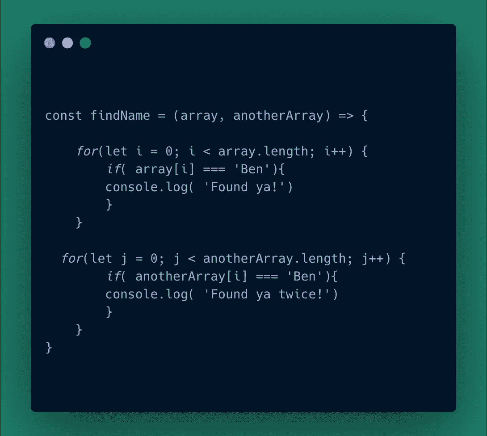
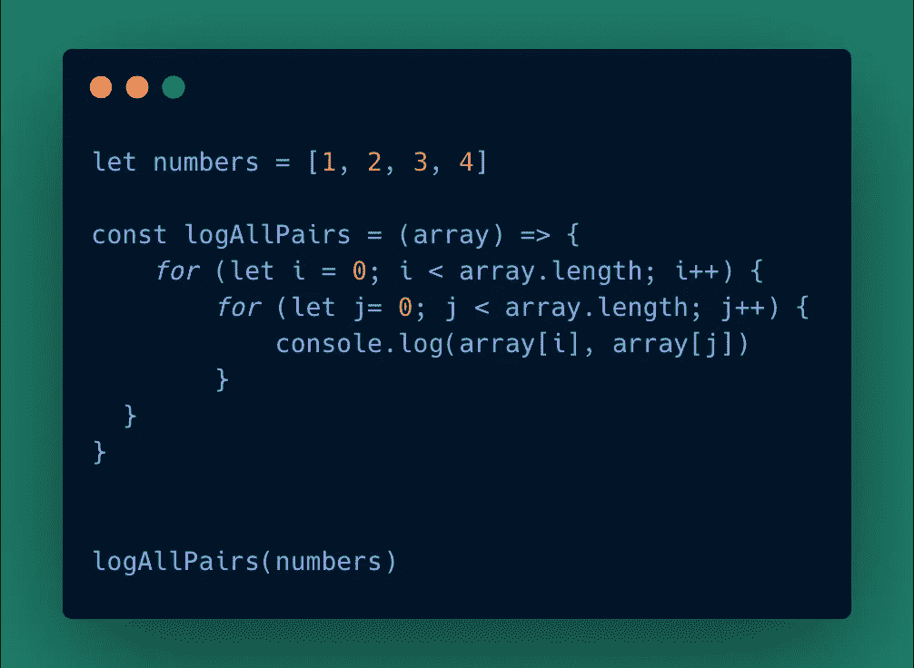
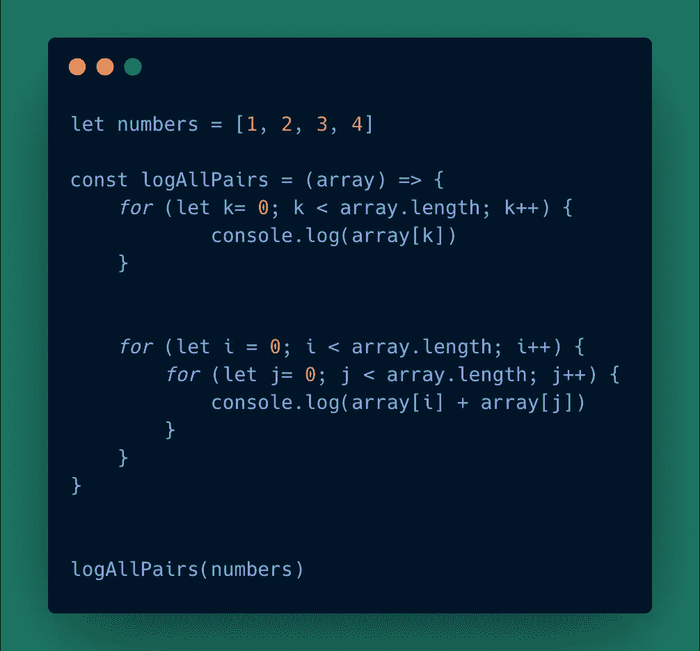

# 开始我的大 O 之旅

> 原文：<https://levelup.gitconnected.com/starting-my-big-o-journey-4425081bcb11>

所以，新的大 O 符号。这是进入 Big-O 符号之旅的起点的基本分类。

我将围绕几个函数示例来撰写这篇文章。但是首先，大 O 符号是做什么的？

它用于显示您的算法在相对于输入的最差情况下的效率。例如:

看这个函数。你会认为找到本又快又容易…你是对的！数组中只有一个名字，所以它会非常快地找到它。但是我们需要考虑相对于输入的最坏情况，所以假设这个数组包含了世界上所有的名字，其中只有一个人叫 Ben，他在最后面。那么这个函数花费的时间将会非常非常长。

Big-O 符号将会考虑你的算法运行和完成所花费的时间，以及这个过程所需要的额外空间。算法效率如何？

所以我们上面的函数的 Big-O 符号是 O(n)。但是我是怎么知道的呢？什么是(n)？

(n)代表潜在输入。因此，如果输入是 10，那么它将是 O(10)，如果我们的输入是 1000，它将是 O(1000)。我们的函数是一个线性函数，也就是说，对于输入中的每个额外元素，我们的代码都要多运行一次。下图对此进行了解释:

好吧，也许还是有点困惑。这很好。接下来，我将讨论如何计算上面的函数，最后是计算 Big-O 的任何规则。

所以回到我们的函数。我是如何到达 O(n)的？好吧，我已经包含了一些额外的控制台日志来真正强调这一点。在计算 Big-O 的时候，你需要看看一段代码在函数被调用的时候会运行多少次。让我们来看一下下面的每一行:

当调用该函数时，第一个控制台日志将只运行一次。它不存在于循环中，因此不依赖于数组的长度。第二个控制台日志也是如此。因此，您将它们计为 O(1 ),因为它们只运行一次！

然后我们遇到了循环。循环依赖于数组长度。因此，正如我们前面提到的，我们用(n)来表示这一点。所以循环中的每一行代码都是 O(n ),因为每一行代码将运行(n)或“数组长度”倍。

但是等等…您可能会问，如果 Ben 是输入中的第一个名字，会发生什么？

计算 Big-O 时，您应该始终遵循一些规则，其中一条规则是:

1.  Big-O 只关心最糟糕的情况！

下一个规则允许我得到 O(n)的大 O，而不是 O(3 + 3n)，如上所示。

2.移除常数。因此 O(3 + 3n)变成 O(n)。

举这个例子。我们有两个循环函数。它们相互独立，但是 bot 依赖于数组的长度。尽管有两个独立的循环函数，这条线仍然是线性的。如果有两个名字，每个数组将运行两次，函数本身将总共产生 4 个操作。直线更陡。

Big-O 关心的是当输入增加时，线条如何移动。

3.输入的不同术语。

这里我们又有两个 for 循环。但是一个在数组上循环，另一个在另一个数组上循环。那么什么是大 O 呢？

在这种情况下，Big-O 是 O(a + b)或(n + m)…这是因为循环在不同的项目上循环。第一个数组可以是 100 个元素，第二个数组可以是 1000 个元素。但想法是，它们仍然是独立的输入，需要这样对待！

但是等等，如果这些循环嵌套在另一个循环中会怎么样呢？？太好了！这也发生了变化。

这里我们有一个循环在另一个循环中。一个好的经验法则是——如果你看到两个嵌套循环，那么你使用乘法。或者 O(n * n)或者 O(n)。

这叫二次时间。因此，如果我们有 2 个元素，那么发生的操作数是 4。如果我们有 3，那么它就变成 9，以此类推。因此，如果我们的例子中有一个 O(a + b)的大 O，那么这个大 O 就会变成 O(a * b)。这并不理想。

4.丢弃非主导。

让我们举这个例子。在这个函数中，我们有一个独立的循环和一个嵌套在另一个循环中的循环。那么什么是大 O 呢？如果我们像以前一样处理它，我们会得到 O(n + n)，因为第一个循环代表 n，第二个嵌套循环是 n。

然后我们去掉 n，大 O 变成 O(n)。这是因为随着输入数的增加，我们希望看到最差的情况，n 比 n 更差，以 O(n + 10n + 1000 + n/2)为例。如果 n 是 3，那么 1000 是最大的……但是记住最坏情况的规则。如果 n 是 6000 会怎么样？那么 n 显然是占优势的那个。

这就是了。Big-O 的四个规则。除了 O(n)和 O(n ),还有更多 Big-O 的例子。一个例子是 O(1)。我建议你在读完这篇博客后，看看自己是否理解了。这是一个简单的学习方法，因为它是常数。

祝您好运，感谢您的任何反馈！