# 以笑话开头

> 原文：<https://levelup.gitconnected.com/starting-out-with-jest-b755756792b3>

因为我已经用 RSpec 和 Ruby on Rails 做了几个后端测试博客。我已经决定用 Jest 做一些前端测试。首先，我在看前端测试，不确定是开始学习 Jest 还是 Mocha。我发现了一个很棒的博客解释了这两个问题，我强烈推荐你读一下，因为它简要地讨论了这两个问题。

[**Jest Vs 摩卡博客！**](https://blog.usejournal.com/jest-vs-mocha-whats-the-difference-235df75ffdf3)

我最终看了 Jest，仅仅是因为我觉得我想使用一个简单的设置，并准备好立即使用。测试框架的工作是尽快告诉开发人员哪些地方出了问题，快速设置总是很方便的。这就是笑话！

敬测试！

首先，让我们创建 Javascript 项目。如下图所示。

回答几个问题来设置您的项目文件夹。

第一行创建我们的项目，第二行将 jest 添加到您的 devDependencies 中，这意味着它不需要下载用于生产，只需要用于本地开发和测试。

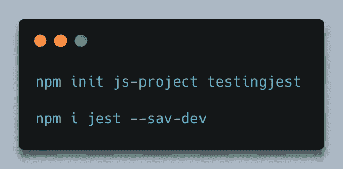

接下来，我们需要向 package.json 添加以下部分。

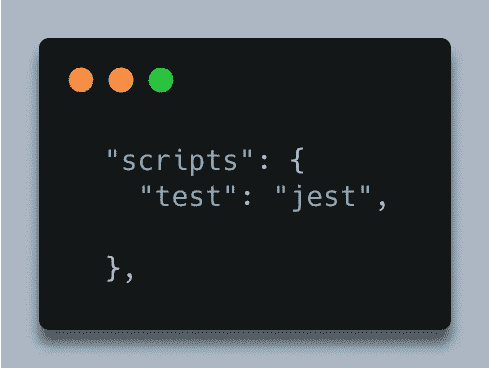

您可能已经有一个脚本部分，所以只需添加测试行。

完美！我们已经准备好在 Javascript 项目中尝试一些基本的测试。

在我们的 src 文件夹中，让我们在 main.js 中键入一两个快捷函数。

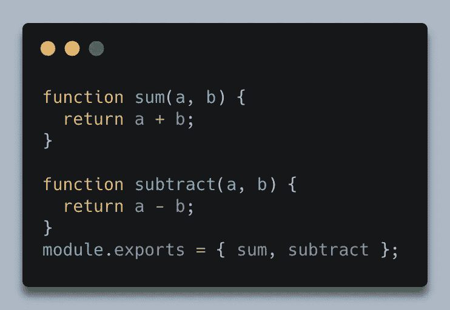

在这里，我们在 main.js 中编写了一些基本函数，并在最底层导出了这些函数。

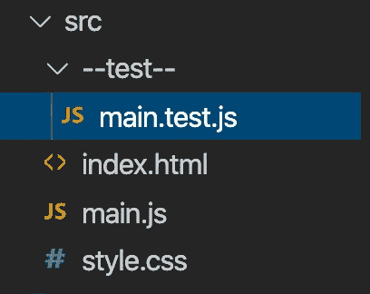

接下来，在 src 中创建一个名为“test”的文件夹。这里是我们编写测试文件的地方。通常，您会为项目中创建的每个 js.file 编写一个测试文件。这允许测试清楚地给出它正在测试什么文件，以及你的项目的什么部分。

现在让我们在这个文件中编写一个基本的测试。首先，我们想在测试文件的顶部调用我们正在测试的 js 文件。

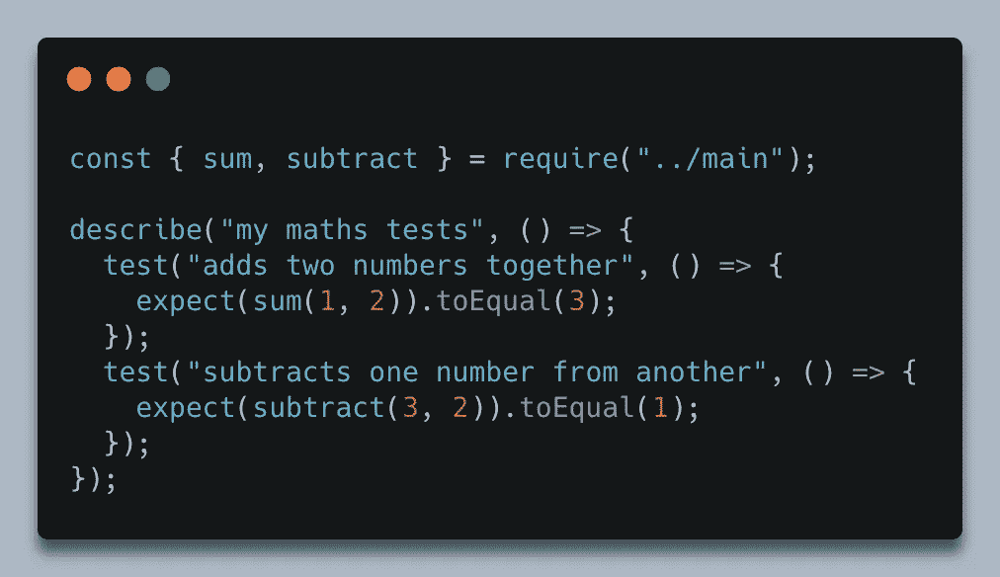

一旦您需要我们正在测试的文件，使用析构的概念从 main.js 文件中提取我想要测试的函数。析构使你的代码更易读，更容易理解。

[**博采众长**](https://medium.com/@lcriswell/destructuring-props-in-react-b1c295005ce0) **。**

让我们把这段代码分解一下，这样我们就能理解它了。如前所述，首先我们调用我们正在测试的文件，并提取函数。接下来，我们使用一个名为 describe 的内置方法。

Describe 是一个 Jest 方法，用于描述和包含我们的测试。正如您所看到的，我给了它一个描述性的句子，以允许另一个开发人员理解块中包含了哪些测试。它有两个参数，一个是描述测试套件的字符串，另一个是包装实际测试的回调函数。

然后我们使用另一个名为“测试”的内置函数。这是不言自明的。这是一个包含我们想要测试的实际代码的块！

好了，让我们深入实际的测试块本身。

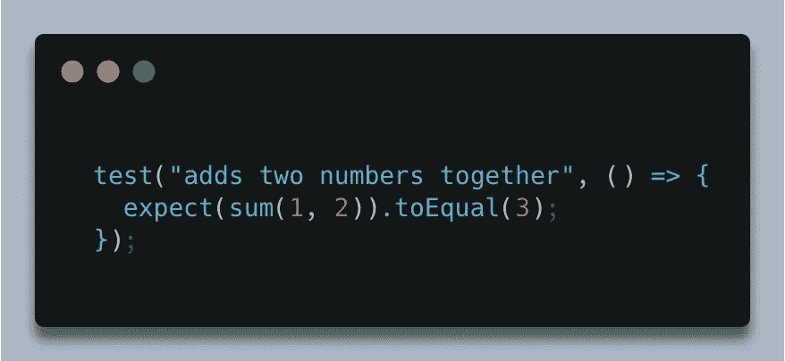

这里，test 方法有两个参数，类似于 describe 方法。在这里，我们想要描述我们正在测试的方法以及我们期望它做什么。接下来，我们使用一个名为 expect 的 Jest 内置方法。

expect 方法包含我们从测试文件顶部的 main.js 中提取的函数，并传递函数运行所需的两个参数。

如果我们通过一个会怎么样？

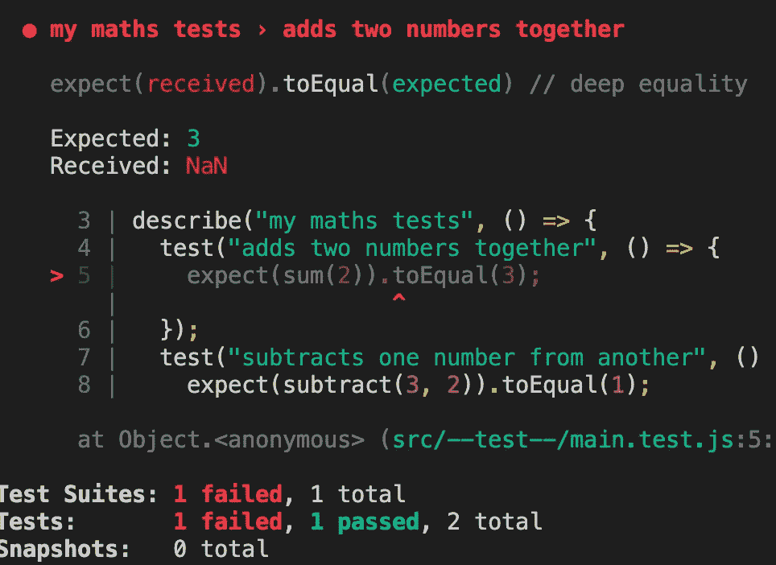

这就是笑话的闪光点。如您所见，如果我尝试只传入一个参数并运行我们的测试，它会失败。但是 Jest 给了我们一个完美的分解，它所期待的和它所收到的。您可以看到它进行了深度的相等性检查，这意味着它还检查了传递给每个测试的参数的数量，如果您想自己检查失败消息，请修复该问题，然后继续。

接下来，我们有另一个内置方法来等同于。toEqual 内置方法是我们输出函数的预期结果进行匹配的地方。同样，如果我在我们的。就像括号一样，玩笑是经不起考验的。

完成后，在您的终端中编写“npm 运行测试”,您应该会得到:

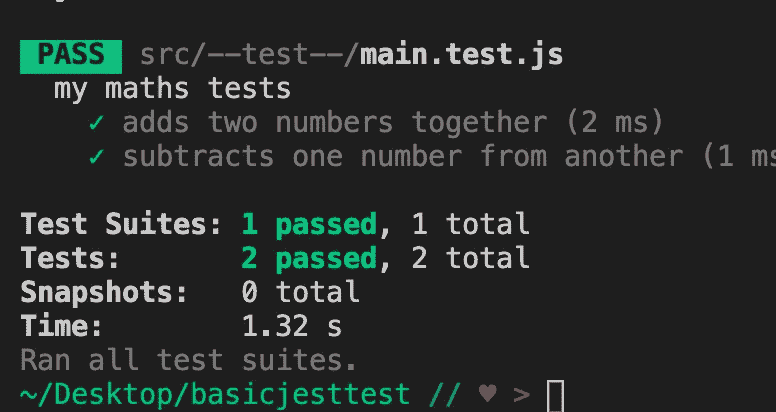

瞧啊。Jest 测试的基础知识。如果你想试验一下，试着多写几个函数，把它们导入到你的测试文件中，然后试验一下。

也可以使用. not 的内置方法。

。not 本质上检查测试后的函数输出是否与。不是括号。下面是一个简单的例子来帮助您理解:

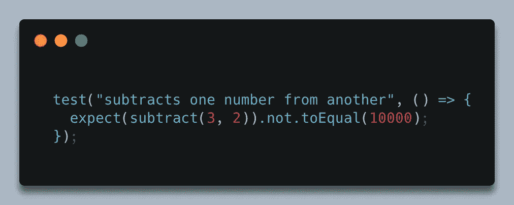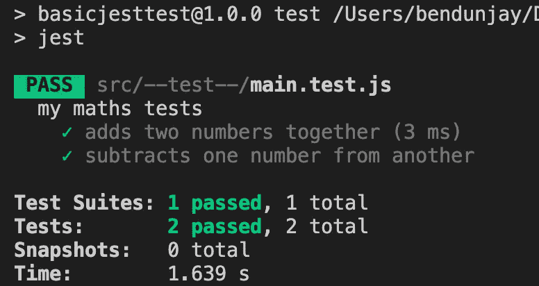

这里 2 减 3 不等于 10000(据我所知)。所以测试通过了。

最后，如果你使用小数(浮点数)，要注意你使用的是哪种内置方法。

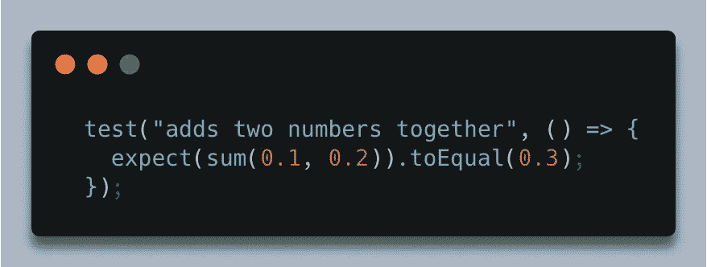

。由于最终的舍入误差，toEqual 实际上会失败。你必须使用。为通过考试做准备。

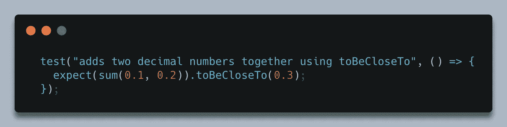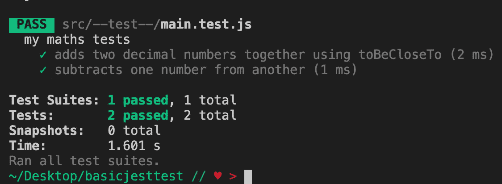

在我的下一篇博客中，我将深入 Jest，查看更多的方法匹配器，然后转向异步函数！