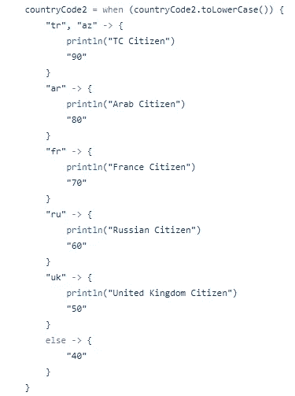

# Kotlin 入门:变量类型和控制流

> 原文：<https://levelup.gitconnected.com/starting-to-kotlin-5719dba1f6ea>

变量类型和控制流介绍

# 变量类型

变量是编程语言的名词。它们是作用或被作用的实体(值、数据)。

## **1。数字**

科特林有六种数字类型。这些是*字节、短整型、长整型、浮点型*和*双精度型。*这些类型具有不同的最小最大值，并且这些值被限制在一个区间内。你可以问为什么不是所有的数字都只使用一种变量类型。答案是性能。例如，如果只有*长*类型，那么它必须包含所有数字。如果它包含所有的数字，应该有一个巨大的内存来存储这些数字。1 辆会存放在长型 t13 和短型 t14 中，2 辆⁰也会存放在那里。在存储 1 的情况下，这是对计算机内存的浪费。因此，有不同的数字类型。您可以使用下面的代码示例检查最小最大值。

`val minByteValue: Byte = Byte.MIN_VALUE //-128
val maxByteValue: Byte = Byte.MAX_VALUE //127`

`val minShortValue: Short = Short.MIN_VALUE //-32768
val maxShortValue: Short = Short.MAX_VALUE //32767`

`val minIntValue: Int = Int.MIN_VALUE //-2,147,483,648
val maxIntValue: Int = Int.MAX_VALUE // 2,147,483,647`

`val minLongValue: Long = Long.MIN_VALUE //-9,223,372,036,854,775,808
val maxLongValue: Long = Long.MAX_VALUE //9,223,372,036,854,775,807`

Float 和 Double 的大小和值与其他类型不同。

给变量赋值时，使用正确的变量类型以获得最佳性能是很重要的。在*类型推断*过程中，如果数字不大于 *Int* ，类型默认设置为 *Int* ，如果大于 Int，类型默认设置为 *Long* 。

当给一个变量赋值时，你可以用下面的方法。

分配数字时可以使用下划线。例如:

`val creditCardNumber = 2354_5645_6866_1232`

另一个关于数字的术语是*装箱的*和*未装箱的*数字。*装箱的*数字将变量作为对象引用，而*未装箱的*数字将变量作为*原始类型*。例如:

三重“===”运算符用于比较变量的引用。两个“==”运算符用于比较变量的值。

## **2。人物**

字符写在单引号中，如果你写了多个值，就会出错。您可以在 char 类型中写入字母、数字、转义符或 Unicode。

它在注释行给出了一个错误，因为“G”字母写在双引号中。双引号表示 Kotlin 中的字符串类型。

## **3。布尔型**

布尔值用于`true`或`false`值。1 和 0 不能用作布尔值。它们可以和布尔运算符一起使用，如 and `&&`，或`||`等。

`if (isStudent && isTeacher)`

没有必要将一个变量与*“真”*进行比较，因为如果它已经为真，它将在 *if* 控制中进行。另一方面，如果你想用*“false”*比较一个值，你可以像下面这样使用它:

`if (!isStudent)`

## **4。数组**

阵列是指有序的系列或排列。在 Kotlin 中，您可以编写相同类型的数组或不同类型的数组或空类型的数组。数组的基本用法:

同样，数组可以用*高阶函数*来定义，函数中的“it”代表数组中的每一个值。

carNames 函数内部有 3 个“蓝宝”值。

## **5。琴弦**

字符串意味着双引号内的所有内容。它是一种字符类型的集合。你可以在另一个数组中写这些字符。

如果你想使用加法运算符，你应该先写*字符串*，再写 *Int。*反过来会出错。

你不需要使用`+`操作符来写变量。它可以通过直接键入双引号来使用。你只需要`$` 就可以做到这一点。这种结构称为字符串模板。如果你需要变量的一个特性，它将被用作`${}`。

## 6。类型转换

在 Kotlin 中，您可以相互转换类型。Kotlin 使用*显式类型转换。*这些是转换类型的函数: *toByte()、toShort()、toInt()、toLong()、toDouble()、toFloat()、toChar()、toString()、toUByte()、toUShort()、toUInt()、toULong()、toDuration()、toBigDecimal()、toBigInteger()。*

具有较小间隔的类型可以毫无问题地转换为具有较大间隔的类型。

答案将被正确返回

但是如果你想把一个值转换成一个区间更小的类型，它会返回不相关的数字。

tcIdentityNumber 是一个长整型变量。正因为如此，转换的结果将返回答非所问

如果两个不同的类型将进行数学计算，结果类型将是变量的类型。

# 控制流程

## **1。否则**

在 if-else 情况之后，花括号将打开。然而，如果我们要在这些括号之间写一行代码，我们就不必使用括号。if-else 用例有两种用法——状态和表达式。状态用法是 if-else case 的常用用法。在 Kotlin 中，您可以将这个常见的 if-else 语句赋给一个变量。

状态使用

表达式用法

## **2。当**

`switch`例时替换为科特林的`when`例。在下面的示例中，您可以看到切换案例的相似性。

when case 的其他用法:

感谢您阅读文章。我将在下一篇文章中继续介绍 Kotlin 的功能。