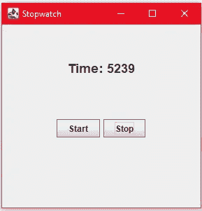

# 从 Swing 应用程序开始(第 4 部分)

> 原文：<https://levelup.gitconnected.com/starting-with-the-swing-app-part-4-7b9395a5960c>


礼貌:timeanddate.com

欢迎来到本系列的第 4 篇教程。从上 3 节教程开始，我们一直在关注我们的核心秒表类。我们努力让它越来越好，尽可能减少客户端代码。现在是时候继续关注在我们的 Swing 应用程序中使用这个秒表类了。

# 之前的教程

如果您是第一次阅读这一部分，那么您一定要看看本系列的第 3 部分。

*   [**代号**](https://github.com/rajtilakls2510/Stopwatch/tree/S3_Applying_Observer_Pattern) 直到现在。
*   [第三部](https://rajtilakls2510.medium.com/applying-the-observer-pattern-part-3-e46ce30c2d32)

在深入研究任何代码之前，让我们先来看看我们要做什么。


这是我们的应用程序在本教程结束后的样子。这里有三个主要部件:**定时显示**、**开始按钮、**和**停止按钮**。

注意:时间仍然是以毫秒为单位的，我希望您弄清楚格式逻辑。

让我们更深入地了解一下我们在这里使用的组件。这里的主要组件是 JFrame。这个 JFrame 将包含所有其他组件。


这个 JFrame 的布局是 2 行 1 列的 **GridLayout** 。


GridLayout 的每个元素都有一个带有 FlowLayout 的 JPanel。


在第一个 JPanel 中有一个名为“timerDisplay”的 JLabel，在第二个 JPanel 中有两个按钮:Start 和 Stop。

我们将保持这个应用程序尽可能简单。用户可以用这个秒表做的唯一事情就是启动和停止它。在我们的 UI 构建好并准备好之后，我们可以添加更多的特性。但是，现在，让我们开始做这个吧。

我们将从创建应用程序的主类开始。创建一个新的 java 文件，并将其命名为“StopwatchSwing.java”

```
public class StopwatchSwing {
}
```

接下来，我们将创建 main()方法，并让 swing 知道这是我们应用程序的主类(不要忘记导入)。

```
import java.awt.*;
import javax.swing.*;public class StopwatchSwing {

    public static void main(String[] args) {
        SwingUtilities.*invokeLater*(new Runnable() {
            @Override
            public void run() {
                new StopwatchSwing();
            }
        });
    }

}
```

让我们给我们的类添加一些 UI 小部件。

```
public class StopwatchSwing {
    JFrame frame;
    JPanel panel1, panel2;
    JLabel timerDisplay;
    JButton start, stop;

    .....}
```

注意，我们添加了主 JFrame、2 个 JPanels、timerDisplay JLabel 以及 Start 和 Stop JButtons。现在让我们在这个类的构造函数中设置 UI。

```
public class StopwatchSwing {

    ....

    StopwatchSwing()
    { *// Initializing the JFrame* frame = new JFrame("Stopwatch");
        frame.setSize(300,300);
        frame.setMinimumSize(new Dimension(300,300));
        frame.setLayout(new GridLayout(2,1));
        frame.setDefaultCloseOperation(JFrame.*EXIT_ON_CLOSE*); }
}
```

您可以看到，我们正在通过创建一个新的 JFrame 对象并将其命名为“秒表”来初始化我们的“框架”。这将是我们应用程序窗口的标题。然后，我们将帧的初始大小设置为 300，300 像素。我们给窗口增加了一个最小尺寸，这样用户就不能把窗口缩小到这个尺寸以下。接下来，我们添加框架的布局。我们在这里使用 2 行 1 列的 GridLayout。最后，我们将这个框架的默认关闭操作设置为 EXIT_ON_CLOSE。

接下来，我们将在每个网格元素中设置 JPanels。

```
StopwatchSwing()
{
    *// Initializing the JFrame* frame = new JFrame("Stopwatch");
    frame.setSize(300,300);
    frame.setMinimumSize(new Dimension(300,300));
    frame.setLayout(new GridLayout(2,1));
    frame.setDefaultCloseOperation(JFrame.*EXIT_ON_CLOSE*);

    *// Setting Up Panels* panel1 = new JPanel();
    panel1.setLayout(new FlowLayout(FlowLayout.*CENTER*, 0, 50));

    panel2 = new JPanel();
    panel2.setLayout(new FlowLayout(FlowLayout.*CENTER*));
} 
```

我们正在创建两个 JPanels，并将它们的布局设置为 FlowLayouts。现在让我们制作 JLabel“timer display”并将其添加到“panel1”中。

```
StopwatchSwing()
{
    ... *// Setting Up Panels* panel1 = new JPanel();
    panel1.setLayout(new FlowLayout(FlowLayout.*CENTER*, 0, 50));

    timerDisplay = new JLabel("Time: 000");
    Font font = timerDisplay.getFont();
    timerDisplay.setFont(new Font(font.getFontName(), font.getStyle(), 18));

    panel1.add(timerDisplay);

    panel2 = new JPanel();
    panel2.setLayout(new FlowLayout(FlowLayout.*CENTER*));
}
```

我们用一个新的 JLabel 对象初始化 timerDisplay，并给它一个初始文本“Time: 000”。然后，我们将字体大小改为 18。最后，我们将计时器显示添加到 panel1。接下来，我们制作两个按钮，并将它们添加到 panel2 中。

```
StopwatchSwing()
{
    ...

    panel2 = new JPanel();
    panel2.setLayout(new FlowLayout(FlowLayout.*CENTER*));
    start = new JButton("Start");
    stop = new JButton("Stop");
    panel2.add(start);
    panel2.add(stop);
}
```

我们正在创建两个按钮并将它们添加到 panel2。这里只剩下两样东西。将两个面板添加到 JFrame 并使框架可见。

```
StopwatchSwing()
{
    *// Initializing the JFrame* frame = new JFrame("Stopwatch");
    frame.setSize(300,300);
    frame.setMinimumSize(new Dimension(300,300));
    frame.setLayout(new GridLayout(2,1));
    frame.setDefaultCloseOperation(JFrame.*EXIT_ON_CLOSE*);

    *// Setting Up Panels* panel1 = new JPanel();
    panel1.setLayout(new FlowLayout(FlowLayout.*CENTER*, 0, 50));

    timerDisplay = new JLabel("Time: 000");
    Font font = timerDisplay.getFont();
    timerDisplay.setFont(new Font(font.getFontName(), font.getStyle(), 18));

    panel1.add(timerDisplay);

    panel2 = new JPanel();
    panel2.setLayout(new FlowLayout(FlowLayout.*CENTER*));
    start = new JButton("Start");
    stop = new JButton("Stop");
    panel2.add(start);
    panel2.add(stop);

    frame.add(panel1);
    frame.add(panel2);

    frame.setVisible(true);
}
```

这是构造函数的完整代码。最后，我们将两个面板添加到框架中，并使用 setVisible()方法使框架可见。


此时，我们的应用程序看起来像这样。注意，点击 Start 和 Stop 按钮并不能做任何显而易见的事情，因为我们还没有任何监听器连接到它。

为了给按钮附加一个监听器，我们必须使用 JButton 类的 addActionListener()方法。我们可以在按钮创建后添加侦听器，因此添加侦听器的好地方是构造函数。转到构造函数的末尾，像这样添加侦听器。

```
import javax.swing.*;
import java.awt.*;
import java.awt.event.ActionEvent;
import java.awt.event.ActionListener;

public class StopwatchSwing {

    ...

    StopwatchSwing()
    {
        ....

        frame.setVisible(true);

        *// Adding Listeners to the Buttons* start.addActionListener(new ActionListener() {
            @Override
            public void actionPerformed(ActionEvent e) {

            }
        });

        stop.addActionListener(new ActionListener() {
            @Override
            public void actionPerformed(ActionEvent e) {

            }
        });

    }
}
```

这里，我们向每个按钮添加一个 ActionListener。点击按钮时将执行的代码需要编写在每个 ActionListener 的 actionPerformed()方法中。现在，我们将打印出一条关于点击 Start 和 Stop 方法的消息。

```
start.addActionListener(new ActionListener() {
            @Override
            public void actionPerformed(ActionEvent e) {
                System.*out*.println("Start Pressed");
}
        });

stop.addActionListener(new ActionListener() {
            @Override
            public void actionPerformed(ActionEvent e) {
                System.*out*.println("Stop Pressed");}
        });
```

编写完这段代码后，运行这段代码并点击几次 Start 和 Stop 方法，您将会看到相应的消息正在控制台上打印出来。


现在让我们继续将秒表添加到这个类中。我们将从使这个类成为观察者开始，因为这个类将观察秒表对象。

```
public class StopwatchSwing implements Observer {

    *...*

    @Override
    public void update(long time) {
        timerDisplay.setText("Time: "+time);
    }
}
```

需要覆盖 update()方法，在其中，我们将显示使用 timerDisplay JLabel 的 setText()方法接收的时间。接下来，我们将秒表添加到我们的类中。

```
public class StopwatchSwing implements Observer {

    Stopwatch sw;
    ..... StopwatchSwing()
    {
        sw = new Stopwatch();
        sw.registerObserver(this);
        .....
    }
}
```

我们正在创建一个新的秒表对象，并注册一个观察者，这个观察者就是 StopwatchSwing 类本身。按下开始按钮时，我们应该启动秒表，按下停止按钮时，我们应该停止秒表。因此，我们必须改变听众。

```
start.addActionListener(new ActionListener() {
            @Override
            public void actionPerformed(ActionEvent e) {
                sw.start();}
        });

        stop.addActionListener(new ActionListener() {
            @Override
            public void actionPerformed(ActionEvent e) {
                sw.stop();}
        });
```

在启动监听器中，我们只是添加了 sw.start()来启动秒表，在停止监听器中，我们只是添加了 sw.stop()来暂停秒表。

现在，将按钮侦听器的逻辑保留在另一个函数中是一个很好的做法。在下一篇教程中，当按钮监听器逻辑变得更加复杂时，您将会理解这一点的必要性。

```
StopwatchSwing()
{
    ....

    *// Adding Listeners to the Buttons* start.addActionListener(new ActionListener() {
        @Override
        public void actionPerformed(ActionEvent e) {
            handleStartPress();
        }
    });

    stop.addActionListener(new ActionListener() {
        @Override
        public void actionPerformed(ActionEvent e) {
            handleStopPress();
        }
    });

}

private void handleStartPress() {
    sw.start();
}
private void handleStopPress(){
    sw.stop();
}
```

我们制作了两个方法:handleStartPress()和 handleStopPress()，它们将负责处理适当的按钮按压。

记住我们到目前为止做了什么。

*   我们正在创建一个秒表对象，并将 StopwatchSwing 对象注册为观察者。
*   当点击 start 按钮时，秒表的 Start()方法被调用。
*   start()方法创建一个新线程并启动该线程。
*   线程每隔 10 毫秒开始向所有观察者通知时间。
*   因为我们的 StopwatchSwing 类是这个秒表的观察者，所以它的 update()方法每隔 10 毫秒被调用一次，update()方法用从秒表类接收的时间更新 timerDisplay 中的时间。

现在运行您的代码。点击开始按钮时，您的秒表应该开始更新 timerDisplay JLabel。按下停止按钮时，秒表将暂停。再次点击 Start，它将恢复。我们重置秒表的唯一方法是再次启动应用程序。



**当然，我们不希望通过一次又一次重启应用程序来重置秒表。事实上，我们必须为用户提供启动、暂停、恢复和停止的功能。如果没有这些特性，我们的秒表应用程序就毫无用处。请记住，核心秒表类并没有实现所有这些特性。它只能暂停和恢复。向用户提供这些功能是 StopwatchSwing 类的责任。这是我们将在下一个教程中解决的问题。**

# 下一个教程:

[为我们的应用程序添加开始、暂停、恢复和停止功能。](https://rajtilakls2510.medium.com/adding-start-pause-resume-and-stop-to-our-app-part-5-dd562d82d0a3)

# 完整代码

[完整的代码在这里。](https://github.com/rajtilakls2510/Stopwatch/tree/S4_Setting_up_the_UI_of_Swing_App)

StopwatchSwing.java

```
import javax.swing.*;
import java.awt.*;
import java.awt.event.ActionEvent;
import java.awt.event.ActionListener;

public class StopwatchSwing implements Observer {

    Stopwatch sw;
    JFrame frame;
    JPanel panel1, panel2;
    JLabel timerDisplay;
    JButton start, stop;

    StopwatchSwing()
    {
        sw = new Stopwatch();
        sw.registerObserver(this);

        *// Initializing the JFrame* frame = new JFrame("Stopwatch");
        frame.setSize(300,300);
        frame.setMinimumSize(new Dimension(300,300));
        frame.setLayout(new GridLayout(2,1));
        frame.setDefaultCloseOperation(JFrame.*EXIT_ON_CLOSE*);

        *// Setting Up Panels* panel1 = new JPanel();
        panel1.setLayout(new FlowLayout(FlowLayout.*CENTER*, 0, 50));

        timerDisplay = new JLabel("Time: 000");
        Font font = timerDisplay.getFont();
        timerDisplay.setFont(new Font(font.getFontName(), font.getStyle(), 18));

        panel1.add(timerDisplay);

        panel2 = new JPanel();
        panel2.setLayout(new FlowLayout(FlowLayout.*CENTER*));
        start = new JButton("Start");
        stop = new JButton("Stop");
        panel2.add(start);
        panel2.add(stop);

        frame.add(panel1);
        frame.add(panel2);

        frame.setVisible(true);

        *// Adding Listeners to the Buttons* start.addActionListener(new ActionListener() {
            @Override
            public void actionPerformed(ActionEvent e) {
                handleStartPress();
            }
        });

        stop.addActionListener(new ActionListener() {
            @Override
            public void actionPerformed(ActionEvent e) {
                handleStopPress();
            }
        });

    }

    private void handleStartPress() {
        sw.start();
    }
    private void handleStopPress(){
        sw.stop();
    }

    public static void main(String[] args) {
        SwingUtilities.*invokeLater*(new Runnable() {
            @Override
            public void run() {
                new StopwatchSwing();
            }
        });
    }

    @Override
    public void update(long time) {
        timerDisplay.setText("Time: "+time);
    }
}
```

# 参考资料:

*   书籍: [Head First 设计模式](https://www.oreilly.com/library/view/head-first-design/0596007124/)，作者埃里克·弗里曼、伊丽莎白·罗布森、伯特·贝茨、凯西·塞拉。