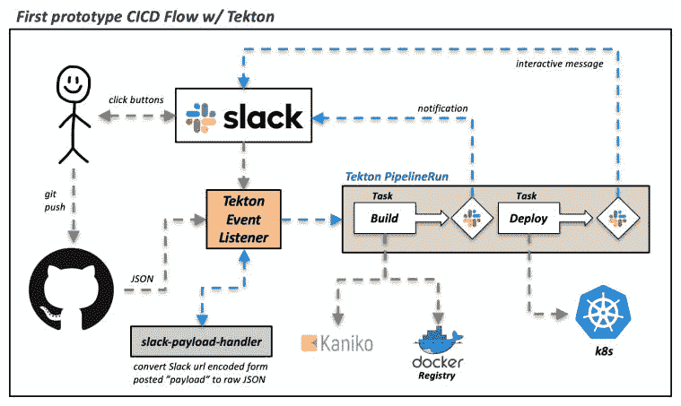
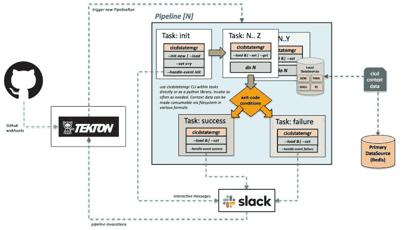
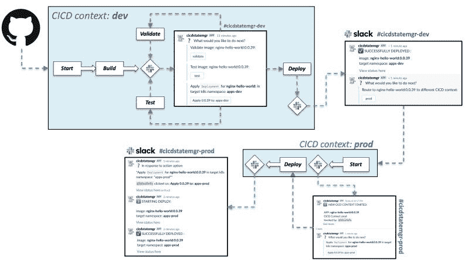
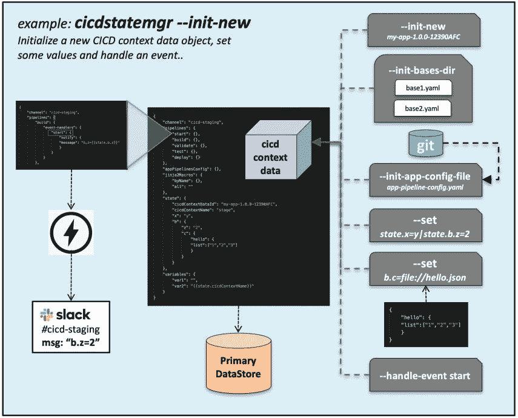
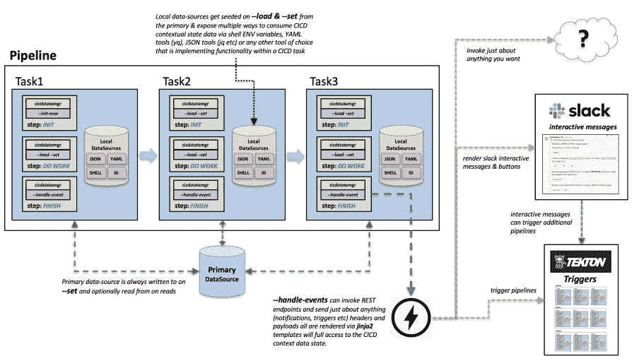

# 具有松弛交互消息的 Tekton 流水线中的状态管理

> 原文：<https://levelup.gitconnected.com/state-management-in-tekton-pipelines-with-slack-interactive-messages-e9ed49d7b89>

今年早些时候，我重新进入了令人眼花缭乱的 CI/CD 平台和解决方案世界。今天的市场提供了如此多的选择，我只能想象对于一个刚进入这个领域的人来说，决定选择什么样的解决方案是多么的困难。

令人欣慰的是，行业开始投资于定义 CI/CD 系统的一些标准化和约定，以及围绕“管道”的概念，随着各种供应商频繁重复模式的成熟，需要一些标准化的基线水平。参与这项工作的组织之一是[持续交付基金会(CDF)](https://cd.foundation/) (与 [CNCF](http://cncf.io/) 关系不太密切)，他们正在从事这些工作。在观察这个领域时，我偶然发现了 [CDF 的](https://github.com/cdfoundation)核心项目之一，名为 [Tekton](https://tekton.dev) ，它最初是由谷歌捐赠给 [CDF](https://github.com/cdfoundation) 的。

*(如果您只是在寻找一个 Tekton 兼容的工具来管理 CI/CD 状态 w/ Slack 交互性，您可以跳过其余部分，在 GitHub* *上查看 cicdstatemgr*[*)*](https://github.com/bitsofinfo/cicdstatemgr)

# **泰克顿**

泰克顿项目由几个部分组成；三个关键的是[管线](https://github.com/tektoncd/pipeline)、[触发器](https://github.com/tektoncd/triggers)和[仪表盘](https://github.com/tektoncd/dashboard)。但是是什么让泰克顿与众不同？如果你看一下 CI/CD 系统，你会发现它们都有什么共同点？好吧，他们最终似乎都重写的一个大组件是由 N 个“任务”组成的“管道”由跨越 N 个“工人”的某种“主人”创建、分发/调度、执行和管理的方式，这通常都是由每个供应商反复编写的定制代码。

Tekton 所做的是定义一些标准的方法，如何将“管道”和“任务”(以及各种其他关键模式)定义为 Kubernetes 资源(通过自定义 CRD)，然后让 Kubernetes 本身管理这些东西的创建、调度、执行和管理(以包含由 N 个步骤(容器)组成的 N 个“任务”(k8s Pods)的“管道运行”的形式)。这实际上为您提供了一种 Kubernetes 进行 CI/CD 的本地方式，并提供了一些基础组件，通过这些组件，您可以构建更高级别的 CI/CD 系统，而不必重新编写所有调度/主/辅助代码，这些代码经常被每个 CI/CD 供应商以某种形式或方式重复使用。厉害！现在，我们离 CI/CD 系统的标准化又近了一步！值得注意的是，Tekton 本身并不是一个现成的 CI/CD 解决方案，而是一个框架，通过它您可以在之上构建更高级别的 CI/CD 功能。几个项目已经建立在泰克顿之上，其中之一是[詹金斯-X](https://jenkins-x.io/) 。如果你想了解更多关于[泰克顿的事情，你可以在这里阅读更多。](https://github.com/tektoncd/pipeline)

# 该项目

作为我对 CI/CD 生态系统现状评估的一部分，我决定构建一个基于 Tekton 的解决方案原型，因为这些概念因其以 Kubernetes 为中心的关注点和云不可知的足迹而真正引起了我的兴趣。我最初花了一些时间尝试使用 [Jenkins-X](https://jenkins-x.io/) ，但很快就遇到了太多的错误和/或缺乏支持，试图让它与特定的 git 提供商和特定的 cloud k8s 供应商一起工作，所以我决定放手，一旦 Jenkins-X 更加成熟，就回到那个项目。

这个概念相当简单，符合典型的 CI/CD 用例模式。我希望开发人员能够将标签推送到 Git，触发构建，然后让他们控制何时验证/测试，部署到开发环境，并最终将标签“提升”到更高级别的环境，如生产环境。在[仪表板项目](https://github.com/tektoncd/dashboard)之外，Tekton 实际上没有任何*【用户界面】*(这对于查看 Tekton 内部发生的事情非常有用)，但并不是真正为了促进选择驱动的控制点而设计的，最终用户可以通过选择驱动的控制点与一组正在执行的管道进行交互，并对决策点等做出响应。考虑到这一点，我决定让最终用户体验(即开发人员或 devops)通过交互式消息控件(即按钮)与 Slack 进行协调。其思想是，当各种管道开始/完成/失败或需要用户交互时，这将通过 Slack 来传达，Slack 既作为状态的通知系统，也作为要做出的“选择”的交互点。

# 样机研究

从 Tekton 开始并不坏，在经过一些反复试验学习了管道、任务、管道运行的基础知识后，我得到了一个基本的“构建”管道功能，可以通过手动应用启动该过程的管道运行 k8s 清单来实例化。基本管道由从 Git repo 中提取的任务组成，在 Kaniko 中进行映像[构建/推送，然后通过调用在幕后利用](https://github.com/GoogleContainerTools/kaniko) [helmfile-deploy](https://github.com/bitsofinfo/helmfile-deploy) 的定制部署工具最终“部署”应用程序映像工件。

这是一个不错的开始，但是我接下来不得不研究 Tekton Triggers 项目，以便能够自动创建一个 PipelineRun 来响应被推送的 Git 标签；而不是人工制作不可持续的管道运行对象。简而言之，Tekton Triggers 项目允许您公开自己的 [EventListeners](https://github.com/tektoncd/triggers/blob/master/docs/eventlisteners.md) (想想 HTTP 端点)，它可以接受另一个系统(通常是 JSON)发送的有效负载，使用 [CEL 表达式](https://github.com/tektoncd/triggers/blob/master/docs/cel_expressions.md)提取您关心的细节，然后将这些参数映射到您想要动态创建的 Tekton 管道资源(即 PipelineRuns)。

既然我已经具备了基于 Git 事件自动触发管道的基本能力，接下来就是创建这样一种能力，既可以发送关于管道内事件的 Slack 通知，也可以让 Slack 中的用户通过[交互组件(按钮)](https://api.slack.com/messaging/interactivity)做出选择，并通过一个定制的 [Slack“应用”](https://api.slack.com/start)响应这些通知。制作一些简单的通知发布到 Slack 并不复杂，只需要为消息创建交互按钮就可以了。当 Slack 消息按钮被按下时，Slack 向您选择的端点发送一个 HTTP POST 在本例中，它是我的 Tekton 触发器[事件监听器](https://github.com/tektoncd/triggers/blob/master/docs/exposing-eventlisteners.md)端点。然而，在 Slack 上，他们的帖子增加了一个非常烦人的问题，不仅仅是发布 JSON，而是将 JSON 嵌入到一个名为“payload”的传统 url 编码的表单 post 变量中。为此，我需要让 EventListener 调用一个定制的 Tekton[web hook interceptor](https://github.com/tektoncd/triggers/blob/master/docs/eventlisteners.md#Webhook-Interceptors)，该拦截器可以[提取它并将其作为普通的 JSON](https://github.com/bitsofinfo/slack-payload-handler) 返回，这样就可以用 CEL 操作它。这是通过在松弛有效载荷处理器的 [github 上写一个 go 和 its 来完成的。](https://github.com/bitsofinfo/slack-payload-handler)

一旦设置好了，在构建完成之后，会发送一个通知，然后在部署任务完成之后，会发送一组按钮，让用户迭代并“重新运行”整个管道。

对于一个原型来说，这工作得很好，老实说，大部分的挑战不是让 Tekton 本身工作，而是更多的关于争论你的管道将需要工作的所有东西的所有样板逻辑(考虑秘密、配置、密钥等)，迁移在 Docker 中构建得很好但当由 Kaniko 构建时行为不同的 Docker 文件，以及许多 YAML 工艺、参数映射、调试 CEL 表达式和所有你最终要做的编写任何软件的典型事情；*是的，CI/CD 是定制软件*，无论您是自己编写还是在另一个平台上配置。

说到底，这只是一个概念证明，证明了什么是可能的，它有许多静态定义的、硬连接的假设和内置的复制粘贴脚本。为了使它达到更有用的状态，它需要做一些工作。

# 确定的要求

在 Tekton 上开发原型暴露了一些我发现自己在重复的模式，并且需要一个工具来简化其中的一些。我最终确定的未来需求领域如下:

## 任务结果、参数和共享的上下文状态数据

一个管道内(可能跨越 N 个管道)的任务通常需要通过输入或输出在它们之间共享的上下文状态数据。如“环境”、“项目名称”、“版本”等以及其他常见的原始属性/值类型变量；包括有时更复杂的结构化值，如 JSON/YAML 代码片段。Tekton 通过其 [*“任务参数”*](https://github.com/tektoncd/pipeline/blob/master/docs/tasks.md#specifying-parameters) 和 [*“任务结果”*](https://github.com/tektoncd/pipeline/blob/master/docs/tasks.md#emitting-results) 功能(即，命名结果指向磁盘上可以在管道中的 N 个任务之间共享的文件)提供了一种解决这一问题的机制。这对我来说没问题，但是任务“结果”的值大小限制为 4096 字节。可以通过将值(文件)写入更大的共享“工作区”卷来解决这一限制。[任务结果](https://github.com/tektoncd/pipeline/blob/master/docs/tasks.md#emitting-results)在单个*管道*内的大部分时间都工作得很好，但是不容易解决跨由进程(和时间)边界分隔的多个管道存储结果或公共“状态”数据的问题。跨 N 个管道共享的结果/数据可以通过工作区来实现，但是我发现跨所有 N 个 YAML 文件来管理、思考和跟踪是很麻烦的。越来越多的需求是动态地添加和删除输入/输出，而不必在任务/流水线级别不断地重新声明结果和参数。

如果您有少量的输入或结果数据，这种机制是很好的，但是如果您超过了少数几个，您可能会花费大量的时间来来回回地在结果、任务和管道之间声明和映射参数。简而言之，随着管道变得越来越复杂，我认为这将成为一个更大的管理问题。理想情况下，使用任务结果和参数对于某些用例(比如移动跟踪标识符和简单的结果状态)来说是很好的，但是实际上我想限制我对它的使用，只保存指向一组更健壮的上下文状态数据的指针，这些数据与执行的逻辑线程(即应用程序发布/版本)相关，很容易使用和改变。

## 上下文状态数据的范围

在后一部分的基础上，很快就清楚了管道最终会变得通用。例如，将应用程序映像“部署”到集群的管道显然应该可以跨不同的执行“上下文”*(即，部署到生产环境、qa 环境和开发环境等)重用。*随之而来的需求是能够在每个应用的 git 项目中定义(在高层次上)，一种由开发人员轻松定义和定制每个管道执行行为的方法*最终由这些执行“上下文”确定范围。*这个执行的“上下文”还会有一组与之相关的数据，这些数据更易变，更特定于运行时。任何 CI/CD“上下文”的行为、数据和配置都可能互不相同。

## 执行模式&对成功/失败的反应

在这个简单的原型中出现了一个简单的模式:*“这能被执行吗？”、“执行它”、“检查退出代码”、“调用端点”。*其中*“调用端点”*可能是向 Slack 发送一些东西，或者递归调用主 Tekton EventListener 端点来触发 Tekton 内的其他东西(即相同或不同的管道)。随着管道越来越复杂，这种模式有可能变得更加普遍。我并不真的关心生成 Tekton 资源来产生一组条件/任务来实现这一点，因为有许多方法可以做到这一点，但我真的只是想要一种通用的方法，我可以用一种一致的和可定制的方式来处理每个应用程序的*“调用端点*”动作，这些应用程序将利用这些管道。定义管道和任务的 Tekton 资源的管理将单独完成，但是可以从内部利用这个工具来简化调用。

## 调用端点，自定义消息和选项

由于每个管道的一个关键项目将是基于一些结果或任意定义的“事件”(即 Tekton 和/或 Slack 等)调用端点的能力，这将需要为定制提供一些东西。由于 Slack 是通知和最终用户交互发生的主要方式，因此需要一种方法来轻松地更改与此相关的所有选项(即消息、端点等的模板)。同样，调整将发送给 EventListener 本身的参数的能力，以便以自动化的方式基于结果重新调用 Tekton。事实上，这个管道配置数据可以是任意的，完全自定义的。任务 X 需要选项 Z 的可配置性？将它添加到管道配置文件中，让开发人员调整它。

## 获取响应并存储它们

在某个端点作为某个先前结果(即 Tekton 或 Slack)的结果被调用后，您可能经常希望从该调用中捕获 HTTP 响应的某个部分，并随后将其存储回前面提到的共享“上下文状态数据”中，该数据将在整个执行流程中共享。人们反复需要能够解析 HTTP 响应，提取参数，然后存储它们以备将来使用。这与 Tekton 触发器中的 CEL 表达式提供的功能非常相似。在这里，我想到了诸如松弛线程 id 和审计跟踪项目之类的东西；或者甚至分析响应并生成要存储在上下文状态数据中的其他内容。

## 消费和变更上下文状态数据

如前所述，我真的很想为 Tekton 之外的一个“执行”线程存储大量上下文“状态”数据，但也想让它非常容易从任务中访问和操作。也就是说，它应该可以在文件系统上本地访问，并且可以以一些常见的格式使用(YAML、JSON、 *sourced* shell ENV vars 等)。这些功能的组合应该允许任何“任务”,无论是 Bash 脚本还是自定义程序，都能够读取/使用数据，同时需要一个专用接口来改变数据。这也将减轻必须通过“结果/参数”机制在不同的管道/任务之间一遍又一遍地传输和重新声明这些值的负担。

## 让开发者为每个应用定制行为

最后，任何 CI/CD 系统的关键是，如果“管道”和“任务”设计得相当一般，那么应该有一种机制，通过这种机制，最终开发人员可以通过定制的任务可消费配置来调整管道的行为，以及(在这种情况下)定制消息和过程中每一步发生的交互。这种行为的大部分应该隐藏在某种可以扩展的“基线”配置中，但最终，至少应该从这些文件中消耗一些执行时的输入，这些文件由将代码推送到系统的最终开发人员管理。

# 从原型到迭代

好的，现在我已经确定了一些用例及模式，它们是实现一个更健壮的实现所需要的，是时候开始了。我并没有打算去构建一个*“开箱即用的 CI/CD 系统”*，而只是一个工具，让你自己动手制作时变得更容易。这就是我开始写一些代码来创建一个实用程序的地方，这个实用程序可以从管道内部利用来解决上面列出的问题。经过几次迭代，这段代码被细化为[***cicdstatemgr***](https://github.com/bitsofinfo/cicdstatemgr):CLI 和 python 库，可以在 CI/CD 管道(如 Tekton)中使用，以帮助解决我在上一节中列出的需求和用例。

# cicdstatemgr

那么 [cicdstatemgr](https://github.com/bitsofinfo/cicdstatemgr) 到底能帮上什么忙呢？最好的展示方式可能是用它帮助解决的一般执行模式的图示(如下所示):

请注意，上图中的任务模式不是由 [cicdstatemgr](https://github.com/bitsofinfo/cicdstatemgr) 强加或实现的，只是为了说明我在 [Tekton](https://tekton.dev) 中实现的一个通用模式，然后在任务中利用 [cicdstatemgr 的](https://github.com/bitsofinfo/cicdstatemgr)功能。您可以完全自由地设计您的管道、流程和任务，并且*在它们对您的特定用例最有意义的时候、如果和在哪里使用 cicdstatemgr。*

下面展示了一个用*cicstatemgr*和 Tekton 实现的示例工作流，展示了“上下文”的概念以及如何在 CI/CD 中逻辑地使用它们。每个“上下文”都有自己的“cicdContextData”实例，可以在其中执行的所有管道之间共享。当一个新的“上下文”开始时，会创建一个新的实例，该实例可能会也可能不会植入来自先前上下文的数据。

# cicdstatemgr 常规功能概述

开发者[在每个应用的配置管理库中声明一个*“app-pipeline-config . YAML”*文件](https://github.com/bitsofinfo/nginx-hello-world/blob/master/app-pipeline-config.yaml)(随便你怎么命名)

每个 app pipeline 配置文件声明一个或多个可以从继承的[可选*【基】*，*【基】* YAML 文件的格式/布局与 app pipeline 配置文件相同。应用程序管道配置文件旨在与 *"bases"* 合并，并覆盖它们。](https://github.com/bitsofinfo/cicdstatemgr/tree/master/examples/tekton/pipelines/bases)

每个应用程序管道配置文件定义一个或多个命名的 *"cicd-contexts"* 的配置，每个配置包含一个或多个命名的"管道"配置，这些配置可以包含*完全任意的 YAML 结构*您定义的*用于保存您想要的任何配置，这些配置随后可以被 *cicdstatemgr 的*使用、引用或变异。其他操作，例如或只是通过这些数据加载到任务的文件系统中，然后可以被任务中的任何工具使用或交叉引用*

*您使用一组参数创建一个 *"cicdContextData"* 的新实例，这些参数使用一个应用程序管道配置文件，将它与其声明的 *"bases"* 合并，以产生" cicdContextData "对象的内容，该对象在其整个生命周期内以及跨进程边界都可以通过其" id "进行检索。这些数据存储在一个“主存储”中(目前支持 redis)，并且可以根据需要以 [YAML、JSON 或 sourceable“shell”格式加载到本地文件系统中。](https://github.com/bitsofinfo/cicdstatemgr/tree/master/examples/basics/localdata)*

*在每个“pipeline”配置部分中，还有一个“event-handlers”部分，当调用[*-handle-event<pipeline name>=<event name>*](https://github.com/bitsofinfo/cicdstatemgr/blob/master/examples/basics/HANDLE_EVENT.md)时会引用该部分。在这里，您可以定义 N 个命名的事件处理程序配置，包括[【通知】](https://github.com/bitsofinfo/cicdstatemgr/blob/master/examples/basics/HANDLE_EVENT.md)[【手动选择】](https://github.com/bitsofinfo/cicdstatemgr/blob/master/examples/basics/HANDLE_EVENT.md)[【设置值】](https://github.com/bitsofinfo/cicdstatemgr/blob/master/examples/basics/HANDLE_EVENT.md)[【触发管道】](https://github.com/bitsofinfo/cicdstatemgr/blob/master/examples/basics/HANDLE_EVENT.md)和[【响应】](https://github.com/bitsofinfo/cicdstatemgr/blob/master/examples/basics/HANDLE_EVENT.md)。其中每一个都有一组特定的选项，你可以在这里阅读，但是最终它们利用 [jinja2](https://github.com/pallets/jinja) 来呈现将被发送到端点的数据；或者从“cicdContextData”中的数据消费来设置新值。*

*有一个单独的[配置](https://github.com/bitsofinfo/cicdstatemgr/blob/master/examples/basics/config.yaml)和[机密](https://github.com/bitsofinfo/cicdstatemgr/blob/master/examples/basics/secrets.yaml)文件用于 *cicidstatemgr* 本身，该文件旨在包含通用的低级配置/模板，而不管正在执行的底层应用程序管道配置。*

****值得注意的是，除了在首次创建时播种新的“cicdContextData”实例的应用管道配置文件的一般框架结构之外，没有“模式”来描述“cicdContextData”必须看起来像什么样*** 。你可以自由地在这个对象上 *-get/-set* 任何 k/v、嵌套、非嵌套的结构。这完全取决于你利用和设计你认为合适的结构。cicdstatemgr 大量使用 JSONPath 表达式获取/设置数据，并利用 jinja2 在其中评估或设置新数据。结构是任意的，你定义了“契约”。*

*因为*cicstatemgr*也是一个 Python 模块，如果你想构建更高级的功能，你可以通过你自己的脚本直接使用它。不想那么做？没问题，直接使用 CLI 即可。*

**请注意，以上都没有为您建立/创建 CI/CD 系统。您仍然负责制作 Tekton 管道、触发器、从 EventListeners 消费输入数据以及将输入桥接到管道等等。****cicdstatemgr****仅仅是你工具箱中的一个工具，你可以在你的任务中随时调用它。**

**

*下面是如何利用它的另一个例子:*

**

# *托多斯*

*在撰写本文的时候， *cicdstatemgr* 仍然非常新，我认为它是 beta 软件。它正被用于一个生产 Tekton CI/CD 实施中，该实施负责交付从开发到 QA 直至生产的众多“环境”中的 30 多个不同应用程序。也就是说，有几个短期目标，主要是:*

*   *尽管最初的开发是为了与 slack 进行大量的交互，但其功能是非常通用的，并且代码只需做一些修改就可以“Slack”不可知。事实上，与“slack”唯一真正相关的是 configs 中几个配置变量的名称和几个 slack 特定的头。在 jinja2 模板中，99%的冗余“意识”被抽象出来，完全由操作员控制。想要与微软团队互动吗？这不是一个太大的飞跃。最终，我们的目标是使它能够与任何可以接受 HTTP 调用的东西完全互操作。*
*   *除了“设置值”之外，一些“事件处理程序”配置只支持每个命名事件的单个操作。这需要改进以允许多个动作。*
*   *为 cicdContextData 实现一个“锁定”抽象，这对于某些管道场景中的并发任务执行非常方便*
*   *记录如何添加额外的主数据源(Redis 之外)*

# *入门指南*

*如果你想独立于 Tekton 使用 *cicdstatemgr* ，你可以通过做这些例子从 [CLI 基础开始](https://github.com/bitsofinfo/cicdstatemgr/tree/master/examples/basics)*

*如果你对使用 Tekton 的 cicdstatemgr 的[例子感兴趣，你可以自己运行](https://github.com/bitsofinfo/cicdstatemgr/tree/master/examples/tekton)[点击这里](https://github.com/bitsofinfo/cicdstatemgr/tree/master/examples/tekton)。(查看下面的[截屏视频](https://www.youtube.com/watch?v=449xT2iDlzQ))*

*希望这是对 [Tekton](https://tekton.dev) 的一个体面的介绍，Tekton 是一个非常酷的实现 CI/CD 的前沿方式，可以在 Kubernetes 之上扩展。Tekton 让您能够创建任何您可以想象的 CI/CD 系统，而不必担心它的所有低级服务器/执行方面。让 k8s 处理吧！*

*如前所述，我目前正在生产中使用它，到目前为止效果很好。感谢 Tekton 的人们为我们搭建了一个伟大的平台。*

*无论如何，感谢阅读，希望有人会发现它的用处。*

* [## bitsofinfo/cicdstatemgr

### cicdstatemgr 是一个 Python 包，它的目的是在开发 CICD 解决方案时让您的生活变得更加轻松

github.com](https://github.com/bitsofinfo/cicdstatemgr)* 

**原载于 2020 年 8 月 13 日 http://bitsofinfo.wordpress.com***。***