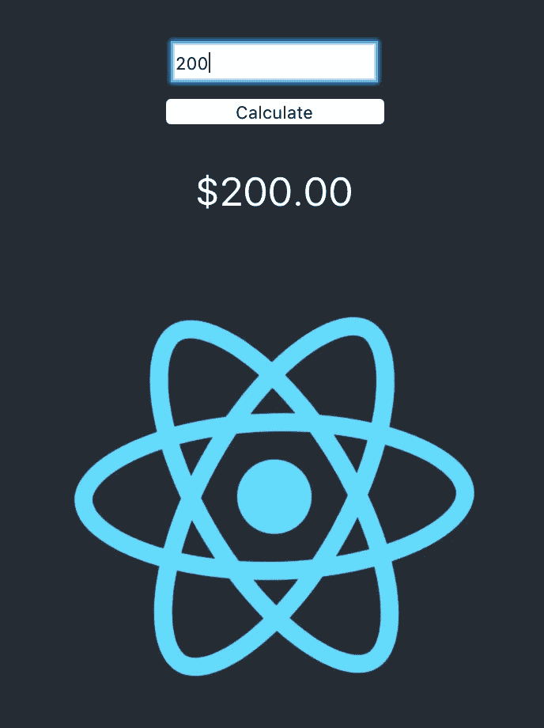
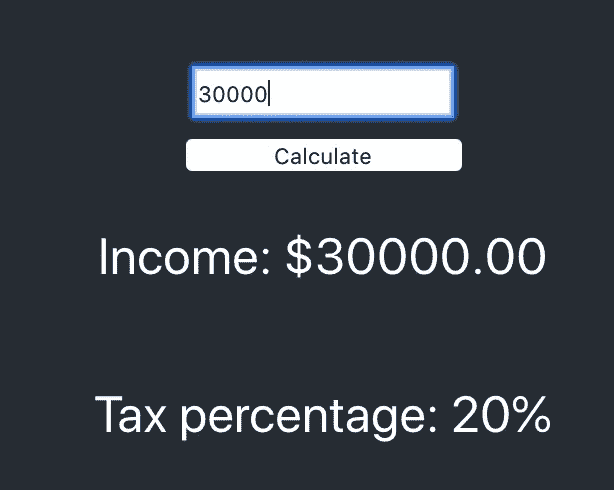
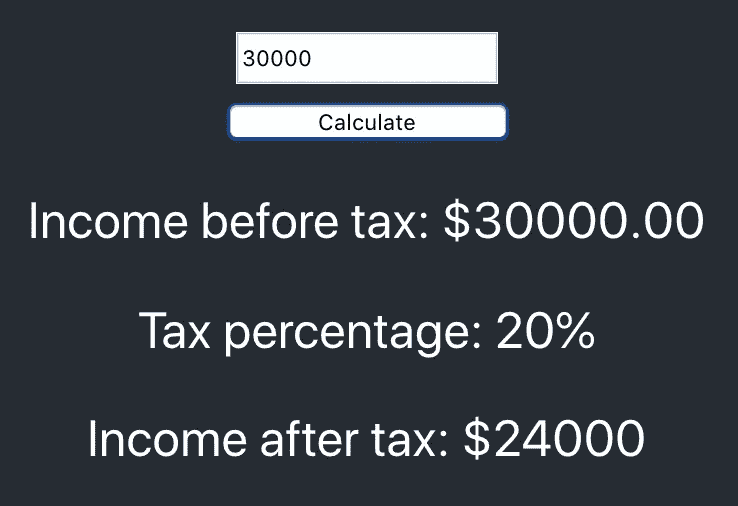
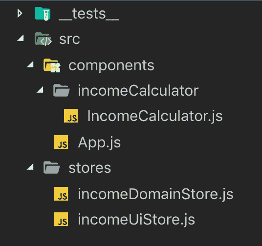
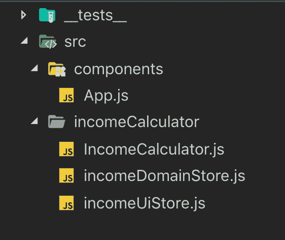

# 使用 MobX 进行状态管理

> 原文：<https://levelup.gitconnected.com/state-management-with-mobx-db464399481d>

下面是我对使用 MobX 的现代 JS 应用程序中的状态管理的看法。MobX 并不固执己见，也不会对你设计应用的方式指手画脚。我将向您展示如何设置一个项目，并使用 MobX 的功能。我还将演示一些构建应用程序的方法。

我们将从应用状态的描述开始，但是如果你想直接进入 MobX，请随意跳过。

如果你一步一步地跟着做是最好的。然而，你可以在这里找到称赞的代码——[https://github.com/shivendraodean/react-mobx-demo](https://github.com/shivendraodean/react-mobx-demo)

# **应用状态**

考虑状态的一种方式是——应用程序为了正常运行而存储和操作的所有数据和元数据。这些数据可以以变量和对象的形式保存在内存中，既可以全局保存也可以本地保存。

状态可以被分成不同的类别，并且应该保持关注点的良好分离。其中一些类别是业务/域、应用程序和 UI 状态。

**域*类别示例*** —
假设您在前端有一个税收和收入计算器。计算工资等级、税收百分比、税收和收入计算等的逻辑是可以存在于领域模块中的关注点。

**应用*类别*示例—** 您需要确定用户是应该被定向到身份验证页面，还是在加载时被定向到主页。确定这一点的功能可以归类为应用问题。

**UI *类别*示例—** 您想要禁用“注册”按钮，直到用户输入有效的电子邮件地址，并且您想要跟踪“isValidEmail”属性。

# MobX

## 3 个主要原则

**状态** —任何数据结构都可以变成 MobX 状态、对象、数组、类等。

**动作—** 动作是*修改*状态的建议方式。

**派生** —新的数据或动作可以基于现有状态的改变而被派生。

UI 应用程序的不同部分将有不同的域上下文。在一个大规模的应用程序中，你可能会发现多个**商店。商店是一组逻辑分组的数据结构，围绕用户界面关注的领域区域分组。通常，我创建一个类作为存放这些有状态数据结构的仓库。我还发现将动作放在它们相关状态所在的同一个类中很有用。**

## 项目设置

先决条件—我假设您已经了解 Javascript 和 React。我正在使用 *Create React App* 创建一个 React App。更多信息请看这里-[https://github . com/Facebook/create-react-app # creating-an-app](https://github.com/facebook/create-react-app#creating-an-app)

从终端运行以下命令。
1 —为我们创建一个名为 react-mobx-demo 的项目。
2 —更改到应用程序目录。
3 —安装 mobx 和 mobx-react
4 —运行 app。

```
npx create-react-app react-mobx-demo
cd react-mobx-demo
npm install mobx-react
npm install mobx
npm start
```

最后一点设置，我保证。将它添加到 package.json 文件的 babel 部分。这将使我们能够使用 es next***decorator***。

```
"plugins": [
  ["[@babel/plugin-proposal-decorator](http://twitter.com/babel/plugin-proposal-decorator)s", { "legacy": true }]
]
```

> 背景——我们将研究一个非常简单的收入计算器。它将允许您输入您的收入，并计算您的税后收入。

## 让我们开始写代码吧..

**App.js 文件-** 我将从第 11-20 行删除一些锅炉板代码。让我们添加一个收入输入框和一个按钮。替换 render 函数以返回以下内容-

```
<div className="App">
  <header className="App-header">
    <input type="text" placeholder="Income" className="income-input"/>
    <button type="button" className="calculate-btn">Calculate</button>
    
  </header>
</div>
```

为 App.css 添加一些样式。

```
.income-input {
  background-color: '#ffffff';
  height: 20px;
}.calculate-btn {
  width: 140px;
  margin-top: 10px;
}
```

## 域存储

首先，我们将创建一个文件来存储收入和纳税状态。我将此称为**商店。**在 src 目录下创建一个名为 **incomeDomainStore.js** 的文件，并添加以下内容-

```
import { action, computed, observable } from "mobx"class IncomeDomainStore {

}export default IncomeDomainStore
```

这里，我们简单地创建了一个 Javascript 类并导入了 3 个 mobx 特性。**可观察的**允许我们把任何数据结构变成可观察的状态。动作允许我们把一个功能转变成操纵那个状态的功能。计算出的允许我们*根据状态变化导出*一些值。

## 供应者

在我们开始向存储中添加观察值、动作和计算值之前，我们应该首先让组件可以访问存储。为此，我将使用一个叫做 Provider 的东西。在 ***index.js 中，*** 添加以下导入并替换渲染函数。

```
import { Provider } from 'mobx-react'
import IncomeDomainStore from './incomeDomainStore'ReactDOM.render(<Provider incomeDomainStore={new IncomeDomainStore()}><App /></Provider>, document.getElementById('root'))
```

我们正在做的是创建该域存储的新实例，并在应用程序中提供它，以便组件可以将其作为依赖项注入。

## 行动和观察

让我们来看看可观察的事物和行动。将 ***存储*** 类改为这个-

```
class IncomeDomainStore {
  @observable incomeBeforeTax = 0 @action setIncome (incomeAmount) {
    this.incomeBeforeTax = parseInt(incomeAmount)
  }
}
```

变量 *incomeBeforeTax* 被修饰为一个可观察值。任何在其 render 方法中使用该可观察对象的 observer 组件都将在数据发生变化时重新呈现。
*动作*是改变可观察值的功能。

是时候用这家店了。用下面的代码适当修改 ***App.js*** 。

```
import React, { Component } from 'react';
import { observer, inject } from 'mobx-react'
import logo from './logo.svg';
import './App.css';[@inject](http://twitter.com/inject)('incomeDomainStore')
[@observer](http://twitter.com/observer)
class App extends Component {
  render() {
    return (
      <div className="App">
        <header className="App-header">
          <input type="text" onChange={event => this.props.incomeDomainStore.setIncome(event.target.value)} placeholder="Income" className="income-input"/>
          <button type="button" className="calculate-btn">Calculate</button>
          <p>Income: ${this.props.incomeDomainStore.incomeBeforeTax}.00</p>
          
        </header>
      </div>
    );
  }
}export default App;
```



图 1

保存所有内容并运行应用程序。现在在输入框中输入一个数字，你会看到可观察到的被渲染在屏幕上。

## 计算的导数

假设我们生活在爱乐之城，收入低于 2 万美元的税率为 10%，高于 2 万美元的税率为 20%。因此，根据用户输入的收入，我们可以得出适用于他们的税收百分比。为了实现这个逻辑，将下面的**计算的** getter 添加到我们的存储中。

```
[@computed](http://twitter.com/computed) get calculatedTaxPercentage () {
 return this.incomeBeforeTax < 20000 ? 10 : 20
}
```

然后回到我们的 **App.js** 文件，添加以下标签。

```
<p>Tax percentage: {this.props.incomeDomainStore.calculatedTaxPercentage}%</p>
```



图 2

现在，如果您运行应用程序并输入大于 20000 美元的金额，您将看到导出并显示的税额。

## UI 商店

让我们继续实现计算按钮。我现在想添加逻辑，以便当用户单击 calculate 时只显示计算出的信息。这是视图逻辑，并不真正适合我们的域存储，所以我们可以用它的视图关注点创建一个新的存储。添加一个名为**的新文件。你知道该怎么做！**

```
import { action, observable } from "mobx"class IncomeUiStore {
  [@observable](http://twitter.com/observable) shouldShowCalculations[@action](http://twitter.com/action) showCalculation () {
    this.shouldShowCalculations = true
  }
}export default IncomeUiStore
```

请记住，我们将无法注入这个商店，直到我们提供给应用程序。因此，让我们通过向 index.js 文件中添加该商店的新实例来实现这一点。

```
import IncomeUiStore from './incomeUiStore'ReactDOM.render(<Provider incomeDomainStore={new IncomeDomainStore()} incomeUiStore={new IncomeUiStore()}><App /></Provider>, document.getElementById('root'));
```

回到我们的 **App.js** 文件，我们现在可以注入添加的存储。让我们也做一个小的改变来决定标签的可见性。

```
class App extends Component {
  render() {
    return (
      <div className="App">
        <header className="App-header">
          <input type="text" onChange={event => this.props.incomeDomainStore.setIncome(event.target.value)} placeholder="Income" className="income-input"/>
          <button type="button" onClick={() => this.props.incomeUiStore.showCalculation()} className="calculate-btn">Calculate</button>
          {this.getCalculation()}
          
        </header>
      </div>
    );
  }getCalculation () {
    if (!this.props.incomeUiStore.shouldShowCalculations) return nullreturn (
      <div>
        <p>Income: ${this.props.incomeDomainStore.incomeBeforeTax}.00</p>
        <p>Tax percentage: {this.props.incomeDomainStore.calculatedTaxPercentage}%</p>
      </div>
    )
  }
}
```

## 另一种推导

让我们加上最终计算值，税后收入值。分别在存储区和组件中添加以下代码。

```
[@computed](http://twitter.com/computed) get calculatedIncomeAfterTax () {
    if (this.incomeBeforeTax < taxBracket) {
      return this.incomeBeforeTax * 0.9
    } return this.incomeBeforeTax * 0.8
  }getCalculation () {
    if (!this.props.incomeUiStore.shouldShowCalculations) return nullreturn (
      <div>
        <p>Income before tax: ${this.props.incomeDomainStore.incomeBeforeTax}.00</p>
        <p>Tax percentage: {this.props.incomeDomainStore.calculatedTaxPercentage}%</p>
        <p>Income after tax: ${this.props.incomeDomainStore.calculatedIncomeAfterTax}</p>
      </div>
    )
  }
```



图 3

## 应用程序结构

我不会在这里进行重构，也不会将文件重新组织到一个文件夹结构中。不过，我可以简单地讨论一下文件夹结构。



一种方法是将存储保存在与组件分开的目录中。



另一种方法——将所有与收入计算器领域相关的东西放在一个地方。

你可以在这里找到所有的代码—[https://github.com/shivendraodean/react-mobx-demo](https://github.com/shivendraodean/react-mobx-demo)

暂时就这样了。感谢阅读。

[](https://levelup.gitconnected.com)[](https://gitconnected.com/learn/react) [## 学习 React -最佳 React 教程(2019) | gitconnected

### 排名前 49 的 React 教程-免费学习 React。课程由开发人员提交并投票，使您能够…

gitconnected.com](https://gitconnected.com/learn/react)