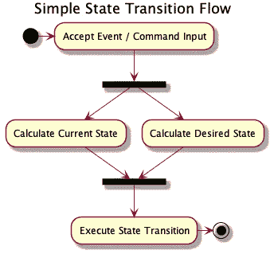

# 状态转换命令

> 原文：<https://levelup.gitconnected.com/state-transition-command-7e409df5e486>

软件开发人员可以通过任何技术系统进行推理，作为状态之间的转换序列。如果系统架构师围绕由事件触发的一系列明确的状态变化来规划他们设计的系统，他们会将其归类为遵循*事件驱动架构*原则的系统。开发人员可以在不同的项目范围内应用这种体系结构，而不需要通过管道在系统中分发消息。

可以说，几乎任何东西，有形的或无形的，都可能有一个相关的状态和状态转换规则——人们可以把这个操作看作是把系统从一个特定状态转移到另一个状态的一种方式。今天我想讨论将状态转换分成两个不同部分的可能性——*一个状态转换命令生成器*和*一个状态转换命令执行器*，以及这种方法的利弊。我以图表的形式将理想的状态转换流程描述如下:

表示状态转换的理想流程的图。使用 PlantUML 创建。

# 状态迁移

为了发生任何状态转换，所讨论的系统需要接受一个输入，其形式为一个*事件*或*命令*(不考虑用于将它传递到系统中的传输层)。这两者之间存在着根本的区别，因为一个*事件*表示发生了某件事，而一个*命令*则要求发生某件事。如果某些事情确实发生了，系统必须(最终)符合这个事实，但是另一方面，它可以拒绝任何请求。

每个输入应该有一个明确的*域*(在 DDD 意义上)与之相关联。简单地说，在在线视频游戏中，请求改变用户的化身通常不涉及更新他们访问的位置。将输入域减小到合理的最小值，可以快速计算该域内的电流和所需状态。

找出当前状态可能需要多次调用各种数据库，但也可能不需要任何操作，特别是当当前状态定义为空集时——更改用户的头像就是一个很好的例子，因为当前头像没有为更改提供任何有价值的信息。我发现了解任何系统的当前状态通常不会立即发生是至关重要的，这意味着结果中的一些信息在获取后会过期——系统应该考虑到这一点，不要过度依赖当前状态。一些软件开发人员将当前状态的计算称为收集关于系统的事实，尤其是在基础设施项目中。

计划状态的计算总是涉及输入，但不一定需要涉及当前状态。例如，如果用户接收到足够的经验点以前进到新的级别，并且状态包含关于该级别的信息，则该计算必须在创建期望的状态之前发生。热心的读者可能会意识到，系统可以根据需要计算等级，使用经验点，将其从状态中移除，并仅将这些点的数量传递到计划状态中。

我认为状态转换组件是系统的一部分，它知道当前和计划的状态，并且有能力*最终*将系统从一个状态转移到另一个状态。上述移动依赖于比较状态之间的某些属性和执行所需的动作，这两种操作通常相互交织，如本段下面的简单状态转换流程图所示。在两者之间提供清晰的分离可能会给任何系统的可用性和可维护性带来很多好处。

一个简单的状态转换流的例子。使用 PlantUML 创建。

# 状态转换命令

代替构建前面提到的组件，我们可以用*命令对象*的形式来描述转换。这样的命令将由有序或无序的指令集组成，其执行者可以在不知道关于初始输入以及先前和期望状态的任何信息的情况下应用于系统。应该认识到一个重要的事实——命令的计算可以在一个子系统中进行，而执行可以在另一个子系统中进行。

## 状态转换命令生成器

我将利用一个例子来展示如何构造一个命令。在游戏中创建官方认可的团体可能需要从游戏客户端向许多游戏服务器中的一个发送以下命令(我假设请求发送者充当新团体的领导者):

创建参与方的命令类型，用 TypeScript 编写。

根据经验，任何接收服务器都应该对每个传入的数据进行杀毒。我不会在这里深入探讨这个主题，但是命令必须符合约定的格式，并且任何一方的名称都不能超过任意确定的字符数，例如 32 个字符。任何版本的游戏客户端都必须遵守与游戏服务器相同的限制。

交易方创建有一个 DDD 意义上的关联域—交易方和请求发送方的交易方成员资格。域内的规则规定不能存在共享相同名称的两方，因此对名称唯一性的检查必须在当前状态创建期间或者在执行状态转换命令期间进行。出于本文的目的，我决定在运行第一阶段时检查它。

在数据库没有同名的其他参与方的情况下，新参与方的当前状态将不包含关于参与方本身的属性(因为它还不存在),但是它将保存关于用户具有成员资格的潜在参与方的信息。用户不能同时属于两方，并且命令执行者必须移除与前一方的关联(如果存在的话)。因此，我可以用下面的结构来表示政党创建状态:

参与方创建的状态类型，用 TypeScript 编写。

我打算用同样的结构来说明理想的状态。它应该包含新参与方的 ID(构建者可以使用 UUID 生成器来获得它)、参与方的名称，以及用户和新创建的参与方之间明显的强制关联。我想指出的是，构建者可以在不知道当前状态的情况下创建这个结构。

构造状态转换命令归结为执行计划状态和当前状态之间的一组差异的等价物。在我的例子中，构建器应该计算创建哪一方，删除哪一个关联(如果它首先存在)以及创建哪一个关联。我在下面写了一个示例性的命令类型:

创建参与方的命令类型，用 TypeScript 编写。

请注意，状态转换命令与来自请求的原始命令几乎没有共同之处，因为它们在系统的不同层上操作——前者在技术层，后者在业务层。因为该命令没有运行时引用，所以构建器可以序列化它，并在必要时将其发送给能够处理它的其他子系统。正如我之前暗示的，推迟立即状态转换可能允许某些分布式系统为不同的转换分配正确的优先级，并且可以通过将特定的变异操作卸载到不同的微服务来降低代码复杂性。

## 状态转换命令执行器

命令执行器期望接收一个命令，并且只应用其中包含的指令。它的特定实现总是依赖于特定的情况，要考虑数据库(SQL 和 NoSQL 一样)、消息队列、事件流和系统中使用的缓存。为了描述一个示例性的实现，我将继续使用我在本文前面写的当事人创建案例。

如果我的模型系统使用单个 SQL 数据库维护它的用户和参与方，我可以假设执行一个参与方创建命令需要三个操作:

*   通过 SQL `INSERT`语句创建新的参与方，
*   利用 SQL `DELETE`语句移除先前的用户对交易方关联(如果存在的话),
*   再次利用 SQL `INSERT`语句向交易方关联添加新用户。

请注意，该命令本身没有任何 SQL 概念，包括底层数据库布局——这不是偶然发生的，因为概述一系列指令并不能说明精确的交付方法。命令在一定程度上需要技术语言，但是依赖于其中的特定技术栈会使整个系统陷入供应商锁定。

人们可以想到可能发生的其他操作，例如，通知用户参与方的创建。我相信这样的需求必须首先存在于命令的定义中，因为执行者应该只依赖写在命令对象中的指导方针。同样，如果系统应该通知用户，命令应该包含通知的信息，而不告诉执行者利用哪种技术来执行这样的任务。

如果执行器与命令构建器位于不同的子系统中，则命令可能需要指定执行器应该将执行结果发送到哪里(如果适用)。最简单的形式是，我将任务结果定义为*成功*或*失败*，而在某些情况下，我可以识别出向用户返回部分成功信息的需求。如果系统设计者认为执行者应该在失败的情况下重试命令执行，他们应该相应地调整命令对象。

# 摘要

将系统简化为状态转换序列允许系统构建者明确地定义上述转换应该如何发生。让一个子系统创建一个状态转换命令，让另一个子系统执行它，这带来了关于应该发生什么(前者)和应该如何发生(后者)的关注点的分离。使用这种模式，即使是对于小系统，也可能证明在减少潜在的未来维护人工成本方面是有益的，因为了解这种模式可以使一些开发人员编写更有组织的代码。