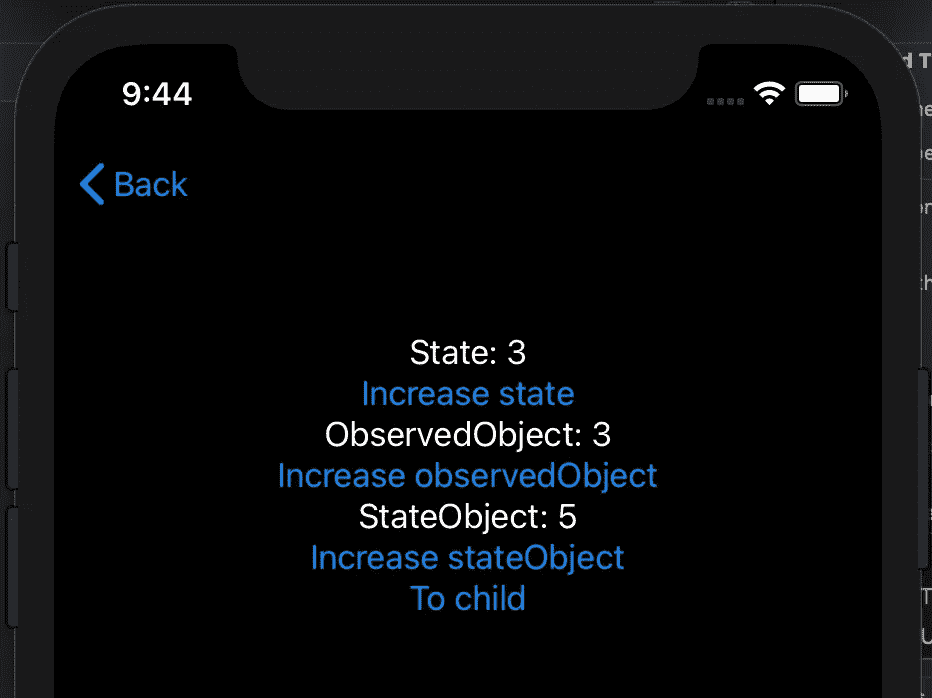
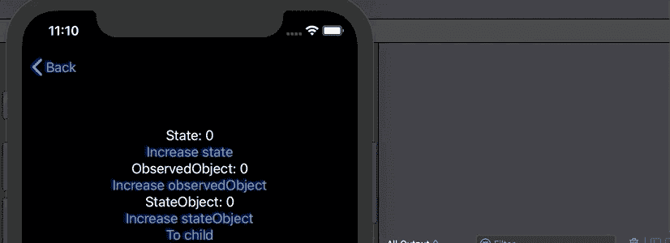
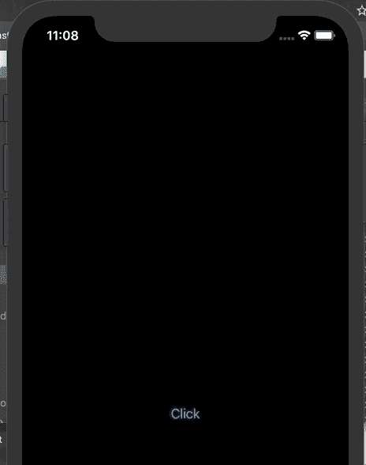
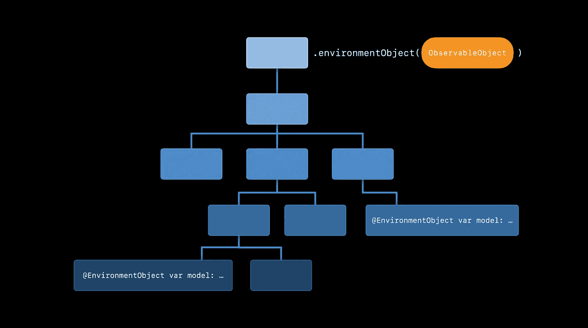

# swift ui:@ State vs @ State object vs @ observed object vs @ environment object

> 原文：<https://levelup.gitconnected.com/state-vs-stateobject-vs-observedobject-vs-environmentobject-in-swiftui-81e2913d63f9>

SwiftUI 开发人员需要做出的第一个决定是使用哪个可用的属性包装器来存储数据。尤其是在 iOS 14 中，可以用 SwiftUI 编写[整个应用生命周期](https://developer.apple.com/documentation/swiftui/app)，以正确的方式存储数据对你的应用运行和行为可预测且无错误至关重要。

我制作的测试这些不同属性包装器的应用程序

制作 SwiftUI 应用的挑战在于，从技术上来说，`@State`、`@StateObject`、`@ObservedObject`和`@EnvironmentObject`这四个应用表面上都能“工作”。你的应用程序将会编译，你甚至可以得到你想要的行为，即使你使用了错误的属性包装器。

但是，如果使用不当，您可能会发现当您的数据更新时，您的视图不会更新。或者，数据保存的时间比您预期的要长。或者说，你的数据根本不持久。

让我们来分解一下这个故事，从`@State`开始。

# @州

> **State:** 可以读写 SwiftUI 管理的值的属性包装器类型。

这是苹果对@State 的[定义。但这意味着什么呢？](https://developer.apple.com/documentation/swiftui/state)

状态是你的应用程序可以拥有的最简单的事实来源。它被设计为包含简单的值类型，如 int、Strings 和 Bools。它不是为更复杂的引用类型而设计的，例如您自己定义并在应用程序中使用的任何类或结构。

状态的良好使用与状态的不良使用

[苹果公司甚至这样说](https://developer.apple.com/documentation/swiftui/managing-user-interface-state)——在将值添加到模型之前**使用简单的状态:**

> 在您准备对应用程序的数据模型进行更改之前，您可能还会发现这种存储方式非常方便。

`@State`通过在视图更新时重新计算视图的主体变量来工作。因此，如果您的视图中有一些状态跟踪一个整数，并且您将该整数加 1，您的状态将会看到这一点并重新呈现视图。当视图使用此状态时，您将在屏幕上看到更新的数字。

就像我之前说的，这和对简单值类型的描述一样有效，比如整数、字符串或布尔。但是，您会发现**有可能** *让`@State`跟踪一个复杂的物体。在整个故事中，我将多次引用以下对象作为示例:*

我就是这样使用它的:

这不会引发任何错误。我所做的是创建一个新的`TestObject()`副本，并用`@State`属性包装器标记它，这告诉 SwiftUI 我希望这个视图能够跟踪它。

你认为当我按照**第 8 行**调用`state.num += 1`时会发生什么？

嗯，我们在输出窗口的第 9 行**看到`state.num`已经增加了 1，但是在我们应用程序的视图中`state`的值没有改变。为什么会这样？**

****

**点击增加状态按钮，我们的输出窗口有我们的打印报表，但用户界面没有更新**

**让我们回到我之前写的东西…**

> **@State 通过在视图更新时重新计算视图的主体变量来工作。**

**但是，因为我们使用的是复杂的参考类型，所以`state`本身的值不会改变。虽然`state`、`num`的属性已经改变，但是`@State`属性包装器不知道，因为它只关注变量`state`，而不是它的任何属性。对 SwiftUI 来说，因为它只是在看`state`，所以它不知道`num`已经改变，所以从不重新渲染视图。**

**这导致了这样的场景:我们可以在控制台中看到值正在成功更新，但是我们视图中的`body`变量从未被重新计算过，因此我们看不到 UI 更新。这也导致我们的`onChange`方法永远不会被调用，因为它检测`body`变量渲染之间的变化，如果它从未被渲染，它就永远不会被调用。**

**因此，正如我们所看到的，对于最简单的数据来说,`@State`不是正确的解决方案。思考用途，比如跟踪某个元素是否应该在屏幕上可见，或者突出显示某个特定的行号。对于任何更复杂或与您的业务逻辑相关的内容，请继续阅读…**

# **@StateObject**

**iOS 14 和 Swift UI 2 推出时， [@StateObject 是](https://developer.apple.com/documentation/swiftui/stateobject) …**

> **实例化可观察对象的属性包装类型。**

**太棒了，山姆，但什么是“可观察物体”？让我们再次向苹果公司求助:**

> **一种具有发行者的对象类型，在对象更改之前发出。**

**那是什么意思？让我给你看一个我们的`TestObject`的例子，但是被重新创建为一个`ObservableObject`:**

**这里有两个主要区别:**

1.  **`TestObject`现在符合协议`ObservableObject`**
2.  **我们用属性包装器`@Published`标记了`num`**

**总的来说，我们要说的是任何时候`num`被更新，我们想让我们`ObservableObject`的任何用户知道他们应该重新渲染视图。**

**让我们回到我们的示例视图。**

**如你所见，我只做了一个小改动，在第 2 行的**上，从`@State`移到了`@StateObject`。使用`@StateObject`需要我的对象符合类型`ObservableObject`，所以好在我们之前已经这么做了。****

**现在，当我们点击按钮时，我们不仅会看到新的 num 值被打印到输出窗口，而且还会看到 UI 更新。**

****

**视图正在更新，当我们退出和进入视图时，对象也被重新创建**

**这是因为，通过使用`@StateObject`，我们让我们的视图知道，每当可观察对象内的任何`@Published`属性改变时，我们希望视图重新呈现。换句话说，每当我们更新`num`时，因为那个属性是`@Published`，它告诉任何正在监听它的视图(*观察*它)值已经改变，它应该重新计算它的视图。**

**我们不会面临与使用`@State`相同的问题，因为现在它不只是简单地观察对象本身，而是监听其任何标记的`@Published`属性的变化。相当酷。**

**使用`@StateObject`要注意的另一件重要事情是对象的生命周期直接与视图相关联。我的意思是，如果你通过[导航链接](https://developer.apple.com/documentation/swiftui/navigationlink)进入你的视图，将`num`设置为 3，返回[导航视图](https://developer.apple.com/documentation/swiftui/navigationview)，然后再次进入你的视图，那么`num`将被重置为 0。事实上，整个`TestObject`将从零开始创建。**

**虽然重置数据听起来很烦人，但这实际上是我们想要的行为。如果我们需要父视图(即通过 NavigationLink 移动到您的视图的视图)中的数据，我们应该在父视图中定义`@StateObject`,而不是子视图。如果我们只需要孩子中的数据，那么在孩子中定义`@StateObject`。**

**使用这种方法，我们可以保证如果视图仍然是活动的，数据不会改变或被丢弃。正如 Apple 在他们的文档中所说，这是实例化复杂数据类型的正确方法。**

**我们接下来的两个方法是使用我们已经实例化为`@StateObject`的复杂对象。**

# **@ObservedObject**

**苹果[将](https://developer.apple.com/documentation/combine/observableobject)和`@ObservedObject`描述为:**

> **一种属性包装类型，订阅可观察对象，并在可观察对象发生变化时使视图无效。**

**这是*几乎和`@StateObject`一样的*，除了它没有提到你的变量的实例化或创建。**

**那是因为`@ObservedObject`被用来跟踪一个已经*被*创建的对象，可能是用`@StateObject`创建的。**

**`@ObservedObject`当你想把一个可观察的物体从一个视图传递到另一个视图时使用。您已经在父视图中使用`@StateObject`实例化了可观察对象，现在您希望子视图能够访问数据。但是，您不想再次重新创建该对象。这不会保留对象中的任何数据。**

**相反，您希望将现有的可观察对象向下传递给子对象，这是通过`@ObservedObject`完成的，通过一个导航链接，如下所示:**

**然后，子视图像这样访问对象:**

**如您所见，`ChildView`有一个名为`observedObject`的属性，它接受类型为`TestObject`的对象。它被标记为`ObservedObject`,因为它**没有**实例化它(那是为了`@StateObject`)。相反，它已经被实例化，现在`ChildView`可以读写父视图正在读写的相同数据。**

**但是，如果许多子视图需要访问相同的数据，这种方法会变得非常麻烦。例如，你可能想知道用户在你的应用程序的许多不同视图中的用户名，但是你不想把一个`UserDetails`模型传递给每一个视图。**

**回车，`@EnvironmentObject` …**

# **@环境对象**

**`@EnvironmentObject`用于那些需要使用`ObservableObject`但是视图不是直接的父/子对的场景。你可能想在主视图和设置菜单中使用一段数据，但是你不希望(或者需要)中间的每个视图都知道这些数据——那会产生一些混乱的代码。**

**这是苹果推荐的解决方案，从这个 [WWDC 视频](https://developer.apple.com/videos/play/wwdc2020/10040/)截图可以看出:**

****

**苹果公司推荐的许多不同视图中所需数据的处理方法。来源:[swift ui-WWDC 2020 数据概要](https://developer.apple.com/videos/play/wwdc2020/10040/)**

**他们的`ObservableObject`是在第一个视图中创建的，当它被改变时，他们想要更深层次的一些视图来了解和响应。**

**使用`@EnvironmentObject`有两个部分。**

**首先，您需要创建一个要使用的对象。创建之后，您需要将它附加到一个视图，以便所有子视图都可以访问它。让我们继续做那件事。**

**这里，在**第 3 行**我创建了对象，然后在**第 6 行，**我把它附加到我的视图中。请注意，我已经在我的主应用程序文件中完成了所有这些。对于希望在整个应用程序中访问的数据，这是一种相当常见的模式。**

**然后，要在`ContentView`内的任何视图中使用该对象，您可以这样做:**

**这与您使用的`@ObservedObject`完全一样，只是这次我们希望它在环境中，而不是直接从父节点传递。**

**`@EnvironmentObject`的工作方式是当在视图中被调用时，它从环境中该类型的对象(换句话说，从它上面任何指定了 [environmentObject](https://developer.apple.com/documentation/swiftui/view/environmentobject(_:)) 的父对象)开始查找，然后让您使用它。这是在运行时完成的，而不是在编译时，所以如果你没有正确设置你的环境对象，你的应用程序在使用它的时候会崩溃。**

**需要注意的另一点是`@EnvironmentObject`寻找该类型的对象。这意味着您不能在同一视图树中使用同一类型定义多个环境对象。**

**`@EnvironmentObject`非常方便，当您的数据被多个邻近视图使用时，它是一个很好的工具。**

**所以，总而言之:**

1.  **对于非常简单的数据，如 Int、Bool 或 String，使用 **@** `**State**`。想想开关是开还是关，或者对话框是开还是关。**
2.  **使用`**@StateObject**`创建任何比`@State`更复杂的类型。确保类型符合`ObservableObject`，并且在您希望视图重新呈现的属性上有`@Published`包装器，或者您希望从视图中更新。
    *在实例化一个模型时，总是使用* `*@StateObject*` *。***
3.  **使用`**@ObservedObject**`允许父视图将已经创建的`ObservableObject`传递给子视图(通过`@StateObject`)。**
4.  **使用`**@EnvironmentObject**`消耗已经在父视图中创建的`ObservableObject`，然后通过视图的`environmentObject()`视图修改器附加。**

**感谢您阅读这个故事。我希望它对您使用 SwiftUI 有所帮助。和往常一样，如果你有任何问题，请留言，我会尽快回复你。**